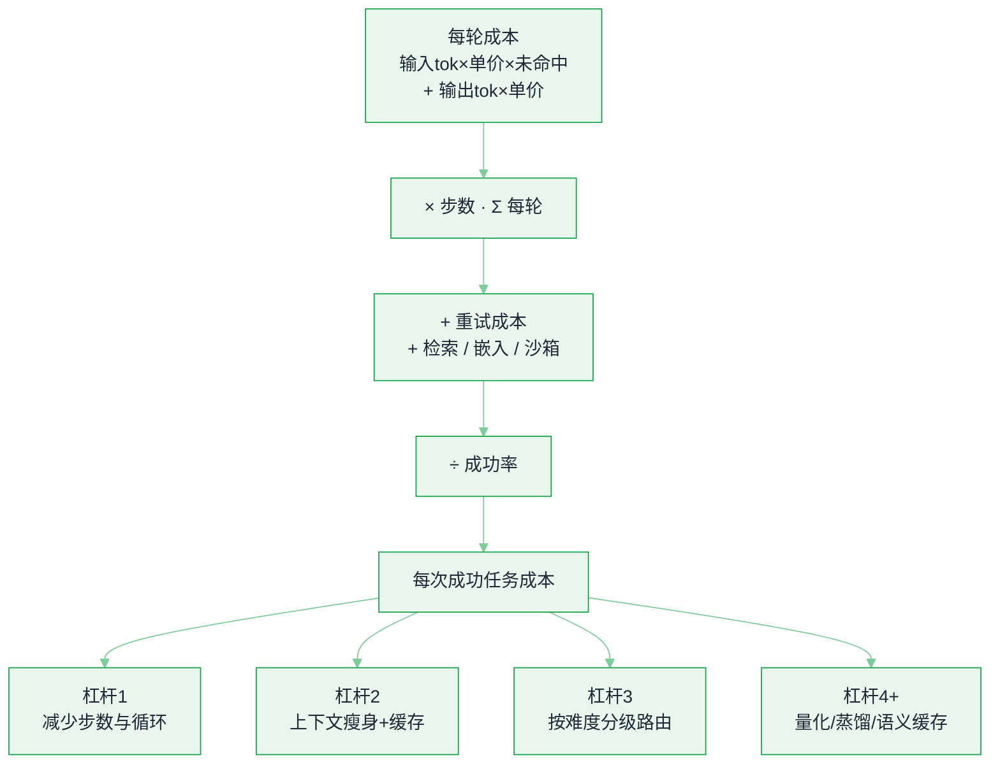

# 推理经济学与部署形态


**一句话**：自建还是买 API，是一道算术题不是信仰题——把「每次成功任务的成本」算清楚（token 单价 × 用量 ÷ 成功率 + 缓存与运维），再决定要不要为省下的单价背上 GPU 集群的运维账。
  **难度**： 进阶


## 先看结论

- **算「每次成功任务成本」，不要算「每百万 token」**：Agent 会重试、会绕圈、会把失败也烧掉 token。分母必须是成功任务数。
- **Agent 成本结构里输入占大头**：一个 30 步的任务，输入 token 常是输出的 10–50 倍。所以「前缀缓存 + 上下文瘦身 + 步数上限」三件套的收益 > 换更便宜的模型。
- **盈亏平衡点随用量移动**：自建 = 卡时成本 ÷ 有效吞吐。用量低时 API 几乎必然更便宜；用量高、且负载可预测时自建才划算（要含 SRE 人力与闲置率，别只算硬件）。
- **小模型能替代大模型的前提是「任务窄」**：蒸馏/LoRA 后的小模型在窄任务上常能到大模型 80–95% 的质量而成本降到 1/5–1/20；任务一宽就断崖。
- **端侧是另一个维度**：隐私、离线、零边际成本、无网络延迟，换来的是算力与内存上限（3B–8B 量化是主战场）。

## 把账算清楚

**成本模型（单轮）**

```text
轮成本 = 输入tok × 输入单价 × (1 - 命中率 × 折扣)
       + 输出tok × 输出单价
任务成本 = Σ(每轮成本) + 失败重试成本 + 检索/嵌入/沙箱成本
每次成功任务成本 = 任务成本 ÷ 成功率
```

公式里唯一容易读错的是缓存那一项。**「命中部分只付 10%」等价于把输入单价乘一个实付系数 `(1 - 命中率) + 命中率 × (1 - 折扣)`**：命中 `hit_rate` 的那部分按 1 折付（`cache_discount = 0.9` 指的是折扣力度，不是付 90%），没命中的部分原价付。命中率 0.15 时系数是 0.865，命中率 0.75 时降到 0.325——**同一份上下文、同一个模型，光靠这一步每轮输入就便宜 2.7 倍**。

下面这份参数表就是全套账目的输入：默认值、三项方案各自的旋钮、以及跑出来的结果。单价随供应商变动，所以它必须是配置项而不是常数。

```json
{
  "unit": "USD",
  "defaults": {
    "p_in_per_mtok": 3.0,
    "p_out_per_mtok": 15.0,
    "hit_rate": 0.7,
    "cache_discount": 0.9,
    "success_rate": 0.8,
    "extra_per_task": { "retrieval": 0.002, "sandbox": 0.005 }
  },
  "formula": {
    "paid_input_ratio": "(1 - hit_rate) + hit_rate * (1 - cache_discount)",
    "per_turn": "in_tok/1e6 * p_in * paid_input_ratio + out_tok/1e6 * p_out",
    "task_gross": "per_turn * steps + sum(extra_per_task)",
    "per_successful_task": "task_gross / success_rate"
  },
  "scenarios": [
    {
      "name": "大模型直用",
      "steps": 28,
      "in_tok": 9000,
      "out_tok": 700,
      "p_in_per_mtok": 3.0,
      "p_out_per_mtok": 15.0,
      "hit_rate": 0.15,
      "success_rate": 0.8,
      "paid_input_ratio": 0.865,
      "per_turn": 0.033855,
      "task_gross": 0.95494,
      "per_successful_task": 1.193675,
      "per_k_successful_tasks": 1193.67
    },
    {
      "name": "大模型+缓存",
      "steps": 28,
      "in_tok": 9000,
      "out_tok": 700,
      "p_in_per_mtok": 3.0,
      "p_out_per_mtok": 15.0,
      "hit_rate": 0.75,
      "success_rate": 0.8,
      "paid_input_ratio": 0.325,
      "per_turn": 0.019275,
      "task_gross": 0.5467,
      "per_successful_task": 0.683375,
      "per_k_successful_tasks": 683.38
    },
    {
      "name": "窄任务小模型",
      "steps": 22,
      "in_tok": 6500,
      "out_tok": 520,
      "p_in_per_mtok": 0.6,
      "p_out_per_mtok": 2.4,
      "hit_rate": 0.8,
      "success_rate": 0.66,
      "paid_input_ratio": 0.28,
      "per_turn": 0.00234,
      "task_gross": 0.05848,
      "per_successful_task": 0.088606,
      "per_k_successful_tasks": 88.61
    }
  ],
  "notes": [
    "extra_per_task 是每任务固定项（0.002 检索 + 0.005 沙箱 = 0.007），不随步数放大",
    "success_rate 只进分母：失败任务照烧 token，所以除以成功率而不是忽略",
    "公式里没有质量项——答对但质量差的成本要靠评估集另算"
  ]
}
```

三个方案的排序很有意思：`大模型直用 → 大模型+缓存` 是**同一批 token 少付钱**（省 42.8%），`→ 窄任务小模型` 是**换一套参数重算**（相对基线便宜 13.47 倍）。而基线方案即使什么都不改，只要把 `hit_rate` 用函数默认值 0.7 而不是你真实流量量出来的 0.15，账面就会从 $1193.67 掉到 $725.90——**参数表里的默认值是成本估算最常见的假账来源**。

## 分步演示：把「每次成功任务成本」算六次




#### 第 1 步：先把单价和缓存折扣钉成配置

`p_in = 3.0`、`p_out = 15.0`（每百万 token 美元，输出通常是输入的 4–5 倍价）；`cache_discount = 0.9` 表示命中部分只付 10%；固定项 `retrieval 0.002 + sandbox 0.005 = 0.007` 美元/任务。**这一步的价值不在于算，而在于让单价可审计**——供应商调价或缓存折扣规则变了，账会自己漂移。




#### 第 2 步：算这个方案实际要付的输入比例

基线方案 `hit_rate = 0.15`（每轮都重写上下文，缓存基本吃不到）：`(1 - 0.15) + 0.15 × 0.1 = 0.865`。也就是说 9000 个输入 token 里有 86.5% 要按原价付。命中率就是「稳定前缀占整段上下文的比例」——system prompt、工具定义、历史消息能不能一字不改地排在前面。




#### 第 3 步：合成一轮的价钱

输入部分 `9000 / 1e6 × 3.0 × 0.865 = 0.023355`，输出部分 `700 / 1e6 × 15.0 = 0.0105`，**每轮 0.033855 美元**（约 3.39 美分）。注意输入是输出的 2.2 倍价钱，而 token 数量是 12.9 倍——这就是「Agent 成本里输入占大头」在这一行的样子。




#### 第 4 步：乘步数，再加固定项

`0.033855 × 28 步 = 0.94794`，加检索与沙箱的 `0.007` → 一个任务毛成本 `0.95494` 美元。这里 `steps` 是**唯一乘在所有 token 成本上的那个数**：其他条件不动，步数从 28 砍到 20，毛成本 `0.033855 × 20 + 0.007 = 0.6841`，除以 0.8 得 $855.13 / 千任务，直接省 28.4%——而且不需要任何人降价。




#### 第 5 步：除以成功率，才是可比数字

`0.95494 ÷ 0.8 = 1.193675` → **每千个成功任务 $1193.67**。失败的 20% 不是没花钱，是把同样的钱再烧一遍。成功率 0.8 掉到 0.6 等于给成本乘 1.33，掉到 0.66 是乘 1.21——很多「换便宜模型省 80%」的方案，光这一项就把收益吃掉一大截。




#### 第 6 步：换旋钮重算，看谁真的省钱

只把 `hit_rate` 从 0.15 提到 0.75：$683.38，省 42.8%，**一行代码不用改，改的是上下文排列顺序**。再换成窄任务小模型（`steps 22`、`in 6500`、`out 520`、单价 `0.6 / 2.4`、`hit 0.8`，但 `success 0.66`）：$88.61。数字很漂亮，代价在公式外面——见下面的标签。



## 四个方案，四种结局（点标签切换）



$1193.67 / 千成功任务。命中率只有 0.15 的原因是典型的上下文写法：把动态内容（RAG 片段、时间戳、上一步工具输出）塞在消息开头，前缀每轮都变，缓存一条都不命中。**修法是重排，不是降价**：稳定前缀 → 历史 → 本轮动态内容。



$683.38，相对基线省 42.8%，零质量损失（模型、步数、成功率全没动）。继续往上推收益会迅速衰减：`hit_rate` 0.75 → 0.90 只把价格拉到 $555.80，再省 18.7%——**因为剩下的钱都在输出侧和未命中部分**，而输出侧不吃缓存。



$88.61，比缓存方案还便宜 7.7 倍。这笔账诚实的部分是：成功率 0.66 已经进了分母，比 0.8 多付了 21%。不诚实的部分是**公式里没有质量项**——「答得对但答得糙」在这里是 0 成本。要把它变成可比数字，得给每个方案配一份评估集，把返工率和人工复核率折进 `success_rate`，这才是第 5 条杠杆「要养训练与评估流水线」的真实含义。



都在小模型方案上改一件事：把成功率从 0.66 修到 0.75 → $77.97（省 12.0%）；把步数从 22 砍到 14 → $60.24（省 32.0%）。**砍步数的回报是修成功率的 2.7 倍**，而且不需要训练、不需要新评估集，只要把 ReAct 换成 Plan-and-Execute 或者把工具批起来发。这就是杠杆排序把「减少步数与循环」放第一名的原因。




**落地就一句话**：四个参数（`p_in / p_out / cache_discount / success_rate`）全部做成配置项挂上看板，所有方案只用「每次成功任务成本」这一个数字比较。本页三个方案算出来是 $1193.67 / $683.38 / $88.61，最远的一档差到 13.47 倍，用的却是同一套公式。用「每百万 token」横比得不出任何结论：步数、命中率、成功率这三个变量全被抹掉了。


> 💡 **提示**：把「小模型成功率折损」显式写进公式。成功率从 0.8 掉到 0.6，等于给成本乘以 1.33——很多「换便宜模型省 80%」的方案，算完这笔只省 40%。

## 成本是怎么长出来的

从「每轮」一路累加到「每次成功任务」，再顺着这条链找杠杆：越靠前的节点（步数、缓存）收益越大且几乎免费，换单价在最末端。



## 四种部署形态对照

| 形态 | 边际成本 | 弹性/运维 | 可控性（数据/延迟/行为） | 适合 |
|---|---|---|---|---|
| 托管 API | 高（按 token） | 零运维，但有配额与限流 | 低（数据出域、模型会变） | MVP、波动大、非核心链路 |
| 托管推理（专属/Serverless GPU） | 中 | 平台管卡，你管引擎 | 中 | 想掌控权重但不想管集群 |
| 自建 GPU 池 | 稳态低、闲置高 | 重（调度、监控、值班、升级） | 高 | 高用量、强合规、需要私有微调 |
| 端侧 / 本地 | 近零（电费） | 无服务端运维，但有版本分发 | 最高（数据不出设备） | 隐私、离线、桌面/移动/机器人 |

**混合策略（多数团队终局）**：稳态负载走自建/专属 + 峰值溢出走 API（网关按配额降级），离线批处理走 Spot + 可抢占队列，端侧做初筛/脱敏再上云。

## 降本的杠杆排序（经验值）

1. **减少步数与循环**（把 ReAct 换成 Plan-and-Execute 或批处理工具）：2–5×
2. **上下文瘦身 + 稳定前缀吃到缓存**：1.5–3×，且延迟一起降
3. **按难度分级路由**（80% 流量走便宜模型）：1.5–4×，需守住成功率
4. **量化与投机解码**（自建）：1.3–2×
5. **蒸馏小模型替代窄任务**：2–10×，但要养训练与评估流水线
6. **语义缓存 / 结果复用**（幂等查询）：特定负载 2–10×，滥用会返回错答案
7. **换供应商的单价**：通常 <1.3×，且被限流/质量波动抵消——放最后考虑

> ⚠ **注意**：第 1、2 条是**改代码**，第 3–7 条是**改基础设施**。前者几乎免费，后者要排期。顺序别反。

## 端侧与本地推理速查

| 方向 | 技术 | 备注 |
|---|---|---|
| 引擎 | llama.cpp（GGUF）、MLX（Apple）、ONNX Runtime、ExecuTorch | 量化生态成熟度：GGUF > 其他 |
| 量化 | Q4_K_M / Q8 / INT4 / FP8 | 常见甜点 Q4 一档，长上下文与数学任务要重测 |
| 内存 | 权重 ≈ 参数量 × 每参字节 + KV 缓存 | 7B@Q4 约 4–5GB 权重，长上下文 KV 可能反超权重 |
| 上下文 | 端侧 KV 上限是主要约束 | 128k 长上下文在手机上不现实；靠检索把上下文做小 |
| 场景 | 草稿/纠错、分类、脱敏、语音唤醒、机器人本地控制 | 与云端大模型形成「本地快脑 + 云端慢脑」分层 |

## 工程现场笔记

- **机器人也在算这笔账**：具身智能里「板载 GPU 延迟预算 + 模型大小」直接决定架构（本地小 policy + 云端大 VLM 的双系统），本质是同一道经济学题，见 [17 具身智能：硬件与实时控制栈](../17-embodied-ai/hardware-realtime-safety.md)。
- **观测单价而不是只观测用量**：模型单价调整、缓存折扣规则变化都会让「成本/成功任务」突然漂移；把单价做成配置项并纳入看板（→ [可观测性与评估平台](llm-observability-eval-platform.md)）。
- **给 Agent 设预算是产品功能**：每 run 上限（token/步数/耗时/金额），到线就收敛输出并汇报「还剩多少事没做完」，比让它一路烧到底更可信。
- **容量规划要按「峰值并发 × 每请求平均输出长度」**，而不是 QPS：长输出请求占着 decode 槽位，是最容易被低估的部分（→ [GPU 调度与多租户](gpu-scheduling-multitenancy.md)）。

## 常见误区

- ❌ 用「每百万 token」比较方案：不同方案的成功率、步数、重试率不同，横向不可比
- ❌ 自建只算卡钱：机房/网络/存储/值班/升级/闲置（推理池日均利用率常常 30–50%）都要进去
- ❌ 「量化必掉点，所以不能用」：在**你的任务集**上量化前后各测一遍才算数；多数窄任务掉点很小
- ❌ 为了省钱把安全/评估环节砍掉：省下的算力会加倍赔在事故与回滚上
- ❌ 忽略缓存 TTL 与生命周期：为省成本把缓存设得过短（或批处理间隔太长），命中率会掉到不值得

## 小练习

挑你系统里成本最高的 3 条链路，按本文公式各算一次「每次成功任务成本」，把输入 token 构成拆开（system / 工具定义 / 历史 / RAG 片段 / 本轮）。哪一块占比最高且最没必要？先砍它——通常能立刻省 20%。

## 参考资料

- [llama.cpp](https://github.com/ggml-org/llama.cpp)
- [MLX](https://github.com/ml-explore/mlx)
- 单价与配额：各供应商定价页（变化频繁，以官网为准）
- [Artificial Analysis（跨供应商单价与吞吐的第三方实测口径）](https://artificialanalysis.ai/)
- [vLLM（自建池最常落的引擎）](https://github.com/vllm-project/vllm)

## 相关知识点

- [缓存与成本优化](../11-engineering/caching-cost-optimization.md)
- [推理、量化、蒸馏与部署](../03-llm/inference-quantization-deployment.md)
- [训练与微调基础设施](training-finetune-infra.md)
- [本章导读](README.md)
- [推理服务化](inference-serving.md)
