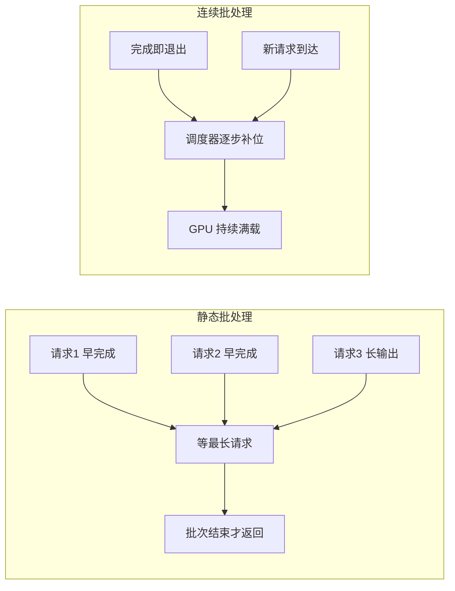
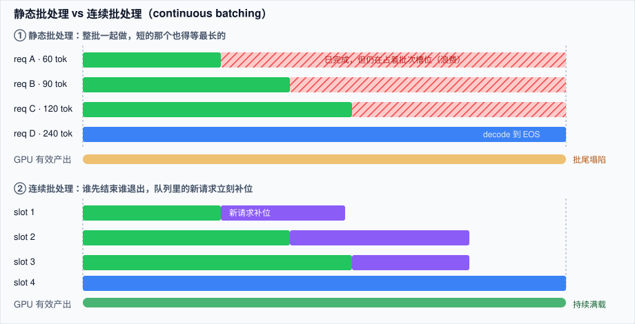

# 推理服务化：引擎、批处理与延迟指标

> **一句话**：现代 LLM 推理引擎的核心不是「把模型跑得更快」，而是「让 GPU 在等 token 的时候别闲着」——连续批处理（continuous batching）+ 分页 KV 缓存（PagedAttention）就是这两件事的实现。
> **难度**： 高级
> **标签**：`#infrastructure` `#llm`

## 先看结论

- **prefill 是算力瓶颈，decode 是显存带宽瓶颈**：同一个请求的两个阶段，瓶颈不同、扩缩容单位也不同。这就是「prefill / decode 分离部署」（disaggregated serving）存在的原因。
- **连续批处理带来 5–10 倍吞吐**：静态批处理要等批次里最长的那条生成完；连续批处理让先结束的请求立刻退出、新请求立刻插队补位。
- **KV 缓存是显存大户**：长上下文时 KV 可能比权重更吃显存，分页管理（vLLM PagedAttention）把碎片吃掉，等效提高并发数。
- **必须盯四个指标**：TTFT（首 token 延迟）、TPOT/ITL（每 token 间隔）、吞吐（tok/s）、goodput（满足 SLO 的那部分吞吐）。只看平均延迟会骗人，要看 p95/p99。
- **选型默认答案**：通用高并发 → vLLM；前缀分支多（Agent、评测、多轮）→ SGLang；只做 NVIDIA 且压榨延迟 → TensorRT-LLM；CPU/端侧 → llama.cpp / MLX。

## 为什么「引擎」不是可选项？

同一份权重、同一张 H100，裸 `model.generate()` 和调优过的引擎，吞吐可以差一个数量级。原因很朴素：





> 💡 **提示**：Agent 负载天生「长输入 + 中等输出 + 高频短请求」，且每轮重复发送同一前缀——所以引擎的前缀缓存能力对 Agent 场景比对聊天更重要。

## 核心机制对照

| 机制 | 治什么 | 代表实现 | 对 Agent 的意义 |
|---|---|---|---|
| Continuous batching | decode 阶段 GPU 空转 | vLLM / SGLang / TRT-LLM | 并发用户数直接翻几倍 |
| PagedAttention | KV 显存碎片 | vLLM | 同样显存塞更长上下文 |
| RadixAttention（基数树前缀缓存） | 重复 prefill | SGLang | 多轮 Agent、同 system prompt 批量评测受益最大 |
| Chunked prefill | 长 prompt 卡住 decode，p99 TTFT 爆炸 | vLLM V1 / SGLang | 混合「长 RAG 请求 + 短请求」时必须开 |
| Speculative decoding（草稿模型） | 显存带宽瓶颈 | EAGLE 系列、Medusa | 输出阶段提速 1.5–3×，长输出场景有效 |
| FP8 / INT4 权重量化、FP8 KV | 显存容量与带宽 | AWQ/GPTQ/FP4，各家引擎支持 | 让 70B 级别塞进单机 |
| Prefill / Decode 分离 | 两阶段资源画像冲突 | NVIDIA Dynamo + NIXL、llm-d、SGLang P/D | 大规模部署（几十卡起）才有意义 |
| 约束解码 / 结构化输出 | JSON 合法率与解析失败重试 | xgrammar、outlines、guided decoding | Agent 工具调用参数不再「偶尔抽风」 |

## 先量一把：TTFT / TPOT 的最小压测脚本

选型之前先有基线，否则所有「优化」都是玄学。

```python
import asyncio, time, statistics
from openai import AsyncOpenAI

CLIENT = AsyncOpenAI(base_url="http://127.0.0.1:8000/v1", api_key="EMPTY")
PROMPT = "用 300 字解释 RAG 与微调的取舍。"   # 换成你真实的业务 prompt

async def one():
    t0 = time.perf_counter(); ttft = None; n = 0
    async with await CLIENT.chat.completions.create(
        model="your-model", messages=[{"role": "user", "content": PROMPT}],
        max_tokens=300, stream=True,
    ) as stream:
        async for chunk in stream:
            if chunk.choices and chunk.choices[0].delta.content:
                if ttft is None:
                    ttft = time.perf_counter() - t0
                n += 1
    total = time.perf_counter() - t0
    return ttft, (total - ttft) / max(n - 1, 1), n

async def main(concurrency=16):
    for _ in range(3):                      # 预热，别把冷启动算进去
        await asyncio.gather(*[one() for _ in range(concurrency)])
    res = await asyncio.gather(*[one() for _ in range(concurrency * 5)])
    p50 = lambda xs: statistics.quantiles(xs, n=100)[49]
    p99 = lambda xs: statistics.quantiles(xs, n=100)[98]
    print(f"TTFT p50 {p50([r[0] for r in res]):.3f}s  p99 {p99([r[0] for r in res]):.3f}s")
    print(f"TPOT p50 {p50([r[1] for r in res])*1000:.1f}ms  p99 {p99([r[1] for r in res])*1000:.1f}ms")
    print(f"输出 tokens 合计 {sum(r[2] for r in res)}")

asyncio.run(main())
```

**读法**：TTFT 高 → prefill 撑不住（开 chunked prefill、缩 prompt、加卡）；TPOT 高 → decode 带宽/并发问题（量化 KV、减并发、上分离部署）；只有 p99 炸 → 排队问题，看调度而不是算力。

## 工程现场笔记

- **vLLM**：生态最广（文本 / 视觉 / 音频 / embedding），V1 引擎默认自动前缀缓存，K8s 生产栈与 llm-d（Red Hat、Google Cloud、IBM、NVIDIA 参与）在做 K8s 原生的分离式部署。
- **SGLang**：RadixAttention 对「共享前缀 + 分支」的负载结构最贴合，Agent 与批量评测常用；约束解码（xgrammar 后端）在开源方案里通常是最快的一档。
- **TensorRT-LLM**：只跑 NVIDIA，压榨延迟与吞吐，代价是构建/运维成本明显更高。
- **托管 API**：把上面所有脏活打包给你，换来的是「不可控的前缀缓存策略与限流」——所以仍要做 [模型网关](model-gateway.md) 那一层。
- **端侧 / 本地**：llama.cpp（GGUF）、MLX（Apple Silicon）——离线、隐私优先场景的唯一现实解，见 [推理经济学](inference-economics-deployment.md)。

> ⚠ **注意**：厂商/社区的吞吐与延迟数字基本都在「理想 batch、单一模型、短上下文」下测的。要自己复现，用你的真实 prompt 分布（长上下文 + 高并发）压测，差异可以到 3 倍以上。

## 常见误区

- ❌ 用平均延迟做 SLO：排队抖动全在尾部，p99 才是用户骂你的那个数字
- ❌ 只看 tok/s 不看 goodput：吞吐再高，超 SLO 的请求都算废品
- ❌ 长上下文业务不开 chunked prefill：一条 50k token 的 RAG 请求能把同批次所有人的 TPOT 拖崩
- ❌ 上来就搞分离式部署：几十卡以下收益抵不上运维复杂度，先把连续批处理与前缀缓存用满
- ❌ 忽略冷启动：模型权重加载到显存要几十秒到几分钟，autoscale 到 0 要接受首请求慢，或者留最小副本

## 容量粗算：一个副本能扛多少并发

并发上限由显存与 KV 缓存共同决定，近似为：

$$
N_{\text{seq}}\approx\frac{\text{显存}_{\text{可用}}-\text{权重字节}}{\text{单序列 KV 字节}}
$$

其中单序列 KV 字节 $=2\times L\times H_{kv}\times d_{head}\times S\times\dfrac{\text{bits}}{8}$（见 [注意力与 KV 缓存](../03-llm/transformer-attention.md) 的推导）。两个结论：一是**长上下文直接压低单副本并发**，二是 GQA/MQA/MLA 这类结构改进之所以重要，正是因为它们缩小了分母。

按 token 计的吞吐成本则可写成：

$$
\text{成本}/10^6\,\text{tokens}=\frac{\text{副本时价}\times 3600}{\text{tokens per second}\times 10^{6}}
$$

**优化方向因此很明确**：提高批处理效率（连续批处理、PagedAttention）比换更快的单卡更划算，因为它同时改善分母。

## 小练习

用上面脚本对同一模型分别测 `max_tokens=1`（纯 prefill）、`max_tokens=300`（prefill+decode）、并发 1 / 8 / 32 三档，画出 TTFT 与 TPOT 随并发的曲线，判断你的瓶颈落在哪一档并发。

## 相关资源

- [vLLM](https://github.com/vllm-project/vllm)、[SGLang](https://github.com/sgl-project/sglang)、[TensorRT-LLM](https://github.com/NVIDIA/TensorRT-LLM)
- [NVIDIA Dynamo](https://github.com/ai-dynamo/dynamo)、[llm-d](https://github.com/llm-d/llm-d)
- [PagedAttention 论文（vLLM）](https://arxiv.org/abs/2309.06180)、[Orca（连续批处理出处）](https://www.usenix.org/conference/osdi22/presentation/yu)

## 相关知识点

- [前缀缓存与上下文工程](prefix-cache-context-engineering.md)
- [推理、量化、蒸馏与部署](../03-llm/inference-quantization-deployment.md)
- [GPU 调度与多租户](gpu-scheduling-multitenancy.md)
- [部署与弹性伸缩](../11-engineering/deployment-scaling.md)
