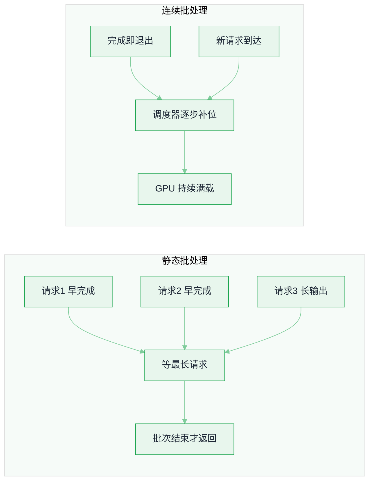
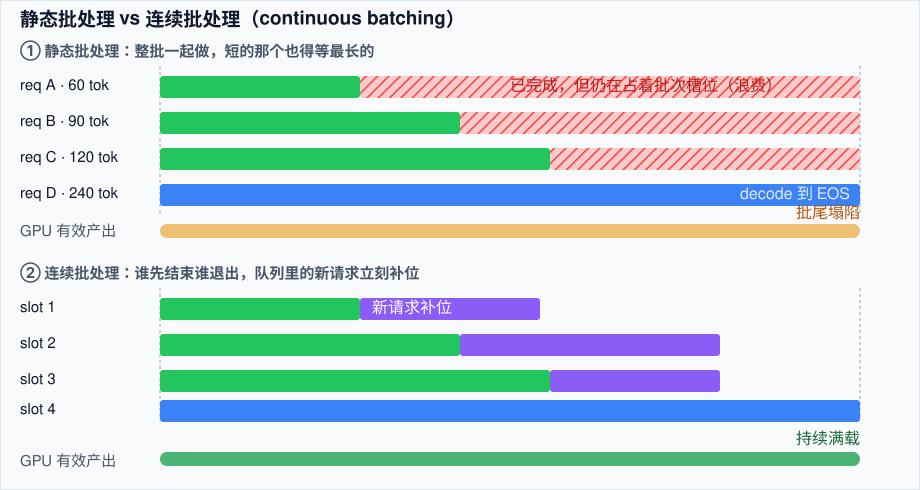
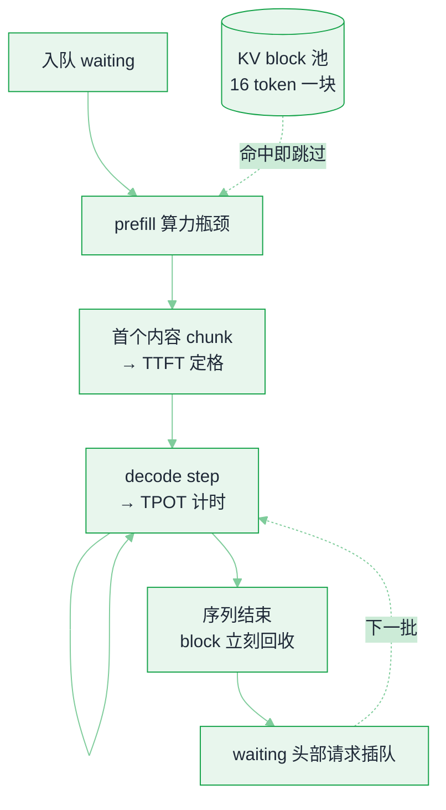

# 推理服务化：引擎、批处理与延迟指标


**一句话**：现代 LLM 推理引擎的核心不是「把模型跑得更快」，而是「让 GPU 在等 token 的时候别闲着」——连续批处理（continuous batching）+ 分页 KV 缓存（PagedAttention）就是这两件事的实现。
  **难度**： 高级


## 先看结论

- **prefill 是算力瓶颈，decode 是显存带宽瓶颈**：同一个请求的两个阶段，瓶颈不同、扩缩容单位也不同。这就是「prefill / decode 分离部署」（disaggregated serving）存在的原因。
- **连续批处理带来 5–10 倍吞吐**：静态批处理要等批次里最长的那条生成完；连续批处理让先结束的请求立刻退出、新请求立刻插队补位。
- **KV 缓存是显存大户**：长上下文时 KV 可能比权重更吃显存，分页管理（vLLM PagedAttention）把碎片吃掉，等效提高并发数。
- **必须盯四个指标**：TTFT（首 token 延迟）、TPOT/ITL（每 token 间隔）、吞吐（tok/s）、goodput（满足 SLO 的那部分吞吐）。只看平均延迟会骗人，要看 p95/p99。
- **选型默认答案**：通用高并发 → vLLM；前缀分支多（Agent、评测、多轮）→ SGLang；只做 NVIDIA 且压榨延迟 → TensorRT-LLM；CPU/端侧 → llama.cpp / MLX。

## 为什么「引擎」不是可选项？

同一份权重、同一张 H100，裸 `model.generate()` 和调优过的引擎，吞吐可以差一个数量级。原因很朴素：





*《图：上下两条时间轴同为四个请求——静态批被最长的 240 tok 拖住尾巴，连续批里 A 一结束新请求立刻补位；GPU 有效产出的差额就是账单》*
> 💡 **提示**：Agent 负载天生「长输入 + 中等输出 + 高频短请求」，且每轮重复发送同一前缀——所以引擎的前缀缓存能力对 Agent 场景比对聊天更重要。

## 核心机制对照

| 机制 | 治什么 | 代表实现 | 对 Agent 的意义 |
|---|---|---|---|
| Continuous batching | decode 阶段 GPU 空转 | vLLM / SGLang / TRT-LLM | 并发用户数直接翻几倍 |
| PagedAttention | KV 显存碎片 | vLLM | 同样显存塞更长上下文 |
| RadixAttention（基数树前缀缓存） | 重复 prefill | SGLang | 多轮 Agent、同 system prompt 批量评测受益最大 |
| Chunked prefill | 长 prompt 卡住 decode，p99 TTFT 爆炸 | vLLM V1 / SGLang | 混合「长 RAG 请求 + 短请求」时必须开 |
| Speculative decoding（草稿模型） | 显存带宽瓶颈 | EAGLE 系列、Medusa | 输出阶段提速 1.5–3×，长输出场景有效 |
| FP8 / INT4 权重量化、FP8 KV | 显存容量与带宽 | AWQ/GPTQ/FP4，各家引擎支持 | 让 70B 级别塞进单机 |
| Prefill / Decode 分离 | 两阶段资源画像冲突 | NVIDIA Dynamo + NIXL、llm-d、SGLang P/D | 大规模部署（几十卡起）才有意义 |
| 约束解码 / 结构化输出 | JSON 合法率与解析失败重试 | xgrammar、outlines、guided decoding | Agent 工具调用参数不再「偶尔抽风」 |

## 先量一把：TTFT / TPOT 的最小压测口径

选型之前先有基线，否则所有「优化」都是玄学。基线的本体不是一段代码，而是**一份写清楚就能复现的跑批契约**：同一条业务 prompt、流式返回、固定并发、先预热再计数、按百分位收数。下面这份 JSON 把原来那段压测脚本的全部信息压成了数据——字段、阈值、公式与示例读数一一对应，照抄就能让任何人给你跑出可比的数。

```json
{
  "target": {
    "base_url": "http://127.0.0.1:8000/v1",
    "api_key": "EMPTY",
    "model": "your-model"
  },
  "request": {
    "messages": [{ "role": "user", "content": "用 300 字解释 RAG 与微调的取舍。" }],
    "max_tokens": 300,
    "stream": true,
    "note": "prompt 换成你真实的业务 prompt，否则测出来的 prefill/decode 比例没有参考价值"
  },
  "load_plan": {
    "concurrency": 16,
    "warmup_rounds": 3,
    "measured_requests": 80,
    "formula": "measured_requests = concurrency * 5；预热 3 轮整批丢弃，不写进统计"
  },
  "metric_definitions": {
    "ttft_s": "t0 起算，到第一个 delta.content 非空的 chunk 到达为止（chunk.choices[0].delta.content）",
    "tpot_ms": "(total_s - ttft_s) / max(n - 1, 1) * 1000，n 为收到的内容 chunk 数",
    "output_tokens_total": "sum(n)，吞吐的分母",
    "percentiles": "p50 = statistics.quantiles(xs, n=100)[49]，p99 = 同数组的 [98]"
  },
  "report_example": {
    "TTFT": { "p50_s": 0.412, "p99_s": 1.86 },
    "TPOT": { "p50_ms": 21.4, "p99_ms": 58.7 },
    "output_tokens_total": 23180
  }
}
```

**读法**：TTFT 高 → prefill 撑不住（开 chunked prefill、缩 prompt、加卡）；TPOT 高 → decode 带宽/并发问题（量化 KV、减并发、上分离部署）；只有 p99 炸 → 排队问题，看调度而不是算力。

预热为什么必须有：权重加载到显存要几十秒，第一批请求还要现场分配 KV block，这两笔一次性开销如果计入 p99，你会得出「引擎不行」的错误结论。按机制算也知道冷启动首请求会明显更慢——问题不在引擎慢，而在两笔一次性开销被计进了同一个样本。

## 分步演示：一条请求从入队到吐出最后一个 token

契约里那两个数各自在哪个瞬间被定格，看这条时间线就清楚了。



*《图：TTFT 在第一个非空 chunk 处定格，TPOT 是此后每个 step 的平均间隔；「回收—插队」这条回头边就是连续批处理的全部秘密》*




#### 第 1 步：入队——TTFT 从这一毫秒开始计时

请求带着 `max_tokens=300` 和 `stream=true` 到达，进的是 waiting 队列而不是 GPU。调度器先估两件事：这条 prompt prefill 完需要多少 KV block、现有空闲 block 凑不凑得出来。凑不出来就继续排队，**排队时间 1:1 记进 TTFT**。所以「p50 正常 0.41s、p99 炸到 1.86s」这种曲线，问题多半在这一步，而不是算力不够。





#### 第 2 步：prefill——算力瓶颈，也是前缀缓存唯一能救的地方

整段 prompt 过一遍前向，逐层写出 KV。引擎按固定块粒度比对已缓存前缀（vLLM 默认 block size 16 token），命中的块直接引用、跳过计算。示例里那条几 KB 的系统前缀若命中，TTFT 从 0.4s 量级掉到 0.1s 以下；全不命中就每轮从头算——这正是 [前缀缓存与上下文工程](prefix-cache-context-engineering.md) 那一页值回票价的地方。





#### 第 3 步：chunked prefill——别让一条长 prompt 毒害整个批次

一条 50k token 的 RAG 请求若一次性 prefill，会把同批次所有人的 TPOT 顶上去。开启 chunked prefill 后 prompt 切成若干块，每个 step 只喂一块，并与正在 decode 的序列混跑：短请求的每 token 间隔稳住了，长请求自己的 TTFT 变长。**这是明确的取舍，不是免费午餐**，混合负载下不开它等于把长尾用户当祭品。





#### 第 4 步：第一个内容 chunk 到达，TTFT 在这里定格

流式响应的头几个 chunk 可能是空壳（只有 role，或者纯粹的心跳），所以计时点必须卡在**第一个 `delta.content` 非空的 chunk**。这个定义差之毫厘，两拨人测出来的 TTFT 就不可比——把口径写进契约，比把脚本传来传去更靠谱。





#### 第 5 步：decode 循环——带宽瓶颈，连续批处理在这里补位

之后每个 step 每条序列只产 1 token，却要读一遍权重加上不断变长的 KV，瓶颈从算力切到显存带宽。调度器每一步都重算批次：生成完的序列立刻退出、block 回收，waiting 头部的请求立刻插队补位。静态批处理得等同批最长那条 300 token 全吐完，连续批处理让早收口的先走——开头那条「5–10 倍吞吐」的差就是这么来的。





#### 第 6 步：80 条样本收数，别用平均值汇报

并发 16、测量 80 条（= `concurrency * 5`，预热 3 轮丢弃），逐条算 `ttft` 与 `tpot`，再取 p50（100 分位的第 49 格）与 p99（第 98 格），输出 token 加总成吞吐。同一个服务，**报「平均 0.5s」和报「p99 1.86s」，做出的容量决策完全不同**：SLO 写 p99，账单看吞吐，两边都要 goodput（满足 SLO 的那部分吞吐）兜底。




## 同一份契约，四种负载（点标签切换）



TTFT p50 0.28s、TPOT p50 14ms。这一档没有任何排队，也没有带宽竞争，是**你理论上能承诺的下限**。它的用途是减法：并发拉高后涨出来的部分，才是调度与带宽的代价。如果并发 1 就慢得离谱，先怀疑没走流式、或者网关那一层在缓冲。



吞吐接近线性（单卡 8 路大约能到单流的 5.5–6.5 倍），TTFT 只涨到 0.35s，TPOT 17ms。GPU 还没喂饱，连续批处理的补位几乎不排队。**多数 Agent 服务应该守在这一档左边**，用多副本横向扩，而不是把单副本的并发往上限顶。



吞吐还在涨但斜率明显变平（约 8–9 倍，远不是 32 倍），TPOT 从 17ms 跳到 45ms，p99 2.3s。每个 step 要读的 KV 总量正比于批内序列数，**先到顶的是带宽不是算力**。对策是量化 KV（FP8）、限制单副本并发、把 `max_num_seqs` 往「吞吐/延迟」拐点左边收，而不是继续加批。



不开 chunked prefill 时，一条 50k prompt 能把同批次所有人的 TPOT 顶到 120ms 以上——短请求的用户最先感受到「卡死」。开了之后短请求回到 45ms 附近，代价是长请求自己的 TTFT 涨到 3s 量级。混合负载的正解是**按长度分池路由**，长请求单独一档 SLO（→ [GPU 调度与多租户](gpu-scheduling-multitenancy.md)）。




**本轮取舍**：并发 1 / 8 / 32 三档跑同一份契约，拐点落在 8 与 32 之间——继续加并发的收益已经抵不上 p99 的恶化，加副本比加批划算。另外，把同一个引擎的批处理参数、KV 量化、chunked prefill 认真调一轮拿到的提升，通常不小于在两个主流引擎之间迁移的收益，而迁移还要重踩一遍坑：**选型会开三天，调参往往三天回本**。


## 工程现场笔记

- **vLLM**：生态最广（文本 / 视觉 / 音频 / embedding），V1 引擎默认自动前缀缓存，K8s 生产栈与 llm-d（Red Hat、Google Cloud、IBM、NVIDIA 参与）在做 K8s 原生的分离式部署。
- **SGLang**：RadixAttention 对「共享前缀 + 分支」的负载结构最贴合，Agent 与批量评测常用；约束解码（xgrammar 后端）在开源方案里通常是最快的一档。
- **TensorRT-LLM**：只跑 NVIDIA，压榨延迟与吞吐，代价是构建/运维成本明显更高。
- **托管 API**：把上面所有脏活打包给你，换来的是「不可控的前缀缓存策略与限流」——所以仍要做 [模型网关](model-gateway.md) 那一层。
- **端侧 / 本地**：llama.cpp（GGUF）、MLX（Apple Silicon）——离线、隐私优先场景的唯一现实解，见 [推理经济学](inference-economics-deployment.md)。

> ⚠ **注意**：厂商/社区的吞吐与延迟数字基本都在「理想 batch、单一模型、短上下文」下测的。要自己复现，用你的真实 prompt 分布（长上下文 + 高并发）压测，差异可以到 3 倍以上。

## 常见误区

- ❌ 用平均延迟做 SLO：排队抖动全在尾部，p99 才是用户骂你的那个数字
- ❌ 只看 tok/s 不看 goodput：吞吐再高，超 SLO 的请求都算废品
- ❌ 长上下文业务不开 chunked prefill：一条 50k token 的 RAG 请求能把同批次所有人的 TPOT 拖崩
- ❌ 上来就搞分离式部署：几十卡以下收益抵不上运维复杂度，先把连续批处理与前缀缓存用满
- ❌ 忽略冷启动：模型权重加载到显存要几十秒到几分钟，autoscale 到 0 要接受首请求慢，或者留最小副本

## 容量粗算：一个副本能扛多少并发

并发上限由显存与 KV 缓存共同决定，近似为：

$$
N_{\text{seq}}\approx\frac{\text{显存}_{\text{可用}}-\text{权重字节}}{\text{单序列 KV 字节}}
$$

其中单序列 KV 字节 $$=2\times L\times H_{kv}\times d_{head}\times S\times\dfrac{\text{bits}}{8}$$（见 [注意力与 KV 缓存](../03-llm/transformer-attention.md) 的推导）。两个结论：一是**长上下文直接压低单副本并发**，二是 GQA/MQA/MLA 这类结构改进之所以重要，正是因为它们缩小了分母。

按 token 计的吞吐成本则可写成：

$$
\text{成本}/10^6\,\text{tokens}=\frac{\text{副本时价}\times 3600}{\text{tokens per second}\times 10^{6}}
$$

**优化方向因此很明确**：提高批处理效率（连续批处理、PagedAttention）比换更快的单卡更划算，因为它同时改善分母。

## 小练习

按上面那份压测契约（`load_plan` 与 `metric_definitions` 保持不动）对同一模型分别测 `max_tokens=1`（纯 prefill）、`max_tokens=300`（prefill+decode），并发 1 / 8 / 32 三档，画出 TTFT 与 TPOT 随并发的曲线，判断你的瓶颈落在哪一档并发。两条曲线的拐点如果不重合，说明两个阶段的资源画像真的冲突——那就是分离式部署唯一的入场理由。

## 实战手记

- **榜单与现场差的是分布**：经验值上，用短文本、均匀负载测出来的吞吐，跟真实 Agent 负载能差 3–5 倍——长上下文、突发并发、前缀命中率忽高忽低，每一项都在吃掉理论收益。容量表要用线上流量日志回放压出来的数字填，别用论文的。
- **调优红利常大于换引擎**：我们常见的项目里，把同一个引擎的批处理参数、KV 量化、chunked prefill 认真调一轮拿到的提升，通常不小于在两个主流引擎之间折腾迁移的收益——而迁移还要重踩一遍坑。选型会开三天，调参往往三天就回本。
- **前缀命中率是最值得盯的运营指标**：对 Agent 负载，这个数低于三成的话，先回头检查自家 prompt 组装（system prompt 是否稳定、历史是否被截了头），再谈引擎的高级特性。命中率从三成拉到七成，等效于白捡半集群算力。

## 参考资料

- [vLLM](https://github.com/vllm-project/vllm)、[SGLang](https://github.com/sgl-project/sglang)、[TensorRT-LLM](https://github.com/NVIDIA/TensorRT-LLM)
- [NVIDIA Dynamo](https://github.com/ai-dynamo/dynamo)、[llm-d](https://github.com/llm-d/llm-d)
- [PagedAttention 论文（vLLM）](https://arxiv.org/abs/2309.06180)、[Orca（连续批处理出处）](https://www.usenix.org/conference/osdi22/presentation/yu)

## 相关知识点

- [前缀缓存与上下文工程](prefix-cache-context-engineering.md)
- [推理、量化、蒸馏与部署](../03-llm/inference-quantization-deployment.md)
- [GPU 调度与多租户](gpu-scheduling-multitenancy.md)
- [部署与弹性伸缩](../11-engineering/deployment-scaling.md)

