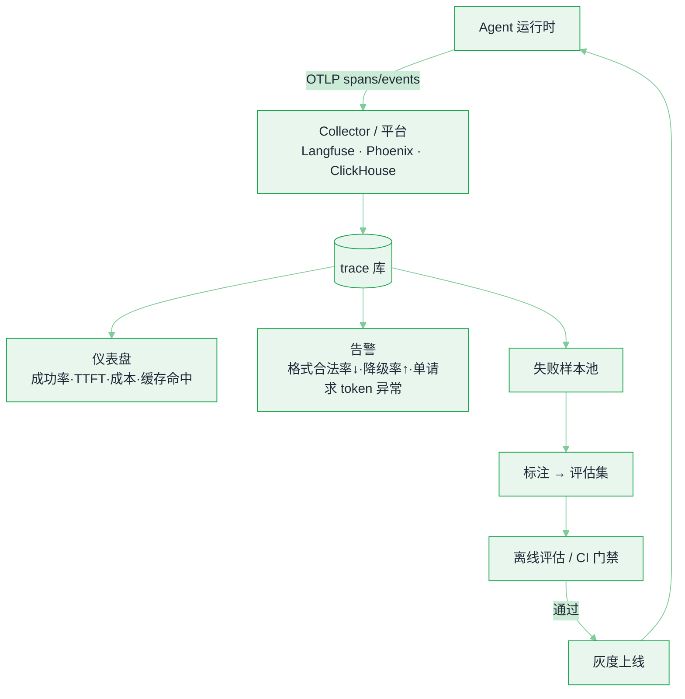

# 可观测性与评估平台


**一句话**：LLM 系统的可观测性不是「加日志」，而是让每一次输出都能回答四个问题：输入是什么、模型怎么想的（调了哪些工具）、为什么这个分数、能不能重跑一遍——把 trace 变成数据集，评估和回归才成为可能。
  **难度**： 进阶


## 先看结论

- **一次 run 的完整 trace = 模型调用 + 工具调用 + 检索 + 状态**：只记 prompt/response 看不到「为什么慢/为什么错」；必须把父子关系（run → step → tool）与 token 计量、缓存命中挂上。
- **用 OTel GenAI 语义约定做底座**：字段名统一（span kind、`gen_ai.*` 属性）之后，平台、告警、评估、仪表盘都不必为每个框架重写一遍。
- **评估分三层**：单元测试（格式/Schema/工具参数合法率）→ 离线评估集（30–500 例，LLM-as-judge + 人评抽样）→ 在线监控（用户反馈、失败率、成本、延迟分位数）。只做中间那层最危险。
- **trace 即数据集**：把线上失败样本自动进候选池 → 人工确认 → 进评估集。这是唯一能让「评估集不过时」的机制。
- **先定义「什么叫成功」**：Agent 任务级成功率（是否真的完成了用户目标），不是「有没有返回 200」。

## 数据流



*《图：trace 库一分三——喂仪表盘、告警、失败样本池；只有走 CI 门禁灰度上线这一支能回流运行时，评估集才不过时》*

## 指标字典（照抄可用）

| 维度 | 指标 | 建议告警线（示例，按业务校准） |
|---|---|---|
| 质量 | 任务级成功率、引用正确率、拒答正确率、格式合法率 | 任一相对基线 ↓3pp（滚动 7 日） |
| 质量 | judge 分（相关性/完整性/安全） | 均值 ↓0.2 或分布左移 |
| 延迟 | TTFT p50/p95、端到端 p95、每步耗时分布 | p95 > SLO×1.5 持续 10 分钟 |
| 成本 | 单次成功任务成本、每请求 token、缓存命中率、升级率（escalation） | 成本 +30% 或命中率 <50% |
| 稳定 | 429/5xx 率、重试率、超时率、fallback 触发率 | 重试率 >2% |
| 行为 | 平均步数、最大步数触顶率、循环检测命中、工具选择分布漂移 | 触顶率 >5% |
| 安全 | 注入检测命中、越权工具调用被拒次数、DLP 拦截 | 越权被拒次数突增（说明有攻击或 prompt 退化） |

## 最小埋点：run → step → tool 三层 span

埋点 SDK 的 API 不用背，但一份**合规 trace 长什么样**必须心里有数。下面是一次 Agent run 真实形状的 span 集：一个 `agent.run` 做父，`llm.chat` 与 `tool.search_orders` 挂在下面，字段名全部走 OTel 的 `gen_ai.*` 语义约定——**字段名统一的价值就在这里：平台、告警、评估、仪表盘不必为每个框架重写一遍**：

```json
{
  "trace_id": "4bf92f3577b34da6a3ce929d0e0e4736",
  "spans": [
    {
      "name": "agent.run",
      "span_id": "00f067aa0ba902b7",
      "parent_id": null,
      "attributes": {
        "gen_ai.agent.run_id": "run-20260923-017",
        "prompt_version": "v14",
        "model": "your-model@2026-08",
        "tool_set_hash": "sha1:4d9e1a"
      }
    },
    {
      "name": "llm.chat",
      "span_id": "53995c3f42cd8ad8",
      "parent_id": "00f067aa0ba902b7",
      "attributes": {
        "gen_ai.operation.name": "chat",
        "gen_ai.request.model": "your-model@2026-08",
        "gen_ai.agent.run_id": "run-20260923-017",
        "gen_ai.agent.step": 2,
        "gen_ai.usage.input_tokens": 3820,
        "gen_ai.usage.output_tokens": 214,
        "gen_ai.usage.cached_tokens": 3584,
        "agent.prompt_hash": "sha1:ab12cd"
      }
    },
    {
      "name": "tool.search_orders",
      "span_id": "b7c1f18f0d2e4a55",
      "parent_id": "53995c3f42cd8ad8",
      "attributes": {
        "tool.name": "search_orders",
        "tool.args_redacted": "{\"order_id\": \"ORD-8**-**\"}",
        "tool.ok": true,
        "tool.ms": 240
      }
    }
  ]
}
```

这份 payload 里五个要点，缺一个都会瞎一块：

- **父子链是命根子**：run → step → tool 靠 `parent_id` 一层层挂上去，「为什么慢、为什么错」沿父链查；只记 prompt/response 就没有这个视角，也做不出「首次失败步骤」直方图。
- **token 计量必须带 `gen_ai.usage.cached_tokens`**：示例里 3584/3820 ≈ 94% 命中。没有这个字段，「成本涨了是因为前缀缓存失效」这种结论既算不出也告不了警。
- **`agent.prompt_hash` 聚合同前缀请求**：prompt 改版出回归时，按哈希分组就能定位「v15 毒害了哪批请求」，不用一条条翻原文。
- **`tool.ok` 是布尔不是异常**：工具抛异常时 `record_exception` 记完还要向上抛，trace 保持完整——「一抛异常就丢埋点」是监控盲区的第一来源。
- **`tool.ms` 无论成败都要落**（在 finally 语义里写，示例是 240 ms）：没有它，「模型慢」和「工具慢」永远混在一个端到端数字里分不清。


`redact()` 必须**在埋点里，不在平台里**。trace 是数据落盘点，明文密钥与 PII 一旦进去就很难追回——`tool.args_redacted` 落盘时就已完成脱敏。强合规栈还要在这之前叠加采样、分级脱敏与 TTL：DB 只存哈希与元数据，全文放加密对象存储。


## 从一次请求到一条评估用例：五步流水线




#### 第 1 步：run 创建——身份四件套先钉死

`run_id` 生成的同时挂上 `prompt_version`、`model`、`tool_set_hash`。三个月后有人问「为什么 6 月好用、7 月变差」，靠的就是这三个字段做横向对比——最常见的答案是某天加了 12 个 MCP 工具把选择面撑大了，而 `tool_set_hash` 的变化能直接证明这一点。





#### 第 2 步：每次模型调用发一个 `llm.chat`

span 上带 `gen_ai.operation.name=chat`、模型名、`run_id` 和当前 `gen_ai.agent.step` 序号；响应回来后把 `input_tokens`/`output_tokens`/`cached_tokens` 三个计量挂上，顺带记 TTFT。步序号是给分析用的：「首次失败发生在第几步」直方图就按它分桶。





#### 第 3 步：每次工具调用发一个 `tool.{name}`

span 名直接带工具名（如 `tool.search_orders`），参数先过 `redact()` 再落 `tool.args_redacted`；成功置 `tool.ok=true`，失败记异常并向上抛；无论哪种结局，`tool.ms` 都要写进去。工具选择分布漂移（哪个工具被点得越来越多）也只有靠这层 span 才统计得出来。





#### 第 4 步：平台按指标字典聚合，过线告警

trace 进 Collector（Langfuse / Phoenix / ClickHouse）后聚合成仪表盘与告警：质量任一指标相对基线 ↓3pp（滚动 7 日）、TTFT p95 > SLO×1.5 持续 10 分钟、重试率 >2%、最大步数触顶率 >5%、单请求 token 异常——每条告警线都要能直接点回一组具体 span，否则等于没告警。





#### 第 5 步：失败样本沉淀进评估集，闭环才算合上

用户差评、`tool.ok=false` 的重试、格式校验失败的 run 自动进候选池 → 人工确认 → 进评估集（30–500 例）→ CI 门禁每次改 prompt / 换模型前跑一遍、不过不放行。评估集「永远不过时」只有这一条机制；绿灯只代表老场景没问题，新场景没跟上就是自欺。




## 四条告警线，四种结局（点标签切换）



拉出失败样本按 `prompt_hash` 分组，发现一半的输出在同一位置被截断——`max_tokens` 被网关改配置时调小了。处置：回滚配置 + 把这条样本按原形状补进评估集。教训是**行为类指标必须由 span 级证据兜底**，光看聚合曲线只会看到「莫名其妙掉了一截」。



一个 run 里 `llm.chat` 数量远超平均，且 `gen_ai.agent.step` 一路递增、`input_tokens` 单调上涨——上下文不压缩导致的循环，「最大步数触顶率」同步抬头。修的是循环检测与压缩策略，不是换模型；「没有异常抛出但把用户的活干成 0 件」正是这类 run 的画像。



trace 显示慢只发生在模型调用段、工具 span 正常，再比 `cached_tokens`：从 94% 掉到接近 0——系统 prompt 改了一个字符把前缀缓存打失效了。缓存失效的代价先出现在延迟告警上，然后才出现在账单上；不埋 `cached_tokens`，你只能看到「莫名其妙变慢了」。



`tool.ok=false` 集中在写操作，且 `tool.args_redacted` 里出现跨租户参数——要么外部攻击，要么 prompt 退化把工具 schema 泄了出去。第一步是网关熔断该工具，第二步才回看 trace 定位注入路径（→ [模型网关与路由](model-gateway.md)）。被拒次数突增本身就是「防线在响」，比出事后查审计日志便宜两个数量级。



## 平台层怎么选

| 需求 | 方案 | 说明 |
|---|---|---|
| 快速起步、要评估与数据集管理 | Langfuse（自托管/云）、Phoenix/Arize | trace + prompt 版本 + 数据集 + judge，一站式，社区大 |
| 已重度用某框架 | LangSmith（LangChain/LangGraph）、各家 SDK 内建 | 心智一致、集成零成本；跨框架时会锁定 |
| 统一可观测栈（含非 LLM 部分） | OTel + Tempo/ClickHouse/Grafana | 与既有 APM 打通；LLM 语义约定需自行映射到看板 |
| 强合规、要求自托管与最小留存 | 自托管 + 采样 + 分级脱敏 + TTL | 明文不入库，全文放加密对象存储，DB 只存哈希与元数据 |
| 需要「改 prompt 就自动跑回归」 | CI 挂评估集（30–100 例）+ 阈值门禁 | 与 [持续评估](../11-engineering/continuous-evaluation.md) 同一条流水线 |

## 评估方法：怎么打分才可信

1. **规则优先**：能用断言就别用模型——JSON Schema 合法率、必须引用来源、必须调用某工具、数值区间、时间/货币格式。这些占真实缺陷的相当比例，且零成本零噪声。
2. **LLM-as-judge 要设护栏**：给判分器 rubric（1/3/5 分档的明确定义）、成对比较优于单点打分、判分模型 ≠ 被评模型、抽样 5–10% 人评校准一致率。
   - **纯判定型的评分可以换成决策模型，把抽检变成全量**：「这条轨迹是否完成任务」「是否违规」只要一个布尔，不需要判词。2026-09 起的 [System One 决策模型](../18-frontier-2026/system-one-decision-models.md) 在 LangChain 的对照实验里单次评估约 0.44 s / $0.00035（同任务用生成模型判分一批约 $28），因此可以从「抽 5% 人评校准」升级为「每条都判、人评只做锚点」。代价是它**不给理由**，排错时必须回看被它判错的样本原文——所以锚点集不能省。
3. **必须有「无解集」**：知识库里没有答案的问题，正确行为是拒答。没有这一类，你的评估会奖励「自信地编」。
4. **端到端 + 分步双轨**：整体成功率之外，统计「首次失败发生在第几步」（工具选择错 / 参数错 / 检索没召回 / 推理错）。定位不同，修的东西完全不同。
5. **回归门禁的阈值来自基线波动**：同一模型同一数据跑两遍的分数差就是噪声地板，门禁要比它高，否则天天红灯。


**最佳实践**：每条 trace 都存 `prompt_version` + `model` + `tool_set_hash`。三个月后有人问「为什么 6 月好用、7 月变差」，你能立刻回答——多半是某天加了 12 个 MCP 工具把选择面撑大了（→ [工具注册中心](../11-engineering/tool-registry.md)）。


## 常见误区

- ❌ 只监控 token 与延迟，不监控行为分布：模型换成更「话痨」的版本，延迟与成本同时涨，但错误率没变——没人看出这是同一件事
- ❌ 用线上流量做「在线评估」却不留人评：judge 与真实用户满意度的相关性会随任务漂移，季度校准不能省
- ❌ trace 里存完整 prompt 但不去重/不脱敏：存储成本和泄露风险同时失控；建议「结构 + 哈希 + 抽样存全文」
- ❌ 评估集从不变大：上线一个新场景后评估集没跟上，绿灯只代表老场景没问题
- ❌ 把「成功率」定义为「没有异常抛出」：Agent 可以一句不错地把用户的活干成 0 件

## 小练习

给你的 Agent 补一个「首次失败步骤」直方图（按步序号统计，并标注失败类型：检索缺失 / 工具选择错 / 参数错 / 上下文丢失 / 判分争议）。做出来后，你会发现八成问题集中在两类上——那两类就是下个月该修的东西。

## 参考资料

- [OTel GenAI 语义约定](https://opentelemetry.io/docs/specs/semconv/gen-ai/)、[Langfuse](https://github.com/langfuse/langfuse)、[Arize Phoenix](https://github.com/Arize-ai/phoenix)

## 相关知识点

- [持续评估](../11-engineering/continuous-evaluation.md)
- [模型网关与路由](model-gateway.md)
- [持久化执行与运行时](agent-runtime-durable-execution.md)
- [17 具身智能：评估基准](../17-embodied-ai/evaluation-benchmarks.md)
- [评估指标](../10-evaluation-safety/evaluation-metrics.md)
- [基准测试](../10-evaluation-safety/benchmarks.md)
- [日志与追踪](../11-engineering/logging-tracing-monitoring.md)
- [可观测工具](../11-engineering/observability-tools.md)
