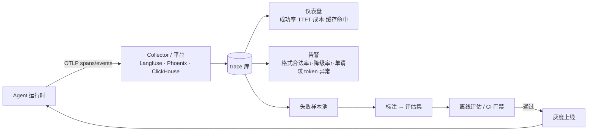

# 🏗️ 可观测性与评估平台

> **一句话**：LLM 系统的可观测性不是「加日志」，而是让每一次输出都能回答四个问题：输入是什么、模型怎么想的（调了哪些工具）、为什么这个分数、能不能重跑一遍——把 trace 变成数据集，评估和回归才成为可能。
> **难度**：⭐️⭐️ 进阶
> **标签**：`#infrastructure` `#evaluation`

## 📌 先看结论

- **一次 run 的完整 trace = 模型调用 + 工具调用 + 检索 + 状态**：只记 prompt/response 看不到「为什么慢/为什么错」；必须把父子关系（run → step → tool）与 token 计量、缓存命中挂上。
- **用 OTel GenAI 语义约定做底座**：字段名统一（span kind、`gen_ai.*` 属性）之后，平台、告警、评估、仪表盘都不必为每个框架重写一遍。
- **评估分三层**：单元测试（格式/Schema/工具参数合法率）→ 离线评估集（30–500 例，LLM-as-judge + 人评抽样）→ 在线监控（用户反馈、失败率、成本、延迟分位数）。只做中间那层最危险。
- **trace 即数据集**：把线上失败样本自动进候选池 → 人工确认 → 进评估集。这是唯一能让「评估集不过时」的机制。
- **先定义「什么叫成功」**：Agent 任务级成功率（是否真的完成了用户目标），不是「有没有返回 200」。

## 🖼️ 数据流



## 🧩 指标字典（照抄可用）

| 维度 | 指标 | 建议告警线（示例，按业务校准） |
|---|---|---|
| 质量 | 任务级成功率、引用正确率、拒答正确率、格式合法率 | 任一相对基线 ↓3pp（滚动 7 日） |
| 质量 | judge 分（相关性/完整性/安全） | 均值 ↓0.2 或分布左移 |
| 延迟 | TTFT p50/p95、端到端 p95、每步耗时分布 | p95 > SLO×1.5 持续 10 分钟 |
| 成本 | 单次成功任务成本、每请求 token、缓存命中率、升级率（escalation） | 成本 +30% 或命中率 <50% |
| 稳定 | 429/5xx 率、重试率、超时率、fallback 触发率 | 重试率 >2% |
| 行为 | 平均步数、最大步数触顶率、循环检测命中、工具选择分布漂移 | 触顶率 >5% |
| 安全 | 注入检测命中、越权工具调用被拒次数、DLP 拦截 | 越权被拒次数突增（说明有攻击或 prompt 退化） |

## 💻 最小埋点：run → step → tool 三层 span

```python
from opentelemetry import trace
from opentelemetry.sdk.trace import TracerProvider   # 配 OTLP exporter 指向平台
tracer = trace.get_tracer("agent")

def traced_llm(messages, model, meta):
    with tracer.start_as_current_span("llm.chat") as sp:
        sp.set_attribute("gen_ai.operation.name", "chat")
        sp.set_attribute("gen_ai.request.model", model)
        sp.set_attribute("gen_ai.agent.run_id", meta["run_id"])
        sp.set_attribute("gen_ai.agent.step", meta["step"])
        r = client.chat.completions.create(model=model, messages=messages)
        u = r.usage
        sp.set_attribute("gen_ai.usage.input_tokens", u.prompt_tokens)
        sp.set_attribute("gen_ai.usage.output_tokens", u.completion_tokens)
        cached = getattr(getattr(u, "prompt_tokens_details", None), "cached_tokens", 0)
        sp.set_attribute("gen_ai.usage.cached_tokens", cached)
        sp.set_attribute("agent.prompt_hash", sha(messages))    # 便于聚合同前缀请求
        return r

def traced_tool(name, args, fn):
    with tracer.start_as_current_span(f"tool.{name}") as sp:
        sp.set_attribute("tool.name", name)
        sp.set_attribute("tool.args_redacted", redact(args))    # 落盘前脱敏！
        t0 = perf_counter()
        try:
            out = fn(**args)
            sp.set_attribute("tool.ok", True)
            return out
        except Exception as e:
            sp.set_attribute("tool.ok", False); sp.record_exception(e); raise
        finally:
            sp.set_attribute("tool.ms", int((perf_counter()-t0)*1000))
```

**要点**：`redact()` 必须在埋点里，不在平台里。trace 是数据落盘点，明文密钥与 PII 一旦进去就很难追回。

## ⚙️ 平台层怎么选

| 需求 | 方案 | 说明 |
|---|---|---|
| 快速起步、要评估与数据集管理 | Langfuse（自托管/云）、Phoenix/Arize | trace + prompt 版本 + 数据集 + judge，一站式，社区大 |
| 已重度用某框架 | LangSmith（LangChain/LangGraph）、各家 SDK 内建 | 心智一致、集成零成本；跨框架时会锁定 |
| 统一可观测栈（含非 LLM 部分） | OTel + Tempo/ClickHouse/Grafana | 与既有 APM 打通；LLM 语义约定需自行映射到看板 |
| 强合规、要求自托管与最小留存 | 自托管 + 采样 + 分级脱敏 + TTL | 明文不入库，全文放加密对象存储，DB 只存哈希与元数据 |
| 需要「改 prompt 就自动跑回归」 | CI 挂评估集（30–100 例）+ 阈值门禁 | 与 [持续评估](../11-engineering/continuous-evaluation.md) 同一条流水线 |

## 🧪 评估方法：怎么打分才可信

1. **规则优先**：能用断言就别用模型——JSON Schema 合法率、必须引用来源、必须调用某工具、数值区间、时间/货币格式。这些占真实缺陷的相当比例，且零成本零噪声。
2. **LLM-as-judge 要设护栏**：给判分器 rubric（1/3/5 分档的明确定义）、成对比较优于单点打分、判分模型 ≠ 被评模型、抽样 5–10% 人评校准一致率。
3. **必须有「无解集」**：知识库里没有答案的问题，正确行为是拒答。没有这一类，你的评估会奖励「自信地编」。
4. **端到端 + 分步双轨**：整体成功率之外，统计「首次失败发生在第几步」（工具选择错 / 参数错 / 检索没召回 / 推理错）。定位不同，修的东西完全不同。
5. **回归门禁的阈值来自基线波动**：同一模型同一数据跑两遍的分数差就是噪声地板，门禁要比它高，否则天天红灯。

> ✅ **最佳实践**：每条 trace 都存 `prompt_version` + `model` + `tool_set_hash`。三个月后有人问「为什么 6 月好用、7 月变差」，你能立刻回答——多半是某天加了 12 个 MCP 工具把选择面撑大了（→ [工具注册中心](../11-engineering/tool-registry.md)）。

## ⚠️ 常见误区

- ❌ 只监控 token 与延迟，不监控行为分布：模型换成更「话痨」的版本，延迟与成本同时涨，但错误率没变——没人看出这是同一件事
- ❌ 用线上流量做「在线评估」却不留人评：judge 与真实用户满意度的相关性会随任务漂移，季度校准不能省
- ❌ trace 里存完整 prompt 但不去重/不脱敏：存储成本和泄露风险同时失控；建议「结构 + 哈希 + 抽样存全文」
- ❌ 评估集从不变大：上线一个新场景后评估集没跟上，绿灯只代表老场景没问题
- ❌ 把「成功率」定义为「没有异常抛出」：Agent 可以一句不错地把用户的活干成 0 件

## 🧪 小练习

给你的 Agent 补一个「首次失败步骤」直方图（按步序号统计，并标注失败类型：检索缺失 / 工具选择错 / 参数错 / 上下文丢失 / 判分争议）。做出来后，你会发现八成问题集中在两类上——那两类就是下个月该修的东西。

## 🔗 相关资源

- [OTel GenAI 语义约定](https://opentelemetry.io/docs/specs/semconv/gen-ai/)、[Langfuse](https://github.com/langfuse/langfuse)、[Arize Phoenix](https://github.com/Arize-ai/phoenix)
- 方法层：[评估指标](../10-evaluation-safety/evaluation-metrics.md)、[基准测试](../10-evaluation-safety/benchmarks.md)、[日志与追踪](../11-engineering/logging-tracing-monitoring.md)、[可观测工具](../11-engineering/observability-tools.md)

## 📚 相关知识点

- [持续评估](../11-engineering/continuous-evaluation.md)
- [模型网关与路由](model-gateway.md)
- [持久化执行与运行时](agent-runtime-durable-execution.md)
- [17 具身智能：评估基准](../17-embodied-ai/evaluation-benchmarks.md)
