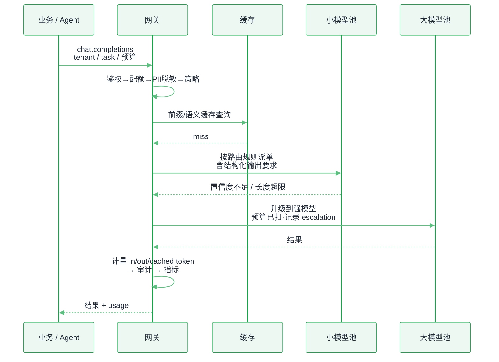
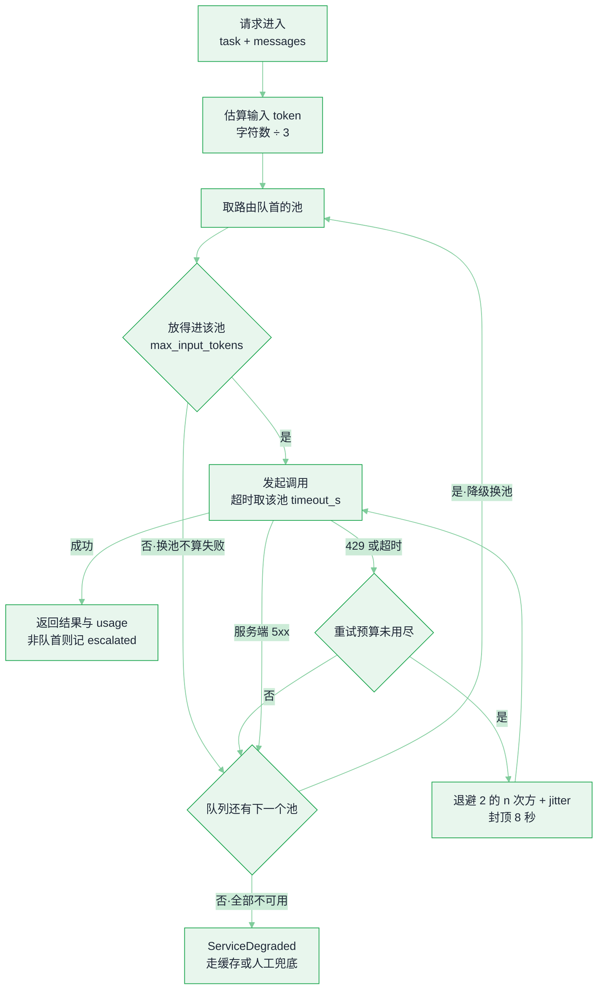

# 模型网关与路由


**一句话**：模型网关是所有 LLM 调用的「统一入口」：一份鉴权、一套计量、一条 fallback 链、一处缓存与配额——多模型时代的成本控制和安全策略都必须打在这一层，而不是散在各个业务代码里。
  **难度**： 进阶


## 先看结论

- **没有网关时你会失去什么**：不知道谁花了多少钱、供应商限流时全站 500、换模型要改 40 处代码、密钥散落在 12 个服务里。这四条足以证明网关的必要性。
- **路由要有依据**：难度分级（小模型先试、失败升级）、任务类型（结构化输出→擅长 JSON 的模型）、上下文长度（超长走支持长上下文的池）、租户 SLA（付费用户走独占池）。
- **「难度分级」这一刀可以外包给决策模型**：路由判定只要一个档位标签，不需要一段理由。用生成模型做这件事时，网关每请求都要多付一次数百 ms 的往返；2026-09 起出现了专门只做判断的 [System One 决策模型](../18-frontier-2026/system-one-decision-models.md)（Jev 一类），第三方实测其在路由任务上比小档生成模型快 5 倍以上、成本低约 96%。**但要在网关里留一条降级路径**：决策模型判错档位时，被选中的便宜模型答砸了也要能被下游质量指标抓到。
- **fallback 链必须显式配 timeout + 重试预算**：否则供应商抖动会引发重试风暴，把自己和对方一起打挂。
- **网关是安全策略的最佳落点**：PII 脱敏、prompt 注入检测、密钥托管、出口 DLP、审计留痕都在这一层，一次实现全站生效。

## 请求生命周期



*《图：请求出网关前必过鉴权、配额、PII 脱敏、策略四道；小模型池置信度不足或长度超限才升级到大模型池，同时记 escalation》*

## 必备能力清单（可当验收表）

| 能力 | 为什么必须有 | 常见做法 |
|---|---|---|
| 协议归一 | 屏蔽各家 API 差异，换模型改配置不改代码 | OpenAI 兼容接口 + 少量扩展字段 |
| 鉴权与密钥托管 | 业务侧不留密钥 | 服务身份 → 网关 → 供应商密钥（KMS/Vault） |
| 计量与配额 | 成本可见可控、防单租户打爆 | 按 token 分别计量（in/out/cached）+ token/分钟配额 |
| 限流与并发闸 | 尊重供应商 RPM/TPM，避免 429 雪崩 | 令牌桶 + 每模型池独立并发上限 + 排队而非直接失败 |
| 重试与 fallback | 供应商故障是常态 | 指数退避 + jitter + 重试预算 + 降级模型链 |
| 超时分级 | 长任务不能被 30s 网关超时杀掉 | 流式 + 每阶段超时（连接/首 token/整体） |
| 结构化输出保障 | 减少解析失败与重试成本 | JSON Schema 校验、失败重试或换模型 |
| 缓存 | 直接省钱省延迟 | 语义缓存只对幂等查询开，前缀缓存靠会话亲和 |
| 灰度与影子 | 换模型不赌博 | 按租户/百分比灰度，影子流量只记录不返回 |
| 审计与安全 | 合规与事后复盘 | 全量请求留痕（可分级采样）+ 敏感词/PII/DLP 规则 |

## 最小可用的路由 + 降级

路由策略真正需要人维护的部分只有两块：**池子规格**和**降级顺序**。它们是配置、不是代码——应该进版本库、由 SRE 审、能按租户灰度。业务侧只看到一个逻辑别名（`agent-cheap` / `agent-strong`），永远不接触池名、密钥和单价。下面这份契约就是全部输入，字段值取自生产上那条 `chat` / `extract` 双路由。

```json
{
  "pools": {
    "small": {
      "alias": "agent-cheap",
      "max_input_tokens": 32000,
      "tpm_budget": 600000,
      "timeout_s": 8.0,
      "constrained_decode": false
    },
    "small-json": {
      "alias": "agent-cheap",
      "max_input_tokens": 16000,
      "tpm_budget": 600000,
      "timeout_s": 6.0,
      "constrained_decode": true
    },
    "large": {
      "alias": "agent-strong",
      "max_input_tokens": 128000,
      "tpm_budget": 150000,
      "timeout_s": 20.0,
      "constrained_decode": true
    }
  },
  "routes": {
    "chat": ["small", "large"],
    "extract": ["small-json", "large"]
  },
  "request_shape": {
    "messages": "必填，多轮原样透传",
    "model": "填池别名，不填真实模型名",
    "response_format": "带 schema 时注入 {type: json_schema, json_schema: {name: out, schema: ...}}"
  },
  "retry": {
    "max_retry": 2,
    "backoff": "min(2 ** attempt, 8) + jitter",
    "retry_same_pool": ["TimeoutError", "RateLimitError"],
    "switch_pool_immediately": ["TransientServerError"]
  },
  "metrics": {
    "gateway.escalated": ["pool"],
    "gateway.retry": ["pool", "err"]
  }
}
```

四个字段值得单独解释，它们决定了线上会不会出事故：

- **`max_input_tokens` 是换池条件，不是错误码**。请求进来先估一把长度（`sum(len(content) for m in messages) // 3`，字符数除以 3 近似 token 数），超过当前池上限就跳过它去下一个池——上下文放不下是**路由问题**。一进门就报 413，等于把自家调度失败推给调用方。
- **`timeout_s` 按池配，不搞全局值**。`small` 8 秒、`small-json` 6 秒、`large` 20 秒：小模型池服务低延迟对话，超时就降级；大模型池承担长输出，必须给它 20 秒。全局 30 秒超时是最常见的写法，也是同时杀死「快请求」和「长任务」的最快办法。
- **`constrained_decode` 是池的能力，不是愿望**。带 `schema` 的任务必须落到真正支持约束解码的池，请求体里塞 `response_format`，让模型「只能吐出合法 JSON」。让不支持的池「尽量输出 JSON」，等于把解析失败和重试成本推到线上。
- **两类错误两种待遇**。`TimeoutError` / `RateLimitError` 说明这个池还活着，退避后值得再试（同池最多 `max_retry + 1 = 3` 次）；`TransientServerError`（5xx）说明它自己都在漏水，**立刻降级到下一个池，一次重试预算都不给它花**——这一条是防止重试风暴的核心开关。

把上面这份契约跑起来，判定顺序长这样。注意图里有两条回路：退避回路回到「发起调用」，换池回路回到「取队首」。



*《图：三条出口对应三种病因——429 与超时吃本池重试预算、5xx 直接换池、池队列耗尽才抛 ServiceDegraded》*

## 分步演示：一次 `extract` 请求的六道判断




#### 第 1 步：进门先验身份，密钥留在这里

业务带服务身份进来，网关换出对应供应商密钥（KMS/Vault 托管，按池隔离）。同一道把 PII 脱敏和 prompt 注入检测也做掉——**必须在派单之前**：一旦原文到了上游，你的合规边界就已经被越过了。此处的产出是一个内部上下文：`tenant` + `task=extract` + 预算档位。




#### 第 2 步：配额闸——超了排队，不是失败

按池的 `tpm_budget`（`small` / `small-json` 各 600_000 token/分钟，`large` 只有 150_000）和该租户的当日累计做判定。配额打满时**排队而不是返回 429**：429 会让客户端立刻重试，把「限流」放大成「把上游继续打死」。排队窗口另设超时，等不到才降级到 `large` 或直接拒绝。




#### 第 3 步：缓存查询——两种缓存的适用面完全不同

前缀缓存靠会话亲和命中同一副本（自建 vLLM/SGLang 时这是路由的一部分，不是可选优化）；语义缓存只对幂等查询开，`extract` 这类「同一份文档问同一个字段」命中率很高，而开放式 `chat` 一律跳过。miss 才继续往下走。




#### 第 4 步：长度预判，然后才轮到「谁便宜」

这条请求带了 6 万字的文档，估算 `60000 // 3 = 20000` token。`extract` 的队首是 `small-json`，上限 16_000——放不下，**跳过它不算错误**。下一个 `large` 上限 128_000，装得下，派单。因为 `large` 不是队首池，这一步要打一个 `gateway.escalated{pool=large}` 计数：没有它，你会一直以为小模型池够用。




#### 第 5 步：约束解码 + 出口校验

请求体里注入 `response_format = {"type": "json_schema", "json_schema": {"name": "out", "schema": ...}}`，`timeout_s` 取该池的 20.0。返回后网关**自己再校验一次 schema**：上游声称支持约束解码不代表一定合法。校验失败按换池处理（记 `gateway.retry{err=schema_validation}`），而不是把脏 JSON 交给业务去 try/except。




#### 第 6 步：计量、审计、指标三件事一起收尾

in / out / cached 三类 token **分开记账**（cached 通常按输入价 1 折计费，混在一起就算不出缓存的真实回报），落到租户账单；审计日志只落脱敏后的正文并按级别采样；指标出 `gateway.retry` 的池维度重试率与超时率。这三件事业务侧一件也做不了——网关是唯一能同时看清「哪个池在漏水」和「哪个租户在烧钱」的位置。



## 四种失败形状，四条分支（点标签切换）



`approx > pool.max_input_tokens` → 换池，不算失败，不进熔断计数。`chat` 走 `small`(32k) → `large`(128k)。若队尾池也放不下，**这时才回 413**，并把 `approx` 和上限一起带回去，让运行时去做压缩或截断——网关只做无状态判定，压缩是语义决策，在这里做了调试会痛不欲生。



`RateLimitError` 说明池还活着，只是配额到顶。同池按 `min(2 ** attempt, 8) + jitter` 退避，最多 3 次尝试（`max_retry = 2`）：三次尝试之间只睡两次，第 1 次 1–2 秒、第 2 次 2–3 秒——公式里那个 8 秒上限要 `max_retry` 调到 3 以上才碰得到，它是给更大重试预算留的天花板。预算用尽才降级到下一个池。429 时最不该做的是「立刻重试」——供应商侧恢复要时间，你只是在排队互相踩。



`TransientServerError` 走完全相反的路：**不重试、不进退避循环，`break` 换池**。理由是重试预算是全局稀缺资源，花在一个正在漏水的池上是纯浪费。副作用是每个池都得配独立并发上限和独立熔断窗口，否则一个供应商抖动会把整条链的槽位占满。



抛出 `ServiceDegraded("所有池均不可用：请走人工/缓存兜底")`，对外是 503 + `Retry-After`。此时真正该发生的是**兜底而非死循环**：命中的语义缓存直接回、回不去给降级文案、把这条链路记为「降级中」并升级给值班。一个只在 happy path 上工作的网关，在供应商区域故障时会让全站 500——这就是 fallback 链要写 timeout 和预算的原因。




**验收怎么打**：把 `gateway.escalated` 拉出来看一周。队首池的真实命中率如果低于 80%，说明路由档位判得太保守（你在为不需要强模型的问题付 `large` 的钱）；如果某个池的 `gateway.retry` 超过 2%，先怀疑它的配额配置（本页里 `large` 的 150_000 TPM 只有 `small` 的 1/4），而不是先怀疑模型质量。


> ✅ **最佳实践**：给每个租户一个「本月 token 预算 + 超预算策略（降级到小模型 / 排队 / 拒绝）」，把成本治理写进网关而不是写进月度复盘邮件。

## 工程现场笔记

- **开源可选**：LiteLLM（协议归一 + 配额/预算，接入门槛最低）、OpenRouter（多模型市场 + 路由）、Envoy AI Gateway / Kong AI Gateway（放在现有 API 网关体系里，复用 mTLS/可观测/限流）、Higress/自研 Go 层（超大流量时的常见终局）。
- **cache-aware 路由是新问题**：自建 vLLM/SGLang 集群时，同一会话要打到同一副本才能吃到 KV 前缀缓存；分离式部署（Dynamo、llm-d）则把「KV 放在哪」也纳入路由决策。这是与传统负载均衡最大的区别。
- **网关是评测的天然挂载点**：线上流量采样 → 离线回放 → 评估集打分，比在业务代码里埋点干净得多（→ [可观测性与评估平台](llm-observability-eval-platform.md)）。
- **别在网关做「上下文压缩」**：压缩属于 Agent 运行时的语义决策，网关只做与模型选择/成本/安全相关的无状态处理，否则调试会痛不欲生。

## 常见误区

- ❌ 网关只做转发：没有计量与配额的网关，等于给成本装了个透明钱包
- ❌ fallback 无脑重试到底：429 时最该做的是排队 + 退避，不是加快速度
- ❌ 把密钥写进 sidecar 环境变量了事：供应商密钥要有独立轮换、最小权限、按池隔离（一个池泄漏不影响全部）
- ❌ 用模型名当配置常量散落在业务里：应使用「逻辑别名 → 网关解析」，如 `agent-strong` / `agent-cheap`，换模型改映射
- ❌ 记录所有 prompt 全文当作「审计」：先做分级与 PII 处理，否则审计日志本身成为泄露源

## 小练习

给上面那份契约补一个 60 行左右的网关中间件：拦截所有 LLM 调用，输出 (a) 每条请求的 in/out/cached token 与费用估算，(b) 每个租户的当日累计，(c) 每个池的重试率与超时率。跑一周后回答：哪 3 个池的重试率超过 2%？哪 20% 的请求消耗了 80% 的成本？

## 参考资料

- [LiteLLM](https://github.com/BerriAI/litellm)、[Envoy AI Gateway](https://github.com/envoyproxy/ai-gateway)、[OpenRouter](https://openrouter.ai/docs)
- [限流与退避](https://builder.aws.com/content/3EumjoZascWd1oZiEgL8ORlv3qE/timeouts-retries-and-backoff-with-jitter)

## 相关知识点

- [错误处理、重试与降级](../11-engineering/error-handling-retry-fallback.md)
- [缓存与成本优化](../11-engineering/caching-cost-optimization.md)
- [推理经济学与部署形态](inference-economics-deployment.md)
- [持久化执行与运行时](agent-runtime-durable-execution.md)

