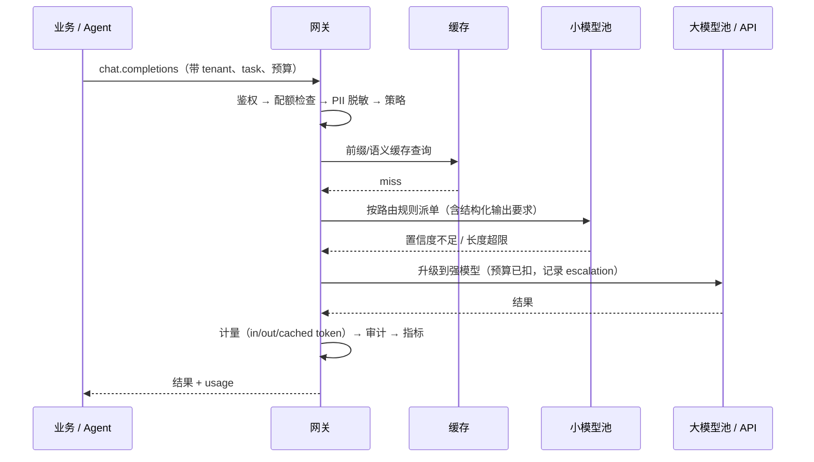

# 模型网关与路由

> **一句话**：模型网关是所有 LLM 调用的「统一入口」：一份鉴权、一套计量、一条 fallback 链、一处缓存与配额——多模型时代的成本控制和安全策略都必须打在这一层，而不是散在各个业务代码里。
> **难度**： 进阶
> **标签**：`#infrastructure` `#engineering`

## 先看结论

- **没有网关时你会失去什么**：不知道谁花了多少钱、供应商限流时全站 500、换模型要改 40 处代码、密钥散落在 12 个服务里。这四条足以证明网关的必要性。
- **路由要有依据**：难度分级（小模型先试、失败升级）、任务类型（结构化输出→擅长 JSON 的模型）、上下文长度（超长走支持长上下文的池）、租户 SLA（付费用户走独占池）。
- **fallback 链必须显式配 timeout + 重试预算**：否则供应商抖动会引发重试风暴，把自己和对方一起打挂。
- **网关是安全策略的最佳落点**：PII 脱敏、prompt 注入检测、密钥托管、出口 DLP、审计留痕都在这一层，一次实现全站生效。

## 请求生命周期



## 必备能力清单（可当验收表）

| 能力 | 为什么必须有 | 常见做法 |
|---|---|---|
| 协议归一 | 屏蔽各家 API 差异，换模型改配置不改代码 | OpenAI 兼容接口 + 少量扩展字段 |
| 鉴权与密钥托管 | 业务侧不留密钥 | 服务身份 → 网关 → 供应商密钥（KMS/Vault） |
| 计量与配额 | 成本可见可控、防单租户打爆 | 按 token 分别计量（in/out/cached）+ token/分钟配额 |
| 限流与并发闸 | 尊重供应商 RPM/TPM，避免 429 雪崩 | 令牌桶 + 每模型池独立并发上限 + 排队而非直接失败 |
| 重试与 fallback | 供应商故障是常态 | 指数退避 + jitter + 重试预算 + 降级模型链 |
| 超时分级 | 长任务不能被 30s 网关超时杀掉 | 流式 + 每阶段超时（连接/首 token/整体） |
| 结构化输出保障 | 减少解析失败与重试成本 | JSON Schema 校验、失败重试或换模型 |
| 缓存 | 直接省钱省延迟 | 语义缓存只对幂等查询开，前缀缓存靠会话亲和 |
| 灰度与影子 | 换模型不赌博 | 按租户/百分比灰度，影子流量只记录不返回 |
| 审计与安全 | 合规与事后复盘 | 全量请求留痕（可分级采样）+ 敏感词/PII/DLP 规则 |

## 最小可用的路由 + 降级

```python
from dataclasses import dataclass
import asyncio, time

@dataclass
class Pool:
    name: str
    client: object
    max_input_tokens: int
    tpm_budget: int          # tokens/分钟
    timeout: float

POLICIES = {
    "chat":     [Pool("small", SMALL,  32_000, 600_000, 8.0),
                 Pool("large", LARGE, 128_000, 150_000, 20.0)],
    "extract":  [Pool("small-json", SMALL, 16_000, 600_000, 6.0),
                 Pool("large", LARGE, 128_000, 150_000, 20.0)],
}

async def call(pool, messages, schema=None):
    async with asyncio.timeout(pool.timeout):
        kw = {"model": pool.name}
        if schema:      # 需要合法 JSON 的任务优先走支持约束解码的池
            kw["response_format"] = {"type": "json_schema",
                                     "json_schema": {"name": "out", "schema": schema}}
        return await pool.client.chat.completions.create(messages=messages, **kw)

async def route(task: str, messages, schema=None, max_retry=2):
    approx = sum(len(m["content"]) for m in messages) // 3
    for i, pool in enumerate(POLICIES[task]):
        if approx > pool.max_input_tokens:            # 上下文放不下 → 换池，不是失败
            continue
        for attempt in range(max_retry + 1):
            try:
                r = await call(pool, messages, schema)
                if i > 0:                             # 记录「升级」事件，用于优化 prompt/小模型
                    metrics.incr("gateway.escalated", tags={"pool": pool.name})
                return r
            except (TimeoutError, RateLimitError) as e:
                await asyncio.sleep(min(2 ** attempt, 8) + random())   # 退避 + jitter
                metrics.incr("gateway.retry", tags={"pool": pool.name, "err": type(e).__name__})
            except TransientServerError:
                break                                  # 立刻降级到下一个池，别耗重试预算
    raise ServiceDegraded("所有池均不可用：请走人工/缓存兜底")
```

> ✅ **最佳实践**：给每个租户一个「本月 token 预算 + 超预算策略（降级到小模型 / 排队 / 拒绝）」，把成本治理写进网关而不是写进月度复盘邮件。

## 工程现场笔记

- **开源可选**：LiteLLM（协议归一 + 配额/预算，接入门槛最低）、OpenRouter（多模型市场 + 路由）、Envoy AI Gateway / Kong AI Gateway（放在现有 API 网关体系里，复用 mTLS/可观测/限流）、Higress/自研 Go 层（超大流量时的常见终局）。
- **cache-aware 路由是新问题**：自建 vLLM/SGLang 集群时，同一会话要打到同一副本才能吃到 KV 前缀缓存；分离式部署（Dynamo、llm-d）则把「KV 放在哪」也纳入路由决策。这是与传统负载均衡最大的区别。
- **网关是评测的天然挂载点**：线上流量采样 → 离线回放 → 评估集打分，比在业务代码里埋点干净得多（→ [可观测性与评估平台](llm-observability-eval-platform.md)）。
- **别在网关做「上下文压缩」**：压缩属于 Agent 运行时的语义决策，网关只做与模型选择/成本/安全相关的无状态处理，否则调试会痛不欲生。

## 常见误区

- ❌ 网关只做转发：没有计量与配额的网关，等于给成本装了个透明钱包
- ❌ fallback 无脑重试到底：429 时最该做的是排队 + 退避，不是加快速度
- ❌ 把密钥写进 sidecar 环境变量了事：供应商密钥要有独立轮换、最小权限、按池隔离（一个池泄漏不影响全部）
- ❌ 用模型名当配置常量散落在业务里：应使用「逻辑别名 → 网关解析」，如 `agent-strong` / `agent-cheap`，换模型改映射
- ❌ 记录所有 prompt 全文当作「审计」：先做分级与 PII 处理，否则审计日志本身成为泄露源

## 小练习

写一个 60 行的网关中间件：拦截所有 LLM 调用，输出 (a) 每条请求的 in/out/cached token 与费用估算，(b) 每个租户的当日累计，(c) 每个池的重试率与超时率。跑一周后回答：哪 3 个池的重试率超过 2%？哪 20% 的请求消耗了 80% 的成本？

## 相关资源

- [LiteLLM](https://github.com/BerriAI/litellm)、[Envoy AI Gateway](https://github.com/envoyproxy/ai-gateway)、[OpenRouter](https://openrouter.ai/docs)
- [限流与退避](https://aws.amazon.com/builders-library/timeouts-retries-and-backoff-with-jitter/)

## 相关知识点

- [错误处理、重试与降级](../11-engineering/error-handling-retry-fallback.md)
- [缓存与成本优化](../11-engineering/caching-cost-optimization.md)
- [推理经济学与部署形态](inference-economics-deployment.md)
- [持久化执行与运行时](agent-runtime-durable-execution.md)
