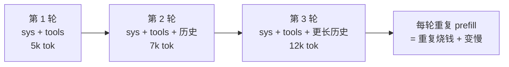

# 前缀缓存与上下文工程

> **一句话**：Agent 的每一轮都在把同一份长前缀（system + 工具定义 + 历史）重发给模型，前缀缓存（prefix caching / prompt caching）就是让这段重复计算与付费只发生一次——前提是**你别动前缀**。
> **难度**： 进阶
> **标签**：`#infrastructure` `#memory`

## 先看结论

- **缓存是前缀匹配，不是内容匹配**：只能复用「从头开始逐 token 相同」的那一段。中间改动一个 token（甚至时间戳、随机顺序的工具列表），后面整段全部失效。
- **省钱的同时省延迟**：命中部分跳过 prefill，TTFT 明显下降；各家定价里缓存读取通常远便宜于普通输入（有的按 1/10 计，有的减半——以你用的服务商报价为准）。
- **稳定前缀是设计约束**：`固定 system → 固定工具列表（按名字典序）→ 追加式历史 → 只变尾部`。任何「每轮重排/重生成」的逻辑都要为缓存让路。
- **自建引擎同样有这层**：vLLM 的自动前缀缓存按 KV block 粒度匹配，SGLang 用基数树匹配并可围绕共享前缀调度——评测与 Agent 高并发时收益尤其大。

## 为什么 Agent 特别需要它？

聊天是「一问一答」，Agent 是「一轮一轮把越滚越长的上下文重发」：



一个跑 40 步的编码 Agent，累计输入 token 可能是最终输出的十几倍甚至更多。缓存命中率从 20% 提到 80%，成本曲线是断崖式的。

## 哪些 token 能省、哪些不能



| 前缀片段 | 能否命中 | 为什么失效 |
|---|---|---|
| system prompt | ✅ | 里面塞了「当前时间 / 用户 ID / 随机 request id」 |
| 工具 schema 列表 | ✅ | MCP 工具按连接顺序拼接、每轮顺序不同 |
| 历史消息（只追加） | ✅ | 做了压缩/摘要/裁剪，改写历史即失效 |
| RAG 检索片段 | ⚠ 部分 | 检索结果排序不稳定、每次 top-k 抖动 |
| 本轮用户输入 / 工具返回 | ❌ | 天生新内容 |

## 让缓存命中的 6 条纪律

1. **前缀不可变**：时间戳、会话 ID、AB 实验标记一律放尾部，不放 system。
2. **工具集稳定排序**：按名称排序后再拼进 prompt；MCP 多 Server 时也要归一化顺序。
3. **历史只追加，不原地改写**：需要瘦身就「截断 + 追加摘要块」，摘要块也追加在尾部（参考 [Claude Code 的压缩策略](../06-memory-rag/memory-compression-forgetting.md)：压缩是打断点，不是每次微调）。
4. **少动模型与参数**：`temperature`、`max_tokens`、工具列表变化都可能让服务商侧缓存整段作废——固定成「一套档位」而不是每请求现算。
5. **批量任务按前缀分组**：评测/离线跑批时把同 prompt 家族排一起打，让引擎侧共享一棵前缀树；同时把并发打满（缓存有 TTL 与 LRU 淘汰，隔一小时再打就不在了）。
6. **命中要能观测**：从 API 响应里取 `cache_read_input_tokens` / `prompt_tokens_details.cached_tokens`（字段名因服务商而异），做「命中率」指标与看板。

## 命中率怎么量

```python
import time
from openai import OpenAI

c = OpenAI()   # 或指向自建 vLLM/SGLang 的 base_url
SYSTEM = open("agent_system.md").read()   # 稳定前缀：几 KB 起

def turn(history, tag):
    r = c.chat.completions.create(
        model="your-model",
        messages=[{"role": "system", "content": SYSTEM}, *history],
        max_tokens=200,
    )
    u = r.usage
    cached = getattr(u, "prompt_tokens_details", None)
    cached = getattr(cached, "cached_tokens", 0) if cached else getattr(u, "cache_read_input_tokens", 0)
    hit = cached / max(u.prompt_tokens, 1)
    print(f"[{tag}] prompt={u.prompt_tokens} cached={cached} 命中率={hit:.0%}")
    return r

t0 = time.perf_counter()
h = [{"role": "user", "content": "列出这个仓库的三个模块"}]
turn(h, "第 1 轮（冷）")
h += [{"role": "assistant", "content": "..."}, {"role": "user", "content": "再深入讲讲第二个"}]
turn(h, "第 2 轮（应命中）")
h[0]["content"] = SYSTEM + f"\n<!-- {time.perf_counter()-t0:.1f}s -->"   # 故意污染前缀
turn(h, "第 3 轮（故意加了时间戳 → 命中率掉下去）")
```

**判据**：多轮 Agent 稳态命中率应当 ≥ 70%；长期低于 40% 说明 prompt 结构有问题，先去改结构，别急着换模型。

## 常见误区

- ❌ 「缓存 = 语义缓存」：前缀缓存复用 KV 计算，结果可完全一致；语义缓存复用整条答案，会返回错的东西（只适合高重复、低风险查询，且要有失效策略）
- ❌ 每轮把「已完成的子任务」重写成自然语言摘要塞回前部：改前缀 = 清缓存，摘要要追加在尾部
- ❌ 只看 token 数省钱、不看 TTFT：缓存没命中时 p99 首字延迟会先崩给用户体验看
- ❌ 在自建引擎上开一堆实例但没做 cache-aware 路由：同一会话被随机打到不同副本，命中率被稀释；需要按会话亲和（consistent hashing）或走带 KV 路由的编排层
- ❌ 把缓存当持久化：KV 缓存会被淘汰/重启清掉，任何「业务状态」都得落库，见 [持久化执行](agent-runtime-durable-execution.md)

## 小练习

给你现有 Agent 的 prompt 组装函数做一次「前缀审计」：把每轮 prompt 存成文件，`diff` 相邻两轮，找出第一个不同的 token 出现在什么位置。它前面的都是可复用资产，它后面的都白算了。

## 相关资源

- [SGLang RadixAttention](https://arxiv.org/abs/2312.07104)、[vLLM Automatic Prefix Caching 文档](https://docs.vllm.ai/en/latest/features/automatic_prefix_caching.html)
- 各家 Prompt Caching 说明（Anthropic / OpenAI / Google 定价页，字段与折扣差异较大，以官方为准）

## 相关知识点

- [上下文工程](../06-memory-rag/context-engineering.md)
- [记忆压缩与遗忘](../06-memory-rag/memory-compression-forgetting.md)
- [缓存与成本优化](../11-engineering/caching-cost-optimization.md)
- [推理服务化](inference-serving.md)
