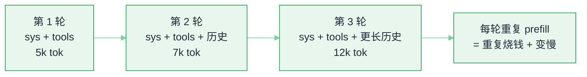
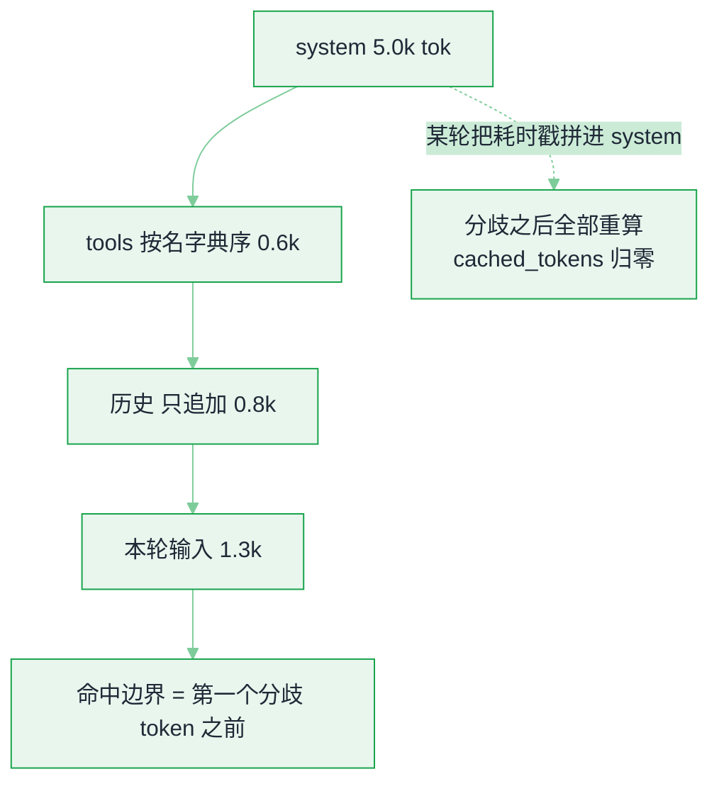

# 前缀缓存与上下文工程


**一句话**：Agent 的每一轮都在把同一份长前缀（system + 工具定义 + 历史）重发给模型，前缀缓存（prefix caching / prompt caching）就是让这段重复计算与付费只发生一次——前提是**你别动前缀**。
  **难度**： 进阶


## 先看结论

- **缓存是前缀匹配，不是内容匹配**：只能复用「从头开始逐 token 相同」的那一段。中间改动一个 token（甚至时间戳、随机顺序的工具列表），后面整段全部失效。
- **省钱的同时省延迟**：命中部分跳过 prefill，TTFT 明显下降；各家定价里缓存读取通常远便宜于普通输入（有的按 1/10 计，有的减半——以你用的服务商报价为准）。
- **稳定前缀是设计约束**：`固定 system → 固定工具列表（按名字典序）→ 追加式历史 → 只变尾部`。任何「每轮重排/重生成」的逻辑都要为缓存让路。
- **自建引擎同样有这层**：vLLM 的自动前缀缓存按 KV block 粒度匹配，SGLang 用基数树匹配并可围绕共享前缀调度——评测与 Agent 高并发时收益尤其大。

## 为什么 Agent 特别需要它？

聊天是「一问一答」，Agent 是「一轮一轮把越滚越长的上下文重发」：



一个跑 40 步的编码 Agent，累计输入 token 可能是最终输出的十几倍甚至更多。缓存命中率从 20% 提到 80%，成本曲线是断崖式的。

## 哪些 token 能省、哪些不能


*《图：同一次请求两种装配顺序：A 只 prefill 2.4k/13.5k，B 因为时间戳落在第一个 token 之后而全量重算——差别不在内容，在顺序》*

| 前缀片段 | 能否命中 | 为什么失效 |
|---|---|---|
| system prompt | ✅ | 里面塞了「当前时间 / 用户 ID / 随机 request id」 |
| 工具 schema 列表 | ✅ | MCP 工具按连接顺序拼接、每轮顺序不同 |
| 历史消息（只追加） | ✅ | 做了压缩/摘要/裁剪，改写历史即失效 |
| RAG 检索片段 | ⚠ 部分 | 检索结果排序不稳定、每次 top-k 抖动 |
| 本轮用户输入 / 工具返回 | ❌ | 天生新内容 |

## 省多少：一笔可算的账

前面说「命中率从 20% 提到 80%，成本断崖式下降」——断崖有多陡，可以用一条公式量化。设一次请求的输入 token 数为 $$L$$、普通输入单价为 $$p_{\text{in}}$$、命中前缀占比为 $$h$$、缓存读取的折扣系数为 $$d$$（命中部分只付原价的 $$d$$ 倍，常见 $$d=0.1$$ 即一折）：

$$
\text{有效输入成本}=p_{\text{in}}\cdot L\cdot\big[(1-h)+h\cdot d\big]
$$

相对「完全不命中」的省幅就是 $$h(1-d)$$。代进正文那组数：$$h$$ 从 0.2 提到 0.8、$$d=0.1$$，输入侧成本系数从 $$0.8+0.02=0.82$$ 掉到 $$0.2+0.08=0.28$$——**同一份 prompt，命中率高的那位每轮只花约 34% 的钱**，再乘上几十步循环，就是断崖。

两个推论：其一，$$d$$ 越接近 0（缓存读越便宜），提升 $$h$$ 的边际收益越大，所以「稳定前缀」的工程纪律值得专门做；其二，省的是**输入侧**，输出 token 与本轮新增内容不打折——别指望缓存能压住输出成本，那是[推理经济学](inference-economics-deployment.md)里另一笔账。

## 让缓存命中的 6 条纪律

1. **前缀不可变**：时间戳、会话 ID、AB 实验标记一律放尾部，不放 system。
2. **工具集稳定排序**：按名称排序后再拼进 prompt；MCP 多 Server 时也要归一化顺序。
3. **历史只追加，不原地改写**：需要瘦身就「截断 + 追加摘要块」，摘要块也追加在尾部（参考 [Claude Code 的压缩策略](../06-memory-rag/memory-compression-forgetting.md)：压缩是打断点，不是每次微调）。
4. **少动模型与参数**：`temperature`、`max_tokens`、工具列表变化都可能让服务商侧缓存整段作废——固定成「一套档位」而不是每请求现算。
5. **批量任务按前缀分组**：评测/离线跑批时把同 prompt 家族排一起打，让引擎侧共享一棵前缀树；同时把并发打满（缓存有 TTL 与 LRU 淘汰，隔一小时再打就不在了）。
6. **命中要能观测**：从 API 响应里取 `cache_read_input_tokens` / `prompt_tokens_details.cached_tokens`（字段名因服务商而异），做「命中率」指标与看板。

## 命中率怎么量

命中率不是感觉，是响应里的两个字段相除。下面这份 JSON 把「装配顺序决定命中率」摊开：请求体的 `messages` 数组顺序、要读的计数字段，以及同一 prompt 家族连跑三轮的**设数样例**（数值是编的，读法是通用的——换成你网关回包里的 `cached_tokens / prompt_tokens` 就是真相）。三轮唯一的变量是前缀有没有被动过。

```json
{
  "request_shape": {
    "model": "your-model",
    "max_tokens": 200,
    "messages": [
      { "role": "system", "content": "<agent_system.md 全文，几 KB 起，逐轮一字不变>" },
      { "role": "user", "content": "列出这个仓库的三个模块" }
    ],
    "base_url": "托管 API 或自建 vLLM / SGLang 的 /v1"
  },
  "usage_fields": {
    "prompt_tokens": "本轮输入总量",
    "prompt_tokens_details.cached_tokens": "OpenAI 口径：命中前缀的 token 数",
    "cache_read_input_tokens": "Anthropic 口径：缓存读取的 token 数",
    "字段说明": "两家字段名不同，取到哪个用哪个；自建引擎看引擎侧的 prefix cache hit 指标"
  },
  "hit_ratio": "cached_tokens / max(prompt_tokens, 1)",
  "three_turns": [
    { "turn": 1, "tag": "第 1 轮（冷）", "prompt_tokens": 5200, "cached_tokens": 0, "hit": "0%", "ttft_s": 1.9 },
    { "turn": 2, "tag": "第 2 轮（应命中）", "prompt_tokens": 6400, "cached_tokens": 5100, "hit": "80%", "ttft_s": 0.4 },
    { "turn": 3, "tag": "第 3 轮（故意加了时间戳 → 命中率掉下去）", "prompt_tokens": 6412, "cached_tokens": 0, "hit": "0%", "ttft_s": 2.0 }
  ],
  "polluted_system": "<agent_system.md 全文>\n<!-- 4.1s -->",
  "turn2_history_appended": [
    { "role": "assistant", "content": "…" },
    { "role": "user", "content": "再深入讲讲第二个" }
  ]
}
```

**判据**：多轮 Agent 稳态命中率应当 ≥ 70%；长期低于 40% 说明 prompt 结构有问题，先去改结构，别急着换模型。

## 分步演示：同一个会话跑三轮，看命中率怎么涨上去又摔下来



*《图：命中长度由「第一个分歧 token」一次性决定——分歧出现在第 12 个 token，后面 6.4k 全部白算，哪怕它们逐字未变》*




#### 第 1 轮：冷启动，无缓存可用

`messages` 是 `[system, user]` 两段，system 取 `agent_system.md` 全文（几 KB 起，对应约 5.0k token）。服务商侧还没有这段前缀的 KV，`prompt_tokens=5200`、`cached_tokens=0`、命中率 0%，TTFT 1.9s。**这一轮不该进任何基线**——它是冷启动，不是稳态。





#### 第 2 轮：只动尾部，命中立刻出现

历史按 `assistant → user` 顺序**追加**（`再深入讲讲第二个`），前缀那 5.1k token 逐 token 与上一轮相同。响应里 `cached_tokens=5100`、`prompt_tokens=6400`，命中率 80%，TTFT 掉到 0.4s——省掉的正是命中段的 prefill，账单上还有一笔折扣（常见 `d=0.1`）。同一条纪律用在批量评测上：`tools` 数组先按名字典序排好再拼进 prompt。





#### 第 3 轮：污染实验，把耗时戳拼进 system

只加了一行 `<!-- 4.1s -->` 注释，位置在 system 文本的末尾——但它在整段 prompt 的第 12 个 token 附近，**从那里往后的 6.4k 全部不再匹配**：`cached_tokens=0`、TTFT 回到 2.0s。改一个字节和改一千个字节，代价是同一个量级，这就是「前缀不可变」值得写成纪律的原因。





#### 收尾：把 `turn3` 的污染删掉，命中率立刻回升

修复不需要重建缓存结构，只要把时间戳、会话 ID、AB 实验标记挪回尾部。同一份 `messages` 再跑一轮，`cached_tokens` 回到 5100 以上。**这笔账是逐轮累计的**：按上文那条公式（`d=0.1`），命中率 80% 时输入侧成本系数是 `0.2+0.08=0.28`，命中率 30% 时是 `0.7+0.03=0.73`——一个 40 步的编码 Agent，等于白付一倍多的输入钱。




## 改一处会怎样（点标签切换）



命中率直接归零，每一轮都当成新 prompt 全量 prefill。典型表现是 `cached_tokens=0` 且 TTFT 恒定不降——**这个曲线形状比看平均值更能暴露问题**。修法只有一条：动态量一律移到消息尾部，或者移到 `tools` 之后的独立块。



MCP 挂了三个 Server，每轮拼接顺序随连接时序变化，命中率在 20%–70% 之间抖动，看起来「时好时坏」。排序键换成工具名字典序（多 Server 也要归一化）之后抖动消失、稳定在 80% 上下。**顺序抖动是最难查的一类**，因为它每次都「差不多」。



做摘要、裁剪、重排都算改写历史：分歧点前移到被改写的那条消息，后面整段作废。正确姿势是**截断 + 把摘要块追加在尾部**，旧的前缀保持不动（参考 [Claude Code 的压缩策略](../06-memory-rag/memory-compression-forgetting.md)：压缩是打断点，不是每次微调）。代价是命中率会掉一个台阶，但只掉一次，而不是每轮都掉。



`temperature`、`max_tokens`、`tools` 列表变动，服务商侧可能整段缓存作废（各家口径不同，以官方文档为准）。所以把这些固定成「一套档位」而不是每请求现算：评测跑批中途改 `max_tokens`，前 2000 条数据的缓存收益全部清零。




**一笔能算出来的账**：一个每轮都往 system 末尾拼 request id 的 Agent，可缓存前缀被这一行字截断，命中率会掉到「只剩 system 那一段」的量级；把 id 移到消息尾部，命中率能抬到接近整段对话的比例。按上面那条公式代一下：$$h$$ 从 0.2 提到 0.8、$$d=0.1$$，输入成本系数从 $$0.82$$ 掉到 $$0.28$$，**同一份 prompt 每轮只花约三分之一的钱**。**没换模型、没改 prompt 内容，只改了顺序**——这就是本页全部的投资回报率。你自己的 Agent 命中了多少，看网关回包里的 `cached_tokens / prompt_tokens` 就能量出来。


## 常见误区

- ❌ 「缓存 = 语义缓存」：前缀缓存复用 KV 计算，结果可完全一致；语义缓存复用整条答案，会返回错的东西（只适合高重复、低风险查询，且要有失效策略）
- ❌ 每轮把「已完成的子任务」重写成自然语言摘要塞回前部：改前缀 = 清缓存，摘要要追加在尾部
- ❌ 只看 token 数省钱、不看 TTFT：缓存没命中时 p99 首字延迟会先崩给用户体验看
- ❌ 在自建引擎上开一堆实例但没做 cache-aware 路由：同一会话被随机打到不同副本，命中率被稀释；需要按会话亲和（consistent hashing）或走带 KV 路由的编排层
- ❌ 把缓存当持久化：KV 缓存会被淘汰/重启清掉，任何「业务状态」都得落库，见 [持久化执行](agent-runtime-durable-execution.md)

## 小练习

给你现有 Agent 的 prompt 组装函数做一次「前缀审计」：把每轮 prompt 存成文件，`diff` 相邻两轮，找出第一个不同的 token 出现在什么位置。它前面的都是可复用资产，它后面的都白算了。

## 参考资料

- [SGLang RadixAttention](https://arxiv.org/abs/2312.07104)、[vLLM Automatic Prefix Caching 文档](https://docs.vllm.ai/en/latest/features/automatic_prefix_caching.html)
- 各家 Prompt Caching 说明（Anthropic / OpenAI / Google 定价页，字段与折扣差异较大，以官方为准）
- [Anthropic Prompt Caching 文档（折扣与 TTL 的原文）](https://docs.anthropic.com/en/docs/build-with-claude/prompt-caching)
- [OpenAI Prompt Caching 指南（自动缓存的计费口径）](https://platform.openai.com/docs/guides/prompt-caching)

## 相关知识点

- [上下文工程](../06-memory-rag/context-engineering.md)
- [记忆压缩与遗忘](../06-memory-rag/memory-compression-forgetting.md)
- [缓存与成本优化](../11-engineering/caching-cost-optimization.md)
- [推理服务化](inference-serving.md)

