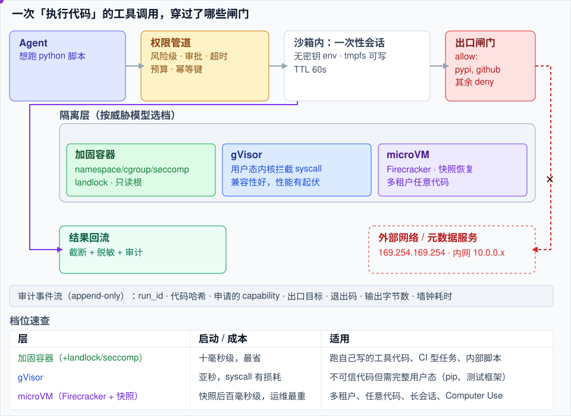
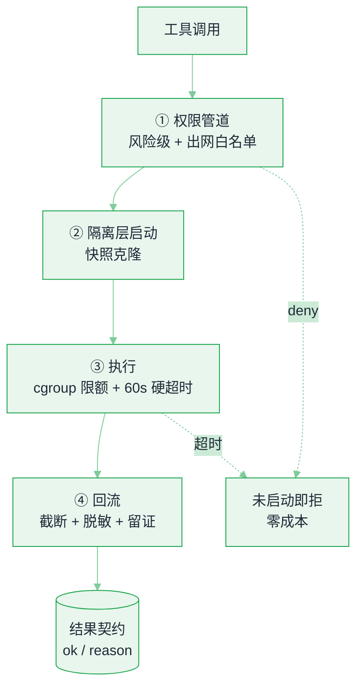

# 沙箱与执行环境


**一句话**：Agent 一旦能执行模型现写的代码，你的服务就多了一个「会自己找路出去的实习生」——沙箱层的任务是把「能干什么、能碰什么、能去哪、能跑多久」四件事变成可验证的边界。
  **难度**： 高级


## 先看结论

- **三档强度，按威胁模型选**：加固容器（runc + user namespace + 只读根 + 无网络）适合「跑自己写的代码」；gVisor（用户态内核）适合「跑不可信代码但不需要完整 Linux 语义」；microVM（Firecracker/Cloud Hypervisor）适合「多租户、任意代码、要求硬件级隔离」。
- **出口网络比文件系统更危险**：真正造成事故的是 `curl metadata.google.internal`、把 SSH 私钥贴进请求、从 pip 装到被投毒的包。默认拒绝 + 域名白名单是性价比最高的一条规则。
- **快照复用替代冷启动**：microVM 冷启动可以做到百毫秒级（Firecracker 官方量级），配合内存快照/恢复，「每次调用一个新环境」才在经济上可行。
- **权限决策要在执行管道里，不在 prompt 里**：把「允许/需确认/禁止」的风险级写进工具注册表，由执行层拦截（→ [工具权限与沙箱](../05-tool-protocol/tool-permission-sandbox.md)）。
- **有状态沙箱是能力也是债务**：给 Agent 一个能装包、留文件的会话，体验提升巨大，但必须能销毁、能快照、能审计、能限流。

## 一次工具调用穿过什么



*《图：一次「跑段代码」连过四道：权限管道、按威胁模型选档的隔离层、出口白名单、回流前的截断脱敏；少任何一道，剩下三道都只是摆设》*

| 隔离层 | 原理 | 强度 | 启动开销 | 典型用途 |
|---|---|---|---|---|
| 语言级受限执行 | 禁 `import`、AST 白名单、子集解释器 |  弱（易绕过） | 微秒 | 只跑数值/表达式计算 |
| 加固容器（runc + seccomp/AppArmor/landlock） | namespace + cgroup + 系统调用过滤 |  | 十毫秒–秒 | 内部工具、CI 型任务 |
| gVisor（runsc） | 用户态内核拦截系统调用 |  | 亚秒 | 通用代码执行、性能损耗不均 |
| microVM（Firecracker / Cloud Hypervisor） | 极简设备模型的虚拟机 |  | 亚秒 + 快照可再降 | 多租户 FaaS、Agent 云沙箱 |
| 独立物理机 / 一次性 VM | 真隔离 |  | 分钟 | 高危：内核、驱动、安全研究 |

> ⚠ **注意**：GPU 直通（device passthrough）会显著扩大攻击面并限制隔离强度——需要 GPU 的推理型沙箱，务必把它当作「独立租户池」而不是「多挂一张卡的普通容器」。

## 一个可落地的最小配置

```yaml
# 加固容器档：给「跑 Agent 生成的 Python」用（Docker Compose 片段，生产建议下沉到 microVM）
services:
  agent-sandbox:
    image: internal/python-runner:slim        # 预装依赖，禁止运行时联网装包
    read_only: true                            # 根文件系统只读
    cap_drop: [ALL]                            # 丢掉所有 capability
    security_opt:
      - no-new-privileges:true
      - seccomp=internal.reject.json           # 只放行必要 syscall
    user: "65534:65534"                        # 非 root、非特权
    network_mode: none                         # 默认断网！
    tmpfs: ["/tmp:size=256m,mode=1777"]         # 唯一可写区
    deploy:
      resources:
        limits: {cpus: "1.0", memory: 1g, pids: 128}   # pids 限制防 fork 炸弹
    pids_limit: 128
    stop_grace_period: 2s
```

上面那份 YAML 只管「环境长什么样」，还差一半：**谁被允许进去跑**。风险闸门是执行管道里的一张决策表，输入是一次工具调用，输出是 `allow` / `deny` 加一份运行预算。整段逻辑就下面这一份 JSON，没有隐藏分支。

```json
{
  "egress_allowlist": ["pypi.org", "files.pythonhosted.org"],
  "input_call": {
    "agent_id": "agent_7c31",
    "type": "shell | python | read | write",
    "risk": "low | medium | high",
    "approved": false,
    "hosts_referenced": ["pypi.org", "webhook.site"],
    "code_sha256": "取自 hash_src(代码原文)"
  },
  "rules_in_order": [
    {
      "when": "risk == high 且 approved == false",
      "decision": "deny",
      "reason_code": "needs_approval",
      "message": "需要人工确认"
    },
    {
      "when": "type == shell 且 hosts_referenced - egress_allowlist 非空",
      "decision": "deny",
      "reason_code": "egress_denied",
      "message": "出口未授权: <差集，逐个列出被挡的域名>"
    },
    {
      "when": "以上都不成立",
      "decision": "allow",
      "budget": {
        "env": { "HOME": "/tmp" },
        "secrets_injected": false,
        "timeout_s": 60,
        "max_output_bytes": 200000,
        "audit": { "agent_id": "agent_7c31", "sha": "code_sha256" }
      }
    }
  ]
}
```

闸门放行之后，沙箱回给 Agent 的东西必须**机器可判定**——和 [把 Agent 接进机器人](../17-embodied-ai/agent-to-robot-bridge.md) 那页的回单是同一个道理：只有 `stdout` 没有结论的执行层，会让 Agent 一路自信地往下错。

```json
{
  "ok": false,
  "exit_code": 124,
  "reason": "timeout",
  "stdout": "…截断到 200000 字节…",
  "stdout_truncated": true,
  "stderr": "…同样截断…",
  "duration_ms": 60021,
  "sandbox_id": "sbx_2f9a",
  "artifacts": [{ "path": "/tmp/out.parquet", "object_store_key": "sbx_2f9a/out.parquet", "redacted": true }],
  "egress_blocked_hosts": ["webhook.site"],
  "reason_enum": ["ok", "timeout", "needs_approval", "egress_denied", "missing_dependency", "oom_killed", "pid_limit", "escape_suspected"]
}
```

`reason` 是**枚举而不是自由文本**：`oom_killed` 该减内存或换镜像，`missing_dependency` 该往 golden snapshot 里加包，`egress_denied` 要么走审批要么改代码——把失败类别分派清楚，Agent 才有机会自己修对。

## 分步演示：把上面那四道闸门拆成六步



*《图：四道闸门的排序有讲究——deny 越靠前越便宜，①挡下的调用一个进程都没起；走到 ③ 之后才暴露的问题，已经花掉一份 CPU 配额和一块 tmpfs》*




#### 第 1 步：先看风险级，不看代码内容

决策表的第一条规则只读 `risk` 与 `approved` 两个字段：`high` 且没有人工确认，直接 `deny`，`reason=needs_approval`、`message=需要人工确认`。**风险级写在工具注册表里，不写在 prompt 里**——prompt 里的「请先询问用户」是建议，管道里的判断才是边界（→ [工具权限与沙箱](../05-tool-protocol/tool-permission-sandbox.md)）。





#### 第 2 步：出网在启动前校验，白名单不是黑名单

`extract_hosts(call.code)` 把代码里出现的域名抽出来，与 `{pypi.org, files.pythonhosted.org}` 求差集，非空即 `deny`，返回消息里点名被挡的 host。为什么这条比文件系统的规矩重要：真正出事故的几乎都是**外带**——`curl metadata.google.internal` 拿凭证、把私钥贴进请求体，而不是往容器里写文件。





#### 第 3 步：环境从快照克隆，不现场装包

上面那份 YAML 在这里落地：根文件系统 `read_only`、`cap_drop: [ALL]`、`no-new-privileges` + seccomp 白名单、`network_mode: none`、唯一可写区是 tmpfs `/tmp`（`size=256m,mode=1777`）、`user: 65534:65534`。依赖来自预装的 golden snapshot，克隆比运行时 `pip install` 快 1–2 个数量级，顺手也关掉了「装到被投毒的包」这条路径。





#### 第 4 步：跑起来之后由 cgroup 数着

`cpus: 1.0`、`memory: 1g`、`pids: 128`，`HOME=/tmp`，**没有任何密钥进环境变量**。pids 上限专治 fork 炸弹：进程数一超就直接以 `pid_limit` 收摊，不用等 60 秒硬超时——这一条在真实事故里最容易被忘，因为「不限制也能跑」。





#### 第 5 步：硬超时必须真的把进程杀掉

`timeout_s: 60` 到点，先发信号、留 `stop_grace_period: 2s` 做清理，然后连**整个进程组**一起回收，tmpfs 一并销毁，回 `exit_code=124 / reason=timeout`（示例里 `duration_ms=60021`，超掉的 21ms 是杀与回收）。只杀主进程等于放生子进程继续跑——这类「沙箱没了但代码还在跑」的 bug 和机器人那页「上层放弃了机械臂还在动」是同一族。





#### 第 6 步：回流之前截断、脱敏、留证

`stdout` 截到 `max_output_bytes=200000` 并置 `stdout_truncated=true`，防止一次 `cat` 大文件把上下文炸掉；`artifacts` 落对象存储，截图/下载件按字段脱敏（一张带身份证的截图，落盘即数据泄露）；`audit` 写 `agent_id` 与 `code_sha256`，事后能回答「这个沙箱跑过什么、是谁让它跑的」。




## 四类结局，四条分支（点标签切换）



`ok=true`、`exit_code=0`、`reason=ok`，`stdout` 未截断、`artifacts` 两三个文件。别急着往下走：**再确认 `egress_blocked_hosts` 是空数组**。最常见的假成功是代码被网络策略挡了一半，`try/except` 吞掉异常后返回了个「看起来完成」的结果。



`exit_code=124`、`reason=timeout`。八成是死循环，或者代码在偷偷装包。同一份 `code_sha256` 的重试预算给 1 次，**超时不自动重放**（重放只会再烧 60 秒）；连超两次就把截断后的 `stdout` 前 2000 字节连同代码哈希交给人。



`reason=needs_approval` 或 `egress_denied`，都发生在启动之前，沙箱一个进程都没起——最省钱的结局。反过来，如果 `exit_code=0` 但 `egress_blocked_hosts` 非空，说明代码在探测未授权域名，直接标 `escape_suspected`：销毁沙箱、吊销该会话凭证、拉审计记录复盘。



`exit_code=1`、`reason=missing_dependency`，`stderr` 里是一行 `ModuleNotFoundError`。因为镜像禁止运行时装包，**正确修法是往 golden snapshot 里加包**，而不是为这次失败放开网络——网络一开，前面四道闸门当场全废。可以把 `missing_dependency` 的发生率做成运营指标，它直接说明快照该更新了。




**本轮取舍**：`max_output_bytes=200000` 是**上限不是目标值**——一次真实的 `pip install` 日志就有 60KB 上下，再小的截断线会把报错那几行一起切掉；而 200000 字节折算约 5 万 token，真给满一次就吃掉大半上下文窗口（长上下文对 TPOT 的杀伤见 [推理服务化](inference-serving.md)）。所以截断必须配 `stdout_truncated=true` 一起返回，让 Agent 明确知道自己在看节选；完整日志走 `artifacts` 落对象存储，按需读片段，而不是整坨塞回 prompt。


**四条硬要求**（少一条都会在真实事故里补上）：① 无密钥进沙箱；② 默认断网；③ 硬超时 + 资源上限（含 pid/磁盘）；④ 每个沙箱有唯一 ID 并留下「跑了什么代码」的可查记录。

## 浏览器与 Computer Use 的沙箱

浏览器自动化把沙箱问题变复杂：真实登录态、真实 Cookie、真实点击能力 = 真实资金风险。

- **一次性 profile**：每任务新建，任务结束销毁；需要登录态时走「受控凭证注入」（用后即焚，不给 Agent 看密码明文）
- **域名 allowlist 比黑名单可靠**：默认拒绝 + 明确可去的站点；对能「付款/发信/删除」的域名加人工确认
- **下载与截图要落对象存储并脱敏**：截图可能带身份证/银行卡，落盘即数据泄露
- **速率与副作用保护**：同一站点请求频率上限、写操作（提交表单）幂等键、失败不自动重放
- 参考：[Browser/Computer Use 页面](../05-tool-protocol/computer-use-browser-use.md)、[WebArena 基准](../13-resources/benchmarks/webarena.md)

## 工程现场笔记

- **开源/云上现成件**：E2B、Modal、Daytona、CodeSandbox 类「Agent 沙箱即服务」提供毫秒级冷启动 + 快照 + 文件/进程 API，适合不想自建的团队；自建路线通常是 Firecracker + 容器镜像流水线 + gVisor 兜底。
- **DeepSeek Harness**：用 Linux `landlock` 做文件系统访问面收敛（把可读可写路径显式列出），属于「加固容器档」里很干净的做法——不上 VM 也能显著缩小爆炸半径。
- **Claude Code**：权限管道 + 计划模式（先只读探索再动手）+ 显式授权范围（目录/命令），说明「沙箱」不只是内核层的事：**会话级的授权边界同样关键**（→ [Claude Code 案例深拆](../12-applications/coding-agent.md)）。
- **快照即成本**：把「已装好依赖」的环境做成 golden snapshot，每个会话从快照克隆，比每会话重装 pip 包快 1–2 个数量级。

## 常见误区

- ❌ 以为 Docker 默认安全：默认配置下容器共享宿主内核，且常带宽 capability；不做加固的容器 ≈ 无隔离
- ❌ 只挡文件系统不挡网络：外带（exfiltration）主要通过出网，不是写文件
- ❌ 把密钥放进环境变量再让 Agent「别读」：Agent 会读，因为它在被注入的 prompt 里被指挥去读
- ❌ 沙箱无限存活：没有 TTL 的沙箱池 = 内存/磁盘缓慢泄漏 + 审计不可用
- ❌ 没有「逃逸演练」：定期用已知绕过手法（比如 procfs/挂载/代理配置）测一遍，才知道边界在哪
- ❌ 把提示注入当「模型问题」：被注入的 Agent 拿不到越权能力，才是根本解法（→ [提示注入](../10-evaluation-safety/prompt-injection.md)）

## 小练习

给你的执行层写一份「威胁清单」并逐条验证：① 能不能读到宿主 `/etc/passwd`？② 能不能出网？③ 能不能 fork 到卡死？④ 能不能写满磁盘？⑤ 能不能拿到别人的会话文件？每条给出「已挡 / 靠自觉 / 未挡」的结论——**「靠自觉」的都要变成管道里的判定或内核层的限额**，凡是依赖模型听话的防线，都按未挡处理。

## 参考资料

- [gVisor](https://gvisor.dev/)、[Firecracker](https://firecracker-microvm.github.io/)、[landlock 文档](https://docs.kernel.org/userspace-api/landlock.html)、[seccomp](https://www.kernel.org/doc/html/latest/userspace-api/seccomp_filter.html)
- [E2B](https://github.com/e2b-dev/E2B)、[Modal](https://modal.com/docs)

## 相关知识点

- [工具权限与沙箱](../05-tool-protocol/tool-permission-sandbox.md)
- [权限与沙箱（安全章）](../10-evaluation-safety/permission-sandbox.md)
- [模型网关与路由](model-gateway.md)
- [GPU 调度与多租户](gpu-scheduling-multitenancy.md)

