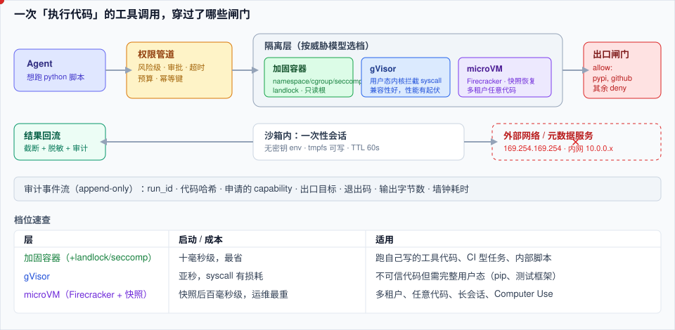

# 🏗️ 沙箱与执行环境

> **一句话**：Agent 一旦能执行模型现写的代码，你的服务就多了一个「会自己找路出去的实习生」——沙箱层的任务是把「能干什么、能碰什么、能去哪、能跑多久」四件事变成可验证的边界。
> **难度**：⭐️⭐️⭐️ 高级
> **标签**：`#infrastructure` `#safety` `#tooling`

## 📌 先看结论

- **三档强度，按威胁模型选**：加固容器（runc + user namespace + 只读根 + 无网络）适合「跑自己写的代码」；gVisor（用户态内核）适合「跑不可信代码但不需要完整 Linux 语义」；microVM（Firecracker/Cloud Hypervisor）适合「多租户、任意代码、要求硬件级隔离」。
- **出口网络比文件系统更危险**：真正造成事故的是 `curl metadata.google.internal`、把 SSH 私钥贴进请求、从 pip 装到被投毒的包。默认拒绝 + 域名白名单是性价比最高的一条规则。
- **快照复用替代冷启动**：microVM 冷启动可以做到百毫秒级（Firecracker 官方量级），配合内存快照/恢复，「每次调用一个新环境」才在经济上可行。
- **权限决策要在执行管道里，不在 prompt 里**：把「允许/需确认/禁止」的风险级写进工具注册表，由执行层拦截（→ [工具权限与沙箱](../05-tool-protocol/tool-permission-sandbox.md)）。
- **有状态沙箱是能力也是债务**：给 Agent 一个能装包、留文件的会话，体验提升巨大，但必须能销毁、能快照、能审计、能限流。

## 🖼️ 一次工具调用穿过什么



| 隔离层 | 原理 | 强度 | 启动开销 | 典型用途 |
|---|---|---|---|---|
| 语言级受限执行 | 禁 `import`、AST 白名单、子集解释器 | ⭐️ 弱（易绕过） | 微秒 | 只跑数值/表达式计算 |
| 加固容器（runc + seccomp/AppArmor/landlock） | namespace + cgroup + 系统调用过滤 | ⭐️⭐️ | 十毫秒–秒 | 内部工具、CI 型任务 |
| gVisor（runsc） | 用户态内核拦截系统调用 | ⭐️⭐️⭐️ | 亚秒 | 通用代码执行、性能损耗不均 |
| microVM（Firecracker / Cloud Hypervisor） | 极简设备模型的虚拟机 | ⭐️⭐️⭐️⭐️ | 亚秒 + 快照可再降 | 多租户 FaaS、Agent 云沙箱 |
| 独立物理机 / 一次性 VM | 真隔离 | ⭐️⭐️⭐️⭐️⭐️ | 分钟 | 高危：内核、驱动、安全研究 |

> ⚠️ **注意**：GPU 直通（device passthrough）会显著扩大攻击面并限制隔离强度——需要 GPU 的推理型沙箱，务必把它当作「独立租户池」而不是「多挂一张卡的普通容器」。

## ⚙️ 一个可落地的最小配置

```yaml
# 加固容器档：给「跑 Agent 生成的 Python」用（Docker Compose 片段，生产建议下沉到 microVM）
services:
  agent-sandbox:
    image: internal/python-runner:slim        # 预装依赖，禁止运行时联网装包
    read_only: true                            # 根文件系统只读
    cap_drop: [ALL]                            # 丢掉所有 capability
    security_opt:
      - no-new-privileges:true
      - seccomp=internal.reject.json           # 只放行必要 syscall
    user: "65534:65534"                        # 非 root、非特权
    network_mode: none                         # 默认断网！
    tmpfs: ["/tmp:size=256m,mode=1777"]         # 唯一可写区
    deploy:
      resources:
        limits: {cpus: "1.0", memory: 1g, pids: 128}   # pids 限制防 fork 炸弹
    pids_limit: 128
    stop_grace_period: 2s
```

```python
# 执行层的风险闸门（放在工具调用管道里，不放 prompt 里）
EGRESS_ALLOW = {"pypi.org", "files.pythonhosted.org"}   # 白名单，而不是黑名单

def before_execute(call):
    if call.risk == "high" and not call.approved:
        return deny("需要人工确认")                       # Human-in-the-loop
    if call.type == "shell":
        hosts = extract_hosts(call.code)
        if hosts - EGRESS_ALLOW:
            return deny(f"出口未授权: {hosts - EGRESS_ALLOW}")
    return allow(
        env={"HOME": "/tmp"},                            # 不挂任何密钥
        timeout=60,                                       # 硬超时
        max_output=200_000,                               # 输出截断，防上下文炸
        audit={"agent": call.agent_id, "sha": hash_src(call.code)},  # 留证据
    )
```

**四条硬要求**（少一条都会在真实事故里补上）：① 无密钥进沙箱；② 默认断网；③ 硬超时 + 资源上限（含 pid/磁盘）；④ 每个沙箱有唯一 ID 并留下「跑了什么代码」的可查记录。

## 🧩 浏览器与 Computer Use 的沙箱

浏览器自动化把沙箱问题变复杂：真实登录态、真实 Cookie、真实点击能力 = 真实资金风险。

- **一次性 profile**：每任务新建，任务结束销毁；需要登录态时走「受控凭证注入」（用后即焚，不给 Agent 看密码明文）
- **域名 allowlist 比黑名单可靠**：默认拒绝 + 明确可去的站点；对能「付款/发信/删除」的域名加人工确认
- **下载与截图要落对象存储并脱敏**：截图可能带身份证/银行卡，落盘即数据泄露
- **速率与副作用保护**：同一站点请求频率上限、写操作（提交表单）幂等键、失败不自动重放
- 参考：[Browser/Computer Use 页面](../05-tool-protocol/computer-use-browser-use.md)、[WebArena 基准](../13-resources/benchmarks/webarena.md)

## 📦 工程现场笔记

- **开源/云上现成件**：E2B、Modal、Daytona、CodeSandbox 类「Agent 沙箱即服务」提供毫秒级冷启动 + 快照 + 文件/进程 API，适合不想自建的团队；自建路线通常是 Firecracker + 容器镜像流水线 + gVisor 兜底。
- **DeepSeek Harness**：用 Linux `landlock` 做文件系统访问面收敛（把可读可写路径显式列出），属于「加固容器档」里很干净的做法——不上 VM 也能显著缩小爆炸半径。
- **Claude Code**：权限管道 + 计划模式（先只读探索再动手）+ 显式授权范围（目录/命令），说明「沙箱」不只是内核层的事：**会话级的授权边界同样关键**（→ [Claude Code 案例深拆](../12-applications/coding-agent.md)）。
- **快照即成本**：把「已装好依赖」的环境做成 golden snapshot，每个会话从快照克隆，比每会话重装 pip 包快 1–2 个数量级。

## ⚠️ 常见误区

- ❌ 以为 Docker 默认安全：默认配置下容器共享宿主内核，且常带宽 capability；不做加固的容器 ≈ 无隔离
- ❌ 只挡文件系统不挡网络：外带（exfiltration）主要通过出网，不是写文件
- ❌ 把密钥放进环境变量再让 Agent「别读」：Agent 会读，因为它在被注入的 prompt 里被指挥去读
- ❌ 沙箱无限存活：没有 TTL 的沙箱池 = 内存/磁盘缓慢泄漏 + 审计不可用
- ❌ 没有「逃逸演练」：定期用已知绕过手法（比如 procfs/挂载/代理配置）测一遍，才知道边界在哪
- ❌ 把提示注入当「模型问题」：被注入的 Agent 拿不到越权能力，才是根本解法（→ [提示注入](../10-evaluation-safety/prompt-injection.md)）

## 🧪 小练习

给你的执行层写一份「威胁清单」并逐条验证：① 能不能读到宿主 `/etc/passwd`？② 能不能出网？③ 能不能 fork 到卡死？④ 能不能写满磁盘？⑤ 能不能拿到别人的会话文件？每条给出「已挡 / 靠自觉 / 未挡」的结论——「靠自觉」的都要变成代码。

## 🔗 相关资源

- [gVisor](https://gvisor.dev/)、[Firecracker](https://firecracker-microvm.github.io/)、[landlock 文档](https://docs.kernel.org/userspace-api/landlock.html)、[seccomp](https://www.kernel.org/doc/html/latest/userspace-api/seccomp_filter.html)
- [E2B](https://github.com/e2b-dev/E2B)、[Modal](https://modal.com/docs)

## 📚 相关知识点

- [工具权限与沙箱](../05-tool-protocol/tool-permission-sandbox.md)
- [权限与沙箱（安全章）](../10-evaluation-safety/permission-sandbox.md)
- [模型网关与路由](model-gateway.md)
- [GPU 调度与多租户](gpu-scheduling-multitenancy.md)
