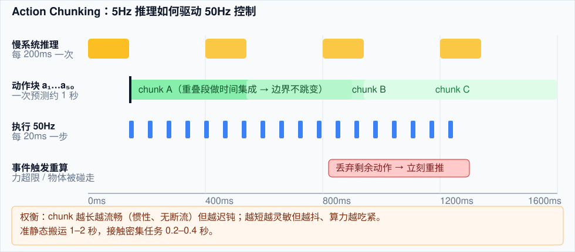

# 动作表示与分层控制

> **一句话**：模型输出的从来不是「动作」，而是某个坐标系下、某个频率上、经过限幅的一段目标——动作表示选错，再强的策略网络也只会稳定地失败。
> **难度**： 进阶
> **标签**：`#embodied-ai` `#engineering`

## 先看结论

- **表示优先于网络**：90% 的「模型不work」在这一步就能避免：末端位姿增量（相对当前）比绝对位姿好学；关节位置目标比力矩目标好部署；绝对旋转用四元数或 6D 表示，不要用欧拉角（万向锁 + 不连续）。
- **控制频率分层**：VLM/规划 1–10Hz → 动作策略 30–200Hz → 关节伺服/平衡控制 500Hz–1kHz+ → 电流环数 kHz。层间用「意图 + 残差」或「目标 + 插值」连接，不要用一层去顶所有层。
- **必须显式建模延迟**：推理 50–200ms、通信 1–20ms、执行器响应一阶滞后。训练时注入随机延迟，部署时做观测时间戳对齐与动作外推，否则策略会「越修正越振荡」。
- **安全层在模型外面**：位置/速度/力矩限幅、关节软限位、自碰撞检查、末端力上限、急停（硬件回路）——模型输出先过这道闸门，永远不要相信神经网络会自律。

## 动作空间怎么选

| 表示 | 优点 | 代价 | 适用 |
|---|---|---|---|
| 末端位姿增量 Δ(x,y,z,rot) + 夹爪 | 与相机视觉最相关、跨机型迁移好 | 需要 IK/笛卡尔控制器；误差累积 | 桌面操作、VLA 微调（最常用） |
| 绝对末端位姿 | 无累积误差 | 分布偏移大，物体一动就废 | 固定工装、结构化抓取 |
| 关节位置目标 | 部署最简单、天然平滑 | 与视觉关系弱，泛化差 | 单臂固定任务、数据来自同一机型 |
| 关节速度 | 安全好限幅 | 精度差，慢 | 教学/演示、早期原型 |
| 力矩 / 关节阻抗 | 能做接触丰富任务（插拔、擦、推） | 需要动力学模型或大量数据；调参敏感 | 装配、人形全身控制 |
| 基座速度（v, ω） | 移动操作解耦简单 | 需要定位与地图 | 轮式底盘、移动机械臂 |

> 💡 **提示**：混合动作空间很常见——「末端增量 + 夹爪开合 + 底盘速度」三段拼接，各自限幅方式不同。写清楚每段的单位、符号约定与坐标系（base / wrist / camera），写进数据 schema，别只写在 README。

## 分层控制与频率对齐



```text
任务层   1–10Hz   「先去水槽那边，再抓蓝色杯子」        ← LLM/VLM、行为树、状态机
技能层  30–200Hz  动作块 a₁…a₅₀（Δ位姿 + 夹爪）        ← VLA / diffusion / flow 策略
控制层 0.5–1kHz   笛卡尔速度→IK→关节目标→阻抗/PD        ← 控制器、QP、WBC
驱动层   kHz+     电流环、力矩补偿、摩擦与前馈            ← 厂商固件/实时总线（EtherCAT 等）
```

**为什么必须分频**：慢系统的算力（几十 GB 权重）跑不到 50Hz，快系统的显存与算力又不足以理解语义。所以慢系统只交「意图」，快系统持续修正，底层负责稳定与限幅——这也是 [VLA 双系统架构](vla-models.md) 存在的物理原因。

## Action Chunking 与「滚动重规划」

```python
# 部署侧骨架：执行块的同时并行推理下一块，用重叠段做平滑
H = 50                      # chunk 长度：50 步 @50Hz = 1 秒
OVERLAP = 15                # 与上一块重叠的步数
CONTROL_HZ = 50

next_obs = env.capture()
plan = policy.step(next_obs, instruction)          # list[Action]，长度 H
i = 0
while not task.done():
    # 后台线程已在算 new_plan（用比 i 更早的观测），这里只取结果
    if pending.done():
        new_plan = pending.result()
        plan = blend(plan[i:], new_plan[:len(plan) - i], OVERLAP)   # temporal ensembling
        i = 0
    a = plan[i]; i += 1
    a = clamp(a, joint_limits, vel_limit, torque_limit)              # 安全层
    if safety.force_exceeded(): a = hold_and_replan()                # 触发式重规划
    robot.send(a)
    if i >= len(plan) - 8:          # 提前发起下一次推理，保证不断流
        pending = pool.submit(policy.step, env.capture(), instruction)
    sleep_at(CONTROL_HZ)
```

**要点**

- **blend（时间集成）**：重叠段做加权平均（ACT 论文里的 temporal ensembling 思路），消除块边界处的跳变。
- **触发式重算**：视觉出现大位移、力超限、卡滞 → 立刻丢弃剩余块重新推理，别硬着头皮把 1 秒动作执行完。
- **块长与任务匹配**：搬运（准静态）可 1–2 秒；插拔/擦桌子（接触反馈主导）应 0.2–0.4 秒；需要动态平衡的人形，快系统更短、底层反射独立。

## 单位与限幅的「一页规范」

```yaml
# action_spec.yaml —— 与数据管线、控制器、评估脚本共用同一份定义
frame: base_link           # 所有 xyz 在底座坐标系
rotation: 6d               # 6D 表示（Zhou et al.），不用欧拉角
order: [dx, dy, dz, r0, r1, r2, r3, r4, r5, gripper]
scale:
  translate: 0.05          # 每步最大 5 cm
  rotate: 0.15             # 每步最大约 8.6°
  gripper: 1.0             # 0=闭, 1=开
control_hz: 50
clamp:
  gripper_force_n: 40      # 超力即退回，防夹碎
  joint_pos: soft_limit    # 由 URDF 读入，留 5° 余量
latency:
  inference_ms: [40, 180]  # 训练时按此范围随机注入
timestamp: monotonic_ns; obs 与 action 必须带 ts 并做最近邻对齐
```

## 工程现场笔记

- **力/力矩反馈被低估**：只用视觉的策略在「插 USB、开抽屉、擦玻璃」这类任务上会一直失败——接触信号是必需的输入，不只是安全监控。
- **阻抗 vs 位置控制**：位置控制在接触时刚度极高（撞了就顶），阻抗/导纳控制允许「软」。学习型策略配阻抗接口，鲁棒性通常好一档。
- **人形的腰部/平衡不能被上层「微操」**：平衡是 kHz 级反射问题。产业方案是给策略一个「质心/落脚点/躯干姿态」接口，底层 WBC 负责不打晃（Helix 一类公开资料里「再加一层更快系统」的思路也是同一件事）。
- **状态估计要归一化一致**：训练与部署的关节单位、坐标系、偏置必须一致。业内常见事故：仿真用弧度、真机驱动回传角度，策略「看着合理」地乱挥。写自动校验（量级检查 + 单步最大变化检查）。

## 常见误区

- ❌ 让模型直接输出关节角度绝对值并期望泛化：不同机型/初始化差异全被压给网络记
- ❌ 欧拉角做旋转：±180° 跳变与万向锁让 MSE 学到荒谬的东西
- ❌ 控制频率与数据频率不一致还直接拼接：录 30Hz、控 50Hz，时间轴错位会让策略「学反因果」
- ❌ 把限幅写进 prompt / 语言层：语言层的「请轻一点」不是安全机制
- ❌ 不做动作平滑（rate limiter / jerk 限制）：电机与减速器寿命、整机抖动都会出问题，评审时也过不了

## 小练习

在仿真里做「延迟消融」：训练时假设 0 延迟，部署时分别注入 0 / 60 / 150 / 300ms 的观测—动作延迟，记录成功率与末端抖动幅度（加速度方差）。然后把随机延迟注入训练，重训一次看恢复多少。这个实验 1 小时能做完，却能让你彻底理解「延迟建模」为什么是标配。

## 相关资源

- [ACT/ALOHA 论文](https://arxiv.org/abs/2304.13705)（动作分块 + temporal ensembling 的出处）、[Diffusion Policy](https://arxiv.org/abs/2303.04137)
- [ROS 2 控制栈文档](https://control.ros.org/)、[Ompl / MoveIt 2](https://moveit.picknik.ai/)（经典规划与安全层参考实现）

## 相关知识点

- [VLA 模型架构](vla-models.md)
- [硬件、实时与安全](hardware-realtime-safety.md)
- [仿真与 Sim-to-Real](simulation-sim2real.md)
- [把 Agent 接进机器人](agent-to-robot-bridge.md)
