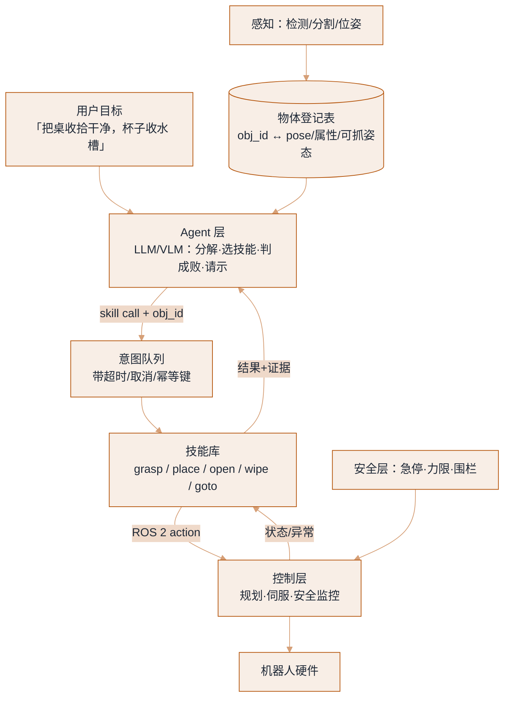
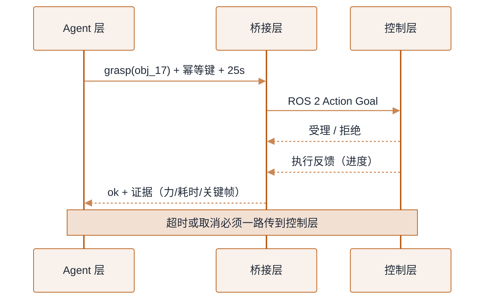

# 把 Agent 接进机器人：技能库 + ROS 2 桥


**一句话**：让 LLM/Agent 层负责「理解目标、拆任务、挑技能、判成败」，让机器人栈负责「安全地执行」——接口的质量（技能的原语粒度 + 可判定的成功条件）决定了整套系统的上限。
  **难度**： 进阶


## 先看结论

- **不要把机器人当「一个工具函数」接进去**：`move_arm(x,y,z)` 这种粒度的接口，会让语言层去做它极不擅长的事（连续坐标、动力学、安全判断）。正确做法是给语言层一组**带内建规划与安全裕度的技能原语**（`grasp(object_id, approach)`、`place(target_region)`）。
- **每个技能必须返回可判定的结果**：`{ok, reason, evidence（关键帧/力峰值/耗时）}`——Agent 才能决定重试、换技能还是问人。「不知道成没成」的接口会让 Agent 一路自信地往下错。
- **物体身份用 ID，不用坐标**：感知层维护「场景清单」（`obj_17: blue cup @ (x,y), graspable_from=[...]`），语言层按 ID 指挥，坐标换算与可达性交给技能层。这是让 LLM 层与机器人层解耦的关键。
- **状态机 + 计划，不要让模型自由循环**：长时序物理任务必须有显式任务状态与硬约束（超时、步数、重试次数、力上限），并把「暂停/接管/急停」作为一等公民。
- **闭环频率分层**：Agent 层 0.5–2Hz（慢、语义），技能层 30–200Hz（快、学习型）。中间放一层「意图队列」，两层各跑各的。

## 分层与接口



*《图：Agent 层只递 obj_id 不递坐标——意图队列带幂等键，感知只喂物体登记表；急停与力限绕过前两层直连控制层》*

## 先看一份真实形状的注册表

技能库对语言层暴露的全部东西，就是下面这份 JSON。它同时是「Agent 能看见的说明书」和「控制器能执行的约束」，两边读同一份，才不会出现「语言层以为能做、控制层拒绝执行」。

```json
{
  "skills": [
    {
      "name": "grasp",
      "description": "抓取指定物体（内部自动规划接近与抓取姿态）。前提: obj visible",
      "params": { "obj_id": "string，取值来自物体登记表" },
      "preconditions": ["obj visible"],
      "hard_limits": { "timeout_s": 25, "force_n": 30 }
    },
    {
      "name": "place",
      "description": "把当前持物放到指定区域。前提: gripper loaded",
      "params": { "region": "sink | table | bin | shelf" },
      "preconditions": ["gripper loaded"],
      "hard_limits": { "timeout_s": 20 }
    },
    {
      "name": "open_drawer",
      "description": "拉开指定抽屉到可放取的角度",
      "params": { "drawer": "string" },
      "preconditions": [],
      "hard_limits": { "timeout_s": 15, "force_n": 45 }
    },
    {
      "name": "goto",
      "description": "底盘移动到指定工位/区域",
      "params": { "target": "string" },
      "preconditions": [],
      "hard_limits": { "timeout_s": 90 }
    },
    {
      "name": "hand_back",
      "description": "把手伸到某人身前等待对方放置物体。前提: human present",
      "params": { "where": "string" },
      "preconditions": ["human present"],
      "hard_limits": { "timeout_s": 60 }
    }
  ]
}
```

三件事一眼能看出来：**`description` 里必须拼上前提条件**（语言层就靠这行文字决定要不要调，这份注册表直接投影成 function calling 的 `tools`）；**`params` 收的是 ID 和枚举区域，不是坐标**；**`hard_limits` 是数据不是注释**——它会被塞进下行的目标消息里，控制层据此自杀式超时。

## 分步演示：一次 `grasp` 从派发到回单的完整往返



*《图：一次调用 = 一个可取消的 Action；「拒绝」和「反馈」都是正常报文，只有回单里的 `ok` 才算结论》*




#### 第 1 步：语言层只挑技能，不写动作

规划器拿到上面那份 `tools` 清单和当前物体登记表，产出的是一串「技能名 + obj_id」，并被强加一个**步数上限（示例里是 12 步）**。物理世界里每一步都花钱、花时间、有可能撞坏东西，所以循环必须有硬上限——和 Lab 1 里 `max_steps` 兜底是同一个道理，只是代价从 token 变成了机械臂。




#### 第 2 步：桥接层把一次调用装成一个 Action 目标

组装下行的目标消息时带三样东西：技能名与参数（序列化成 JSON）、**幂等键 `run_id:skill_name`**、**`deadline_s`（取自注册表的 `timeout_s`）**。幂等键保证重放不会重复执行物理动作（对照 [持久化执行](../16-ai-infrastructure/agent-runtime-durable-execution.md)）；`deadline` 下传给控制层，意味着**就算 Agent 那侧卡死，机器自己也会停**——超时不能只靠上层。




#### 第 3 步：控制器有权拒绝，而且拒绝是正常路径

一个技能对应一个 action topic。目标发出去，先等「受理 / 拒绝」——前提条件不满足（夹具里已经拿着东西）、或者系统处于急停态，控制器直接拒绝，桥接层返回一条 `rejected_by_controller` 的结果给语言层。**注意：这一步没有任何异常抛出**，拒绝是数据，不是崩溃，所以 Agent 可以据此换技能。




#### 第 4 步：执行期间靠反馈推进，不靠轮询

受理后进入异步等待：控制层持续上报进度反馈（当前阶段、实测力、已完成比例），上层订阅回调而不是忙轮询——忙轮询既烧 CPU，又会把「取消」的响应延迟拉大。反馈的另一个作用是给多模态模型喂关键帧，让人工升级时看到的是图而不是一串形容词。




#### 第 5 步：回单只有三种可能，每种都要能被机器判定

结果回来时统一成一个形状：

```json
{
  "ok": true,
  "reason": "",
  "evidence": { "peak_force_n": 12.4, "ms": 4120, "frames": ["snap_01.jpg", "snap_02.jpg"] }
}
```

`reason` 是**枚举**而不是自由文本：`slip / unreachable / timeout / blocked / force_limit / perception_lost / safety_stop / rejected_by_controller`。语言层要的是可分派的失败类别，不是「大概是没抓稳吧」。「没报错」不等于成功——机器人最常见的状态恰恰是安静地什么都没做，所以判定必须看 `ok` 字段与证据。



## 四种结局，四条分支（点标签切换）



`ok=true`，带证据回单。规划循环走到下一步，同时把 `scene_version` 一起推进——**抓取这个动作本身改变了世界**（杯子从桌面进了夹具），下一句「放到水槽」引用的必须是新版本。世界版本化是防「按 30 秒前的地图伸手」的唯一办法。



返回 `rejected_by_controller`，物理动作一次都没发生。分支处理是**重感知 + 重规划**：前提条件不满足通常说明语言层对世界的理解过期了（夹具已占用、物体被人的手挡住）。此时最不该做的是「再试一次同样的目标」——同一份前提下重试，结果必然是同一份拒绝。



到 `deadline` 仍没等到结果，桥接层必须**把取消真的传到控制层**，再回一条 `reason=timeout` 的结果。这里藏着本领域最危险的 bug 类别：上层放弃了、日志里写了 timeout，而机械臂还在动。取消信号要一路贯穿到伺服层，急停与力限则干脆绕过前两层直连控制层（见本页开头的分层图）。



第一次失败后先 `objects.refresh()` 重感知、再带着失败原因重规划；**第二次仍失败就直接升级给人**，不再硬试。物理世界的重试有真实代价：可能刮花物体、可能把夹具拧到卡死。升级时要一并交出去的正是那份证据链——峰值力、耗时、关键帧、已试过的分支——这比「Agent 说它做不到」有用得多。



## 生活类比

这层桥接像「项目经理与技工之间的工单系统」：经理（LLM）说「把 3 号件装回去」，不说「左手抬 12.4 度」；技工（技能层）做完必须回单——装上了 / 螺丝滑丝了 / 需要新零件。「不回单」的系统，经理只能猜，然后就出事。

## 接口设计的六条规则

1. **幂等键**：`run_id + step_id`，让重放不重复执行物理动作（对照 [持久化执行](../16-ai-infrastructure/agent-runtime-durable-execution.md)）。
2. **可取消**：取消必须传到控制层并真的停下；「上层不管了但机械臂还在动」是最危险的 bug 类别。
3. **失败原因枚举化**：`unreachable / blocked / slip / force_limit / timeout / perception_lost / safety_stop`——让 Agent 能选择对策而不是重新祈祷。
4. **证据而非长描述**：返回关键帧路径 + 数值（力、耗时、残差），文字描述留给日志。多模态模型看图像比看形容词准。
5. **世界版本化**：`scene_version` 随每次感知更新，Agent 计划带版本号；版本变了就重规划（防止「按 30 秒前的地图伸手」）。
6. **降级模式**：云端不可达时，本地技能库仍能执行「已确认的剩余步骤」或安全停驻（→ [模型网关](../16-ai-infrastructure/model-gateway.md)、[硬件、实时与安全](hardware-realtime-safety.md)）。

## 工程现场笔记

- **主流做法与开源参考**：SayCan / Code-as-Policies（LLM 出计划或直接出代码）、VoxPoser（语言 → 价值图 → 运动规划）、RT-2/PaLM-E（把语言模型直接接成策略）、π0.5 / GR00T / Helix 这类双系统（慢系统给子目标、快系统执行）。共同经验：**语言层的自由度要受限于「技能 + 前提条件 + 硬约束」**。
- **让模型「写代码」而不是「挑技能」的取舍**：代码生成更灵活（能把感知与控制组合成新流程），但必须跑在沙箱 + 白名单 API（无直接力矩接口）+ 静态安全检查里，否则等于把机器人交给一段没审过的脚本（→ [沙箱与执行环境](../16-ai-infrastructure/sandbox-execution-environments.md)）。
- **仿真里的 Agent 评测很便宜**：BEHAVIOR / RoboCasa / ManiSkill 这类基准支持「语言任务 → 长时序执行」，适合先验证规划层，再谈控制层。见 [评估与基准](evaluation-benchmarks.md)。
- **多机器人协作是同一套栈**：共享物体登记表 + 意图队列 + 冲突锁（两个臂不能同时要同一个抽屉）。参考 [多智能体](../08-multi-agent/README.md)。
- **数据回流是最大红利**：每次任务的计划、失败原因、人工纠正都写进轨迹库，反哺技能库与高层策略——数字 Agent 的「失败样本 → 评估集」在机器人这里同样成立。

## 常见误区

- ❌ 让 LLM 输出毫米级坐标与关节角度：它在连续数值上极不可靠，且单位/坐标系混淆是必然事件
- ❌ 技能无前提条件检查：拿着「已抓取」的前提去做「抓取」，物理上就是撞
- ❌ 用「没报错」代替「成功」：机器人最常见的状态是「安静地什么都没做」
- ❌ 无限重试：真机每次失败都可能损坏物体/机器人，重试预算与人工升级必须显式设计
- ❌ 忽略时钟与因果：Agent 的 3 秒思考期间世界变了；计划必须绑定 `scene_version`，执行前复核关键前提
- ❌ 把「语音助手 + 机械臂」当具身智能：没有闭环感知、恢复行为与安全层的系统，现场会以最贵的失败方式教你区别

## 小练习

用一份仿真（Isaac Lab / MuJoCo / ManiSkill 任一）搭一个三层最小系统：① 感知给你一个物体清单 JSON；② 技能库提供 4 个技能（goto / grasp / place / open），每个带前提条件与硬超时；③ 语言层用 function calling 出计划。跑 20 个任务，统计「规划层失败」与「执行层失败」的比例——这决定你下一步该修 prompt/规划还是修策略。

## 参考资料

- [ROS 2 文档（Action、Life cycle、DDS）](https://docs.ros.org/en/latest/)、[MoveIt 2](https://moveit.picknik.ai/)、[LeRobot](https://github.com/huggingface/lerobot)
- 方法：[SayCan](https://arxiv.org/abs/2204.01691)、[Code as Policies](https://arxiv.org/abs/2209.07753)、[VoxPoser](https://arxiv.org/abs/2307.05973)

## 相关知识点

- [VLA 模型架构](vla-models.md)
- [动作表示与分层控制](action-representation-control.md)
- [硬件、实时与安全](hardware-realtime-safety.md)
- [持久化执行与运行时](../16-ai-infrastructure/agent-runtime-durable-execution.md)
- [工具调用与协议](../05-tool-protocol/README.md)
- [规划与任务执行](../07-planning/README.md)
- [Human-in-the-loop](../02-agent-basics/human-in-the-loop.md)
