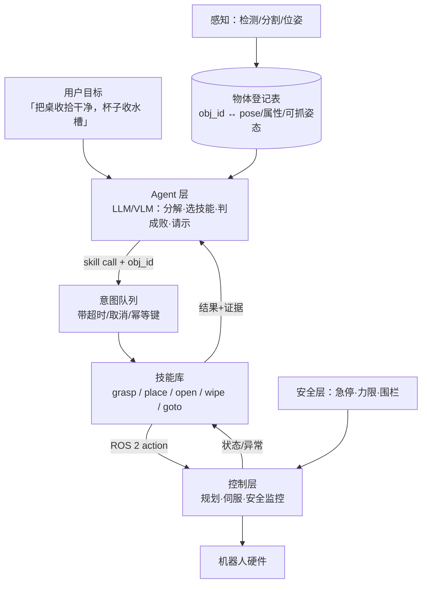

# 把 Agent 接进机器人：技能库 + ROS 2 桥

> **一句话**：让 LLM/Agent 层负责「理解目标、拆任务、挑技能、判成败」，让机器人栈负责「安全地执行」——接口的质量（技能的原语粒度 + 可判定的成功条件）决定了整套系统的上限。
> **难度**： 进阶
> **标签**：`#embodied-ai` `#tooling`

## 先看结论

- **不要把机器人当「一个工具函数」接进去**：`move_arm(x,y,z)` 这种粒度的接口，会让语言层去做它极不擅长的事（连续坐标、动力学、安全判断）。正确做法是给语言层一组**带内建规划与安全裕度的技能原语**（`grasp(object_id, approach)`、`place(target_region)`）。
- **每个技能必须返回可判定的结果**：`{ok, reason, evidence（关键帧/力峰值/耗时）}`——Agent 才能决定重试、换技能还是问人。「不知道成没成」的接口会让 Agent 一路自信地往下错。
- **物体身份用 ID，不用坐标**：感知层维护「场景清单」（`obj_17: blue cup @ (x,y), graspable_from=[...]`），语言层按 ID 指挥，坐标换算与可达性交给技能层。这是让 LLM 层与机器人层解耦的关键。
- **状态机 + 计划，不要让模型自由循环**：长时序物理任务必须有显式任务状态与硬约束（超时、步数、重试次数、力上限），并把「暂停/接管/急停」作为一等公民。
- **闭环频率分层**：Agent 层 0.5–2Hz（慢、语义），技能层 30–200Hz（快、学习型）。中间放一层「意图队列」，两层各跑各的。

## 分层与接口



## 最小可跑：技能注册 + ROS 2 Action 桥接

```python
# skill_registry.py —— 把技能当「工具」暴露给 Agent，但语义是机器人级的
from dataclasses import dataclass
from typing import Literal

@dataclass
class SkillResult:
    ok: bool
    reason: str = ""                      # slip / unreachable / timeout / blocked / force_limit
    evidence: dict | None = None          # 关键帧路径、峰值力、耗时

@dataclass
class SkillSpec:
    name: str
    description: str                      # 给语言层看的自然语言说明
    params: dict                          # JSON schema（含 obj_id 枚举来自登记表）
    preconditions: list[str]              # 例："obj visible", "gripper empty"
    hard_limits: dict                     # 超时、最大力、速度档

SKILLS = [
  SkillSpec("grasp", "抓取指定物体（内部自动规划接近与抓取姿态）",
            {"obj_id": "string"}, ["obj visible"], {"timeout_s": 25, "force_n": 30}),
  SkillSpec("place", "把当前持物放到指定区域",
            {"region": "sink|table|bin|shelf"}, ["gripper loaded"], {"timeout_s": 20}),
  SkillSpec("open_drawer", "拉开指定抽屉到可放取的角度",
            {"drawer": "string"}, [], {"timeout_s": 15, "force_n": 45}),
  SkillSpec("goto", "底盘移动到指定工位/区域",
            {"target": "string"}, [], {"timeout_s": 90}),
  SkillSpec("hand_back", "把手伸到某人身前等待对方放置物体",
            {"where": "string"}, ["human present"], {"timeout_s": 60}),
]

def to_tool_schema(specs):                 # 暴露成 function calling 的 tools
    return [{"type": "function", "function": {
        "name": s.name, "description": s.description + " 前提: " + "; ".join(s.preconditions),
        "parameters": {"type": "object", "properties":
                       {k: {"type": "string"} for k in s.params}}}} for s in specs]
```

```python
# ros2_bridge.py —— Agent 的一次调用 = 一个 ROS 2 Action（可取消、带反馈）
import rclpy
import json
from rclpy.node import Node
from rclpy.action import ActionClient
from my_robot_interfaces.action import Skill       # 自定义 action：Goal/Result/Feedback

class SkillRunner(Node):
    def __init__(self):
        super().__init__("agent_skill_runner")
        self.clients, self._inflight = {}, {}

    def _client(self, name):                       # 一个技能 = 一个 ROS 2 action topic
        return self.clients.setdefault(name, ActionClient(self, Skill, f"/skills/{name}"))

    def _build_goal(self, skill, args, idempotency_key):
        g = Skill.Goal()
        g.skill, g.args_json, g.idempotency_key = skill.name, json.dumps(args), idempotency_key
        g.deadline_s = skill.hard_limits["timeout_s"]      # 控制层也要有超时，别只靠上层
        return g

    def send(self, skill, args, run_id, on_feedback=None):
        cli = self._client(skill.name)
        gh = cli.send_goal_async(self._build_goal(skill, args, f"{run_id}:{skill.name}"),
                                 feedback_callback=lambda fb: on_feedback and on_feedback(fb.feedback))
        return cli, gh                              # 上层 await + 超时；取消走 gh.cancel_goal_async()

    def cancel(self, run_id):                       # 取消必须真的传到控制层
        if gh := self._inflight.get(run_id):
            gh.cancel_goal_async()

async def execute_skill(runner, spec, args, run_id):
    cli, goal_future = runner.send(spec, args, run_id)
    gh = await goal_future
    runner._inflight[run_id] = gh
    if not gh.accepted:                                  # 控制器拒绝（前提条件不满足/已急停）
        return SkillResult(False, "rejected_by_controller")
    try:
        async with asyncio.timeout(spec.hard_limits["timeout_s"]):
            res = (await gh.get_result_async()).result    # 异步等待，不忙轮询
            return SkillResult(ok=res.status == 4,        # SUCCEEDED
                               reason=res.message or "",
                               evidence={"peak_force_n": res.peak_force,
                                         "ms": res.elapsed_ms,
                                         "frames": res.snapshot_urls})
    except TimeoutError:
        runner.cancel(run_id)                       # 取消要真的传到控制层！
        return SkillResult(False, "timeout")
```

```python
# 规划循环：语言层只管「下一步做什么」，不知道怎么做
def agent_loop(goal, objects, runner):
    plan = llm_plan(goal, objects, tools=to_tool_schema(SKILLS))
    for step in plan.steps(max_steps=12):                     # 步数上限是硬约束
        if step.needs_human:
            if not human_approve(step): break                 # Human-in-the-loop
        res = await execute_skill(runner, SKILLS[step.name], step.args, step.run_id)
        if not res.ok:
            if step.retries >= 2:
                return escalate_to_human(step, res)           # 别硬试：物理世界里重试有代价
            objects.refresh()                                 # 失败往往意味着场景变了 → 重感知
            plan = replan(plan, res)                          # 带着失败原因重规划
    return done(report())
```

## 生活类比

这层桥接像「项目经理与技工之间的工单系统」：经理（LLM）说「把 3 号件装回去」，不说「左手抬 12.4 度」；技工（技能层）做完必须回单——装上了 / 螺丝滑丝了 / 需要新零件。「不回单」的系统，经理只能猜，然后就出事。

## 接口设计的六条规则

1. **幂等键**：`run_id + step_id`，让重放不重复执行物理动作（对照 [持久化执行](../16-ai-infrastructure/agent-runtime-durable-execution.md)）。
2. **可取消**：取消必须传到控制层并真的停下；「上层不管了但机械臂还在动」是最危险的 bug 类别。
3. **失败原因枚举化**：`unreachable / blocked / slip / force_limit / timeout / perception_lost / safety_stop`——让 Agent 能选择对策而不是重新祈祷。
4. **证据而非长描述**：返回关键帧路径 + 数值（力、耗时、残差），文字描述留给日志。多模态模型看图像比看形容词准。
5. **世界版本化**：`scene_version` 随每次感知更新，Agent 计划带版本号；版本变了就重规划（防止「按 30 秒前的地图伸手」）。
6. **降级模式**：云端不可达时，本地技能库仍能执行「已确认的剩余步骤」或安全停驻（→ [模型网关](../16-ai-infrastructure/model-gateway.md)、[硬件、实时与安全](hardware-realtime-safety.md)）。

## 工程现场笔记

- **主流做法与开源参考**：SayCan / Code-as-Policies（LLM 出计划或直接出代码）、VoxPoser（语言 → 价值图 → 运动规划）、RT-2/PaLM-E（把语言模型直接接成策略）、π0.5 / GR00T / Helix 这类双系统（慢系统给子目标、快系统执行）。共同经验：**语言层的自由度要受限于「技能 + 前提条件 + 硬约束」**。
- **让模型「写代码」而不是「挑技能」的取舍**：代码生成更灵活（能把感知与控制组合成新流程），但必须跑在沙箱 + 白名单 API（无直接力矩接口）+ 静态安全检查里，否则等于把机器人交给一段没审过的脚本（→ [沙箱与执行环境](../16-ai-infrastructure/sandbox-execution-environments.md)）。
- **仿真里的 Agent 评测很便宜**：BEHAVIOR / RoboCasa / ManiSkill 这类基准支持「语言任务 → 长时序执行」，适合先验证规划层，再谈控制层。见 [评估与基准](evaluation-benchmarks.md)。
- **多机器人协作是同一套栈**：共享物体登记表 + 意图队列 + 冲突锁（两个臂不能同时要同一个抽屉）。参考 [多智能体](../08-multi-agent/README.md)。
- **数据回流是最大红利**：每次任务的计划、失败原因、人工纠正都写进轨迹库，反哺技能库与高层策略——数字 Agent 的「失败样本 → 评估集」在机器人这里同样成立。

## 常见误区

- ❌ 让 LLM 输出毫米级坐标与关节角度：它在连续数值上极不可靠，且单位/坐标系混淆是必然事件
- ❌ 技能无前提条件检查：拿着「已抓取」的前提去做「抓取」，物理上就是撞
- ❌ 用「没报错」代替「成功」：机器人最常见的状态是「安静地什么都没做」
- ❌ 无限重试：真机每次失败都可能损坏物体/机器人，重试预算与人工升级必须显式设计
- ❌ 忽略时钟与因果：Agent 的 3 秒思考期间世界变了；计划必须绑定 `scene_version`，执行前复核关键前提
- ❌ 把「语音助手 + 机械臂」当具身智能：没有闭环感知、恢复行为与安全层的系统，现场会以最贵的失败方式教你区别

## 小练习

用一份仿真（Isaac Lab / MuJoCo / ManiSkill 任一）搭一个三层最小系统：① 感知给你一个物体清单 JSON；② 技能库提供 4 个技能（goto / grasp / place / open），每个带前提条件与硬超时；③ 语言层用 function calling 出计划。跑 20 个任务，统计「规划层失败」与「执行层失败」的比例——这决定你下一步该修 prompt/规划还是修策略。

## 相关资源

- [ROS 2 文档（Action、Life cycle、DDS）](https://docs.ros.org/)、[MoveIt 2](https://moveit.picknik.ai/)、[LeRobot](https://github.com/huggingface/lerobot)
- 方法：[SayCan](https://arxiv.org/abs/2204.01691)、[Code as Policies](https://arxiv.org/abs/2209.07753)、[VoxPoser](https://arxiv.org/abs/2307.05973)
- 相关章节：[工具调用与协议](../05-tool-protocol/README.md)、[规划与任务执行](../07-planning/README.md)、[Human-in-the-loop](../02-agent-basics/human-in-the-loop.md)

## 相关知识点

- [VLA 模型架构](vla-models.md)
- [动作表示与分层控制](action-representation-control.md)
- [硬件、实时与安全](hardware-realtime-safety.md)
- [持久化执行与运行时](../16-ai-infrastructure/agent-runtime-durable-execution.md)
