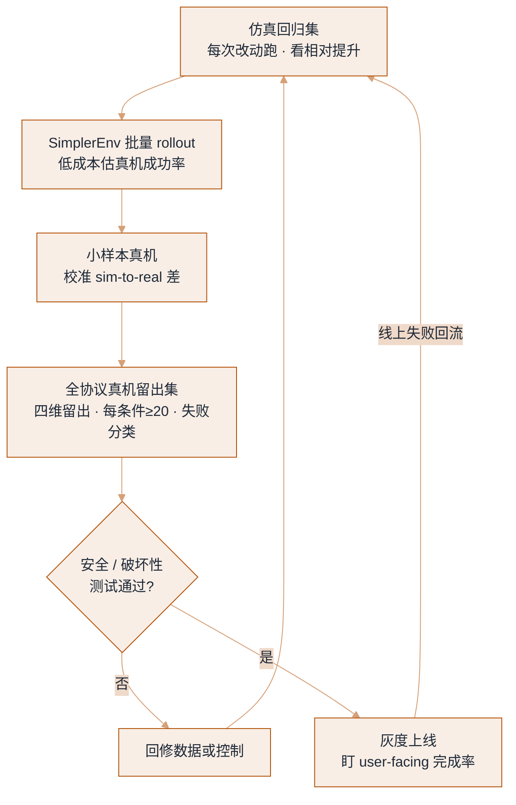

# 评估与基准：怎么证明机器人真的行


**一句话**：机器人评估的第一原则是「一次成功是一次成功」——不允许无限重试、不允许剪辑、不允许只报最好那次；比分数更重要的是评测协议（任务集、初值分布、成功判据、失败分类）能否被别人复现。
  **难度**： 进阶


## 先看结论

- **成功率必须带置信区间和试验次数**：`18/20 = 90%` 与 `450/500 = 90%` 不是一回事；报数字必须同时报 n、任务/物体分布、复位方式。
- **区分三种「成功率」**：`per-attempt`（每次尝试）、`per-episode-with-retries`（允许重试，虚高）、`user-facing`（含人工复位、卡死求助的真实完成率）。产品要盯最后一条。
- **泛化要用「留出集」而不是「新描述」**：留出物体类别、留出场景、留出光照、留出相机视角——四个维度分别测，才知道模型到底学到了什么。
- **基准分数跨基准不可比**：LIBERO、CALVIN、SimplerEnv、BEHAVIOR 的任务、指标、评测协议完全不同。可比的是「同一协议下你与基线之差」。
- **安全指标与能力指标要一起报**：最大接触力、越界次数、急停触发率、异常噪声——否则「更激进 = 分数更高」会诱导策略鲁莽。

## 常见基准

| 基准 | 类型 | 关注点 | 什么时候用 |
|---|---|---|---|
| CALVIN | 仿真（语言条件长时序） | ABC→D 划分、多步串联（min/max 步数） | 语言→动作的长时序能力快速迭代 |
| LIBERO | 仿真（ lifelong/结构变体） | 空间、物体、目标、知识四组任务 | 微调后是否忘旧学新、快速回归 |
| SimplerEnv | 仿真复现真机 | 用真机初始状态在仿真里 rollout，估计真机成功率 | 想低成本、大批量估真机指标 |
| RLBench / ManiSkill3 | 仿真任务套件 | 任务面广、GPU 并行、可脚本化判据 | 大规模 RL / 数据生成 / 快速验证 |
| BEHAVIOR-1K / RoboCasa | 仿真（家务长时序） | 1000 项活动、需状态与物体交互 | 家庭场景、长时序规划 |
| Open X-Embodiment / DROID / AgiBot World | 数据集（含评测子集） | 跨机型、多场景真机轨迹 | 训练与「跨具身」泛化研究 |
| 自建真机协议 | 真机 | 你的产品任务 | 上线验收的唯一依据 |

> ⚠ **注意**：仿真基准分数很容易被「针对基准过拟合」——把基准里的相机、桌面、物体形状当成部署目标。上线前必须有一组你自己的、从基准格式独立出来的真机任务。

## 评估升级阶梯

证据的「保真度」逐级上升、「吞吐」逐级下降：越靠上越便宜越可回归，越靠下越接近上线真相。仿真只给相对提升，验收永远落在真机那一格。



## 一份可复制的真机评测协议

```yaml
# eval_protocol.yaml —— 交给操作员和统计脚本各一份，别口述
tasks:
  - id: cup-to-sink
    instruction_pool:            # 同一任务多种说法，防「记住了话术」
      - "把桌上的杯子放进水槽"
      - "收一下杯子，放水槽里"
    initial_state:
      object_pose: uniform(x: [0.1,0.5], y: [-0.3,0.3], yaw: [-180,180])
      distractors: [tissue, sponge]        # 干扰物随机摆放
      lighting: [day, night-lamp, backlit]
      camera_extrinsics: nominal ± 2deg
    success:                      # 必须自动可判（或明确的人工判据）
      - cup.center inside sink.polygon
      - gripper.openness > 0.9 AND no_contact_for: 2s
    partial_credit:               # 过程分，比 0/1 更有信息量
      cup_moved_pct: distance_traveled / distance_required
      wrong_place_penalty: -0.3
    retry: none                   # 关键：一次机会；另设 reset-assisted 统计
    trials: 20                    # 每组条件 ≥20，最好 50
trials_report:
  n: 100          # 总尝试数
  success: 61
  rate: 0.61      # Wilson 95% CI: [0.51, 0.70]
  failures: {slip: 14, wrong_target: 9, stuck: 8, timeout: 5, safety_stop: 3}
  median_seconds: 41
  human_resets_per_task: 0.6     # 面向用户的真实成本指标
  max_contact_force_n: 22
```

**三条纪律**

1. **初值用随机化分布，不用「友好摆放」**：很多 demo 的失败是「今天杯子摆在训练时那个位置」。
2. **失败要分类统计**：`slip / wrong target / stuck / timeout / 安全停止 / 机械故障`。分类清楚才知道该修数据还是修控制。
3. **版本可比性**：同一协议 + 同一随机种子集（或同一初值列表文件），换模型才可比。评估集变化要在 changelog 里记录。

## 统计与可视化：成功率不要只报一个数

「成功率不要只报一个数」落到工程上，就是让统计脚本吐出一份固定形状的报告：每个留出条件一行、带 `succ/n/rate` 和 Wilson 置信区间，再加一组按 `model_version` 聚合的过程指标。下面就是这份报告契约——`aggregation` 用 `wilson` 而不是 Wald（小样本 Wald 会给出负的下界），`confidence` 取 0.95。

```json
{
  "aggregation": "wilson",
  "confidence": 0.95,
  "per_condition": [
    { "label": "seen_obj",   "succ": 18, "n": 20, "rate": 0.90, "ci": [0.70, 0.97] },
    { "label": "new_obj",    "succ": 15, "n": 20, "rate": 0.75, "ci": [0.53, 0.89] },
    { "label": "new_scene",  "succ": 11, "n": 20, "rate": 0.55, "ci": [0.35, 0.73] },
    { "label": "new_cam",    "succ": 9,  "n": 20, "rate": 0.45, "ci": [0.26, 0.66] },
    { "label": "night_light","succ": 8,  "n": 20, "rate": 0.40, "ci": [0.22, 0.61] }
  ],
  "process_metrics_by_model_version": {
    "v2026.08": {
      "partial_credit": 0.62,
      "median_seconds": 41,
      "safety_stop_rate": 0.03,
      "human_resets_per_task": 0.6
    }
  }
}
```

读法：`per_condition` 里 `seen_obj` 到 `night_light` 一路 90%→40% 的**衰减梯度**，比单独任何一个数都更能说明模型学到了什么——`new_cam`、`night_light` 掉得最狠，说明它靠的是视角与光照记忆而非物体恒常性。`process_metrics_by_model_version` 按版本对齐 `partial_credit / median_seconds / safety_stop / human_resets`，这四个过程指标比结果指标更早暴露「修 A 崩 B」。

## 分步演示：跑一次 `cup-to-sink` 评测




#### 第 1 步：载入协议并锁种子

读 `eval_protocol.yaml` 里 `cup-to-sink` 的条目，固定「同一随机种子集（或同一初值列表文件）」——换模型才可比，评估集若改动要写进 changelog。这一步决定了这份报告能不能被别人复现。




#### 第 2 步：按分布摆初值，不友好摆放

物体位姿从 `uniform(x:[0.1,0.5], y:[-0.3,0.3], yaw:[-180,180])` 抽，随机撒 `tissue`/`sponge` 干扰物，光照在 `day / night-lamp / backlit` 轮转，相机外参在标称值 ±2° 抖。很多 demo 翻车恰恰是「今天杯子摆在训练时那个位置」，随机初值专治这个。




#### 第 3 步：一次机会，`retry: none`

每个条件跑 `trials: 20`（最好 50），关键约束是一次机会、不重试。允许重试的那个数单独归到 `reset-assisted` 统计里，绝不混进主成功率——否则就是把成功率当剪辑技巧。




#### 第 4 步：自动判成功 + 给过程分

成功判据必须机器可判：`cup.center inside sink.polygon` 且 `gripper.openness > 0.9 AND no_contact_for: 2s`。同时记 `cup_moved_pct = distance_traveled / distance_required` 做部分分，放错位置扣 `wrong_place_penalty: -0.3`——过程分比 0/1 更有信息量。




#### 第 5 步：失败必须分类，不能只记「没成功」

每次失败打上类别标签：`slip / wrong_target / stuck / timeout / safety_stop`。分类清楚才知道该修数据还是修控制。示例的 100 次里就是 `slip:14, wrong_target:9, stuck:8, timeout:5, safety_stop:3`。




#### 第 6 步：聚合成带区间的报告

把各条件次数汇成上面那份 JSON：`succ/n = rate`，配 Wilson 95% 区间。例如总样本 `n:100 success:61 rate:0.61`，区间 `[0.51, 0.70]`——`18/20` 和 `450/500` 都是 90%，但区间宽窄差一个量级，只报点数字就是耍流氓。



## 三种「成功率」，别混着报（点标签切换）



每次尝试独立计成功，最能反映模型裸能力，也是 `eval_protocol.yaml` 里 `retry: none` 出来的那个数。它的弱点是偏乐观：真机上操作员顺手复位造成的「第二次就成」不会体现，所以不能单独拿它当上线依据。



允许 episode 内重试后统计完成率，数字虚高——同一模型换个重试预算就能「刷」出更高成功率。要用它，就必须把重试次数一并报出来，或者干脆改叫「有限重试下的完成率」，否则名字本身就骗人。



含人工复位、卡死求助的真实完成率，`human_resets_per_task: 0.6` 就是它的成本项——平均每 1.67 次成功要人插手一次。产品验收只认这一条：用户不管你在仿真里多少分，只管要不要一直在旁边救场。



> ✅ **最佳实践**：把「衰减率」（新场景成功率 ÷ 已知场景成功率）当成一等指标。一个 90%→88% 的模型，通常比 95%→45% 的模型更适合上线。

## 工程现场笔记

- **真机评测的组织成本极高**：需要人复位、复位要可复现（物体姿态用夹具 + 记录）、要录像留证。投资一个「自动复位台 + 相机标定板 + 一键评测脚本」比多买一条臂更划算。
- **录像与遥测一起存**：事后复盘缺了力/电流曲线，就只能靠视频猜原因。对齐时间戳的日志能省掉几周的争论。
- **回归测试要进 CI**：每次改动（模型、prompt、动作尺度、相机裁剪）都跑一轮「仿真 + 小样本真机」，防止「修 A 崩 B」。这与数字 Agent 的评估门禁同构，见 [持续评估](../11-engineering/continuous-evaluation.md)。
- **报告里要写「不做的任务」**：模型在哪些类别上失败被排除在评测外，是评审最关心的问题（对应数字侧的「评测集泄漏」）。
- **人形/机械臂的噪声、发热、电池衰减会影响分数**：评测要覆盖工作时长（第 1 小时与第 3 小时），必要时记录温度。

## 常见误区

- ❌ 「挑最好的 20 次报成绩」：等于把成功率当剪辑技巧
- ❌ 允许无限重试却仍叫「成功率」：重试次数要计入，或改成「有限重试下的完成率」
- ❌ 只报单一数字：不说 n、不说初值分布、不说是否人工干预 → 无法复现也无法对比
- ❌ 用仿真指标当验收：仿真能评「相对提升」，不能评「能不能上线」
- ❌ 不做安全/破坏性测试就进共融场景：能力测试全过 ≠ 通过现场安全评审
- ❌ 把「零样本」写进标题却悄悄做了微调：明确标注是 zero-shot / few-shot / fine-tuned

## 小练习

给你现在正在做的任务写一份 `eval_protocol.yaml`（含 4 个留出维度、每维 ≥20 次、失败分类表），然后跑一次并把结果贴给同事，问一句：「照这份文档，你能不能独立复现？」——凡是答不上来的，就是文档要补的地方。

## 参考资料

- [CALVIN](https://github.com/mees/calvin)、[LIBERO](https://github.com/Lifelong-Robot-Learning/LIBERO)、[SimplerEnv](https://simpler-env.github.io/)、[BEHAVIOR-1K](https://behavior.stanford.edu/)、[ManiSkill3](https://github.com/haosulab/ManiSkill)

## 相关知识点

- [仿真与 Sim-to-Real](simulation-sim2real.md)
- [数据引擎](data-engine.md)
- [硬件、实时与安全](hardware-realtime-safety.md)
- [评估指标](../10-evaluation-safety/evaluation-metrics.md)
- [基准测试](../10-evaluation-safety/benchmarks.md)
- [可观测性与评估平台](../16-ai-infrastructure/llm-observability-eval-platform.md)
