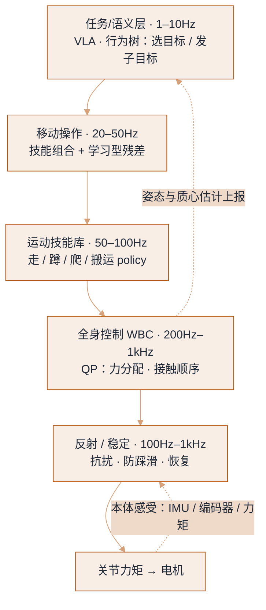
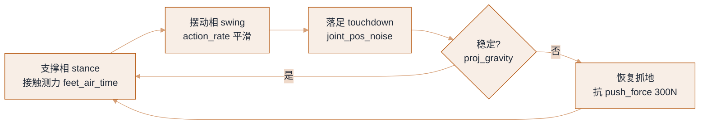

# 人形与腿足运动


**一句话**：腿足运动的真正难点不是「走起来」，而是「在推动、搬运、被踩到、地面打滑时还不倒」——所以现代方案几乎都是「仿真里大规模 RL 训出底层运动技能 + 真机数据学上半身操作 + 任务层用 VLA 挑目标」的三层结构。
  **难度**： 进阶


## 先看结论

- **行走控制基本被 RL 拿下**：大规模并行仿真（GPU 上同时跑数千环境）+ 课程学习 + 域随机化，产出可部署的关节策略；PPO 仍是默认算法。真正的难点转移到「全身协调 + 操作时不失衡」。
- **人形的价值在于「环境兼容」**：楼梯、门槛、驾驶座、人类工具、狭窄通道——不是为了拟人而拟人。若场景是平整工厂地面，轮式底盘 + 双臂在能耗、速度、成本、安全上通常更优。
- **学习走路的主流捷径是「模仿人类动作」**：SMPL/动捕数据 → 重定向到机器人骨架（retargeting）→ 跟踪关节/末端轨迹训练策略。好处是先验充足，坏处是受限于人类动作分布与机器人形态差异。
- **上半身与下半身要解耦频率**：平衡是 kHz–数百 Hz 的反射问题，操作是 50Hz 问题，任务是 5Hz 问题。把它们塞进同一个网络，实时性与安全都难保证。

## 技术栈

| 层 | 任务 | 常见方法 | 频率 |
|---|---|---|---|
| 反射/稳定 | 抗扰动、踩滑、恢复 | RL 策略、MPC、ZMP/Capture point 分析 | 100Hz–1kHz |
| 全身控制（WBC） | 多任务优先级、接触点选择、力分配 | QP（凸优化）+ 动力学模型 | 200Hz–1kHz |
| 运动技能库 | 走、跑、蹲、爬、搬运、起身 | RL policy（每技能一个或条件化统一） | 50–100Hz |
| 移动操作 | 边走边搬、双手作业 | 技能组合 + 规划 + 学习型残差 | 20–50Hz |
| 任务/语义层 | 目标选择、指令分解 | VLM/VLA、行为树、LLM 规划 | 1–10Hz |

## 分层控制与频率解耦

命令自上而下、状态自下而上；频率逐层升高，正是「平衡交给底层、上层只发末端轨迹 + 接触力期望」的由来。把它塞进同一个网络，实时与安全都会输。



## 「仿真到真机」的人形配方（RL 路线）

这段训练骨架的全部信息，浓缩在下面这份配置契约里——它同时是仿真器的启动参数、域随机化的采样区间、以及「怎样算学坏了」的奖励判据。每个字段值都取真机可复现的量级，改任何一项都要回真机重测。

```json
{
  "num_envs": 4096,
  "terrain": ["flat", "rough", "stairs_up", "stairs_down", "slope", "displace"],
  "curriculum": "terrain_difficulty",
  "randomize_per_env": {
    "mass_scale": [0.8, 1.2],
    "friction": [0.3, 1.2],
    "kp_kd_scale": [0.7, 1.3],
    "latency_steps": [0, 6],
    "push_force": [0, 300],
    "joint_pos_noise": [0, 0.05]
  },
  "reward": {
    "lin_vel_track": 1.0,
    "ang_vel_track": 0.5,
    "termination_penalty": -50,
    "action_rate": -0.05,
    "torque": -1e-4,
    "feet_air_time": 0.1,
    "joint_limit": -0.5
  },
  "obs": {
    "history": 5,
    "include": ["base_ang_vel", "proj_gravity", "cmd_vel", "joint_pos", "joint_vel", "last_action"]
  },
  "trainer": { "algo": "PPO", "total_steps": 2e10 },
  "export": { "format": "onnx", "sample_rate_hz": 50 }
}
```

三处最该读出来的取舍：**`latency_steps`（0–6 步）与 `push_force`（0–300N）是抗扰能力的来源**——每个 env 固定一组、episode 内不变，策略才会「先估计当前域再决定怎么踩」；**`reward` 的负项是安全边界**（`action_rate` -0.05、`torque` -1e-4、`joint_limit` -0.5、`termination_penalty` -50），去掉就得到暴力抽搐的步态、电机过热；**`obs.include` 只放真机有的量**（IMU 角速度、投影重力、编码器、上一步动作 `last_action`），塞进仿真真值就等于真机「睁眼瞎」。`total_steps` 到 `2e10`（几十亿步）是常见量级，导出 ONNX 时 `sample_rate_hz=50` 必须匹配训练频率，否则板载推理与训练分布错位。

## 一个步态周期的状态机



*《图：一个周期 = 支撑相→摆动相→落足→稳定判定；`proj_gravity` 判稳失败就进恢复支路，恢复成功再并回支撑相》*

## 分步演示：策略在一步之内做了什么




#### 第 1 步：拼装观测（50Hz）

每个控制周期把 `obs.history=5` 帧堆成输入：`base_ang_vel`、`proj_gravity`、`cmd_vel`（期望速度）、`joint_pos/joint_vel`、`last_action`。注意这里没有一帧是仿真真值——干净接触力、无噪声根速度的版本在真机上拿不到，训练时就喂真值会训出「离不开真值」的脆策略。




#### 第 2 步：策略推理出关节目标

导出的 ONNX 以 `sample_rate_hz=50` 推理，吐出各关节目标位置。策略看到的当前域，是 `latency_steps`（0–6 步）和 `push_force`（0–300N）落在哪一档——`kp_kd_scale`（0.7–1.3）会让同一目标在不同 env 里力度不同，所以策略学的是「带裕度地下指令」，不是精确打点。




#### 第 3 步：WBC/QP 做力分配

关节目标交给 200Hz–1kHz 的全身控制，用 QP 把期望力摊到各接触点上，并受 `torque`（-1e-4 惩罚）与 `joint_limit`（-0.5）约束。反射层负责 kHz 级抗扰，操作层只管末端轨迹——把它们塞进同一网络，实时与安全两头都会输。




#### 第 4 步：支撑相蹬地

一条腿进入 stance，地面反作用力推动质心前进；`feet_air_time`（+0.1）鼓励干净的抬腿—落地而非拖步。`friction` 采自 [0.3, 1.2]，低摩擦档就模拟结冰/瓷砖，策略必须靠更保守的落脚位置补偿。




#### 第 5 步：摆动相与落足判定

另一条腿进 swing，`action_rate`（-0.05）压住抖动让落点平滑。落足瞬间用 `proj_gravity` 与捕获点判稳：稳就并回支撑相，不稳就触发恢复；若恢复失败则终止，吃到 `termination_penalty`（-50）——这是全表最重的一笔，逼策略「宁可慢也不要倒」。



## 三种扰动的结局（点标签切换）



`friction` 抽到 0.3 档、落足切向力超过摩擦锥，脚往前滑。策略在训练里见过整段 [0.3, 1.2]，会缩短步长、把 `proj_gravity` 拉回支撑多边形上方恢复；典型表现是单步耗时上升，而只要摩擦仍落在训练过的 [0.3, 1.2] 区间内，成功率不该掉——这正是把摩擦放进随机化的意义。



`push_force` 抽到接近 300N 的横向冲击。能否恢复取决于电机力矩余量与 `kp_kd_scale`（0.7–1.3）：余量够就一步跨出去重定向捕获点，不够就直接倒、吃 `termination_penalty`。所以「视频里被踹一脚不倒」是挑样本，真指标是「扰动强度—恢复成功率」曲线。



全尺寸人形连续作业只有 1–4 小时，且执行器热限会压缩可用力矩。掉电或热限触发时，正确行为不是「再撑一步」而是安全停驻——把姿态锁进稳定支撑、上报 `safety_stop`。热限没建模（力矩-速度曲线、背隙）的话，真机做同样动作会顶限幅、变慢，仿真里根本看不出来。



**踩坑提示**

- **奖励里的「动作平滑」与「力矩惩罚」不能省**，否则得到暴力抽搐的步态，电机过热且不安全。
- **obs 里不要放仿真器独有的真值**（如干净的接触力、根节点速度无噪声版本）。真机只有 IMU + 编码器 + 估计器；策略依赖真值会在真机上「睁眼瞎」。这是最常见的一类 sim-to-real bug。
- **执行器模型要建模**（力矩-速度曲线、背隙、热限），否则真机做同样动作会顶限幅、变慢。
- **推挠与恢复测试要在真机重做一遍**：仿真里能恢复不代表电机扭矩余量够。

## 人形硬件与形态的选择

| 类型 | 代表方向 | 优势 | 代价 |
|---|---|---|---|
| 全尺寸人形（1.7m 级、双腿双手） | Figure、Tesla Optimus、Apptronik Apollo、Unitree H1、智元远征 | 环境兼容性最好，人类遥操数据可直接重定向 | 成本高、续航短、安全要求最高 |
| 小型人形（0.9–1.3m） | Unitree G1 类 | 便宜、可买可摔、适合研究与算法验证 | 力矩与负载能力有限，动作幅度受限 |
| 轮式 + 躯干 + 双臂 | 各家「轮式人形」 | 效率、稳定性、续航、成本低；上半身能力不打折 | 台阶与复杂地形能力差 |
| 四足 + 机械臂（legged manipulator） | 各 quadruped + arm | 户外/工地/巡检稳定性好 | 双手协调与操作工作空间受限 |
| 固定/移动底座 + 单双臂 | 工业最常见 | 可靠性与节拍最优 | 不「拟人」，跨场景迁移差 |

> 💡 **提示**：选型问题最好写成「场景兼容收益 vs 每小时成本与停机风险」。人形目前的真实优势在「为人类设计的空间 + 需要双手 + 愿意为此付溢价」这三条同时成立时。

## 工程现场笔记

- **遥操作是人形数据的捷径**：主从臂/VR 全身动捕采人形演示，既得动作数据又得「可重定向的人类动作」，一条链路两用。AgiBot、Unitree、Figure、Tesla 类公司都在建采集基地；学术界也有开源方案（如 OpenTeach/ExBody/H2O 一脉的「人类视频→机器人」流程）。
- **运动与操作耦合是当前的真难点**：弯腰伸手时质心偏移，纯操作策略会倒，纯步态策略够不到。解法是把平衡交给底层（WBC/反射），上层只发「末端轨迹 + 接触力期望」。
- **电池与热是产品瓶颈，不是模型瓶颈**：多数全尺寸人形的连续作业时间在 1–4 小时量级（换电/快充是运营设计的一部分）。做 ROI 测算时，「需要人换电池/复位」的工时成本要计入。
- **安全裕度要按「人会碰它」来设计**：与人共处的力限制、速度分离监控、可预测的运动，比「模型多聪明」更能决定能否通过现场评审（→ [硬件、实时与安全](hardware-realtime-safety.md)）。

## 常见误区

- ❌ 把「会走路」当「能干活」：搬 10kg 箱子时的步态是完全不同的问题
- ❌ 端到端一个网络管到底（从像素到力矩）：算力、安全、可调试性三头都输
- ❌ 只在平坦地面上验证：地形与扰动测试不足的人形，现场第一次下雨就退货
- ❌ 模仿人类动作就以为能泛化：机器人关节限位、质量分布与人类不同，重定向后动作可能不可达或不安全
- ❌ 用视频 demo 里的「被打一脚不倒」当鲁棒性证明：那是挑选样本；要有「扰动强度—恢复成功率」曲线
- ❌ 忽略维护：腿部减速器/皮带是磨损件，故障率决定能不能 24 小时运营

## 小练习

给你手上的仿真环境（Isaac Lab / MuJoCo 任一）训一个「平地 + 随机推力」行走策略，然后画三条曲线：① 推力强度 vs 恢复成功率；② 观测噪声 vs 步态稳定性；③ 控制频率（20/50/100Hz）vs 性能。回答：哪一条曲线下降最快？那就是你系统最薄弱的环节。

## 参考资料

- [Isaac Lab](https://github.com/isaac-sim/IsaacLab)、[Legged Gym](https://github.com/leggedrobotics/legged_gym)、[Unitree RL 训练示例](https://github.com/unitreerobotics/unitree_rl_gym)
- 方向参考：HumanPlus / H2O / OmniH2O / ExBody / ASAP 系列（人类动作驱动的人形控制）、[GR00T 全身控制工作](https://arxiv.org/abs/2503.14734)

## 相关知识点

- [仿真与 Sim-to-Real](simulation-sim2real.md)
- [动作表示与分层控制](action-representation-control.md)
- [灵巧操作](manipulation.md)
- [硬件、实时与安全](hardware-realtime-safety.md)

