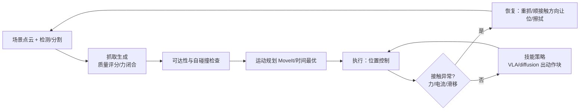

# 🦾 灵巧操作：抓取、接触与触觉

> **一句话**：操作是具身智能里最难也最值钱的一块——难点不在「抓住」，而在「接触丰富」：滑、卡、变形、遮挡同时发生时，纯视觉策略会立刻失去对世界的把握，力/触觉与恢复行为才是分水岭。
> **难度**：⭐️⭐️ 进阶
> **标签**：`#embodied-ai` `#application`

## 📌 先看结论

- **抓取 ≠ 操作**：抓取是「让物体跟着夹爪走」，可操作物品研究（Object Manipulation）是「让物体相对夹爪动」（转笔、调姿态、开盖）。后者才需要力控与多指。
- **两条技术路线在合流**：解析式（抓取质量评估、力闭合、GraspNet/AnyGrasp 类抓取生成）负责「先能抓住」；学习式（VLA、diffusion/flow 策略）负责「抓完之后的连续操作」。生产系统一般串联使用。
- **接触任务必须有触觉或力信号**：插 USB、拧盖、按键、抽纸巾、折布——只靠视觉的失败率极高，因为关键信息（法向力、滑移、形变）不在像素里。
- **灵巧手是能力上限，也是可靠性下限**：多指带来姿态调整能力，也带来机械磨损、标定漂移、控制复杂度。评估「值不值得上灵巧手」的唯一办法是先跑夹爪基线。

## 🧩 任务分级

| 级别 | 任务例 | 需要的能力 | 当前成熟度 |
|---|---|---|---|
| L1 平移搬运 | 捡杯子放桌上 | 视觉抓取 + 位置控制 | 🟢 商用（分拣/上下料） |
| L2 半固定操作 | 开抽屉、按开关、推门 | 接触 + 力限幅 + 策略鲁棒 | 🟢 演示稳定，落地需调 |
| L3 姿态调整 | 手内翻转、插入销钉、对齐 | 多指 / 力控 / 精细反馈 | 🟡 实验室可靠、产线苛刻 |
| L4 柔性与可变形物 | 叠衣、装袋、线缆、食物处理 | 形变建模 + 视觉-力融合 | 🟠 数据驱动 + 大量演示 |
| L5 工具使用与双手协调 | 用剪刀、托盘递物、双手传接 | 长时序规划 + 双手同步 | 🟠 前沿演示 |

## ⚙️ 一个可落地的操作栈



**关键工程点**

1. **抓取要带「可操作性」约束**：不只是抓到，还要抓完能干活——留出视线、避开把手、避免遮挡手腕相机。把「后续动作」写进抓取评分。
2. **接触检测要便宜**：用电流/力矩残差（期望力矩与实测之差）做碰撞与滑移检测，比装六维力传感器便宜得多，且足够触发重规划。
3. **柔顺优于精准**：插入类任务用阻抗控制（低刚度沿接触方向、高刚度沿法向）比「毫米级轨迹规划」更容易成功。
4. **恢复动作要专门采数据**： slip 后重新收紧、抓歪后重抓、卡住后退回——这些「纠错片段」占演示数据的 10–30% 才可能学会恢复（对应数字 Agent 里的失败样本回流，见 [数据引擎](data-engine.md)）。

## 💻 抓取 + 柔顺插入的最小骨架

```python
import numpy as np

def grasp_and_insert(obj, target, arm, hand):
    # 1) 抓取候选评分：接触质量 + 抓取后可操作空间（相机可见 + 无自碰撞）
    cands = hand.propose_grasps(obj, k=128)
    cands = [g for g in cands if arm.ik_reachable(g.pre_grasp) and not arm.self_collision(g)]
    g = max(cands, key=lambda g: g.quality * g.visibility_score * g.clearance_score)

    arm.move_to(g.pre_grasp, speed="safe")        # 接近段慢
    hand.close(force_limit=25)                     # 力限幅，别夹碎
    arm.move_to(g.grasp, speed="creep")

    # 2) 插入段：XY 柔顺（低刚度），Z 位置控制 + 力监控
    arm.set_impedance(xy_stiffness=80, z_stiffness=4000)     # N/m
    while (d := target.pose - arm.tcp_pose).norm() > 2e-3:
        arm.vel_cmd(d.direction * 0.02 + wbc.search_term(wobble=3e-3))  # 抖动搜索
        if abs(ft.fz()) > 40:                      # 顶死了
            arm.retrace(dt=0.15); arm.rotate_yaw(0.03)   # 回退 + 微旋 = 经典对齐策略
        if hand.slip_detected():
            hand.regrasp(); continue
    hand.open(); return True
```

> ✅ **最佳实践**：把「回退 + 旋转 + 再试」这类人类操作直觉写进控制层，让策略只需学「什么时候触发」，不必自己从零学出机械常识。这叫残差/技能组合，比端到端硬学省一个量级的数据。

## 🍜 生活类比

纯视觉策略像「闭着眼睛按记忆拧钥匙」；力/触觉反馈是手指上的感觉——钥匙卡住时你会本能地前后轻晃、稍微提一点、换个角度再进。机器人要的就是这套「手感 + 微操反射」，而且它得比人更快（毫秒级）。

## 📦 工程现场笔记

- **夹爪先跑通，再谈灵巧手**：二指平行夹爪覆盖绝大多数桌面任务；三指/五指手带来的增益集中在「需要手内调整姿态」与「工具使用」上，代价是维护与标定复杂度大幅上升。产线现场常见结论是「夹爪 + 工装/吸盘」更可靠。
- **触觉传感器定位**：视触融合（GelSight 类光学触觉）在「滑移检测、边缘定位、表面纹理」上有独特价值，但当前主要瓶颈是数据稀缺与部署鲁棒性（污染、磨损、标定）。
- **吸盘被严重低估**：在平整表面（玻璃、纸箱、钣金、屏幕）上，吸盘的可靠性、速度与容错常优于夹爪，是工业落地的默认选项之一。
- **双臂的价值在「传递与稳定」**：一手扶容器一手操作，成功率提升明显（这也是 ALOHA 系列选双臂的原因之一）。但需要处理双手时序耦合，控制复杂度不低。
- **失败模式要写成清单**：抓空、抓偏、夹碎、滑落、卡住、把别的物体带起来、放到错误位置——每一条都要有检测信号与恢复动作，这就是操作系统的「运营手册」。

## ⚠️ 常见误区

- ❌ 用「单一桌面 + 单一光照」评操作策略：换个杯子和桌布就崩，分数毫无意义
- ❌ 追求「零样本抓任何物体」而忽略抓取后不可操作：抓得住但挡住了相机/够不到目标 = 任务失败
- ❌ 力阈值设太保守 → 永远在「柔顺退让」，任务做不完；要按物体强度与接触类型分档
- ❌ 把触觉当锦上添花的数据源却不进训练：真机数据没触觉，策略上线时那路输入只能是噪声
- ❌ 忽略机械维护对精度的影响：皮带张紧、齿轮背隙、夹爪橡胶磨损都会让标定漂移，评估要按「维护周期」记录

## 🧪 小练习

选一个日常任务（推荐「把 USB 插进电脑」或「拧开矿泉水盖」），列出：① 需要哪些传感量（含最便宜的替代方案）；② 三种典型失败模式与检测信号；③ 你愿意为「恢复行为」采集多少条纠错演示。做完这三问，你会发现任务定义比模型选择重要得多。

## 🔗 相关资源

- [ALOHA / ACT](https://arxiv.org/abs/2304.13705)、[Mobile ALOHA](https://arxiv.org/abs/2401.02117)、[Diffusion Policy](https://arxiv.org/abs/2303.04137)、[UMI](https://arxiv.org/abs/2402.10329)
- 抓取方向：[GraspNet](https://graspnet.net/)、[AnyGrasp](https://github.com/grasp-lyrl/AnyGrasp)；OpenAI 手内旋转：[Learning Dexterous In-Hand Manipulation](https://arxiv.org/abs/1808.00177)

## 📚 相关知识点

- [VLA 模型架构](vla-models.md)
- [动作表示与分层控制](action-representation-control.md)
- [人形与腿足运动](humanoid-locomotion.md)
- [硬件、实时与安全](hardware-realtime-safety.md)
