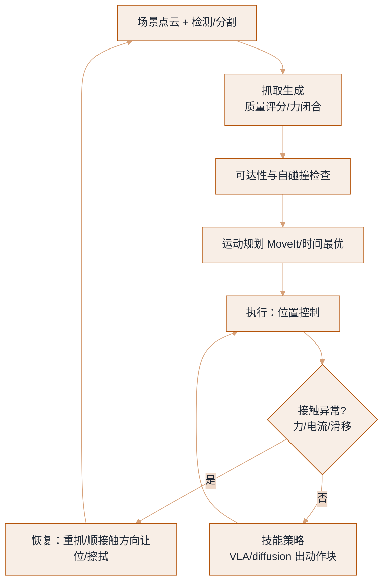
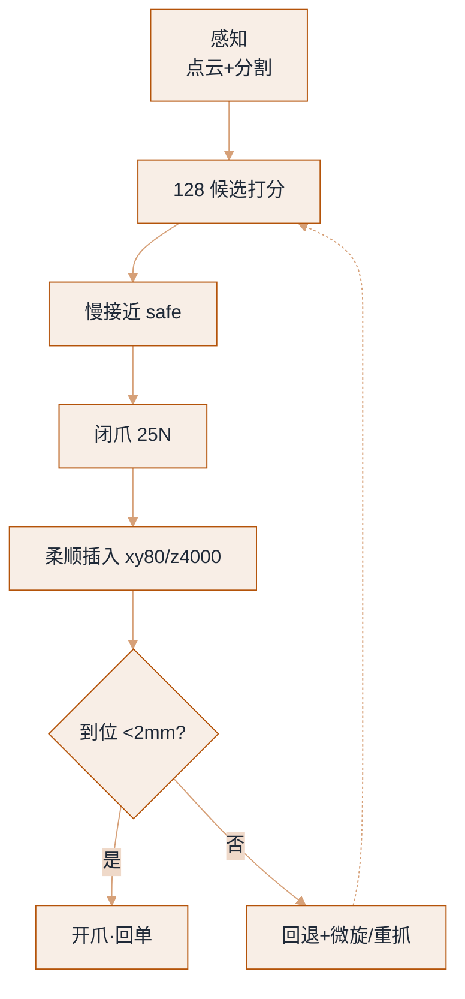

# 灵巧操作：抓取、接触与触觉


**一句话**：操作是具身智能里最难也最值钱的一块——难点不在「抓住」，而在「接触丰富」：滑、卡、变形、遮挡同时发生时，纯视觉策略会立刻失去对世界的把握，力/触觉与恢复行为才是分水岭。
  **难度**： 进阶


## 先看结论

- **抓取 ≠ 操作**：抓取是「让物体跟着夹爪走」，可操作物品研究（Object Manipulation）是「让物体相对夹爪动」（转笔、调姿态、开盖）。后者才需要力控与多指。
- **两条技术路线在合流**：解析式（抓取质量评估、力闭合、GraspNet/AnyGrasp 类抓取生成）负责「先能抓住」；学习式（VLA、diffusion/flow 策略）负责「抓完之后的连续操作」。生产系统一般串联使用。
- **接触任务必须有触觉或力信号**：插 USB、拧盖、按键、抽纸巾、折布——只靠视觉的失败率极高，因为关键信息（法向力、滑移、形变）不在像素里。
- **灵巧手是能力上限，也是可靠性下限**：多指带来姿态调整能力，也带来机械磨损、标定漂移、控制复杂度。评估「值不值得上灵巧手」的唯一办法是先跑夹爪基线。

## 任务分级

| 级别 | 任务例 | 需要的能力 | 当前成熟度 |
|---|---|---|---|
| L1 平移搬运 | 捡杯子放桌上 | 视觉抓取 + 位置控制 |  商用（分拣/上下料） |
| L2 半固定操作 | 开抽屉、按开关、推门 | 接触 + 力限幅 + 策略鲁棒 |  演示稳定，落地需调 |
| L3 姿态调整 | 手内翻转、插入销钉、对齐 | 多指 / 力控 / 精细反馈 |  实验室可靠、产线苛刻 |
| L4 柔性与可变形物 | 叠衣、装袋、线缆、食物处理 | 形变建模 + 视觉-力融合 |  数据驱动 + 大量演示 |
| L5 工具使用与双手协调 | 用剪刀、托盘递物、双手传接 | 长时序规划 + 双手同步 |  前沿演示 |

## 一个可落地的操作栈



*《图：位置控制后必过接触异常闸门——力/电流/滑移任一异常就重抓、让位并回退到重感知；无异常才交给 VLA 出动作块》*

**关键工程点**

1. **抓取要带「可操作性」约束**：不只是抓到，还要抓完能干活——留出视线、避开把手、避免遮挡手腕相机。把「后续动作」写进抓取评分。
2. **接触检测要便宜**：用电流/力矩残差（期望力矩与实测之差）做碰撞与滑移检测，比装六维力传感器便宜得多，且足够触发重规划。
3. **柔顺优于精准**：插入类任务用阻抗控制（低刚度沿接触方向、高刚度沿法向）比「毫米级轨迹规划」更容易成功。
4. **恢复动作要专门采数据**： slip 后重新收紧、抓歪后重抓、卡住后退回——这些「纠错片段」占演示数据的 10–30% 才可能学会恢复（对应数字 Agent 里的失败样本回流，见 [数据引擎](data-engine.md)）。

## 抓取 + 柔顺插入：一份可执行的配方

一次「抓取 + 柔顺插入」能写成一份数据契约：抓取候选的打分权重、接近/闭爪的速度档、插入段的阻抗刚度与力阈值。下面这份 JSON 就是控制层真正读的配方——把「人类操作直觉」固化成参数，策略只需学「什么时候触发」。

```json
{
  "grasp_planning": {
    "candidates_k": 128,
    "filters": ["ik_reachable(pre_grasp)", "not self_collision(grasp)"],
    "score": "quality * visibility_score * clearance_score",
    "approach_speed": "safe",
    "grasp_speed": "creep",
    "close_force_limit_n": 25
  },
  "insertion_control": {
    "impedance_stiffness_n_per_m": { "xy": 80, "z": 4000 },
    "pos_tol_m": 0.002,
    "feed_vel_m_per_s": 0.02,
    "wobble_search_m": 0.003,
    "fz_stop_n": 40,
    "retrace_dt_s": 0.15,
    "rotate_yaw_rad": 0.03,
    "on_slip": "regrasp"
  },
  "signals": ["ft.fz", "hand.slip_detected", "arm.tcp_pose", "target.pose"]
}
```

关键在**各向异性的阻抗**：`xy` 方向压到 `80 N/m`（软，孔没对准能横向滑进去），`z` 方向拉到 `4000 N/m`（硬，进给位移精确）。`fz_stop_n=40` 是「顶死了」的判据，`rotate_yaw_rad=0.03` 配合 `retrace_dt_s=0.15` 就是经典对齐策略：回退 0.15 秒 + 微旋 0.03 弧度再进。

### 一次抓取到回单（分步演示）



*《图：抓取不是一步——128 候选按可操作性打分，插入段力顶死则回退微旋、滑移则重抓，只有到位<2mm 才开爪回单》*




#### 第 1 步：生成并过滤抓取候选

`propose_grasps(obj, k=128)` 出 128 个候选，过两道硬筛：`ik_reachable(pre_grasp)`（够得到）和 `not self_collision`（不撞自己）。剩下的按 `quality * visibility_score * clearance_score` 取最高——把「抓完还能干活」（看得见、不挡手腕相机）写进评分，而不只是抓得稳。




#### 第 2 步：慢接近 + 限力闭爪

先 `move_to(pre_grasp, speed="safe")` 慢速接近，`close(force_limit_n=25)` 限力闭爪防夹碎，再 `move_to(grasp, speed="creep")` 蠕行确认咬合。接近段快=危险，闭爪力大=夹碎，这两处最容易被忽略。




#### 第 3 步：切到柔顺插入

`set_impedance(xy=80, z=4000 N/m)`：横向软、进给硬。沿目标方向以 `feed_vel=0.02 m/s` 推进，叠加 `wobble_search=0.003 m` 的抖动搜索（±3mm 微晃找孔），直到 `‖target.pose − tcp_pose‖ < 0.002 m`。




#### 第 4 步：顶死了就回退微旋

`ft.fz > 40 N` 判定卡死：`retrace(dt=0.15)` 退回 0.15 秒、`rotate_yaw(0.03)` 微旋再进——这是把「对准插口」的人类直觉写进控制层，让策略不必从零学出机械常识。




#### 第 5 步：滑移重抓，到位开爪

`slip_detected()` 命中 → `regrasp` 重来。只有走到 `<2mm` 容差内才 `hand.open()` 并回单。**回单要带证据**（实测 `fz` 峰值、耗时、是否触发过恢复），和 [把 Agent 接进机器人](agent-to-robot-bridge.md) 的 `ok + reason + evidence` 是同一套接口。




### 三种典型失败，三条恢复（点标签切换）



信号：`ft.fz > 40 N`、位移不再前进。恢复：`retrace(0.15)` + `rotate_yaw(0.03)` 微旋对齐，连续顶死多次才放弃。这属于对齐问题，硬顶只会刮伤零件。



信号：`hand.slip_detected()`（触觉阵列或电流残差检测到物体在指间动）。恢复：`regrasp` 重新收紧或换候选。纯视觉看不到滑移——关键信息（法向力、滑移）不在像素里。



信号：闭爪到底 `gripper_open≈0` 却没负载，或抬升后位姿和预期差一截。恢复：退回重感知、从 128 候选里取次优，别在同一路径重试。这类占失败大头，是「纠错演示数据要占 10–30%」的来源（见 [数据引擎](data-engine.md)）。




> ✅ **最佳实践**：把「回退 + 旋转 + 再试」这类人类操作直觉写进控制层，让策略只需学「什么时候触发」，不必自己从零学出机械常识。这叫残差/技能组合，比端到端硬学省一个量级的数据。

## 生活类比

纯视觉策略像「闭着眼睛按记忆拧钥匙」；力/触觉反馈是手指上的感觉——钥匙卡住时你会本能地前后轻晃、稍微提一点、换个角度再进。机器人要的就是这套「手感 + 微操反射」，而且它得比人更快（毫秒级）。

## 工程现场笔记

- **夹爪先跑通，再谈灵巧手**：二指平行夹爪覆盖绝大多数桌面任务；三指/五指手带来的增益集中在「需要手内调整姿态」与「工具使用」上，代价是维护与标定复杂度大幅上升。产线现场常见结论是「夹爪 + 工装/吸盘」更可靠。
- **触觉传感器定位**：视触融合（GelSight 类光学触觉）在「滑移检测、边缘定位、表面纹理」上有独特价值，但当前主要瓶颈是数据稀缺与部署鲁棒性（污染、磨损、标定）。
- **吸盘被严重低估**：在平整表面（玻璃、纸箱、钣金、屏幕）上，吸盘的可靠性、速度与容错常优于夹爪，是工业落地的默认选项之一。
- **双臂的价值在「传递与稳定」**：一手扶容器一手操作，成功率提升明显（这也是 ALOHA 系列选双臂的原因之一）。但需要处理双手时序耦合，控制复杂度不低。
- **失败模式要写成清单**：抓空、抓偏、夹碎、滑落、卡住、把别的物体带起来、放到错误位置——每一条都要有检测信号与恢复动作，这就是操作系统的「运营手册」。

## 常见误区

- ❌ 用「单一桌面 + 单一光照」评操作策略：换个杯子和桌布就崩，分数毫无意义
- ❌ 追求「零样本抓任何物体」而忽略抓取后不可操作：抓得住但挡住了相机/够不到目标 = 任务失败
- ❌ 力阈值设太保守 → 永远在「柔顺退让」，任务做不完；要按物体强度与接触类型分档
- ❌ 把触觉当锦上添花的数据源却不进训练：真机数据没触觉，策略上线时那路输入只能是噪声
- ❌ 忽略机械维护对精度的影响：皮带张紧、齿轮背隙、夹爪橡胶磨损都会让标定漂移，评估要按「维护周期」记录

## 小练习

选一个日常任务（推荐「把 USB 插进电脑」或「拧开矿泉水盖」），列出：① 需要哪些传感量（含最便宜的替代方案）；② 三种典型失败模式与检测信号；③ 你愿意为「恢复行为」采集多少条纠错演示。做完这三问，你会发现任务定义比模型选择重要得多。

## 参考资料

- [ALOHA / ACT](https://arxiv.org/abs/2304.13705)、[Mobile ALOHA](https://arxiv.org/abs/2401.02117)、[Diffusion Policy](https://arxiv.org/abs/2303.04137)、[UMI](https://arxiv.org/abs/2402.10329)
- 抓取方向：[GraspNet](https://graspnet.net/)、[AnyGrasp SDK](https://github.com/graspnet/anygrasp_sdk)；OpenAI 手内旋转：[Learning Dexterous In-Hand Manipulation](https://arxiv.org/abs/1808.00177)

## 相关知识点

- [VLA 模型架构](vla-models.md)
- [动作表示与分层控制](action-representation-control.md)
- [人形与腿足运动](humanoid-locomotion.md)
- [硬件、实时与安全](hardware-realtime-safety.md)

