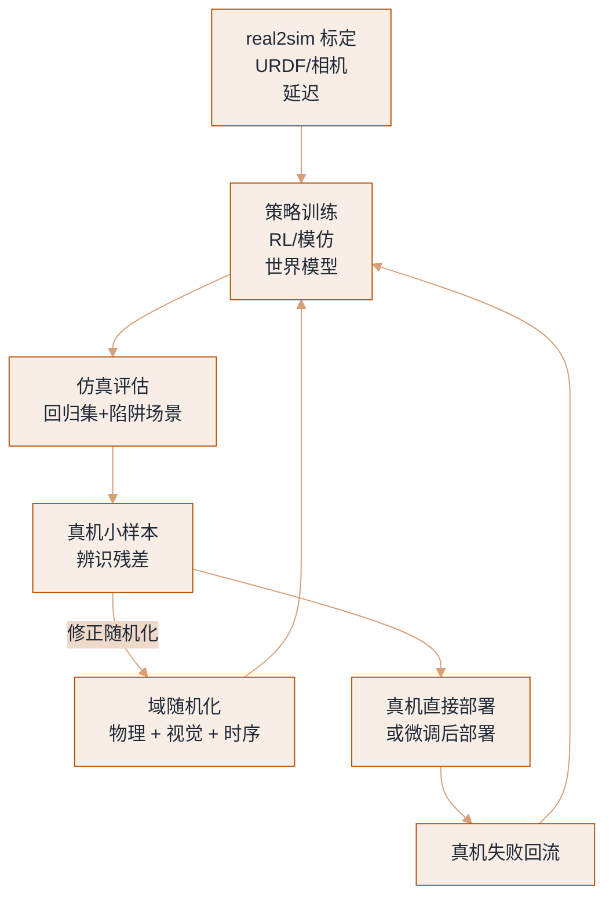
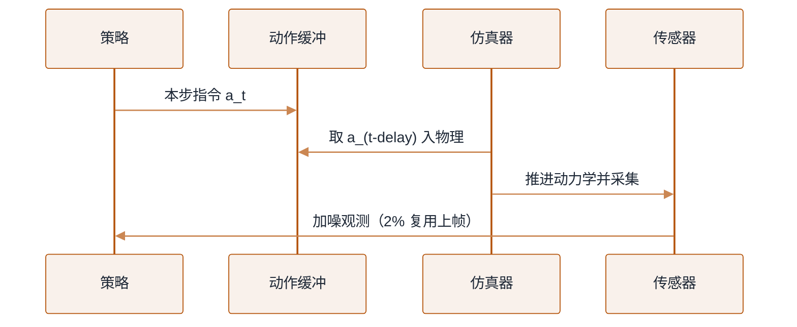

# 仿真与 Sim-to-Real


**一句话**：仿真的价值不是「便宜地刷分」，而是给你一台可以无限快进、能设陷阱、能量化不确定性的时间机器——真正难的是把「仿真里的 95%」变成「真机上的 60%」，而域随机化（domain randomization）与 real2sim 标定是两座最常见的桥。
  **难度**： 高级


## 先看结论

- **三种用途别混为一谈**：① 大规模并行强化学习（要的是吞吐）；② 演示/评估与回归测试（要的是可复现）；③ 合成数据生成（要的是视觉真实度）。同一仿真器在三件事上的取舍完全不同。
- **接触是硬问题**：刚体求解器的接触顺序、软接触（织物、海绵、线缆）、摩擦系数不确定、流体与颗粒——这些直接决定 sim-to-real 差距的量级。
- **域随机化是「分布训练」**：把重力、摩擦、质量、时延、相机曝光、光照、标定误差全部随机化，让策略在「一个分布」上收敛，而不是「一个场景」上收敛。随机化范围要按真机实测来定，不能凭感觉。
- **real2sim 先做，再谈随机化**：URDF 精度（连杆质量、惯量、摩擦）、相机内外参、延迟与控制接口的仿真复现，收益常常大于换仿真器。
- **仿真成功率不能当验收指标**：它是「相对提升的度量」和「回归门禁」，绝对值要靠真机评测协议来定（见 [评估与基准](evaluation-benchmarks.md)）。

## 迁移路径



*《图：底部两组数是全章最该记住的一页：无随机化 95%→35%，只随机化视觉仍 88%→52%——动力学失配不会被更好的贴图救回来》*


*《图：真机小样本辨识残差有两条出口——一条改域随机化的分布范围，一条放行部署；部署后的失败再回流策略训练》*

## 仿真器选择

| 仿真器 | 强项 | 弱项 | 适合 |
|---|---|---|---|
| MuJoCo（含 MJX） | 接触与关节动力学稳、API 简洁；MJX 可 GPU 批量 | 渲染与传感器拟真需要外挂 | RL、控制研究、软接触基础实验 |
| Isaac Sim / Isaac Lab | 大规模并行、渲染真实（RTX）、传感器与 ROS 桥接完整 | 显存与运维门槛高、许可与硬件绑定 | 大规模 RL、合成数据、人形全身 |
| Genesis | 纯 Python、宣称极高并行吞吐、生成式场景 | 新项目，功能与稳定性仍在快速迭代 | 快速起实验、需要大规模并行的团队 |
| SAPIEN / ManiSkill3 | 操作类任务、GPU 并行、脚本化真值丰富 | 生态相对小 | 抓取/操作基准与模仿学习 |
| PyBullet | 上手快、文档多 | 精度与吞吐都不占优，逐步退居二线 | 教学、原型验证 |
| 真实机器人数字孪生（自研） | 与你的硬件/控制器完全一致（含延迟） | 开发成本 | 产品化阶段的回归测试 |

> ⚠ **注意**：各家「比某仿真快 N 倍」的数字几乎都在特定场景下测得（如大量并行的关节跟踪）。要在**你的任务 + 你的并行度**上重测，再决定迁移成本。

## 域随机化实操清单

**物理侧**

- 质量/惯量 ±20–50%；摩擦系数 [0.3, 1.2]（按物体类别分档）；阻尼与恢复系数
- **执行器延迟随机化**：20–200ms（关键！）+ 一阶滞后 + 力矩上限
- 未建模负载：杯子里有水、夹爪上挂了线、手持物重量变化
- 地面/桌面倾斜、关节零位偏移（模拟长期使用）

**视觉侧**

- 光照方向与强度、色温、HDR 环境贴图轮换
- 材质/纹理/颜色随机（尤其桌面与容器），保持「语义颜色」可用（不要让「蓝色杯子」的蓝也随机掉——那会毁掉语言条件）
- 相机内外参抖动 ±几度、曝光/噪声/运动模糊、随机遮挡物
- 渲染器与真机 ISP 差距：加噪声 + 轻微去饱和，让真机图看起来「像仿真」而不是反过来

**状态与传感侧**

- 本体感受噪声（IMU 偏置、编码器量化）、力矩估计误差
- 深度图失效区、反光物体假深度、相机丢帧
- 观测频率与真机一致（例：30Hz 相机 + 50Hz 控制，不要给策略 200Hz 的完美观测）

**训练侧**

- 随机化课程：先窄后宽（否则早期学不动）
- 每 episode 固定一组随机参数（不要每步都变，那会让策略学不到一致性）
- 显式做「辨识头」或输入随机化种子，让策略能感知当前域

## 把真机延迟与噪声注入训练（一份随机化契约）

「注入延迟与噪声」这件事的全部参数，写死在下面这份随机化契约里。它规定了每个 episode 从哪个区间抽一组物理量、动作要延迟几步、观测噪声多大、丢帧怎么处理——训练侧和评估侧读同一份，才不会出现「训练时延迟 6 步、评估时当没延迟」。

```json
{
  "per_episode_randomization": {
    "joint_damping": { "dist": "uniform", "low": 0.5, "high": 3.0 },
    "gripper_friction": { "dist": "uniform", "low": 0.2, "high": 1.0 },
    "action_delay_steps": { "dist": "integer", "low": 1, "high": 10, "at_hz": 50, "equiv_ms": [20, 200] },
    "obs_noise_std": { "dist": "uniform", "low": 1e-4, "high": 8e-4 },
    "camera_extrinsics_jitter": { "dist": "normal", "sigma": 0.01, "dof": 6, "note": "标定误差" }
  },
  "sensor": {
    "frame_drop_prob": 0.02,
    "on_drop": "reuse_last_good_obs"
  },
  "apply_rule": "每 episode 抽一组、episode 内固定；不要每个控制步重设"
}
```

三个要点藏在数值里：**`action_delay_steps` 1–10 步在 50Hz 下就是 20–200ms**，这是最关键的一项——不随机化延迟，策略会当成「指令立即生效」，真机上必然过冲；**`obs_noise_std` 到 8e-4、`camera_extrinsics` 抖 6 自由度 σ=0.01** 复现的是标定误差与传感器噪声；**`frame_drop_prob` 0.02（2% 丢帧）要显式「复用上一好帧」**，否则策略学到的是「永远有新观测」这个真机不成立的假设。

## 分步演示：一次带延迟与噪声的 `env.step`



*《图：推进的是 `delay_steps` 之前的旧动作，喂回策略的是加了 std 噪声、还可能复用上帧的观测——延迟和噪声分别卡在回路的进与出》*




#### 第 1 步：指令先进缓冲，不立即生效

策略在 t 步吐出动作 `a_t`，写进动作缓冲；真正推给仿真器的是 `a_(t-action_delay_steps)`——即本 episode 开头抽到的那一档延迟（1–10 步）。这一步模拟的是通信与控制栈的真实滞后，50Hz 下等价 20–200ms。




#### 第 2 步：推进物理，采集原始观测

用旧动作把动力学往前积分一步，`joint_damping`（0.5–3.0）与 `gripper_friction`（0.2–1.0）都取本 episode 固定的那一组，相机按抖动过的外参（σ=0.01）成像。episode 内不变，策略才能从一致物理里学出可迁移的规律。




#### 第 3 步：给观测叠噪声

原始观测 `obs_raw` 加上均值为 0、std 落在 1e-4~8e-4 的高斯噪声，复现 IMU 偏置、编码器量化与力矩估计误差。给「完美观测」等于骗策略——真机永远拿不到干净值。




#### 第 4 步：按 2% 概率丢帧并复用

每步以 `frame_drop_prob=0.02` 判定是否丢帧；丢了就把上一好帧顶上来，而不是喂零或跳过。策略因此学会「这帧可能没更新」的鲁棒性，而不是假设传感器帧帧必到。




#### 第 5 步：交给策略，episode 结束重抽一组

带延迟、带噪、可能复用的观测喂回策略进入下一步；episode 结束时重抽整组随机参数。判据很简单：去掉延迟评估若明显变差，说明策略真利用了延迟建模（好兆头）；完全没差别，多半是随机化幅度小于真机实际抖动，回去量真机。



## 各项随机化各自救什么、不救什么（点标签切换）



换纹理、换光照、换相机内外参，仿真里看着很鲁棒，但真机一碰就倒——这类失配的典型量级是 **88%→52%**。动力学从头到尾没变过，策略从未学过「摩擦/延迟变了怎么办」。视觉随机化救不了动力学失配，更好的贴图补不回这个 gap。



`gripper_friction` [0.2, 1.0]、质量/惯量 ±20–50% 一起抖。抓到滑、推到位就停，策略被迫用更保守的力与更大的抓握裕度。随机化范围要按真机实测分布来定，凭感觉放宽只会浪费训练、真机仍失配。



把 `action_delay_steps` 从 1 抖到 10（20–200ms），策略学会「下指令要留提前量」。判据同上一节：训练里去掉延迟评估会变差，正是策略真用了延迟建模的证据——这是唯一能靠随机化直接消灭的一类 sim-to-real bug。



对照组：单场景收敛，仿真 **95%**，上真机 **35%**。这是全章最该记住的一页——策略利用了仿真器的数值缺陷（靠穿透做抓取、靠完美接触抓稳），一旦真机没有这些缺陷就全线崩。域随机化的意义就是把「一个场景」变成「一个分布」。



**判据**：如果你发现「仿真里去掉延迟评估会明显变差」，说明策略已利用了延迟建模——这是好兆头。若完全没差别，多半是你的随机化幅度小于真机实际抖动，去量一遍真机。

## 工程现场笔记

- **SimplerEnv 思路值得抄进内部工具链**：把真机评测「搬到仿真里」——用与真机相同的初始状态、相同的相机视角与动作接口，在仿真里跑上千个 rollout 估计成功率，再抽样真机验证。这比「每改一版就手工测 20 次」快两个数量级。
- **软体与线缆是能力分界线**：织物、绳、液体的仿真误差比刚体大一个量级；相关任务（叠衣、插线）常需真机数据为主。
- **合成数据用于「视觉预训练」最划算**：仿真图像 + 真值标签做检测/分割/深度/关键点，比直接生成动作标签更可靠。
- **接触密集任务的 sim 残差用「真机数据微调」补**：仿真预训练 + 少量真机（几十到几百条）微调，是当前把 sim-to-real 差距压下去的现实路径。
- **别用仿真给安全论证背书**：急停响应、力上限、噪声下的行为，只能在真机上按标准流程测（→ [硬件、实时与安全](hardware-realtime-safety.md)）。

## 常见误区

- ❌ 「仿真分高 → 真机会好」：策略可能利用仿真器的数值缺陷（例如靠穿透做抓取、靠完美接触抓住）。要做「陷阱测试」：故意扰动、故意改摩擦，看它是否崩
- ❌ 随机化范围凭感觉：应从真机测量得到（摩擦、延迟、噪声的实测分布），否则训练浪费 + 真机仍失配
- ❌ 只随机化视觉不随机化动力学：视觉鲁棒了，但一碰就倒——因为动力学从未变过
- ❌ 每个控制步重设物理参数：策略无法从「不断漂移的物理」中学习，episode 内要固定
- ❌ 忽略 URDF 精度：连杆惯量填 0、夹爪质量漏算，仿真器再强也没用
- ❌ 拿别人仿真分数对比：任务定义、随机化、并行度、成功判据不同，数字不可比

## 小练习

在 MuJoCo 或 Isaac Lab 里做「一次迁移实验」：① 训一个抓立方体的策略（无任何随机化）；② 加入视觉随机化；③ 加入动力学 + 延迟随机化。然后分别报告：仿真成功率、换纹理后的仿真成功率、真机（或高保真渲染）成功率。三次数字的差值就是你的 sim-to-real gap 拆解。

## 参考资料

- [MuJoCo / MJX](https://mujoco.org/)、[Isaac Lab](https://github.com/isaac-sim/IsaacLab)、[Genesis](https://github.com/Genesis-Embodied-AI/Genesis)、[ManiSkill3](https://github.com/haosulab/ManiSkill)
- [域随机化原始论文（Tobin et al. 2017）](https://arxiv.org/abs/1703.06907)、[SimplerEnv](https://simpler-env.github.io/)

## 相关知识点

- [评估与基准](evaluation-benchmarks.md)
- [世界模型与视频预训练](world-models-video.md)
- [数据引擎](data-engine.md)
- [VLA 模型架构](vla-models.md)

