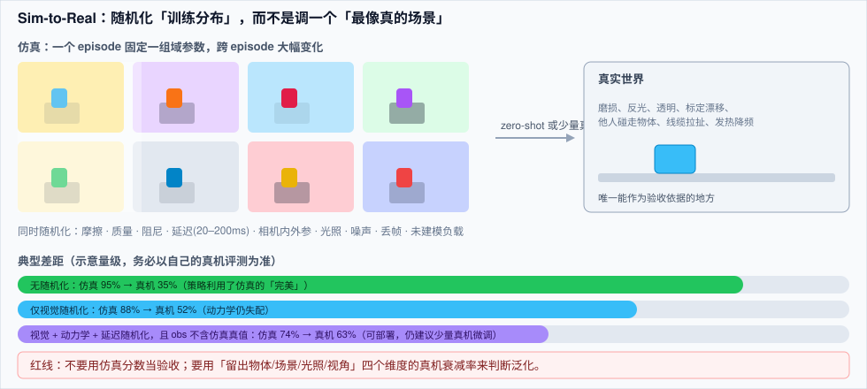
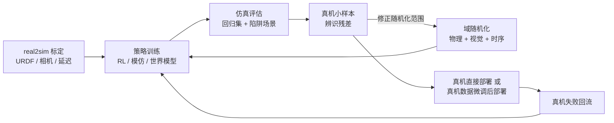

# 🦾 仿真与 Sim-to-Real

> **一句话**：仿真的价值不是「便宜地刷分」，而是给你一台可以无限快进、能设陷阱、能量化不确定性的时间机器——真正难的是把「仿真里的 95%」变成「真机上的 60%」，而域随机化（domain randomization）与 real2sim 标定是两座最常见的桥。
> **难度**：⭐️⭐️⭐️ 高级
> **标签**：`#embodied-ai` `#evaluation`

## 📌 先看结论

- **三种用途别混为一谈**：① 大规模并行强化学习（要的是吞吐）；② 演示/评估与回归测试（要的是可复现）；③ 合成数据生成（要的是视觉真实度）。同一仿真器在三件事上的取舍完全不同。
- **接触是硬问题**：刚体求解器的接触顺序、软接触（织物、海绵、线缆）、摩擦系数不确定、流体与颗粒——这些直接决定 sim-to-real 差距的量级。
- **域随机化是「分布训练」**：把重力、摩擦、质量、时延、相机曝光、光照、标定误差全部随机化，让策略在「一个分布」上收敛，而不是「一个场景」上收敛。随机化范围要按真机实测来定，不能凭感觉。
- **real2sim 先做，再谈随机化**：URDF 精度（连杆质量、惯量、摩擦）、相机内外参、延迟与控制接口的仿真复现，收益常常大于换仿真器。
- **仿真成功率不能当验收指标**：它是「相对提升的度量」和「回归门禁」，绝对值要靠真机评测协议来定（见 [评估与基准](evaluation-benchmarks.md)）。

## 🖼️ 迁移路径





## 🧩 仿真器选择

| 仿真器 | 强项 | 弱项 | 适合 |
|---|---|---|---|
| MuJoCo（含 MJX） | 接触与关节动力学稳、API 简洁；MJX 可 GPU 批量 | 渲染与传感器拟真需要外挂 | RL、控制研究、软接触基础实验 |
| Isaac Sim / Isaac Lab | 大规模并行、渲染真实（RTX）、传感器与 ROS 桥接完整 | 显存与运维门槛高、许可与硬件绑定 | 大规模 RL、合成数据、人形全身 |
| Genesis | 纯 Python、宣称极高并行吞吐、生成式场景 | 新项目，功能与稳定性仍在快速迭代 | 快速起实验、需要大规模并行的团队 |
| SAPIEN / ManiSkill3 | 操作类任务、GPU 并行、脚本化真值丰富 | 生态相对小 | 抓取/操作基准与模仿学习 |
| PyBullet | 上手快、文档多 | 精度与吞吐都不占优，逐步退居二线 | 教学、原型验证 |
| 真实机器人数字孪生（自研） | 与你的硬件/控制器完全一致（含延迟） | 开发成本 | 产品化阶段的回归测试 |

> ⚠️ **注意**：各家「比某仿真快 N 倍」的数字几乎都在特定场景下测得（如大量并行的关节跟踪）。要在**你的任务 + 你的并行度**上重测，再决定迁移成本。

## ⚙️ 域随机化实操清单

**物理侧**

- 质量/惯量 ±20–50%；摩擦系数 [0.3, 1.2]（按物体类别分档）；阻尼与恢复系数
- **执行器延迟随机化**：20–200ms（关键！）+ 一阶滞后 + 力矩上限
- 未建模负载：杯子里有水、夹爪上挂了线、手持物重量变化
- 地面/桌面倾斜、关节零位偏移（模拟长期使用）

**视觉侧**

- 光照方向与强度、色温、HDR 环境贴图轮换
- 材质/纹理/颜色随机（尤其桌面与容器），保持「语义颜色」可用（不要让「蓝色杯子」的蓝也随机掉——那会毁掉语言条件）
- 相机内外参抖动 ±几度、曝光/噪声/运动模糊、随机遮挡物
- 渲染器与真机 ISP 差距：加噪声 + 轻微去饱和，让真机图看起来「像仿真」而不是反过来

**状态与传感侧**

- 本体感受噪声（IMU 偏置、编码器量化）、力矩估计误差
- 深度图失效区、反光物体假深度、相机丢帧
- 观测频率与真机一致（例：30Hz 相机 + 50Hz 控制，不要给策略 200Hz 的完美观测）

**训练侧**

- 随机化课程：先窄后宽（否则早期学不动）
- 每 episode 固定一组随机参数（不要每步都变，那会让策略学不到一致性）
- 显式做「辨识头」或输入随机化种子，让策略能感知当前域

## 💻 把真机延迟与噪声注入训练（最小实现）

```python
import numpy as np

def randomize_world(rng, task):
    p = task.params
    p.damping[task.joints] = rng.uniform(0.5, 3.0)
    p.gripper_friction = rng.uniform(0.2, 1.0)
    p.action_delay_steps = int(rng.integers(1, 11))      # 50Hz 下 20–200ms
    p.obs_noise_std = rng.uniform(1e-4, 8e-4)
    p.camera_extrinsics += rng.normal(0, 0.01, size=6)  # 标定误差
    return p

def step_with_latency(env, policy_state, obs, p):
    env.push_action(obs_buffer[-1])          # 用的是 p.action_delay_steps 之前的动作
    obs_raw = env.capture()
    obs = obs_raw + np.random.randn(*obs_raw.shape) * p.obs_noise_std
    if rng.random() < 0.02:                  # 2% 丢帧 → 复用上一帧
        obs = last_good_obs
    return obs
```

**判据**：如果你发现「仿真里去掉延迟评估会明显变差」，说明策略已利用了延迟建模——这是好兆头。若完全没差别，多半是你的随机化幅度小于真机实际抖动，去量一遍真机。

## 📦 工程现场笔记

- **SimplerEnv 思路值得抄进内部工具链**：把真机评测「搬到仿真里」——用与真机相同的初始状态、相同的相机视角与动作接口，在仿真里跑上千个 rollout 估计成功率，再抽样真机验证。这比「每改一版就手工测 20 次」快两个数量级。
- **软体与线缆是能力分界线**：织物、绳、液体的仿真误差比刚体大一个量级；相关任务（叠衣、插线）常需真机数据为主。
- **合成数据用于「视觉预训练」最划算**：仿真图像 + 真值标签做检测/分割/深度/关键点，比直接生成动作标签更可靠。
- **接触密集任务的 sim 残差用「真机数据微调」补**：仿真预训练 + 少量真机（几十到几百条）微调，是当前把 sim-to-real 差距压下去的现实路径。
- **别用仿真给安全论证背书**：急停响应、力上限、噪声下的行为，只能在真机上按标准流程测（→ [硬件、实时与安全](hardware-realtime-safety.md)）。

## ⚠️ 常见误区

- ❌ 「仿真分高 → 真机会好」：策略可能利用仿真器的数值缺陷（例如靠穿透做抓取、靠完美接触抓住）。要做「陷阱测试」：故意扰动、故意改摩擦，看它是否崩
- ❌ 随机化范围凭感觉：应从真机测量得到（摩擦、延迟、噪声的实测分布），否则训练浪费 + 真机仍失配
- ❌ 只随机化视觉不随机化动力学：视觉鲁棒了，但一碰就倒——因为动力学从未变过
- ❌ 每个控制步重设物理参数：策略无法从「不断漂移的物理」中学习，episode 内要固定
- ❌ 忽略 URDF 精度：连杆惯量填 0、夹爪质量漏算，仿真器再强也没用
- ❌ 拿别人仿真分数对比：任务定义、随机化、并行度、成功判据不同，数字不可比

## 🧪 小练习

在 MuJoCo 或 Isaac Lab 里做「一次迁移实验」：① 训一个抓立方体的策略（无任何随机化）；② 加入视觉随机化；③ 加入动力学 + 延迟随机化。然后分别报告：仿真成功率、换纹理后的仿真成功率、真机（或高保真渲染）成功率。三次数字的差值就是你的 sim-to-real gap 拆解。

## 🔗 相关资源

- [MuJoCo / MJX](https://mujoco.org/)、[Isaac Lab](https://github.com/isaac-sim/IsaacLab)、[Genesis](https://github.com/Genesis-Embodied-AI/Genesis)、[ManiSkill3](https://github.com/haosulab/ManiSkill)
- [域随机化原始论文（Tobin et al. 2017）](https://arxiv.org/abs/1703.06907)、[SimplerEnv](https://simpler-env.github.io/)

## 📚 相关知识点

- [评估与基准](evaluation-benchmarks.md)
- [世界模型与视频预训练](world-models-video.md)
- [数据引擎](data-engine.md)
- [VLA 模型架构](vla-models.md)
