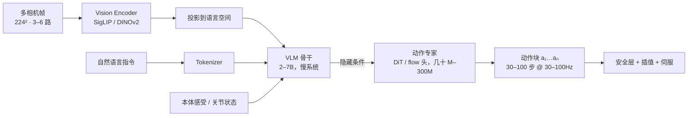
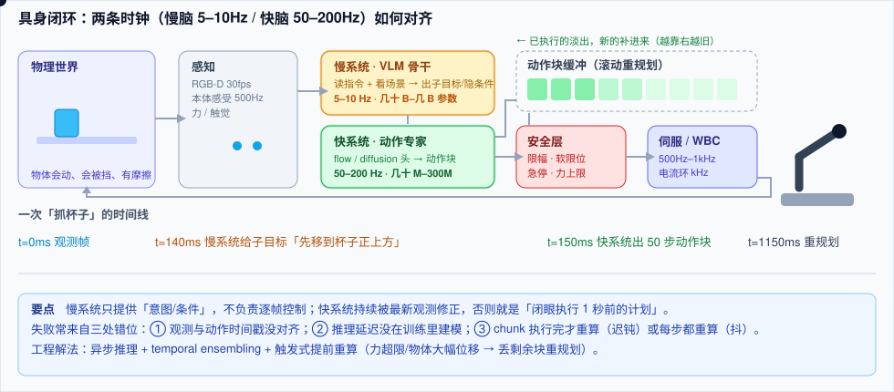

# VLA 模型架构：视觉—语言—动作怎么接起来

> **一句话**：VLA（Vision-Language-Action，视觉-语言-动作模型）= 预训练 VLM 的骨干 + 一个把隐藏状态变成连续动作的「动作专家」。模型能不能在真机上流畅干活，八成取决于这个动作专家的输出形式与频率。
> **难度**： 高级
> **标签**：`#embodied-ai` `#llm`

## 先看结论

- **三种动作头，各有各的债**：离散 token（复用 LLM 栈，但高频控制下 token 数爆炸、量化误差明显）；扩散去噪（平滑、能建模多模态，但推理慢、步数要调）；flow matching（介于二者，训练稳定、几步去噪即可出块，当前多数新工作在用）。
- **一次推理必须输出一段动作（action chunk）**：模型 5Hz、控制 50Hz，唯一优雅的补法是「预测未来 1 秒动作，滚动重规划」。chunk 越长越流畅但越不反应，越短越敏感但越容易抖。
- **多模态动作分布是真实存在的**：同一个观察，从左边抓和从右边抓都对。回归 MSE 会学出「两边平均 = 撞中间」，这就是扩散/流式方法有效的根本原因。
- **视觉 token 是显存黑洞**：多路相机 × 多帧 × ViT patch，很容易比语言 token 多一个量级；压缩（Q-Former、pixel shuffle、时间下采样）是工程必做项。

## 标准解剖图





## 各部件的设计选择

| 部件 | 常见选择 | 关键权衡 |
|---|---|---|
| 视觉编码 | SigLIP / PaliGemma 视觉塔、DINOv2（几何更强） | 语义 vs 空间精度；多相机要不要拼接成一张图 |
| 时序 | 单帧 / 最近 k 帧 / 视频编码 | 帧多 → 延迟与显存涨；帧少 → 遮挡时状态估计差 |
| 语言条件 | 指令 + 子目标（分层）+ CoT | 让模型显式输出「先打开抽屉」再执行，可解释性与鲁棒性都更好 |
| 状态输入 | 关节角、夹爪开口、末端位姿、力/力矩 | 归一化方式要和部署端完全一致（最常见的 bug 源） |
| 动作头 | 离散 token / MSE 回归 / 扩散 / flow matching | 见上；多模态分布必须用生成式头 |
| 动作空间 | 末端增量位姿 + 夹爪、关节位置、关节速度、力矩 | 见 [动作表示与分层控制](action-representation-control.md) |
| 分块长度 | 10–100 步（0.2–2 秒） | 长：流畅但迟钝；短：灵敏但抖；常见 50 步/1 秒 |
| 推理调度 | 同步（执行完整块）/ 异步（重叠推理与执行，temporal ensembling） | 异步能同时拿到高频与低延迟，代价是实现复杂度 |

## 动作头的三条实现路线（含代码骨架）

```python
# ① 离散 token：把每维动作量化成 bin，复用交叉熵 —— 简单、易训、难高频
BINS = 256
def to_tokens(action):                       # action: (T, D) in [-1, 1]
    return (action * 0.5 + 0.5) * (BINS - 1)
def from_tokens(tok):
    return tok / (BINS - 1) * 2 - 1
# 训练就是 next-token prediction；部署时按 D 维 × T 步逐个解码 → 慢

# ② 扩散头：条件去噪，能表达多模态分布
def diffusion_loss(h_cond, action_chunk):
    noise = torch.randn_like(action_chunk)
    t = torch.randint(0, K, (len(action_chunk),))
    noisy = q_sample(action_chunk, t, noise)            # 前向加噪
    return F.mse_loss(model(noisy, t, h_cond), noise)  # 预测噪声
# 推理需 K 次去噪（K=10–100），可用 DDIM/一致性蒸馏降步数

# ③ Flow matching：学一个速度场，把噪声推流到动作 —— 训练稳、少步可采样
def flow_loss(h_cond, a1):
    a0 = torch.randn_like(a1)
    u = torch.rand(len(a1), 1, 1, device=a1.device)
    a_u = u * a1 + (1 - u) * a0                 # 插值点
    v_target = a1 - a0                          # 目标速度场
    return F.mse_loss(v_net(a_u, u, h_cond), v_target)

@torch.no_grad()
def sample(h_cond, steps=10, dt=0.1):           # 欧拉积分，从噪声走到动作
    a = torch.randn(1, T, D, device=h_cond.device)
    for i in range(steps):
        a = a + v_net(a, i*dt, h_cond) * dt
    return a
```

> ✅ **最佳实践**：先用 ①/②/③ 中「最容易训的」跑通闭环（通常是 ①或 flow matching），再加 temporal ensembling、异步推理与动作平滑，别一上来就换三种动作头比高低。

## 生活类比

动作头像「写钢琴谱的方式」：
- 离散 token = 一个音一个音地敲（简单，但快板来不及）；
- 扩散 = 先画一团墨迹，反复擦改成形（结果漂亮，改的轮数多就慢）；
- flow matching = 顺着水流把墨迹推向目标形状（几步就能到位，训练也稳）。
- action chunking = 一次写完整小节再弹，而不是看一个键写一个键——手部动作因此连贯。

## 工程现场笔记

- **快慢分频是硬需求**：双系统（慢 VLM 出隐条件、快动作专家出动作）几乎是当前产业共识：慢系统 7–10Hz、快系统 100–200Hz、底层伺服 kHz 级。参考 [动作表示与分层控制](action-representation-control.md)。
- **推理必须流式/分块**：`VLM 前向 → 条件缓存 → 动作专家多次小步去噪`，后者与执行重叠（边执行当前块边算下一块），这是延迟能做到可感知的关键，见 [Action Chunking 动画](../.gitbook/assets/17-action-chunking.svg)。
- **视觉 tokenizer 换不得**：底座 VLM 的图片预处理（分辨率、patch 数、归一化）与训练时不一致，策略会「安静地坏掉」——分数下降不明显但在你的场景里就是不行。把它写进配置校验。
- **语言头输出子目标（hierarchical reasoning）在长时序任务上收益大**：π0.5、GR00T 一类都在往「先说下一步做什么，再做」的方向靠，便于人接管与调试。
- **和 LLM 侧共用的基建**：量化与 KV 缓存同样适用；机器人板载算力下，FP8/INT4 化的 VLM 骨干常常是从「不可用」到「可用」的那一步（→ [推理服务化](../16-ai-infrastructure/inference-serving.md)）。

## 常见误区

- ❌ 只用 MSE 回归动作：多峰分布被平均，出现「停在两个抓取姿态中间」的失败模式
- ❌ chunk 执行完才推理：等待期机器人「闭眼执行」，物体被碰走就全盘错。要么异步重规划，要么做触发式提前重算
- ❌ 忽略观测延迟与时间对齐：相机 30Hz、控制 50Hz、推理 200ms——不显式记录时间戳并做最近邻/插值对齐，策略会学错因果
- ❌ 把语言指令当强约束：模型可能忽略「轻一点拿」。安全相关的要求要写在控制层限幅里，不写在 prompt 里
- ❌ 只在「有真值状态」的仿真里训：真机状态估计有噪声，训练时要注入观测噪声与延迟

## 小练习

在一个仿真任务里（如 Isaac Lab 或 MuJoCo 的桌面抓取），固定数据与训练预算，只换动作头：`离散 token` vs `flow matching`，比较：① 训练稳定性；② 推理 50 步动作的耗时；③ 多峰场景（左右两侧都能抓）的成功率与失败姿态分布。写一份 5 行结论。

## 相关资源

- [Diffusion Policy](https://diffusion-policy.cs.columbia.edu/)（[论文](https://arxiv.org/abs/2303.04137)）、[ACT / ALOHA](https://arxiv.org/abs/2304.13705)、[flow matching](https://arxiv.org/abs/2210.02747)
- [LeRobot（数据集 + 训练范式）](https://github.com/huggingface/lerobot)、[openpi](https://github.com/Physical-Intelligence/openpi)

## 相关知识点

- [动作表示与分层控制](action-representation-control.md)
- [机器人基础模型谱系](robot-foundation-models.md)
- [Transformer 与 Attention](../03-llm/transformer-attention.md)
- [数据引擎](data-engine.md)
