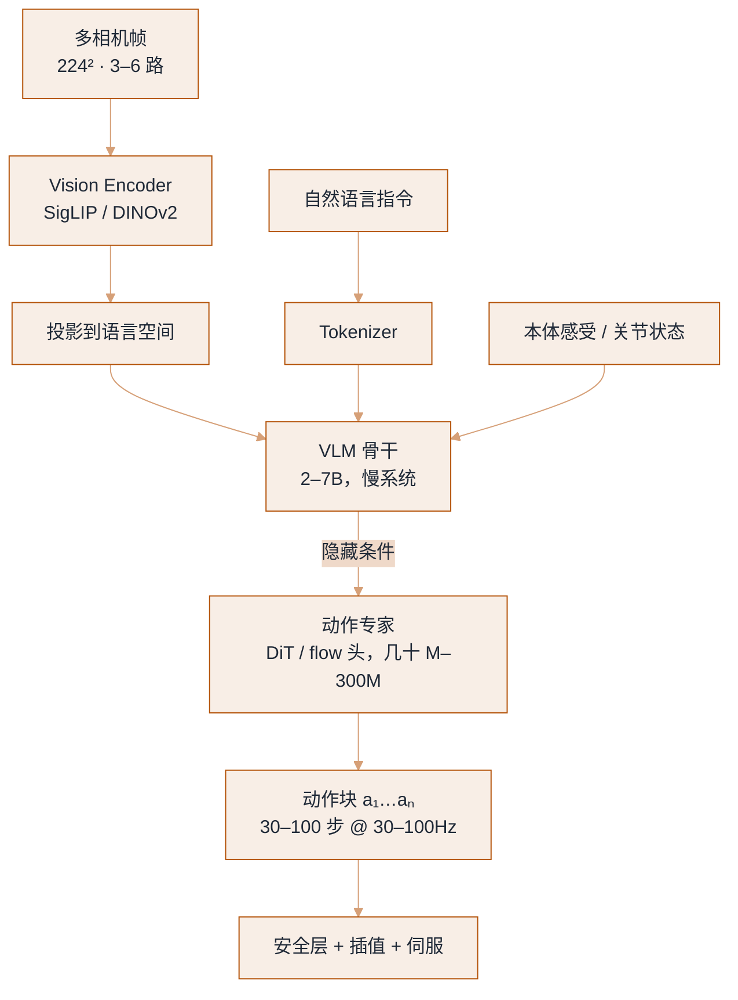
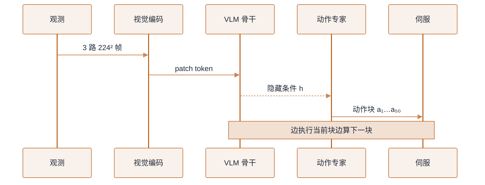

# VLA 模型架构：视觉—语言—动作怎么接起来


**一句话**：VLA（Vision-Language-Action，视觉-语言-动作模型）= 预训练 VLM 的骨干 + 一个把隐藏状态变成连续动作的「动作专家」。模型能不能在真机上流畅干活，八成取决于这个动作专家的输出形式与频率。
  **难度**： 高级


## 先看结论

- **三种动作头，各有各的债**：离散 token（复用 LLM 栈，但高频控制下 token 数爆炸、量化误差明显）；扩散去噪（平滑、能建模多模态，但推理慢、步数要调）；flow matching（介于二者，训练稳定、几步去噪即可出块，当前多数新工作在用）。
- **一次推理必须输出一段动作（action chunk）**：模型 5Hz、控制 50Hz，唯一优雅的补法是「预测未来 1 秒动作，滚动重规划」。chunk 越长越流畅但越不反应，越短越敏感但越容易抖。
- **多模态动作分布是真实存在的**：同一个观察，从左边抓和从右边抓都对。回归 MSE 会学出「两边平均 = 撞中间」，这就是扩散/流式方法有效的根本原因。
- **视觉 token 是显存黑洞**：多路相机 × 多帧 × ViT patch，很容易比语言 token 多一个量级；压缩（Q-Former、pixel shuffle、时间下采样）是工程必做项。

## 标准解剖图



*《图：视觉、语言、本体感受三路都进 VLM，输出的却是隐藏条件而非动作；真正给伺服的是几十 M 的动作专家与 30–100 步动作块》*


*《图：两条时钟各自成立才谈对齐：慢系统 5–10 Hz 出子目标，快系统 50–200 Hz 出动作块，中间靠滚动缓冲衔接，安全层与伺服在块外再兜一层》*
## 各部件的设计选择

| 部件 | 常见选择 | 关键权衡 |
|---|---|---|
| 视觉编码 | SigLIP / PaliGemma 视觉塔、DINOv2（几何更强） | 语义 vs 空间精度；多相机要不要拼接成一张图 |
| 时序 | 单帧 / 最近 k 帧 / 视频编码 | 帧多 → 延迟与显存涨；帧少 → 遮挡时状态估计差 |
| 语言条件 | 指令 + 子目标（分层）+ CoT | 让模型显式输出「先打开抽屉」再执行，可解释性与鲁棒性都更好 |
| 状态输入 | 关节角、夹爪开口、末端位姿、力/力矩 | 归一化方式要和部署端完全一致（最常见的 bug 源） |
| 动作头 | 离散 token / MSE 回归 / 扩散 / flow matching | 见上；多模态分布必须用生成式头 |
| 动作空间 | 末端增量位姿 + 夹爪、关节位置、关节速度、力矩 | 见 [动作表示与分层控制](action-representation-control.md) |
| 分块长度 | 10–100 步（0.2–2 秒） | 长：流畅但迟钝；短：灵敏但抖；常见 50 步/1 秒 |
| 推理调度 | 同步（执行完整块）/ 异步（重叠推理与执行，temporal ensembling） | 异步能同时拿到高频与低延迟，代价是实现复杂度 |

## 动作头的三条实现路线

三条路线的差别只在「动作专家怎么把隐藏条件变成一段动作」。下面这份 JSON 是一次推理进出的真实形状：左边是喂进去的观测，右边是吐出来的动作块，中间记着动作头的参数。三条路线共用同一份 I/O，换头不改接口。

```json
{
  "observation": {
    "cameras": [
      { "name": "base_rgb", "w": 224, "h": 224, "ts_ms": 0 },
      { "name": "wrist_rgb", "w": 224, "h": 224, "ts_ms": 2 },
      { "name": "side_rgb", "w": 224, "h": 224, "ts_ms": 2 }
    ],
    "instruction": "pick up the blue cup",
    "proprio": { "joint_pos_rad": [0.0, -0.4, 1.2, 0.0, 0.8, 0.0], "gripper_open": 0.0 },
    "hidden_cond_dim": 4096
  },
  "action_chunk": {
    "T": 50,
    "D": 10,
    "action_range": [-1.0, 1.0],
    "control_hz": 50,
    "representation": "delta_tcp_xyz + 6d_rot + gripper"
  },
  "action_head": {
    "selected": "flow_matching",
    "discrete_token": { "bins": 256, "encode": "(a*0.5+0.5)*(bins-1)", "decode": "tok/(bins-1)*2-1", "loss": "next-token cross-entropy" },
    "diffusion": { "denoise_steps_K": [10, 100], "target": "predict_noise", "loss": "MSE", "accelerator": "DDIM / consistency distillation" },
    "flow": { "sample_steps": 10, "dt": 0.1, "integrator": "euler", "target": "velocity_field(a1 - a0)", "loss": "MSE" }
  }
}
```

三个动作空间量要钉死在配置里：`action_range` 固定是 `[-1.0, 1.0]`，离散头靠它做 `bins=256` 的量化，`from_tokens` 再反归一化回这个区间；`T`、`D` 决定一次吐出多少步多少维（示例 50 步 10 维 = 1 秒）；`representation` 说明这 10 维到底是 `Δtcp(3) + 6D 旋转(6) + 夹爪(1)`。

### 一次推理的往返（分步演示）



*《图：VLM 只交隐藏条件，真正给伺服的是动作专家吐出的 a₁…a₅₀；下一块在当前块还剩约 8 步时就并行发起》*




#### 第 1 步：观测先对齐时间戳

三路 224² 相机帧 + 本体状态（`joint_pos_rad`、`gripper_open`）+ 语言指令打包进模型。相机 30Hz、控制 50Hz、推理 200ms 各跑各的时钟，不显式带 `ts_ms` 并做最近邻对齐，策略就会「拿着 200ms 前的画面纠正现在的手」，把因果学反。




#### 第 2 步：视觉编码 → token → 隐藏条件

视觉塔把每帧切成 patch token，多路多帧很容易比语言 token 多出一个量级（这就是显存黑洞，得靠 Q-Former / pixel shuffle / 时间下采样压）。VLM 骨干（2–7B 慢系统）融合图像、指令、本体感受，输出的不是动作，是一维 `hidden_cond_dim=4096` 的条件向量 `h`。




#### 第 3 步：动作专家把 `h` 变成一段动作

动作专家（几十 M–300M 的 DiT / flow 头）以 `h` 为条件采样出一个 `(T=50, D=10)` 的动作块，每维归一化在 `[-1.0, 1.0]`。一次必须出一段而不是一步——模型 5Hz、控制 50Hz，唯一优雅的补法就是「预测未来 1 秒、滚动重规划」。




#### 第 4 步：块外再兜一层安全 + 插值

动作块进伺服前过限幅与插值（`action_spec` 的 clamp，见 [动作表示与分层控制](action-representation-control.md)）。块外再留触发式重算：力超限或物体被碰走，立即丢弃剩余动作重新推理，而不是硬着头皮把 1 秒执行完。




### 三条路线的取舍（点标签切换）



每维量化成 `bins=256` 个 bin（`encode = (a*0.5+0.5)*(bins-1)`，`decode = tok/(bins-1)*2-1`），训练退化成 next-token prediction，直接复用 LLM 栈、最容易训。代价在部署：`(T=50, D=10)` 要逐 token 解码 500 次，控制频率被 token 数拖垮，且高频控制下量化误差明显。适合快速跑通闭环、低频任务。



条件去噪：前向对动作块加噪（`q_sample`），网络预测噪声、`MSE` 收损。它能表达多模态分布——同一观察「左抓右抓都对」，回归 MSE 会学成「两边平均 = 撞中间」，这正是扩散有效的根本原因。代价是推理要 `K=10–100` 次去噪，慢；上 DDIM / 一致性蒸馏可把步数压到几步。



学一个速度场把噪声推流到动作：插值 `a_u = u*a1 + (1-u)*a0`（`u~rand`、`a0~randn`），目标是 `v_target = a1 - a0`，`MSE` 收损。采样用欧拉积分，示例 `steps=10, dt=0.1` 即可从噪声走到动作。训练比扩散稳、步数比扩散少，是当前多数新工作（π0、GR00T 一类）的默认头。



最朴素的动作头：直接回归动作、MSE 收损。看起来最省事，实际最容易翻车——多峰分布被平均，模型停在两个抓取姿态中间。它是用来理解「为什么需要生成式头」的反面基线，不建议单独上真机。




> ✅ **最佳实践**：先用 ①/②/③ 中「最容易训的」跑通闭环（通常是 ①或 flow matching），再加 temporal ensembling、异步推理与动作平滑，别一上来就换三种动作头比高低。

## 生活类比

动作头像「写钢琴谱的方式」：
- 离散 token = 一个音一个音地敲（简单，但快板来不及）；
- 扩散 = 先画一团墨迹，反复擦改成形（结果漂亮，改的轮数多就慢）；
- flow matching = 顺着水流把墨迹推向目标形状（几步就能到位，训练也稳）。
- action chunking = 一次写完整小节再弹，而不是看一个键写一个键——手部动作因此连贯。

## 工程现场笔记

- **快慢分频是硬需求**：双系统（慢 VLM 出隐条件、快动作专家出动作）几乎是当前产业共识：慢系统 7–10Hz、快系统 100–200Hz、底层伺服 kHz 级。参考 [动作表示与分层控制](action-representation-control.md)。
- **推理必须流式/分块**：`VLM 前向 → 条件缓存 → 动作专家多次小步去噪`，后者与执行重叠（边执行当前块边算下一块），这是延迟能做到可感知的关键，见 [Action Chunking 动画](../.gitbook/assets/17-action-chunking.svg)。
- **视觉 tokenizer 换不得**：底座 VLM 的图片预处理（分辨率、patch 数、归一化）与训练时不一致，策略会「安静地坏掉」——分数下降不明显但在你的场景里就是不行。把它写进配置校验。
- **语言头输出子目标（hierarchical reasoning）在长时序任务上收益大**：π0.5、GR00T 一类都在往「先说下一步做什么，再做」的方向靠，便于人接管与调试。
- **和 LLM 侧共用的基建**：量化与 KV 缓存同样适用；机器人板载算力下，FP8/INT4 化的 VLM 骨干常常是从「不可用」到「可用」的那一步（→ [推理服务化](../16-ai-infrastructure/inference-serving.md)）。

## 常见误区

- ❌ 只用 MSE 回归动作：多峰分布被平均，出现「停在两个抓取姿态中间」的失败模式
- ❌ chunk 执行完才推理：等待期机器人「闭眼执行」，物体被碰走就全盘错。要么异步重规划，要么做触发式提前重算
- ❌ 忽略观测延迟与时间对齐：相机 30Hz、控制 50Hz、推理 200ms——不显式记录时间戳并做最近邻/插值对齐，策略会学错因果
- ❌ 把语言指令当强约束：模型可能忽略「轻一点拿」。安全相关的要求要写在控制层限幅里，不写在 prompt 里
- ❌ 只在「有真值状态」的仿真里训：真机状态估计有噪声，训练时要注入观测噪声与延迟

## 小练习

在一个仿真任务里（如 Isaac Lab 或 MuJoCo 的桌面抓取），固定数据与训练预算，只换动作头：`离散 token` vs `flow matching`，比较：① 训练稳定性；② 推理 50 步动作的耗时；③ 多峰场景（左右两侧都能抓）的成功率与失败姿态分布。写一份 5 行结论。

## 参考资料

- [Diffusion Policy](https://diffusion-policy.cs.columbia.edu/)（[论文](https://arxiv.org/abs/2303.04137)）、[ACT / ALOHA](https://arxiv.org/abs/2304.13705)、[flow matching](https://arxiv.org/abs/2210.02747)
- [LeRobot（数据集 + 训练范式）](https://github.com/huggingface/lerobot)、[openpi](https://github.com/Physical-Intelligence/openpi)

## 相关知识点

- [动作表示与分层控制](action-representation-control.md)
- [机器人基础模型谱系](robot-foundation-models.md)
- [Transformer 与 Attention](../03-llm/transformer-attention.md)
- [数据引擎](data-engine.md)

