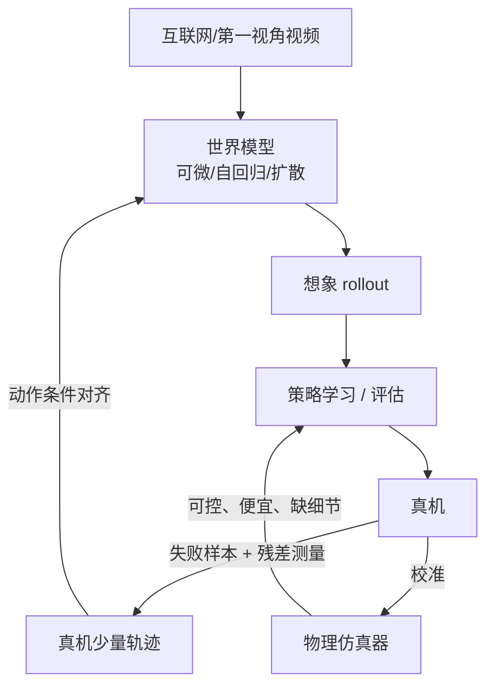

# 世界模型与视频预训练

> **一句话**：世界模型（World Model）是「会预测未来的内部模拟器」——给定当前观测和动作，它能预测下一帧会发生什么。对机器人的价值有三档：当数据生成器、当策略评估器、当规划器本身。
> **难度**： 高级
> **标签**：`#embodied-ai` `#llm`

## 先看结论

- **三条路线，按「预测什么」区分**：像素空间（视频生成，直观但昂贵）；潜空间（V-JEPA 类，预测抽象特征，省算力但不可看）；3D/场景化（点云、场景图、occupancy，适合导航与规划）。
- **视频预训练解决「表征」，不解决「动作」**：海量人类/网络视频能教会模型物体恒存、遮挡、重力与因果直觉，但没有动作真值。落地仍需要少量机器人数据把「想象」接上「执行」。
- **最实用的近期价值是「离线评估」**：在世界模型里 rollout 一段策略，比真机测快、比仿真可信（对视觉与交互分布），可用来筛掉明显坏版本。
- **别把生成质量当物理正确性**：视频模型「看起来合理」不代表「符合力学」——杯子穿模、液体形状不守恒，这些在训练数据里当 label 用时会污染策略。

## 世界模型能替机器人做什么

| 用途 | 做法 | 收益 | 风险 |
|---|---|---|---|
| 数据增强 / 合成轨迹 | 用真机少量轨迹 + 生成模型扩充视角、光照、物体 | 降低采集量 | 物理不一致 → 策略学到幻觉动作 |
| 策略评估 | 策略在模型里 rollout，比较版本优劣 | 比真机快 10–1000× | 模型误差被利用（策略「骗」模型） |
| 模型基规划（MPC） | 在潜空间对候选动作序列打分，取最优前几步 | 无需真机试错 | 搜索成本高，误差累积 |
| 表征预训练 | 视频自监督 → 冻结/微调骨干给 policy | 数据效率明显提升 | 表征与任务错位 |
| 世界模型即策略（WMPO 类） | 在「想象」中做 RL，再上真机微调 | 真机小时数大幅下降 | 想象与真实的分布偏移必须控住 |
| 反事实与安全检查 | 「如果我推它会怎样」 | 安全评审素材 | 模型不可靠时不能作为放行依据 |

## 与仿真的分工

## 常见误区

- ❌ 「视频模型能生成漂亮结果 = 它懂物理」：生成质量与因果一致性是两件事，要用可验证指标（遮挡后重现、动量守恒、液体体积）来测
- ❌ 用世界模型评估替代真机验收：模型误差会被策略主动利用，出现「模型里满分、真机里乱挥」
- ❌ 忽略动作可控性：无动作条件的视频预测只是「下一帧」，机器人需要的是「如果我这样做会怎样」
- ❌ 把潜空间预测的「不可解释」当缺点就放弃：像素空间模型算力成本高很多，两者是不同预算下的答案
- ❌ 只做单向预测不做多分支：接触丰富任务的结果本来就是多峰的，单模态预测必然平均化（对照 [VLA 模型架构](vla-models.md) 的多模态动作分布讨论）

## 工程现场笔记

- **代表方向（了解脉络，细节以官方材料为准）**：Genie 类「可交互世界生成」、V-JEPA 类「潜空间预测 + 零样本机器人策略」、Cosmos 类「世界基础模型 + 合成数据」、各家厂商公开的机器人世界模型（如 1X 为 NEO 做的视频预训练世界模型）。共同点：把「生成」当成数据与评估基础设施，而不是最终产品。
- **算力现实**：视频模型推理成本极高，「在世界模型里做 RL」通常要在训练集群上跑批，而不是板载。真机部署时世界模型常被「蒸馏」成小 critic 或直接丢掉，只保留它训出的策略。
- **与 Agent 侧的连接**：世界模型的角色类似数字 Agent 里的「沙箱回放 / 仿真评估」——先在可回滚的环境里跑，再上不可回滚的环境。见 [沙箱与执行环境](../16-ai-infrastructure/sandbox-execution-environments.md)、[可观测性与评估平台](../16-ai-infrastructure/llm-observability-eval-platform.md)。

## 怎么判断世界模型「够不够用」

视频生成的质量指标（PSNR、FID 一类像素/分布相似度）**不能**回答「物理对不对」：

$$
\text{像素相似度高}\;\not\Rightarrow\;\text{物理一致性好}
$$

一个模型可以生成视觉上极逼真、但物体穿模、质量不守恒、接触后不回弹的视频。因此评估要换成物理量指标：遮挡重现一致性、堆叠稳定性、液体体积守恒、斜面滑动摩擦行为、碰撞后动量方向。**这套指标也是判断「世界模型能否当数据工厂」的尺子**——生成的数据若物理不自洽，用它训练的策略会在真机上失效。

## 小练习

挑一个开源视频预测/世界模型 checkpoint，做「物理合理性 5 题」：遮挡重现、堆叠稳定性、液体倾倒体积、斜面滑动、弹簧回弹。各写 3 条可自动计算的指标（如深度一致性、边界 IoU、颜色质心轨迹连续性），并记录它在哪几题失败。这份清单以后就是你判断任何「世界模型能当数据工厂」宣传的尺子。

## 相关资源

- [V-JEPA 2](https://arxiv.org/abs/2506.09985)、[Genie 2 博客](https://deepmind.google/discover/blog/genie-2-a-large-scale-foundation-world-model/)、[Cosmos](https://github.com/NVIDIA/Cosmos)、[DayDreamer](https://arxiv.org/abs/2206.14176)（真机上的世界模型 RL 代表作）

## 相关知识点

- [仿真与 Sim-to-Real](simulation-sim2real.md)
- [数据引擎](data-engine.md)
- [多模态模型](../03-llm/multimodal.md)
- [评估与基准](evaluation-benchmarks.md)
