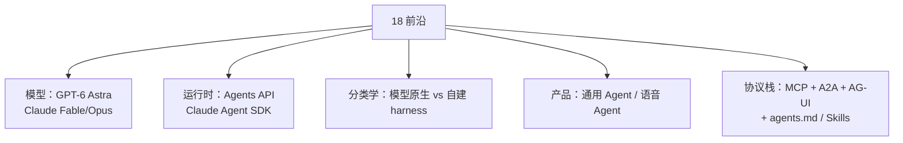

# 本章导读：2026 前沿

> **一句话**：2026 年的竞争焦点已从「单模型分数」转向「模型 + 托管 harness + 沙箱 + 企业治理」——本章对齐 2026-09 的真实产品面。

## 为什么要单独开这一章

01–17 章讲的是**原理与工程骨架**（循环、协议、记忆、评估、基础设施）。这些骨架稳定，但**模型名、产品名、基准代际**每季度都在换。把易变的前沿内容集中在本章，正文知识页只需链接过来，不必整本追改。

写这一章时（2026-09-12）刚发生的事：

| 时间 | 事件 | 对 Agent 工程的含义 |
|---|---|---|
| 2026-07-24 | Claude Opus 5 | 长时程 Agent 的 Opus 档 |
| 2026-08-27 | Anthropic Model Hardware Standard 研究预览 | Agent 安全操作实体设备的共享规范 |
| 2026-09-01 | Claude Fable 5.1 / Mythos 5.1 | 编码与知识工作新前沿；缓存读降价 |
| 2026-09-09 | **GPT-6 Astra** | computer use / 浏览 / 科研 / 网安 SOTA |
| 2026-09-10 | **OpenAI Agents API** 公测 | 托管 Codex harness：压缩、tool search、子 Agent |
| 2026-09-10 | GPT-Live-1 API | 实时语音 Agent 运行时 |

## 本章地图

| 页面 | 读完你能 |
|---|---|
| [2026 前沿模型地图](frontier-models-2026.md) | 说清 Astra / Fable 5.1 / Opus 5 各自强在哪、价格与安全档位 |
| [OpenAI Agents API](openai-agents-api.md) | 用一次 API call 起托管 Agent，并理解压缩 / tool search / 子 Agent |
| [Claude Agent SDK](claude-agent-sdk.md) | 分清 Agent SDK / CLI / Client SDK / Managed Agents |
| [模型原生 vs 自建 Harness](model-native-vs-harness.md) | 判断你的场景该买托管 harness 还是自己写循环 |
| [通用 Agent 产品](general-agent-products.md) | 看懂 Manus 类「通用助理」与编程 Agent 的差异 |
| [实时语音 Agent](voice-agents.md) | 理解语音 Agent 的延迟预算与工具打断模型 |
| [2026 协议栈](protocol-stack-2026.md) | 把 MCP / A2A / AG-UI / agents.md / Skills 放进同一张图 |

## 与旧章的关系

- 模型原理仍在 [03 LLM 基础](../03-llm/README.md)
- 工具协议主体仍在 [05 工具调用与协议](../05-tool-protocol/README.md)
- 框架对比仍在 [09 框架与生态](../09-frameworks/README.md)
- 评估方法仍在 [10 评估、安全与对齐](../10-evaluation-safety/README.md)，**2026 基准代际**见本章 [评估 2026](eval-2026.md) 与第 10 章更新页

## 参考资料

- [GPT-6 Astra](https://openai.com/index/gpt-6-astra/)（OpenAI, 2026-09-09）
- [Introducing the Agents API](https://openai.com/index/introducing-the-agents-api/)（OpenAI, 2026-09-10）
- [Claude Fable 5.1 and Mythos 5.1](https://www.anthropic.com/claude-fable-and-mythos-5-1)（Anthropic, 2026-09）
- [Claude Agent SDK overview](https://docs.claude.com/en/api/agent-sdk/overview)
- [Terminal-Bench 4.0](https://www.tbench.ai/)
