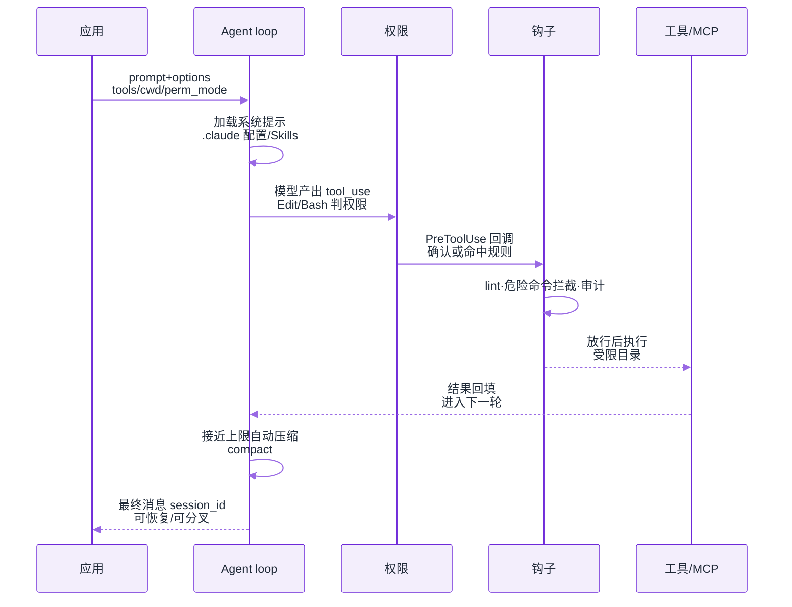
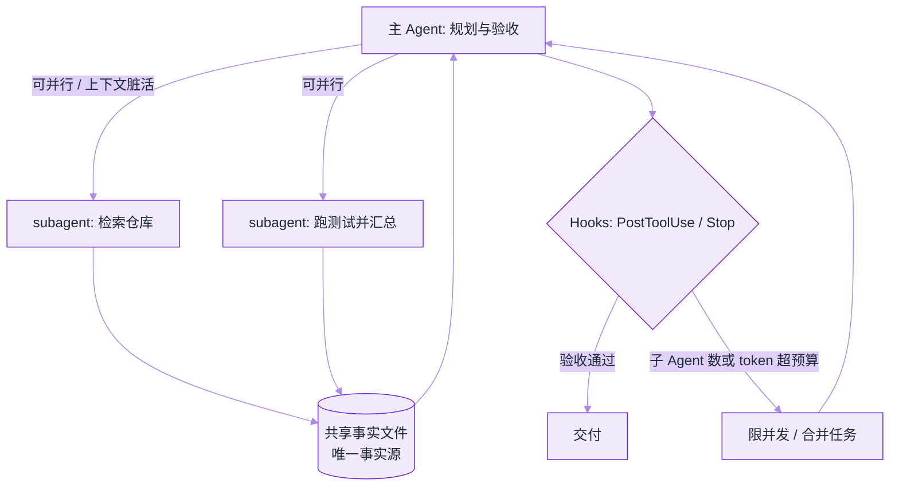
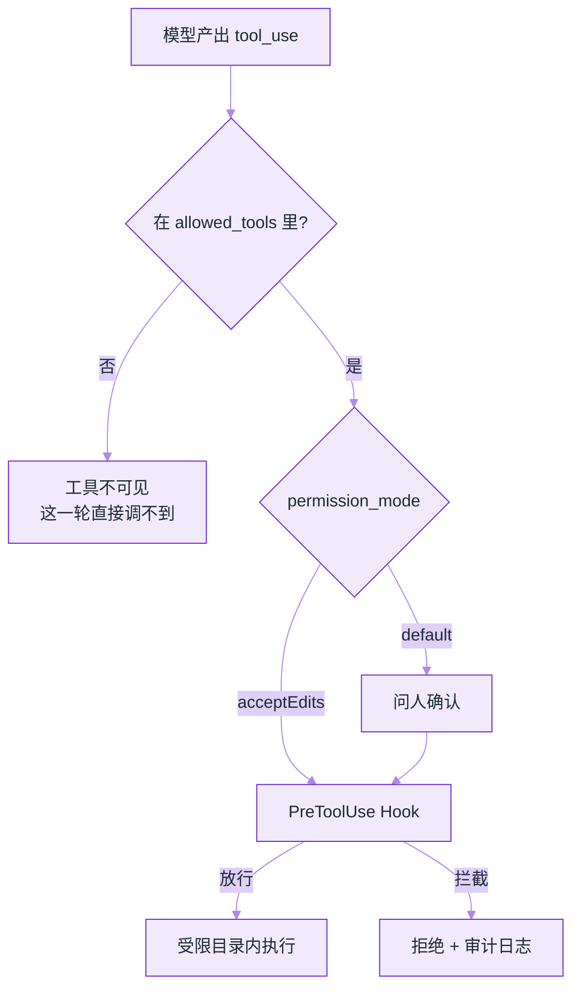

# Claude Agent SDK


**一句话**：把 Claude Code 的 agent loop、工具、权限、会话与 Skills 做成 **Python / TypeScript 库**，让你在自己的进程里跑同一套生产级循环。


## 先看结论

- Agent SDK ≠ 再包一层 Messages API：它交付的是 **harness**（循环 + 工具 + 权限 + 压缩 + 子 Agent）
- 与四种形态的分界：SDK（库内循环）/ CLI（交互终端）/ Client SDK（裸 API，自己写循环）/ Managed Agents（托管 REST）
- 能力与 Claude Code 对齐：内置文件与命令工具、Hooks、Subagents、MCP、Permissions、Sessions、Skills/Plugins
- 认证：一般用 API Key；第三方产品不得未经批准提供 claude.ai 登录额度

## 与相邻形态对比

| 你想做什么 | 用 | 原因 |
|---|---|---|
| 在自己应用里跑 Agent，不自己实现工具循环 | **Agent SDK** | Python/TS 库，进程内控制 |
| 终端交互开发 / 一次性任务 | Claude Code CLI | 产品化 TUI |
| 完全自定义循环，直连模型 API | Client SDK / Messages API | 你负责 loop |
| 长时异步、不想管沙箱 | Managed Agents | Anthropic 托管 REST + 沙箱 |

## 核心机制

### 1. 你买到的是「可嵌入的 Claude Code 内核」

```text
你的应用
  └── Agent SDK query(...)
        ├── system prompt / 项目 .claude 配置加载
        ├── agent loop：模型 → 工具 → 观察 → 再模型
        ├── permissions：自动 / 需确认 / 拒绝
        ├── sessions：可恢复、可分叉
        └── subagents / MCP / skills / hooks
```

这与 [OpenAI Agents API](openai-agents-api.md) 的差别是部署形态：SDK 默认 **你的进程、你的环境**；Agents API 默认 **OpenAI 托管 harness + 沙箱**。

一次 `query()` 的内部时序（循环、权限判定与 Hooks 全在你的进程里）：



### 2. Skills 与项目约定

SDK 会加载与 Claude Code 相同的项目配置目录（如 `.claude/` 与用户级配置），因此：

- 团队可以把「如何跑测试、如何提交 PR」写成 **Skill / Command**
- Agent 在不同仓库行为可复现，而不是每次靠系统提示词人肉调

详见 [2026 协议栈](protocol-stack-2026.md) 中 Skills / agents.md 一节。

### 3. Hooks 与治理

在工具执行前/后、会话关键节点插入自定义代码，实现：

- 强制 lint / 危险命令拦截
- 审计日志
- 与内部审批系统对接

比「只在 prompt 里写不要 rm -rf」可靠一个数量级（见 [权限控制与沙箱隔离](../10-evaluation-safety/permission-sandbox.md)）。

### 4. 子 Agent 的派发与成本护栏



子 Agent 各有独立上下文窗口、只回传摘要——这是它省主上下文的原因，也是它容易叠成本的原因（见下表「子 Agent 成本爆炸」）。

### 5. 会话为什么能当「可分支的工作流」

SDK 的会话是**持久化的消息与工具历史**，因此支持两件在框架拼图里要自己实现的事：

| 能力 | 含义 | 典型用法 |
|---|---|---|
| resume | 用同一个 session 继续，历史与已读文件状态延续 | 长任务跨进程/跨天续跑；崩溃后不从头再来 |
| fork | 从既有会话分叉出平行支线，各自继续 | 同一份「已读完仓库」的状态，跑两种修复方案做 A/B |

$$
\text{cost}_{\text{branch}} \approx \text{cost}_{\text{prefix}} + \text{cost}_{\text{tail}}
$$

分叉的价值正是 $$\text{cost}_{\text{prefix}}$$（探索、读码）只付一次；滥用则会让 tail 数量线性堆成本。工程上给每条支线设独立预算，并只保留一条主线进入交付。

### 6. 权限：先划「不可逆动作」，再谈模式

`permission_mode` 与 `allowed_tools` 是两把不同的闸：前者决定「是否每次问人」，后者决定「能不能出现在工具表里」。三档环境的共同骨架与差异，就是下面这份配置——`base` 三档都一样（`Read`/`Grep` 打底），差异只落在工具集、确认策略与有没有 Hook：

```json
{
  "base": { "cwd": "/path/to/repo", "allowed_tools": ["Read", "Grep"] },
  "profiles": [
    {
      "env": "ci",
      "allowed_tools": ["Read", "Grep"],
      "permission_mode": "default",
      "intent": "只读探索，任何写盘都拒绝"
    },
    {
      "env": "dev",
      "allowed_tools": ["Read", "Grep", "Edit", "Bash"],
      "permission_mode": "acceptEdits",
      "intent": "本地：可编辑文件，命令仍需逐次确认"
    },
    {
      "env": "prod",
      "allowed_tools": ["Read", "Grep", "Edit"],
      "permission_mode": "acceptEdits",
      "hooks": ["audit_and_block_hooks"],
      "intent": "流水线：写盘自动，危险命令由 PreToolUse Hook 拦截并落审计"
    }
  ]
}
```

读这份配置要注意四点：

1. **`ci` 用 `default` 而不是 `acceptEdits`**：`default` 的语义始终是「每次都问」，但 CI 里没有人可问——写盘动作要么被拒、要么挂到超时。想要「只读探索、任何写盘都拒绝」这个意图，就得靠 `default` + 不给写工具两件事一起成立，而不是以为 `default` 本身禁止写。
2. **`dev` 比 `prod` 多一个 `Bash`**：跑测试、装依赖是本地的刚需；流水线里命令执行权归 CI，不该由模型临场决定，所以 `prod` 的工具集收到只剩 `Edit`。
3. **`allowed_tools` 是整表而不是追加**：`ci` 只有两项，`dev` 要把 `Read`/`Grep` 一起写全再加 `Edit`/`Bash`。漏写 `Read` 就等于让 Agent 蒙着眼改代码——这类配置错误不会报错，只会让循环绕远。
4. **只有 `prod` 挂 `hooks`**：`audit_and_block_hooks` 同时做拦截与审计，因为这一档写盘自动、没有人兜底。

三把闸的先后顺序是固定的，搞反了就会写出「Hook 永远等不到调用」的配置：



*《图：`allowed_tools` 决定能不能被想到，`permission_mode` 决定要不要问，Hook 决定问完了还让不让——三层都过才会真的执行》*

要点：**Hook 是最后防线**，因为它在工具真正执行前跑你的代码；prompt 里的「请不要删库」不是闸（见 [权限控制与沙箱隔离](../10-evaluation-safety/permission-sandbox.md)）。

## 一次 `query()` 的调用形状

入口只有两个符号：`claude_agent_sdk` 导出的 `query` 与 `ClaudeAgentOptions`。一次调用的请求与回包形状如下——**注意回包不是一次性 return，而是逐条 yield 的消息流**，所以消费端是「边跑边读」而不是「等结果」：

```json
{
  "call": {
    "prompt": "Find the failing unit test and fix the root cause.",
    "options": {
      "cwd": "/path/to/repo",
      "allowed_tools": ["Read", "Edit", "Bash"],
      "permission_mode": "acceptEdits"
    }
  },
  "returns": {
    "shape": "异步消息流：循环内逐条取到模型消息 / 工具调用 / 工具结果",
    "last_message": { "session_id": "会话标识", "usable_for": ["resume", "fork"] }
  }
}
```

这份形状里藏了三个决策：`cwd` 决定加载哪个仓库的 `.claude/` 配置与 Skills，也就决定了「同一个 prompt 在两个目录里行为不同」；`allowed_tools` 三项（`Read`、`Edit`、`Bash`）对应「读得懂、改得动、跑得起来」这条最小闭环，缺一项模型就只能把活推给你；`permission_mode: "acceptEdits"` 意味着改文件不再问人、但 `Bash` 仍然要确认——这正是本页「权限」一节里 `dev` 档的配置。

> 以官方 SDK 文档为准核对 API 签名；版本迭代较快。


**生产环境请锁 SDK 与 CLI 版本并记录在案**：SDK/CLI 的行为差异主要来自版本与配置目录，「本地能跑、CI 结果不同」多半是这个原因。同理，第三方产品不得未经批准提供 claude.ai 登录额度，也不能自称 Claude Code。


## 分步演示：一次 `query()` 从进程启动到交付

本页「核心机制 1」那张时序图是骨架，下面按它走一遍，标出每一步会卡在哪。




#### 第 1 步：循环在你的进程里，配置先进来

`query()` 接受两个入参：`prompt` 与 `options`（一个 `ClaudeAgentOptions`）。循环启动之前先加载系统提示、`cwd` 指向仓库的项目 `.claude/` 与用户级配置、Skills/Plugins。这一步是「SDK 行为与 CLI 不一致」的第一嫌疑：版本不同、或者加载到的配置目录不同。




#### 第 2 步：第一轮通常不写代码

模型先出 `Read`/`Grep` 的 `tool_use`，把失败的单测定位出来；工具结果回填上下文，进入下一轮。读写探索往往占掉前缀成本的大头——这正是本页「会话为什么能当可分支的工作流」一节里 `fork` 值得存在的原因：这段「已经读懂仓库」的状态可以复用。




#### 第 3 步：`Edit` 与 `Bash` 在权限闸处分岔

`permission_mode="acceptEdits"` 下，文件编辑直接放行、`Bash`（跑测试的命令）仍需确认。如果一轮下来被打断几十次，问题通常是 `allowed_tools` 给宽了而不是模式选错了——先收窄工具集，再考虑换模式（见「常见故障」表第二行）。




#### 第 4 步：Hook 在工具真正执行前跑你的代码

`PreToolUse` 做 lint、危险命令拦截、审计落盘，必要时对接内部审批系统；放行后工具才在受限目录里执行。比「只在 prompt 里写不要 rm -rf」可靠一个数量级——差别在于 Hook 拒绝时是**动作没发生**，而 prompt 只是让模型不太想做。




#### 第 5 步：继续跑，直到接近上限才压缩

多轮「模型 → 工具 → 观察」之间，harness 在上下文逼近上限时自动 `compact`。子 Agent 也在这一层派发：每个子 Agent 独立上下文、只回传摘要，省主上下文但会叠 token 成本——不设并发上限就是「子 Agent 成本爆炸」那一行。




#### 第 6 步：最后一条消息带 `session_id`

拿到 session 标识之后，任务才真正变成可续跑资产：`resume` 用同一份历史与已读文件状态跨进程/跨天继续，`fork` 从既有会话拉出平行支线跑两种修复方案做 A/B。分叉的价值是探索前缀只付一次，滥用则让支线条数线性堆成本——每条支线给独立预算，只留一条主线进交付。



## 改一处会怎样（点标签切换）



`allowed_tools` 收到 `["Read", "Edit"]`：Agent 读得到、改得动，但跑不了测试。它会在没有验证的情况下声称修好了，验证责任被推回 CI。适合「只出补丁、人来跑」的评审场景，不适合「找根因并修复」这类要求自证的 prompt。



每一次写盘都要问人。本地开发会被打断到想关掉终端；CI 里更糟——没有人可问，任务卡在第一个 `Edit` 上超时。记住 `default` 的语义是「每次问」，不是「禁止写」。



`prod` 档把 `audit_and_block_hooks` 摘掉：写盘仍然自动，但危险命令没人拦、审计链断在工具执行前那一刻。等于把最后防线换成 prompt 里的礼貌请求——出事之后你只知道「它删了」，不知道为什么、什么时候。



Permissions、Hooks、Skills 全部写在 `.claude/` 里并由 SDK 加载，配置随仓库 review。反过来把 `allowed_tools` 硬编码在应用代码里，就会出现「同一个仓库本地能跑、别人的分支跑不了」——这也是误区「配置只写在代码里」的形态。



非 Python/TypeScript 项目用 Claude Code CLI 的 headless 模式（`-p` 加 JSON 输出）以子进程驱动：拿到同一套循环与同一份 `.claude/` 配置，代价是没有进程内回调——Hook 想接自家审批系统就只能靠子进程 stdout 逐条解析，中断与恢复也要自己管。



## 常见故障与排查

| 现象 | 原因 | 处理 |
|---|---|---|
| 循环行为与 CLI 不一致 | SDK/CLI 版本或配置目录不同 | 对齐版本；检查 `.claude` 加载 |
| 权限频繁打断 | `permission_mode` 过严或工具集过宽 | 收窄 allowed_tools；分环境配置 |
| 子 Agent 成本爆炸 | 无并发上限、任务拆分过碎 | 限制 subagent 数；共享事实文件 |
| 想在非 Python/TS 使用 | 官方仅 Py/TS 库 | 以 CLI headless（`-p` + JSON 输出）子进程驱动 |

## 工程含义

1. **框架选型多了一极**：09 章的 LangGraph/CrewAI 仍是「你自己拼图」；Agent SDK / Agents API 是「买整机」
2. **治理前移到配置**：Permissions、Hooks、Skills 应进版本库，和代码一起 review
3. **不要品牌误用**：集成产品不能自称 Claude Code（见官方 branding guidelines）

## 常见误区

1. **把它当 Messages API 的包装**——跳过 Permissions/Sessions/Hooks 而只用 `query()`，等于花整机的钱只开一个轮子
2. **配置只写在代码里**——`.claude/`、Skills、Hooks 应进版本库；否则本地能跑、CI 行为不同
3. **权限模式一刀切**——开发环境与流水线用同一档，要么天天被打断，要么写死高危工具
4. **子 Agent 无上限**——「并行更快」在 token 与沙箱计费上是线性成本
5. **版本不锁**——SDK 与 CLI 行为差异主要来自版本与配置目录，生产要锁版本并记录在案

## 小练习

给同一个仓库写两套 `query()` 配置：一套 CI 只读（`Read`/`Grep`，禁止写盘），一套本地可编辑。然后用同一 prompt 各跑一次，比较两者的工具调用序列差异——差在哪几步，就是你的权限边界。

## 参考资料

- [Agent SDK overview](https://docs.claude.com/en/api/agent-sdk/overview)
- [Claude Agent SDK TypeScript](https://github.com/anthropics/claude-agent-sdk-typescript)
- [Claude Agent SDK Python](https://github.com/anthropics/claude-agent-sdk-python)
- [A harness for every task（工程博客）](https://claude.com/blog/a-harness-for-every-task-dynamic-workflows-in-claude-code)

## 相关知识点

- [OpenAI Agents API](openai-agents-api.md)
- [模型原生 vs 自建 Harness](model-native-vs-harness.md)
- [OpenAI Agents SDK](../09-frameworks/openai-agents-sdk.md)
- [编程 Agent](../12-applications/coding-agent.md)

