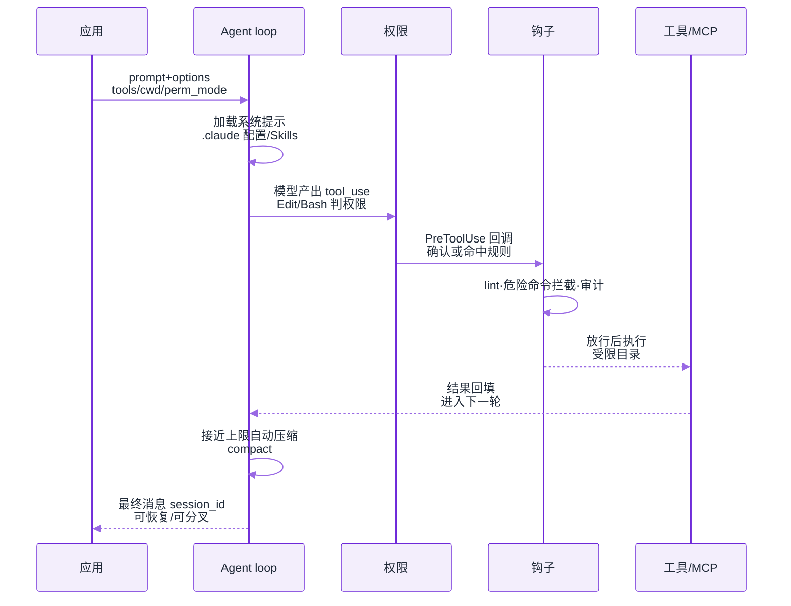
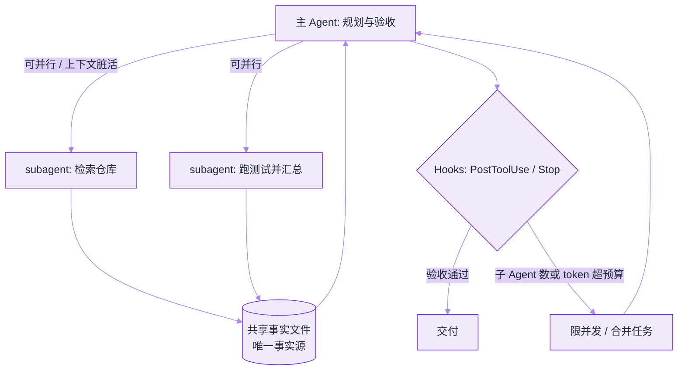

# Claude Agent SDK


**一句话**：把 Claude Code 的 agent loop、工具、权限、会话与 Skills 做成 **Python / TypeScript 库**，让你在自己的进程里跑同一套生产级循环。


## 先看结论

- Agent SDK ≠ 再包一层 Messages API：它交付的是 **harness**（循环 + 工具 + 权限 + 压缩 + 子 Agent）
- 与四种形态的分界：SDK（库内循环）/ CLI（交互终端）/ Client SDK（裸 API，自己写循环）/ Managed Agents（托管 REST）
- 能力与 Claude Code 对齐：内置文件与命令工具、Hooks、Subagents、MCP、Permissions、Sessions、Skills/Plugins
- 认证：一般用 API Key；第三方产品不得未经批准提供 claude.ai 登录额度

## 与相邻形态对比

| 你想做什么 | 用 | 原因 |
|---|---|---|
| 在自己应用里跑 Agent，不自己实现工具循环 | **Agent SDK** | Python/TS 库，进程内控制 |
| 终端交互开发 / 一次性任务 | Claude Code CLI | 产品化 TUI |
| 完全自定义循环，直连模型 API | Client SDK / Messages API | 你负责 loop |
| 长时异步、不想管沙箱 | Managed Agents | Anthropic 托管 REST + 沙箱 |

## 核心机制

### 1. 你买到的是「可嵌入的 Claude Code 内核」

```text
你的应用
  └── Agent SDK query(...)
        ├── system prompt / 项目 .claude 配置加载
        ├── agent loop：模型 → 工具 → 观察 → 再模型
        ├── permissions：自动 / 需确认 / 拒绝
        ├── sessions：可恢复、可分叉
        └── subagents / MCP / skills / hooks
```

这与 [OpenAI Agents API](openai-agents-api.md) 的差别是部署形态：SDK 默认 **你的进程、你的环境**；Agents API 默认 **OpenAI 托管 harness + 沙箱**。

一次 `query()` 的内部时序（循环、权限判定与 Hooks 全在你的进程里）：



### 2. Skills 与项目约定

SDK 会加载与 Claude Code 相同的项目配置目录（如 `.claude/` 与用户级配置），因此：

- 团队可以把「如何跑测试、如何提交 PR」写成 **Skill / Command**
- Agent 在不同仓库行为可复现，而不是每次靠系统提示词人肉调

详见 [2026 协议栈](protocol-stack-2026.md) 中 Skills / agents.md 一节。

### 3. Hooks 与治理

在工具执行前/后、会话关键节点插入自定义代码，实现：

- 强制 lint / 危险命令拦截
- 审计日志
- 与内部审批系统对接

比「只在 prompt 里写不要 rm -rf」可靠一个数量级（见 [权限控制与沙箱隔离](../10-evaluation-safety/permission-sandbox.md)）。

### 4. 子 Agent 的派发与成本护栏



子 Agent 各有独立上下文窗口、只回传摘要——这是它省主上下文的原因，也是它容易叠成本的原因（见下表「子 Agent 成本爆炸」）。

### 5. 会话为什么能当「可分支的工作流」

SDK 的会话是**持久化的消息与工具历史**，因此支持两件在框架拼图里要自己实现的事：

| 能力 | 含义 | 典型用法 |
|---|---|---|
| resume | 用同一个 session 继续，历史与已读文件状态延续 | 长任务跨进程/跨天续跑；崩溃后不从头再来 |
| fork | 从既有会话分叉出平行支线，各自继续 | 同一份「已读完仓库」的状态，跑两种修复方案做 A/B |

$$
\text{cost}_{\text{branch}} \approx \text{cost}_{\text{prefix}} + \text{cost}_{\text{tail}}
$$

分叉的价值正是 $$\text{cost}_{\text{prefix}}$$（探索、读码）只付一次；滥用则会让 tail 数量线性堆成本。工程上给每条支线设独立预算，并只保留一条主线进入交付。

### 6. 权限：先划「不可逆动作」，再谈模式

`permission_mode` 与 `allowed_tools` 是两把不同的闸：前者决定「是否每次问人」，后者决定「能不能出现在工具表里」。推荐顺序：

```python
# 示意：三档配置的共同骨架，差异只在工具集与确认策略
def build_options(env: str, repo: str):
    base = dict(cwd=repo, allowed_tools=["Read", "Grep"])
    if env == "ci":       # 只读探索，任何写盘都拒绝
        return ClaudeAgentOptions(**base, permission_mode="default")
    if env == "dev":      # 本地：可编辑，命令仍需确认
        return ClaudeAgentOptions(**base, allowed_tools=["Edit", "Bash"],
                                  permission_mode="acceptEdits")
    # prod 流水线：写盘自动，但危险命令由 PreToolUse Hook 拦截并落审计
    return ClaudeAgentOptions(**base, allowed_tools=["Edit"],
                              permission_mode="acceptEdits",
                              hooks=audit_and_block_hooks())
```

要点：**Hook 是最后防线**，因为它在工具真正执行前跑你的代码；prompt 里的「请不要删库」不是闸（见 [权限控制与沙箱隔离](../10-evaluation-safety/permission-sandbox.md)）。

## 可运行示例（Python）

```python
from claude_agent_sdk import query, ClaudeAgentOptions

async for message in query(
    prompt="Find the failing unit test and fix the root cause.",
    options=ClaudeAgentOptions(
        allowed_tools=["Read", "Edit", "Bash"],
        permission_mode="acceptEdits",
        cwd="/path/to/repo",
    ),
):
    print(message)
```

> 以官方 SDK 文档为准核对 API 签名；版本迭代较快。

## 常见故障与排查

| 现象 | 原因 | 处理 |
|---|---|---|
| 循环行为与 CLI 不一致 | SDK/CLI 版本或配置目录不同 | 对齐版本；检查 `.claude` 加载 |
| 权限频繁打断 | `permission_mode` 过严或工具集过宽 | 收窄 allowed_tools；分环境配置 |
| 子 Agent 成本爆炸 | 无并发上限、任务拆分过碎 | 限制 subagent 数；共享事实文件 |
| 想在非 Python/TS 使用 | 官方仅 Py/TS 库 | 以 CLI headless（`-p` + JSON 输出）子进程驱动 |

## 工程含义

1. **框架选型多了一极**：09 章的 LangGraph/CrewAI 仍是「你自己拼图」；Agent SDK / Agents API 是「买整机」
2. **治理前移到配置**：Permissions、Hooks、Skills 应进版本库，和代码一起 review
3. **不要品牌误用**：集成产品不能自称 Claude Code（见官方 branding guidelines）

## 常见误区

1. **把它当 Messages API 的包装**——跳过 Permissions/Sessions/Hooks 而只用 `query()`，等于花整机的钱只开一个轮子
2. **配置只写在代码里**——`.claude/`、Skills、Hooks 应进版本库；否则本地能跑、CI 行为不同
3. **权限模式一刀切**——开发环境与流水线用同一档，要么天天被打断，要么写死高危工具
4. **子 Agent 无上限**——「并行更快」在 token 与沙箱计费上是线性成本
5. **版本不锁**——SDK 与 CLI 行为差异主要来自版本与配置目录，生产要锁版本并记录在案

## 小练习

给同一个仓库写两套 `query()` 配置：一套 CI 只读（`Read`/`Grep`，禁止写盘），一套本地可编辑。然后用同一 prompt 各跑一次，比较两者的工具调用序列差异——差在哪几步，就是你的权限边界。

## 参考资料

- [Agent SDK overview](https://docs.claude.com/en/api/agent-sdk/overview)
- [Claude Agent SDK TypeScript](https://github.com/anthropics/claude-agent-sdk-typescript)
- [Claude Agent SDK Python](https://github.com/anthropics/claude-agent-sdk-python)
- [A harness for every task（工程博客）](https://claude.com/blog/a-harness-for-every-task-dynamic-workflows-in-claude-code)

## 相关知识点

- [OpenAI Agents API](openai-agents-api.md)
- [模型原生 vs 自建 Harness](model-native-vs-harness.md)
- [OpenAI Agents SDK](../09-frameworks/openai-agents-sdk.md)
- [编程 Agent](../12-applications/coding-agent.md)

