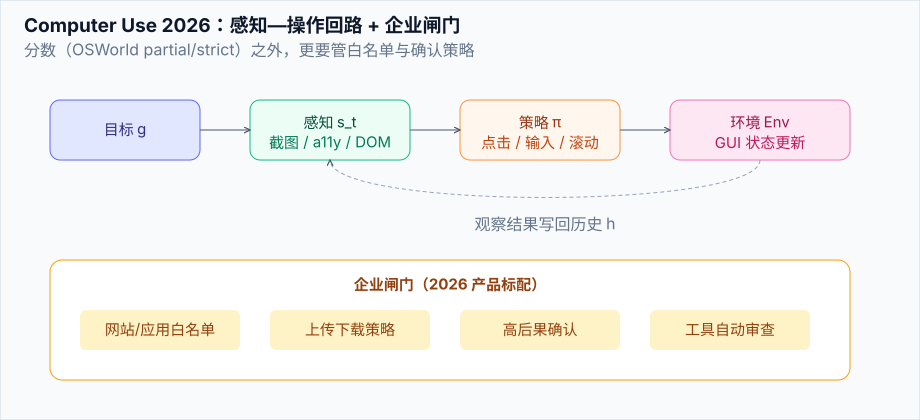

# Computer Use 2026

> **一句话**：2026 的 computer use 已从「能点 GUI」变成 **产品级代办能力**——更快的视觉定位、任务边界遵守、企业白名单与自动审查成为标配。

## 先看结论

- 前沿分数：OSWorld 2.0 上 Astra 约 72.6%（partial），Fable 5.1 公布 partial 77.9% / strict 41.7%（配置不同，不可直接混比）
- 效率同样关键：Astra 官方称较 GPT-5.6 Sol 约 **47% 更少时间/任务**
- 安全成为产品功能：网站/应用白名单、确认策略、对高后果动作的自动审查
- 与 [05 章基础](../05-tool-protocol/computer-use-browser-use.md) 的差别：本页对齐 2026 产品与读数

## 核心机制

### 1. 感知—定位—操作回路

$$
a_t = \pi\big(s_t^{\text{screen}},\; g,\; h_{<t}\big),\qquad
s_{t+1} = \mathrm{Env}(a_t)
$$

$$s_t^{\text{screen}}$$ 可以是截图、可访问性树、DOM 或三者混合。混合感知通常比纯像素更稳。

### 2. 记分：partial vs strict

| 模式 | 含义 | 影响 |
|---|---|---|
| partial | 部分子目标达成给部分分 | 分数更高，贴近过程质量 |
| strict | 全部达成才算过 | 更接近「能否托付」 |

读榜单必须看清模式，否则会把 77.9% partial 和 41.7% strict 误比。

### 3. 企业闸门

2026 主流部署默认：

1. 允许站点/应用列表  
2. 上传下载策略  
3. 确认策略（付款、删除、外发）  
4. 工具调用自动审查  

见 [2026 安全现实](../10-evaluation-safety/safety-incidents-2026.md)。

## 工程含义

1. **优先 API/工具，其次 GUI**——有官方 API 的系统不要用 computer use 硬点
2. **每任务截图预算**：视觉 token 很贵；滚动与局部截图策略要设计
3. **失败模式入库**：误点、过期元素、验证码，都要有恢复路径

## 参考资料

- [GPT-6 Astra](https://openai.com/index/gpt-6-astra/)
- [Claude Fable 5.1 and Mythos 5.1](https://www.anthropic.com/claude-fable-and-mythos-5-1)
- [OSWorld](https://os-world.github.io/)
- [Anthropic Computer Use](https://docs.anthropic.com/en/docs/agents-and-tools/computer-use)

## 相关知识点

- [Computer Use / Browser Use](../05-tool-protocol/computer-use-browser-use.md)
- [通用 Agent 产品](../12-applications/general-agent-products.md)
- [评估 2026](eval-2026.md)
