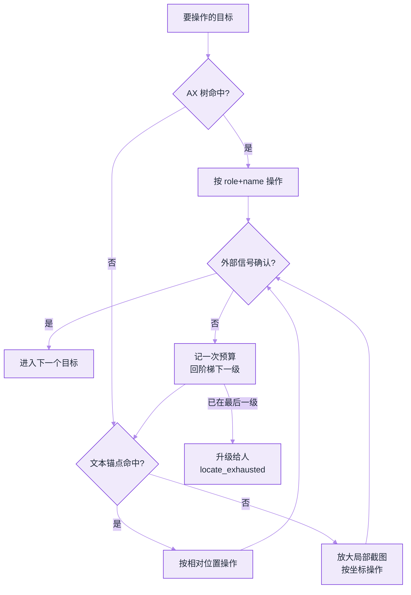

# Computer Use 2026


**一句话**：2026 的 computer use 已从「能点 GUI」变成 **产品级代办能力**——更快的视觉定位、任务边界遵守、企业白名单与自动审查成为标配。


## 先看结论

- 前沿分数：OSWorld 2.0 上 Astra 约 72.6%（partial），Fable 5.1 公布 partial 77.9% / strict 41.7%（配置不同，不可直接混比）
- 效率同样关键：Astra 官方称较 GPT-5.6 Sol 约 **47% 更少时间/任务**
- 安全成为产品功能：网站/应用白名单、确认策略、对高后果动作的自动审查
- 与 [05 章基础](../05-tool-protocol/computer-use-browser-use.md) 的差别：本页对齐 2026 产品与读数


*《图：左半是经典感知—操作回路，右半是 2026 新加的企业闸门——白名单、上传下载策略、高后果确认；分数之外，闸门才是产品差异》*


**同一系统的两个口径不能混比**：Fable 5.1 在 OSWorld 2.0 上 partial **77.9%**、strict **41.7%**，差的 36 个百分点不是「再优化一版」能补的，而是计分方式不同。选型时先按你的容错场景挑口径（能容忍半途失败的看 partial，要直接托付的看 strict），再比模型；跨厂商读数还要连「截图频率」与「预算设置」一起对齐。


## 核心机制

### 1. 感知—定位—操作回路

$$
a_t = \pi\big(s_t^{\text{screen}},\; g,\; h_{<t}\big),\qquad
s_{t+1} = \mathrm{Env}(a_t)
$$

$$s_t^{\text{screen}}$$ 可以是截图、可访问性树、DOM 或三者混合。混合感知通常比纯像素更稳。

### 2. 记分：partial vs strict

| 模式 | 含义 | 影响 |
|---|---|---|
| partial | 部分子目标达成给部分分 | 分数更高，贴近过程质量 |
| strict | 全部达成才算过 | 更接近「能否托付」 |

读榜单必须看清模式，否则会把 77.9% partial 和 41.7% strict 误比。

### 3. 企业闸门

2026 主流部署默认：

1. 允许站点/应用列表  
2. 上传下载策略  
3. 确认策略（付款、删除、外发）  
4. 工具调用自动审查  

见 [2026 安全现实](../10-evaluation-safety/safety-incidents-2026.md)。

### 4. 定位失效的恢复阶梯

GUI 自动化的头号故障不是「模型不会点」，而是**上一次截图里的元素这一次不在了**：页面异步渲染、列表重排、弹窗遮挡、滚动位置漂移都会让坐标失效。生产实现普遍按阶梯降级，而不是原地重试同一个坐标。

这个例程通常叫作 `act_with_recovery`，三个入参：环境、目标、预算。它的控制流全部信息量就是下面这份契约（**形状示意，不是某个 SDK 的完整实现**）——`locate`、`act`、`verify`、`spend` 四个动作在阶梯的每一级重复一次，四级走完仍未成功就升级：

```json
{
  "target": "语义描述，例：「提交」按钮右侧那个开关",
  "ladder": ["ax", "text_anchor", "zoom", "human"],
  "per_level": {
    "locate": "env.locate —— method 逐级换成 ladder 里的下一项，取不到引用就跳到下一级",
    "act": "env.act —— 点击 / 输入 / 选择",
    "verify": "env.changed_as_expected —— 截图区域 diff + 状态断言，两者都过才算成功",
    "budget": "budget.spend —— 每级记一次账，防止无限重试"
  },
  "on_exhausted": { "action": "env.escalate", "reason": "locate_exhausted" }
}
```

三条要点：

1. **可访问性树（AX tree）优先于像素**：AX 节点带 role 与 name，页面重排后仍能按语义找到；纯坐标只在没有 AX 的原生应用里兜底。
2. **文本锚点比坐标稳**：「点『提交』右侧那个开关」这种描述，重排后命中率明显高于绝对坐标——写提示词时就把目标描述成语义锚点。
3. **判定成功要独立于模型自述**：模型说「已提交」不算，要用截图区域 diff、URL 变化、后端状态查询这类外部信号确认，否则会把幻觉当成完成。

### 5. 预算是三维的

只限轮次的护栏会在「第 3 步就烧光 token」时失效。2026 的实现通常同时卡三个维度，任一触顶即停：

$$
B=\min\big(N_{\text{steps}},\; T_{\text{visual-token}},\; W_{\text{wall-clock}}\big)
$$

再加一条**进展判据**：连续 $$k$$ 步（经验上取 2–3）页面状态没有可检测变化，就判定为原地打转而提前终止——这一步比单纯放宽轮次更省成本，因为它砍掉的正是「反复截图反复滚动」的无效循环。

## 分步演示：目标「『提交』右侧那个开关」怎么一层层降级



*《图：四级阶梯换的是「定位方式」而不是「重发同一个坐标」；判定权在截图 diff 与后端状态，不在模型自述》*




#### 第 1 级 `ax`：先读可访问性树

第一级把 `method` 设成 `ax`，在可访问性树里按 role 与 name 找控件。页面重排、换主题、窗口移动都不影响语义命中，而且这一级**不产生截图**，视觉 token 成本近乎为零——所以它永远排在最前。只有没有 AX 树的原生应用才掉到后面的像素路径。




#### 第 2 级 `text_anchor`：把目标写成相对描述

AX 树里没有这个节点（自绘控件常见），就换成「『提交』右侧那个开关」这类文本锚点 + 相对方位。重排之后的命中率明显高于绝对坐标，前提是**你在提示词里一开始就用语义锚点描述目标**，而不是让模型报一组 (x, y)。




#### 第 3 级 `zoom`：局部放大再定位

小控件、高 DPI 缩放、滚动位置漂移都靠这一级兜。代价要算清：多一次渲染、多一份局部截图的视觉 token，所以它排在语义方式之后、人工之前，而不是「一失败就放大重试」。




#### 第 4 步：判定必须独立于模型

每一级 `act` 之后立刻问 `changed_as_expected`：截图区域 diff、URL 变化、后端状态查询三类外部信号交叉确认。模型说「已提交」不算数——把幻觉当完成，是这一层最贵的错误，因为它会让后续步骤在错误前提上继续花钱。




#### 第 5 级 `human`：升级时带上 reason

三级机器方式全失败（或预算耗尽）才走 `env.escalate` 升级，`reason` 固定写 `locate_exhausted`。失败原因要收敛成**枚举**而不是自由文本：运维要按 reason 分派「页面改版了」和「会话断了」这两类完全不同的工单，`reason=定位失败` 这种写法没法分派。



## 预算先触哪根轴（点标签切换）

上一节那个取小值公式的价值在于：**哪根轴先触顶，直接告诉你该修什么**，而不是一律放宽轮次。



每步都很省、但任务停在半路。症状是「步骤数刚好卡在限制上，且最后一步仍是有效动作」——说明任务本身超出单次预算，该拆目标或改走有 API 的路径；单纯加轮次只是把钱花到下一个上限。



典型的「第 3 步就烧光预算」。根因几乎都是每步截全屏：视觉 token 随分辨率平方级增长。对策是滚动后只截变化区域、先取 AX 树再按需截图，而不是换更便宜的模型——感知预算没管住，换模型只是把浪费搬到别处。



步数与 token 都没超，人先等不住了。通常卡在同步等待：页面异步加载、验证码、外部审批。这一档的正解是把「等待」显式化成状态（挂起后重查），而不是把 GUI 循环加速到把别人的后端打爆。



连续 $$k$$ 步（经验取 2–3）页面状态无可检测变化即提前终止。它砍掉的正是「反复截图反复滚动」这类无效循环，比放宽任何一根轴都省成本。注意它依赖上一节的独立判定信号：拿模型自述当进展判据，等于没装这个闸。



## 常见误区

- ❌ **有 API 却硬用 GUI**：GUI 是「没有接口时的兜底」，不是更高级的能力。同一动作走 API 少两次截图往返，且不会因改版失效。
- ❌ **把 partial 分数当可托付度**：partial 77.9% 与 strict 41.7% 是同一系统的两种口径，选型要按你的容错场景挑口径，不能混比。
- ❌ **每步都截全屏**：视觉 token 随分辨率平方级增长；滚动后只截变化区域，或先取 AX 树再按需截图。
- ❌ **确认弹窗交给模型自己判断**：付款、删除、外发这三类动作的确认必须由 harness 侧的闸门触发，而不是模型「觉得需要问」。

## 小练习

给「在网页报销系统里提交一张差旅发票」设计 computer use 方案：写出感知方式（AX/DOM/截图各承担什么）、四级定位阶梯的具体判据、三维预算的取值，以及哪一步必须停下来问人。

## 工程含义

1. **优先 API/工具，其次 GUI**——有官方 API 的系统不要用 computer use 硬点
2. **每任务截图预算**：视觉 token 很贵；滚动与局部截图策略要设计
3. **失败模式入库**：误点、过期元素、验证码，都要有恢复路径

## 参考资料

- [GPT-6 Astra](https://openai.com/index/gpt-6-astra/)
- [Claude Fable 5.1 and Mythos 5.1](https://www.anthropic.com/claude-fable-and-mythos-5-1)
- [OSWorld](https://os-world.github.io/)
- [Anthropic Computer Use](https://docs.anthropic.com/en/docs/agents-and-tools/computer-use)

## 相关知识点

- [Computer Use / Browser Use](../05-tool-protocol/computer-use-browser-use.md)
- [通用 Agent 产品](../12-applications/general-agent-products.md)
- [评估 2026](eval-2026.md)

