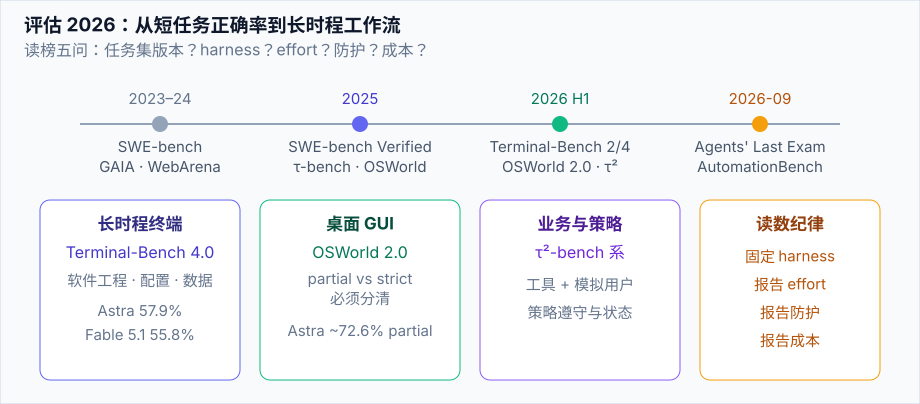

# 评估 2026：基准代际

> **一句话**：2026 的 Agent 榜单主流已从「短任务正确率」转向 **长时程终端 / 桌面 / 科研工作流**，并强制披露 harness、effort 与防护是否干预。

## 先看结论

- **Terminal-Bench 4.0**：终端复杂任务（软件工程、系统配置、数据分析）的当前硬通货；Astra 57.9%、Fable 5.1 55.8% 为厂商公布量级
- **OSWorld 2.0**：真实桌面 GUI；必须区分 partial / strict 记分
- **SWE-bench 系**：Verified 仍是仓库修复标配；更难的 Pro / DeepSWE 等用于拉开前沿差距
- **τ-bench → τ²-bench**：工具 + 用户模拟 + 策略遵守，客服/业务 Agent 必看
- **Agents' Last Exam / AutomationBench**：真实软件里的专业知识工作
- 读 2026 榜单五问：任务集版本？harness？effort？防护是否开启？成本？

## 核心机制：为什么旧读法失效

### 1. 长时程把方差放大

设单步成功率为 $$p$$，独立近似下 $$T$$ 步任务成功率：

$$
P(\text{success}) \approx p^{T}
$$

$$p=0.98$$、$$T=50$$ 时只剩约 36%。这解释了为何「单元测试全过」的模型在多小时任务上仍会崩——**错误恢复与状态管理**成为一等公民（见 [错误恢复与重试](../07-planning/error-recovery-retry.md)）。

### 2. Cost–Accuracy 曲线取代单点

2026 厂商报告常见形式：

$$
(\text{score}(e),\; \text{cost}(e)),\quad e\in\{\text{low},\text{med},\text{high},\ldots\}
$$

选型应最大化业务效用，而不是最大分：

$$
e^{*}=\arg\max_{e}\; U\big(\text{score}(e),\; \text{cost}(e),\; \text{latency}(e)\big)
$$

### 3. 防护干预 = 分数的一部分

生产防护开启后，网安/生物等双用任务可能被拒绝或改道。评测配置（防护关）与用户真实体验（防护开）可以差出两位数百分点——**榜单必须标注**。

## 2026 应纳入视野的基准

| 基准 | 考什么 | 为何重要 |
|---|---|---|
| Terminal-Bench 4.0 | 长终端任务 | 前沿编码/运维硬指标 |
| OSWorld 2.0 | 桌面 GUI | computer use 主战场 |
| SWE-bench Verified / Pro | 仓库修复 | 工程可信基线 |
| DeepSWE | 更难软件工程 | 拉开前沿 |
| τ²-bench | 工具 + 模拟用户 + 策略 | 业务 Agent |
| Agents' Last Exam | 真实专业软件任务 | 知识工作 |
| AutomationBench | 业务流程自动化 | 企业场景 |
| ARC-AGI-3 | 新颖环境适应 | 抽象推理（Astra 99.9%） |
| FrontierMath Tier 4 | 数学 | 科研推理 |
| ExploitBench / ExploitGym | 漏洞利用能力 | 安全阈值治理 |

> 第 10 章 [基准测试总览](../10-evaluation-safety/benchmarks.md) 仍讲方法论；本页强调 **2026 代际清单与读法**。

## 工程含义

1. **内测集对齐 2026 协议**：长时程 + 可执行判分 + 成本日志，而不是 10 条短 QA
2. **固定 harness 做 A/B**：换模型不换 harness，才能归因
3. **记录防护模式**：研发榜与生产榜分开

## 参考资料

- [Terminal-Bench 4.0](https://www.tbench.ai/)
- [GPT-6 Astra 发布（含多基准表）](https://openai.com/index/gpt-6-astra/)
- [Claude Fable 5.1 and Mythos 5.1](https://www.anthropic.com/claude-fable-and-mythos-5-1)
- [OSWorld](https://os-world.github.io/)
- [τ-bench](https://github.com/sierra-research/tau-bench)

## 相关知识点

- [基准测试总览](../10-evaluation-safety/benchmarks.md)
- [Agent 评估指标](../10-evaluation-safety/evaluation-metrics.md)
- [2026 前沿模型地图](frontier-models-2026.md)
- [持续评估](../11-engineering/continuous-evaluation.md)
