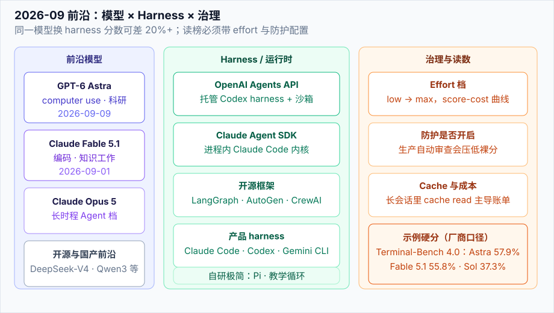

# 2026 前沿模型地图

> **一句话**：2026-09 的前沿不再是「谁 MMLU 高」，而是谁在 **computer use、长时程编码、科研工具链、企业治理** 上同时过关——代表是 GPT-6 Astra 与 Claude Fable 5.1。

## 先看结论

- **GPT-6 Astra**（`gpt-6-astra`，2026-09-09）：OpenAI 当前最强工作型模型；computer use / 浏览 / 软件工程 / 网络安全 / 科研全面拉高；首次触达 Preparedness **Critical 网络安全**阈值
- **Claude Fable 5.1 / Mythos 5.1**（`claude-fable-5-1`，2026-09-01）：同一底模、不同防护档；Fable 面向大众，Mythos 走可信访问（网安 / 生命科学）
- **Claude Opus 5**（2026-07-24）：长时程 Agent 的 Opus 档，Fable 5.1 出现前的主力
- 读榜单必须带上 **harness + effort + 防护是否干预**；Astra 与 Fable 的官方数字都标明了这些条件
- 缓存读价格成为 Agent 成本主战场：Fable 5.1 将 cache read 降至约 **$0.25 / 1M**（较 Fable 5 低 75%），高 agentic 负载总成本可降约 45%

## 一张对比表（2026-09 官方口径）

| 维度 | GPT-6 Astra | Claude Fable 5.1 | Claude Opus 5 | GPT-5.6 Sol（上一代对照） |
|---|---|---|---|---|
| 定位 | 工作 / computer use / 科研 / 网安 | 编码与知识工作（GA） | 长时程 Opus 档 | Astra 前一代前沿 |
| API 名 | `gpt-6-astra` | `claude-fable-5-1` | Opus 系列 | GPT-5.6 Sol |
| 标准价（in/out per 1M） | $10 / $50 | $10 / $50 | 随档位 | 低于 Astra（见官方页） |
| 缓存读 | 有 cache 价 | **$0.25**（降 75%） | — | — |
| Terminal-Bench 4.0 | **57.9%** | 55.8%（Mythos 60.9%） | 52.6% | 37.3% |
| OSWorld 2.0 | 72.6%（部分分） | 77.9% partial / 41.7% strict | 75.4% partial | — |
| 特长 | 速度与判断、网安 Critical | 长任务可读性、缓存经济性 | 历史主力 / 部分双用任务回退 | 对照基线 |

> 数字均来自厂商发布页，**不是**第三方统一 harness 复测。比较时务必看脚注中的 effort、防护与任务集版本。

## 核心机制：为什么「effort × 防护 × harness」决定分数

2026 前沿评测几乎都引入了 **effort 档**（low / medium / high / xhigh / max）。对固定任务，厂商常给出 accuracy–cost 曲线而非单点：

$$
\text{有效产出} \;\approx\; \frac{\text{任务成功率}(\text{effort})}{\text{期望成本}(\text{effort},\;\text{cache hit})}
$$

其中期望成本近似为：

$$
C \;\approx\; p_{\text{in}} N_{\text{in}} + p_{\text{cache}} N_{\text{cache}} + p_{\text{out}} N_{\text{out}} + C_{\text{retry}}\cdot \mathbb{P}(\text{retry})
$$

工程含义：

1. **高 effort 不是默认最优**——Fable 5.1 在 low/medium 已能追平甚至超过 Fable 5 high，成本更低
2. **cache hit 率** 在长 Agent 会话中主导账单；这也是 Fable 5.1 把 cache read 降价的战略原因
3. **防护干预会压低裸分**——Fable 5.1 生产防护开启后，部分网安/生物任务被改道或拒绝，榜单数字会低于「防护关闭」的研究配置

## GPT-6 Astra：必须知道的工程点

| 能力 | 事实 | 出处 |
|---|---|---|
| Computer use | OSWorld 2.0 约 72.6%，较 GPT-5.6 Sol 约省 47% 时间/任务 | [Astra 发布页](https://openai.com/index/gpt-6-astra/) |
| 编码 | Terminal-Bench 4.0 **57.9%**；DeepSWE v1.1 约 74% 量级（Datacurve 引述） | 同上 |
| 抽象推理 | ARC-AGI-3 **99.9%**（官方 harness 设定） | 同上 |
| 数学 | FrontierMath Tier 4 (v2) 约 97.6–98% | 同上 |
| 网络安全 | ExploitBench 100%；首个 **Critical** 能力阈值模型 | 同上 + Preparedness |
| 对齐 | 内部 computer-use 安全基准：无意结果率较 GPT-5.6 Sol 低 **89%** | 同上 |
| 企业控制 | 网站/桌面应用白名单、上传下载管控、确认策略、自动审查 | 同上 |
| 价格 | $10 / $50 per 1M；Fast mode 最高约 2× 速度、2× 价格 | 同上 |

**上下文工程新特性**：Codex 为 Astra 引入跨上下文窗口 **notes**——压缩不再把历史抹成单一摘要，旧窗口仍可检索。这直接回应了长会话里「为什么上次修失败」丢失的问题（见 [上下文工程](../06-memory-rag/context-engineering.md)）。

## Claude Fable 5.1 / Mythos 5.1：必须知道的工程点

| 能力 | 事实 |
|---|---|
| 与 Fable 5 关系 | 同代升级；low/medium effort 即可接近旧 high 档表现 |
| 编码 | Terminal-Bench 4.0 55.8%；CursorBench 3.2 约 73.4%（max effort） |
| 科研 | Mythos 可做高亲和力蛋白设计；并行优化开源生物信息模型 GPU kernel |
| 安全策略 | 生物与网安能力走 **可信访问**（CVP / LSVP）；Fable 允许发现漏洞、不允许开发 exploit |
| 企业隐私 | Enterprise Frontier Safeguards（EFS）：数据落客户云，接近 ZDR 且保留滥用检测 |
| 反蒸馏 | 新 API 账号不能在保留思考轨迹的前提下改写历史上下文 |
| 价格 | 标准价与 Fable 5 同档；**cache read $0.25/1M** |

## 直觉解释

把 2026 前沿想成「特种部队采购」：你买的不只是一个更聪明的大脑，而是 **大脑 + 标准装备（harness）+ 交战规则（防护）+ 后勤单价（cache/effort）**。只比大脑的 IQ，会买错整套系统。

## 工程含义

1. **选型矩阵先写场景**：长时程无人值守编码 → 看 Fable 5.1 / Opus 5 与 Agents API；桌面/浏览器代办 → 看 Astra computer use；科研仪器 → 看 Mythos + MHS
2. **把 effort 写进你的成本模型**，不要用「默认档」估算月账单
3. **企业默认关 Astra / Fable 的高危能力**是正常态；上线前先配确认策略与工具白名单
4. **裸分不可直接横比**：官方表格里的防护、harness、任务版本都不同

## 常见误区

- ❌ 「Astra 全面碾压 Fable」：OSWorld 等项 Fable 公布分更高；强项不同
- ❌ 「分数高就能直接上生产」：Critical 网安能力意味着更严的部署闸门
- ❌ 「缓存价不重要」：高 agentic 负载里 cache read 往往是最大成本项

## 参考资料

- [GPT-6 Astra: A new generation of intelligence](https://openai.com/index/gpt-6-astra/)
- [GPT-6 Astra: The next generation in intelligence for work](https://openai.com/index/gpt-6-astra-next-generation-work/)
- [Claude Fable 5.1 and Mythos 5.1](https://www.anthropic.com/claude-fable-and-mythos-5-1)
- [Claude Opus 5](https://www.anthropic.com/news/claude-opus-5)
- [Introducing the Agents API](https://openai.com/index/introducing-the-agents-api/)
- [Terminal-Bench 4.0](https://www.tbench.ai/)

## 相关知识点

- [OpenAI Agents API](openai-agents-api.md)
- [Claude Agent SDK](claude-agent-sdk.md)
- [模型原生 vs 自建 Harness](model-native-vs-harness.md)
- [评估 2026](eval-2026.md)
- [推理、量化与部署](../03-llm/inference-quantization-deployment.md)
