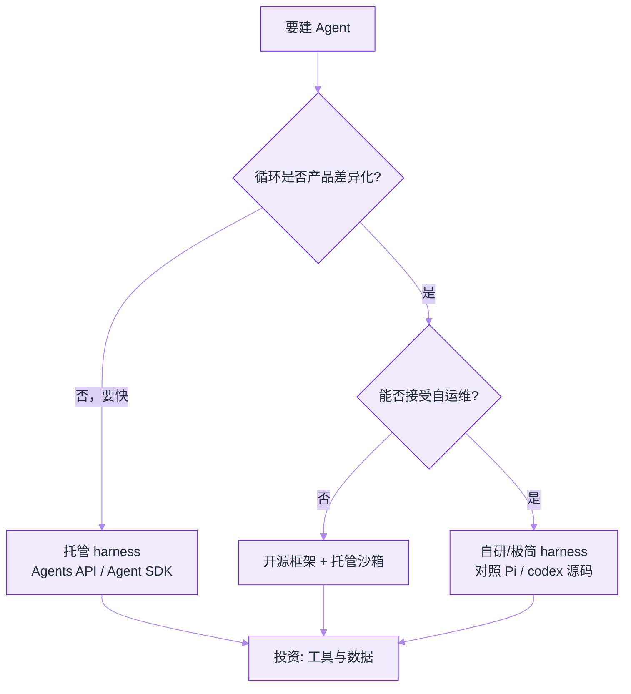

# 模型原生 vs 自建 Harness


**一句话**：2026 年 Agent 架构的主分叉是——**模型厂商托管 harness**（Agents API / Agent SDK / Managed Agents）还是 **你自己（或开源框架）组装循环**。


## 定义与边界

| 类型 | 定义 | 典型 |
|---|---|---|
| 模型原生 / 托管 harness | 循环、压缩、工具治理由模型厂商版本化提供 | OpenAI Agents API、Claude Agent SDK、Managed Agents |
| 开源框架 harness | 你用库组装节点、状态图、工具 | LangGraph、AutoGen、CrewAI、DSPy |
| 自研极简 harness | 自己写 `while` 循环与工具表 | Pi、教学实现、深度定制产品 |
| 产品化编码 harness | 完整终端/IDE 产品内嵌 harness | Claude Code、Codex、Gemini CLI、DeepSeek Harness |

**什么不算托管 harness**：只是 `chat.completions` 多包一层重试——没有压缩策略、权限管道、会话恢复的产品级循环，仍属「裸 API + 胶水」。

## 与相邻概念的对比

| 维度 | 托管 harness | 开源框架 | 自研循环 |
|---|---|---|---|
| 上手速度 | 最快 | 中 | 慢 |
| 行为可控性 | 受版本路线约束 | 高 | 最高 |
| 运维负担 | 低（厂商管） | 中 | 高 |
| 锁定风险 | 高 | 低 | 无 |
| 适合 | 要快速上线、跟前沿模型 | 要独特工作流与私有部署 | 要极致定制或教学 |

## 决策流程

*《图：两问定路线——循环不差异化就买托管，差异化再问自运维能不能接受；三条出口最后都汇到投资工具与数据》*

## 一个具体例子

同一需求「夜间巡检仓库 PR 并开修复草稿」：

- **托管**：Agents API 一次 `sessions.create`，配 MCP 读 CI、子 Agent 并行分析——你只写工具与验收文件
- **框架**：LangGraph 定义「列表 → 分诊 → 修复 → 验证」状态图，自己接沙箱与重试
- **自研**：抄 Pi 的四原子工具 + 300 行循环，为你的 monorepo 加专用 grep 工具

三条路都能通；差别在 **谁拥有压缩与权限的长期演进**。

## 锁定风险要落到三条接口面上

「厂商锁定」不是一句口号，它能被具体数出来。托管 harness 与你的代码之间通常只有三条缝：

| 接口面 | 锁定的表现 | 迁移前的自检问题 |
|---|---|---|
| 会话状态格式 | 历史、压缩摘要、工具记录是厂商私有结构 | 能不能把一次会话完整导出并重放？导出后还认得哪步是被压缩掉的吗？ |
| 工具 schema 方言 | 参数命名、流式约定、错误结构各家不同 | 同一套工具能否原样喂给另一个 harness（MCP 标准工具最省事）？ |
| 压缩与权限策略 | 什么时候截断、什么时候拒绝，黑盒决定 | 你能否拿到「这轮为什么丢了我的上下文」的可解释记录？ |

判断标准很实在：**把线上 20 个真实任务的 trace 导出，在另一个 harness 上重放**。跑得通、结果一致，锁定就低；跑不通，迁移成本就要写进今天的选型账里。

## 成本模型怎么拆

托管与自研的账单长得不一样，混在一起比必然误判。四项分开记：

$$
C_{\text{total}} = C_{\text{token}} + C_{\text{sandbox}} + C_{\text{eng}} + C_{\text{oncall}}
$$

- $$C_{\text{token}}$$：模型与 harness 侧的推理开销，托管通常按 token/会话计费，且**压缩策略会直接改变这一项**（同一任务，激进的上下文压缩可以少付一大截重复前缀）。
- $$C_{\text{sandbox}}$$：执行环境。托管多按秒计费，自研则是自己养容器池。
- $$C_{\text{eng}}$$：把循环写到能上生产的人力——工具表、重试、恢复、评测集。经验上这一项自研最高，且常被低估。
- $$C_{\text{oncall}}$$：值班与排错。托管把一部分故障转移给厂商，但也意味着故障时你只能等对方。

结论往往是：**任务量小、迭代快 → 托管省的是 $$C_{\text{eng}}$$；任务量大、行为要可控 → 自研省的是单位 $$C_{\text{token}}$$ 与 $$C_{\text{oncall}}$$ 的确定性**。

## 混合形态与换层的触发条件

2026 企业里最常见的不是三选一，而是**分层混装**：托管循环 + 自有 MCP 工具网关 + 内部审批链。触发把某一层换掉的信号也很具体：

1. **从托管抽回工具层**：当同一批工具要服务多个模型厂商（避免每家写一遍适配），就把它下沉为自建 MCP 网关。
2. **从托管抽回上下文层**：当合规要求「必须能解释这轮看到了什么」，而厂商只给结果不给拼装过程。
3. **从自研退回托管**：当 $$C_{\text{oncall}}$$ 持续高于模型账单，且你的循环并没有产品差异化——这时自研只是成本中心。

## 常见误区

- ❌ **把「包一层 API」当成用了托管 harness**：没有压缩策略、权限管道、会话恢复的封装，迁移成本与自研一样，收益却是零。
- ❌ **只看 token 单价选型**：单价低但循环啰嗦的 harness，一个任务的总账可能更高；要比 $$C_{\text{total}}$$。
- ❌ **以为开源就没有锁定**：框架的版本升级、状态图 API 变更同样会锁你，只是锁的方向从模型厂商换成了库作者。
- ❌ **一次定终身**：先托管跑通业务、再把有差异化价值的循环抽出来，是风险最低的路径。

## 小练习

列出你正在做的 Agent 项目：写出它当前落在哪一类 harness、三条接口面各自是否可导出，并用四项成本估一下「换成自研」在 12 个月后是省还是亏，说明关键假设。

## 工程含义

1. **Harness 已是采购项**：选型会写进安全评审与成本模型，不只是「技术偏好」
2. **开源仍关键**：托管黑盒出问题时，`openai/codex`、Pi、DeepSeek Harness 是解剖参照
3. **组合常见**：托管 harness + 自有 MCP 工具网关 + 内部审批，是 2026 企业默认形态

## 参考资料

- [Introducing the Agents API](https://openai.com/index/introducing-the-agents-api/)
- [Agent SDK overview](https://docs.claude.com/en/api/agent-sdk/overview)
- [earendil-works/pi](https://github.com/earendil-works/pi)
- [openai/codex](https://github.com/openai/codex)

## 相关知识点

- [什么是 AI Agent](../02-agent-basics/what-is-agent.md)
- [编程 Agent](../12-applications/coding-agent.md)
- [OpenAI Agents API](openai-agents-api.md)
- [Claude Agent SDK](claude-agent-sdk.md)

