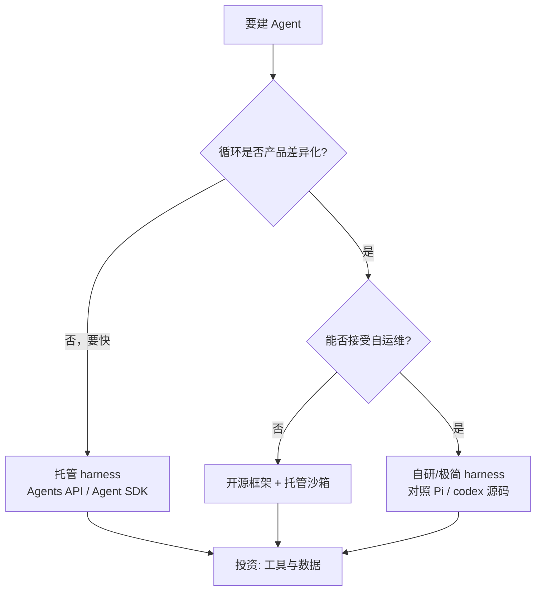

# 模型原生 vs 自建 Harness

> **一句话**：2026 年 Agent 架构的主分叉是——**模型厂商托管 harness**（Agents API / Agent SDK / Managed Agents）还是 **你自己（或开源框架）组装循环**。

## 定义与边界

| 类型 | 定义 | 典型 |
|---|---|---|
| 模型原生 / 托管 harness | 循环、压缩、工具治理由模型厂商版本化提供 | OpenAI Agents API、Claude Agent SDK、Managed Agents |
| 开源框架 harness | 你用库组装节点、状态图、工具 | LangGraph、AutoGen、CrewAI、DSPy |
| 自研极简 harness | 自己写 `while` 循环与工具表 | Pi、教学实现、深度定制产品 |
| 产品化编码 harness | 完整终端/IDE 产品内嵌 harness | Claude Code、Codex、Gemini CLI、DeepSeek Harness |

**什么不算托管 harness**：只是 `chat.completions` 多包一层重试——没有压缩策略、权限管道、会话恢复的产品级循环，仍属「裸 API + 胶水」。

## 与相邻概念的对比

| 维度 | 托管 harness | 开源框架 | 自研循环 |
|---|---|---|---|
| 上手速度 | 最快 | 中 | 慢 |
| 行为可控性 | 受版本路线约束 | 高 | 最高 |
| 运维负担 | 低（厂商管） | 中 | 高 |
| 锁定风险 | 高 | 低 | 无 |
| 适合 | 要快速上线、跟前沿模型 | 要独特工作流与私有部署 | 要极致定制或教学 |

## 决策流程

## 一个具体例子

同一需求「夜间巡检仓库 PR 并开修复草稿」：

- **托管**：Agents API 一次 `sessions.create`，配 MCP 读 CI、子 Agent 并行分析——你只写工具与验收文件
- **框架**：LangGraph 定义「列表 → 分诊 → 修复 → 验证」状态图，自己接沙箱与重试
- **自研**：抄 Pi 的四原子工具 + 300 行循环，为你的 monorepo 加专用 grep 工具

三条路都能通；差别在 **谁拥有压缩与权限的长期演进**。

## 工程含义

1. **Harness 已是采购项**：选型会写进安全评审与成本模型，不只是「技术偏好」
2. **开源仍关键**：托管黑盒出问题时，`openai/codex`、Pi、DeepSeek Harness 是解剖参照
3. **组合常见**：托管 harness + 自有 MCP 工具网关 + 内部审批，是 2026 企业默认形态

## 参考资料

- [Introducing the Agents API](https://openai.com/index/introducing-the-agents-api/)
- [Agent SDK overview](https://docs.claude.com/en/api/agent-sdk/overview)
- [earendil-works/pi](https://github.com/earendil-works/pi)
- [openai/codex](https://github.com/openai/codex)

## 相关知识点

- [什么是 AI Agent](../02-agent-basics/what-is-agent.md)
- [编程 Agent](../12-applications/coding-agent.md)
- [OpenAI Agents API](openai-agents-api.md)
- [Claude Agent SDK](claude-agent-sdk.md)
