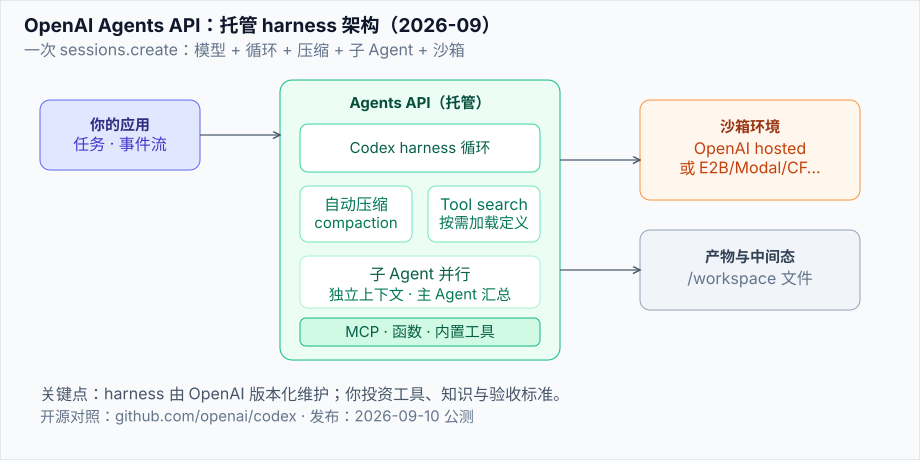
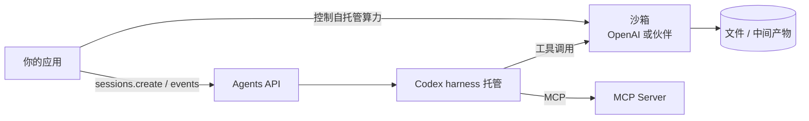

# OpenAI Agents API

> **一句话**：2026-09-10 公测的托管 Agent 运行时——把驱动 Codex 的 harness 与沙箱基础设施，通过一次 API call 开放给开发者。



## 先看结论

- 本质：**模型 + 托管 harness + 可选托管/自托管沙箱**；OpenAI 维护 harness，你提供工具、知识与工作流
- 开箱能力：长会话 **自动压缩**、**tool search**、**programmatic tool calling**、**子 Agent 并行**、MCP 原生接入
- 计费：Agents API 本身不额外收费，按 token 与工具用量计费
- 开源底座：harness 逻辑可对照 [`openai/codex`](https://github.com/openai/codex) 阅读
- 对手册的意义：这是继 [Claude Agent SDK](claude-agent-sdk.md) 之后，第二条「模型厂商亲自托管 harness」的主路径

## 适用场景与前置条件

- 任务需要**跑数小时**、多步工具调用、文件落盘与中间产物
- 你不希望自己维护 compaction、重试、子 Agent 编排
- 环境可以用 OpenAI hosted sandbox，或 E2B / Modal / Cloudflare / Daytona / Vercel 等伙伴沙箱
- 已有 OpenAI API Key；模型示例常用 `gpt-6-astra`

## 可运行示例

```javascript
import OpenAI from "openai";

const client = new OpenAI();

const session = await client.beta.agents.sessions.create({
  agent: {
    model: "gpt-6-astra",
    tools: [
      {
        type: "mcp",
        server_label: "observability",
        transport: {
          type: "http",
          server_url: "https://observability.example.com/mcp",
        },
      },
    ],
    multi_agent: { enabled: true, max_concurrent_subagents: 3 },
  },
  vault_ids: ["vault_YOUR_VAULT_ID"],
  environment: {
    type: "openai_hosted",
    capability_directories: ["/workspace/capabilities/skills"],
  },
  input:
    "Investigate service-api’s elevated 5xx rate over the last 30 minutes. " +
    "Delegate deployment, error, and dependency analysis to subagents. " +
    "Save findings, evidence, and recommended mitigation in /workspace/outputs.",
});
```

字段要点：

| 字段 | 作用 |
|---|---|
| `agent.model` | 前沿模型，如 `gpt-6-astra` |
| `agent.tools` | MCP / 自定义函数 / 内置工具（如 web search） |
| `agent.multi_agent` | 打开子 Agent，并限制并发 |
| `environment` | `openai_hosted` 或自托管 / 伙伴沙箱 |
| `input` | 任务自然语言；长任务可异步续跑 |

## 核心机制

### 1. 托管 harness 解决什么

自建 Agent 最贵的不是模型调用，而是：

1. 上下文窗口将满时的 **压缩策略**（丢什么、留什么）
2. 工具列表变长后的 **token 与注意力税**
3. 多工具结果的 **并行与过滤**
4. 长任务崩溃后的 **恢复点**

Agents API 把这四件事做成版本化能力，随模型升级一起演进。

### 2. 自动压缩（compaction）

会话逼近上下文上限时，harness 自动压缩早期上下文，保留继续任务所需信息。你不必再自写摘要器；但**关键约束与验收标准**仍应写在任务指令或落盘文件里，不要只依赖模型记忆。

### 3. Tool search 与 programmatic tool calling

- **Tool search**：按需加载相关工具定义，降低全量 tools 的 token 税，并尽量保住前缀缓存
- **Programmatic tool calling**：在代码里并行调用、串联相关操作、过滤/合并结果，只把相关片段送回上下文

这与 DeepSeek Harness 的 PTC 模式、以及本手册 [工具选择与路由](../07-planning/tool-selection-routing.md) 讨论的方向一致：**模型出意图，代码做批量与裁剪**。

### 4. 多 Agent（子 Agent）

主 Agent 把可并行子任务拆给子 Agent；每个子 Agent **独立上下文**，主 Agent 汇总。官方客户反馈中出现「评估分 0.71→0.85」「约 4× 延迟下降」等说法——属于特定业务自测，不能当作普遍保证，但说明「观察与编排子 Agent」曾是自建方案的主要摩擦点。

## 架构图（文字版）



## 常见故障与排查

| 现象 | 可能原因 | 处理 |
|---|---|---|
| 长任务中途「失忆」 | 关键验收标准未落盘，仅存在于早期对话 | 把 DoD 写入 `/workspace` 文件；依赖 notes/压缩但不赌它 |
| 工具全量塞爆上下文 | 未启用 tool search，tools 过多 | 拆 MCP server；开 tool search；程序化过滤结果 |
| 子 Agent 结果互相矛盾 | 缺少统一事实源 | 指定共享文件/数据库为唯一事实源 |
| 沙箱冷启动慢 | 自托管资源规格不足 | 换伙伴沙箱档位或预热池 |
| 权限过宽 | 默认放行高危工具 | 接确认策略与工具白名单（见 [权限与沙箱](../10-evaluation-safety/permission-sandbox.md)） |

## 工程含义

1. **Harness 商品化**：09 章的开源框架与本 API 是互补——框架给你组装自由，托管 harness 给你省运维
2. **对照开源学习**：读 `openai/codex` 仍是最便宜的 harness 教科书之一（见 [编程 Agent](../12-applications/coding-agent.md)）
3. **安全面扩大**：托管沙箱 ≠ 免责任；MCP server 与 vault 密钥仍是你的攻击面（见 [提示注入](../10-evaluation-safety/prompt-injection.md)）

## 参考资料

- [Introducing the Agents API](https://openai.com/index/introducing-the-agents-api/)（2026-09-10）
- [Agents API overview（开发者文档）](https://developers.openai.com/api/docs/guides/agents-api/overview)
- [openai/codex](https://github.com/openai/codex)
- [GPT-6 Astra](https://openai.com/index/gpt-6-astra/)

## 相关知识点

- [Claude Agent SDK](claude-agent-sdk.md)
- [模型原生 vs 自建 Harness](model-native-vs-harness.md)
- [MCP](../05-tool-protocol/mcp.md)
- [沙箱与执行环境](../16-ai-infrastructure/sandbox-execution-environments.md)
- [持久化执行与 Agent 运行时](../16-ai-infrastructure/agent-runtime-durable-execution.md)
