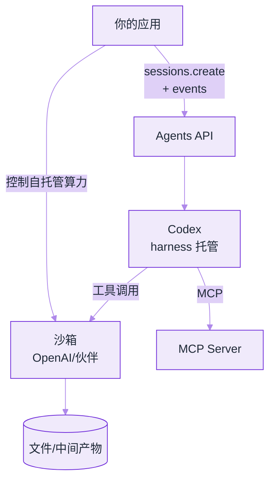
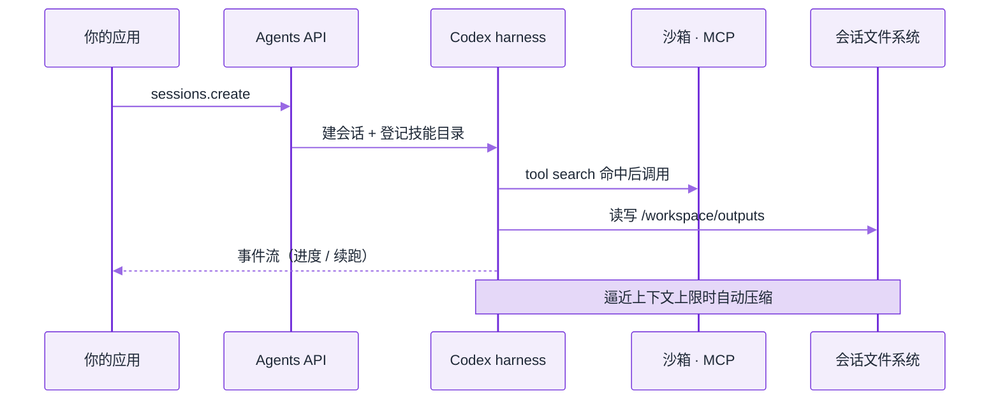

# OpenAI Agents API


**一句话**：2026-09-10 公测的托管 Agent 运行时——把驱动 Codex 的 harness 与沙箱基础设施，通过一次 API call 开放给开发者。



*《图：托管的边界要看清：harness 循环、自动压缩、tool search、子 Agent 并行都在 API 内，沙箱可选 OpenAI hosted 或 E2B/Modal》*
## 先看结论

- 本质：**模型 + 托管 harness + 可选托管/自托管沙箱**；OpenAI 维护 harness，你提供工具、知识与工作流
- 开箱能力：长会话 **自动压缩**、**tool search**、**programmatic tool calling**、**子 Agent 并行**、MCP 原生接入
- 计费：Agents API 本身不额外收费，按 token 与工具用量计费
- 开源底座：harness 逻辑可对照 [`openai/codex`](https://github.com/openai/codex) 阅读
- 对手册的意义：这是继 [Claude Agent SDK](claude-agent-sdk.md) 之后，第二条「模型厂商亲自托管 harness」的主路径

## 适用场景与前置条件

- 任务需要**跑数小时**、多步工具调用、文件落盘与中间产物
- 你不希望自己维护 compaction、重试、子 Agent 编排
- 环境可以用 OpenAI hosted sandbox，或 E2B / Modal / Cloudflare / Daytona / Vercel 等伙伴沙箱
- 已有 OpenAI API Key；模型示例常用 `gpt-6-astra`

## 一次 `sessions.create` 的真实形状

接入面只有一个入口：用 API Key 初始化 `openai` 客户端，然后打 `client.beta.agents.sessions.create`，一次调用换回一个 session。报文分四块——`agent` 决定「谁在跑、能用什么」，`environment` 决定「在哪跑」，`vault_ids` 决定「凭据从哪注入」，`input` 是任务本身。下面就是那次调用发出去的完整形状：

```json
{
  "agent": {
    "model": "gpt-6-astra",
    "tools": [
      {
        "type": "mcp",
        "server_label": "observability",
        "transport": {
          "type": "http",
          "server_url": "https://observability.example.com/mcp"
        }
      }
    ],
    "multi_agent": { "enabled": true, "max_concurrent_subagents": 3 }
  },
  "vault_ids": ["vault_YOUR_VAULT_ID"],
  "environment": {
    "type": "openai_hosted",
    "capability_directories": ["/workspace/capabilities/skills"]
  },
  "input": "Investigate service-api’s elevated 5xx rate over the last 30 minutes. Delegate deployment, error, and dependency analysis to subagents. Save findings, evidence, and recommended mitigation in /workspace/outputs."
}
```

三处值得停下来看：

- **`tools` 是异构的**：`type: "mcp"` 这条只声明「有个叫 `observability` 的 MCP server，走 `http` 传输，地址是 `https://observability.example.com/mcp`」，具体工具清单由对端在运行时给出。因此**报文里数不出模型到底能看到几个工具**——这个数量只能在运行时由 tool search 收敛（见下文机制 3）。
- **`max_concurrent_subagents: 3` 是硬上限而不是提示**：`input` 里恰好派了 deployment、error、dependency 三个方向，3 刚好够用；第 4 个子任务只能排队，不会抢跑。每个子 Agent 有独立上下文，主 Agent 只负责派发与汇总。
- **`input` 里的落盘路径是接口的一部分**：产物写 `/workspace/outputs`，技能登记在 `capability_directories` 指向的 `/workspace/capabilities/skills`——技能与产物住在同一个沙箱命名空间里，跨会话续跑时才读得回来。

字段要点：

| 字段 | 作用 |
|---|---|
| `agent.model` | 前沿模型，如 `gpt-6-astra` |
| `agent.tools` | MCP / 自定义函数 / 内置工具（如 web search） |
| `agent.multi_agent` | 打开子 Agent，并限制并发 |
| `environment` | `openai_hosted` 或自托管 / 伙伴沙箱 |
| `input` | 任务自然语言；长任务可异步续跑 |


**别把 `input` 当配置文件用**：验收标准（DoD）、工具白名单、子 Agent 拓扑应该写成自己仓库里的配置并落盘进 `/workspace`，而不是全塞进一句自然语言。上面这份示例里 `input` 只有三句、`max_concurrent_subagents` 只有 3——换到你自己的任务时，先把「落哪儿、能用啥、并行几个」这三件事定下来，再谈提示词。


## 核心机制

### 1. 托管 harness 解决什么

自建 Agent 最贵的不是模型调用，而是：

1. 上下文窗口将满时的 **压缩策略**（丢什么、留什么）
2. 工具列表变长后的 **token 与注意力税**
3. 多工具结果的 **并行与过滤**
4. 长任务崩溃后的 **恢复点**

Agents API 把这四件事做成版本化能力，随模型升级一起演进。

### 2. 自动压缩（compaction）

会话逼近上下文上限时，harness 自动压缩早期上下文，保留继续任务所需信息。你不必再自写摘要器；但**关键约束与验收标准**仍应写在任务指令或落盘文件里，不要只依赖模型记忆。

### 3. Tool search 与 programmatic tool calling

- **Tool search**：按需加载相关工具定义，降低全量 tools 的 token 税，并尽量保住前缀缓存
- **Programmatic tool calling**：在代码里并行调用、串联相关操作、过滤/合并结果，只把相关片段送回上下文

这与 DeepSeek Harness 的 PTC 模式、以及本手册 [工具选择与路由](../07-planning/tool-selection-routing.md) 讨论的方向一致：**模型出意图，代码做批量与裁剪**。

### 4. 多 Agent（子 Agent）

主 Agent 把可并行子任务拆给子 Agent；每个子 Agent **独立上下文**，主 Agent 汇总。官方客户反馈中出现「评估分 0.71→0.85」「约 4× 延迟下降」等说法——属于特定业务自测，不能当作普遍保证，但说明「观察与编排子 Agent」曾是自建方案的主要摩擦点。

## 架构图（文字版）



*《图：sessions.create 单向流进 Codex 再落到沙箱；产物回文件系统，只有自托管算力允许 App 直连沙箱、绕开厂商 harness》*

## 分步演示：一次「5xx 排查」从建会话到回读



*《图：一次 `create` 之后循环全在 API 内跑；应用只订阅事件流，中间产物落在沙箱文件系统，不回上下文》*




#### 第 1 步：一次调用换回一个会话

`beta.agents.sessions.create` 同步返回 session 句柄，之后没有「再发一轮」的固定接口——任务已经交给 harness。`environment.type=openai_hosted` 时沙箱按需拉起（冷启动慢的处理见下文故障表），`capability_directories` 下的技能被登记进会话，`vault_ids` 把凭据注入运行环境而不是写进提示词。




#### 第 2 步：主 Agent 拆方向，并发被上限卡住

`gpt-6-astra` 读 `input` 得到「30 分钟窗口 + deployment / error / dependency 三个方向」，先派发再汇总。`max_concurrent_subagents: 3` 意味着同时在跑的就是 3 个；子 Agent 各有独立上下文，主 Agent 看到的只有它们的结论，不是它们的过程。




#### 第 3 步：工具按命中装载，不整表进上下文

真要查指标时，才从 `observability` 这个 MCP server 里拉相关工具的定义。全量 tools 的 token 税与前缀缓存失效，是自建 harness 里最常见、也最难自察的两项浪费——它们不会报错，只会让每一轮都变贵变钝。




#### 第 4 步：并行与裁剪发生在代码里

programmatic tool calling 允许一个子 Agent 并行发多次查询、在代码里 join 与过滤，只把相关片段回填上下文。机制 3 那句「模型出意图，代码做批量与裁剪」在这里是实际发生的事：三个方向各查五项指标，回填进上下文的是一段合并后的摘要，而不是十五份原始响应——省下的那部分才是 tool search 之外的第二笔账。




#### 第 5 步：压缩与落盘同时发生

上下文逼近上限时 harness 自动压缩早期轮次，而「丢什么、留什么」不由你决定。所以 DoD、已排除的假设、下一步计划要写进 `/workspace/outputs`——故障表第一行「长任务中途失忆」的本质就是把验收标准只存在早期对话里。




#### 第 6 步：续跑、回读与账单

跑几小时的任务允许应用侧断开再按事件流续跑，恢复点在 API 那一侧。计费只按 token 与工具用量，Agents API 本身不额外收费——所以官方客户反馈里「约 4× 延迟下降」省下的是墙钟时间，不是账单；子 Agent 开得越多，token 那条线只会往上走。



## 四种配置，四种代价（点标签切换）



`multi_agent.enabled` 改 `false`：三个方向改由主 Agent 串行做。只有一份上下文，交叉引用更稳、结论更不容易自相矛盾；代价是墙钟时间按方向数近似线性上升，「约 4× 延迟下降」那部分收益直接归零。子任务其实只有一个方向、或者共享事实源还没定下来时，就该关。



`max_concurrent_subagents: 3 → 8`。子 Agent 各带独立上下文，token 与工具调用量近似线性上涨；更先出问题的是结果互相矛盾——三个方向查同一场 5xx，指标口径不一致时没人兜底。先指定共享文件/数据库作为唯一事实源（见下表最后一列），再谈提高并发。



`environment.type` 从 `openai_hosted` 换成 E2B / Modal / Cloudflare / Daytona / Vercel 之一。换来的是算力规格与冷启动策略自己控（「沙箱冷启动慢」只能靠换档位或预热池解决的那一行），代价是 `capability_directories` 要重新挂、出网策略自己管；架构图里「应用直连沙箱」那条边也只有这一档才成立。



`observability` 单个 server 挂几十个工具时，tool search 也只能减轻 token 税，救不回注意力分配。按用途拆成 `metrics` / `logs` / `deploy` 三个 `server_label`，每份定义更短、命中更准，`transport.server_url` 也各自独立演进。这是「工具全量塞爆上下文」那行的正解，比调提示词有效得多。



## 常见故障与排查

| 现象 | 可能原因 | 处理 |
|---|---|---|
| 长任务中途「失忆」 | 关键验收标准未落盘，仅存在于早期对话 | 把 DoD 写入 `/workspace` 文件；依赖 notes/压缩但不赌它 |
| 工具全量塞爆上下文 | 未启用 tool search，tools 过多 | 拆 MCP server；开 tool search；程序化过滤结果 |
| 子 Agent 结果互相矛盾 | 缺少统一事实源 | 指定共享文件/数据库为唯一事实源 |
| 沙箱冷启动慢 | 自托管资源规格不足 | 换伙伴沙箱档位或预热池 |
| 权限过宽 | 默认放行高危工具 | 接确认策略与工具白名单（见 [权限与沙箱](../10-evaluation-safety/permission-sandbox.md)） |

## 工程含义

1. **Harness 商品化**：09 章的开源框架与本 API 是互补——框架给你组装自由，托管 harness 给你省运维
2. **对照开源学习**：读 `openai/codex` 仍是最便宜的 harness 教科书之一（见 [编程 Agent](../12-applications/coding-agent.md)）
3. **安全面扩大**：托管沙箱 ≠ 免责任；MCP server 与 vault 密钥仍是你的攻击面（见 [提示注入](../10-evaluation-safety/prompt-injection.md)）
4. **可移植性要主动测**：把 DoD、工具白名单、子 Agent 拓扑写成自己仓库里的配置，而不是散在提示词中——换 harness 时能带走的只有前者，后者会跟着供应商的措辞习惯一起沉没

## 参考资料

- [Introducing the Agents API](https://openai.com/index/introducing-the-agents-api/)（2026-09-10）
- [Agents API overview（开发者文档）](https://developers.openai.com/api/docs/guides/agents-api/overview)
- [openai/codex](https://github.com/openai/codex)
- [GPT-6 Astra](https://openai.com/index/gpt-6-astra/)

## 相关知识点

- [Claude Agent SDK](claude-agent-sdk.md)
- [模型原生 vs 自建 Harness](model-native-vs-harness.md)
- [MCP](../05-tool-protocol/mcp.md)
- [沙箱与执行环境](../16-ai-infrastructure/sandbox-execution-environments.md)
- [持久化执行与 Agent 运行时](../16-ai-infrastructure/agent-runtime-durable-execution.md)

