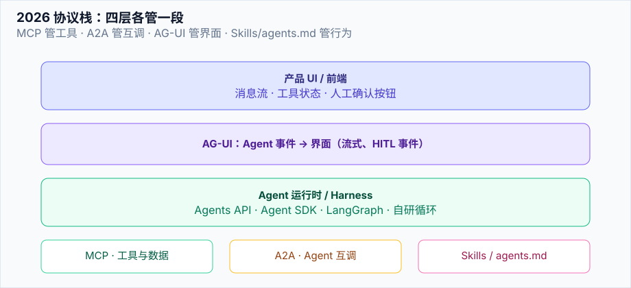
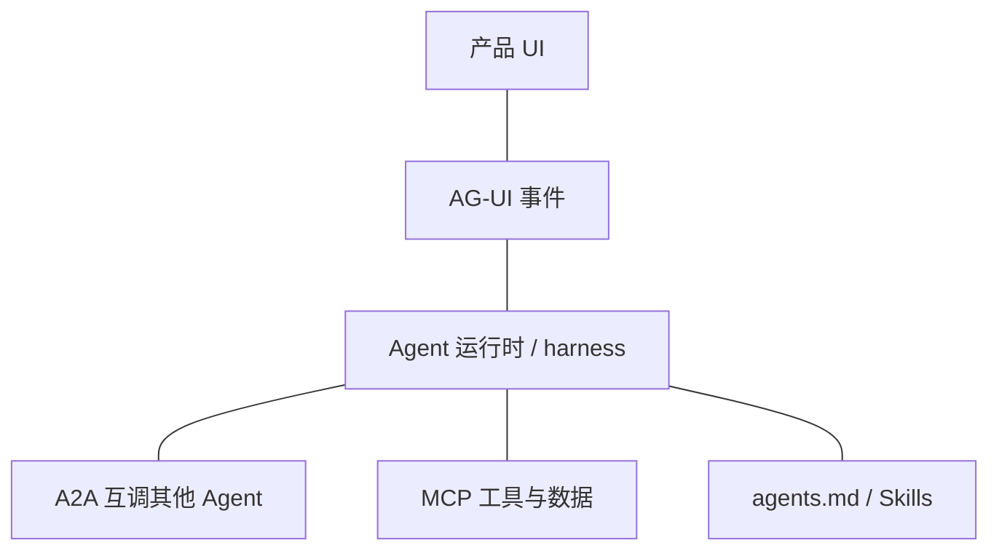

# 2026 协议栈：MCP · A2A · AG-UI · Skills

> **一句话**：工具接入看 MCP，Agent 互操作看 A2A，界面流式看 AG-UI，行为可复用看 agents.md / Skills——四层解决的问题不同，不要混为一谈。

## 先看结论

| 层 | 协议/规范 | 解决 |
|---|---|---|
| 工具与数据 | **MCP** | 模型 ↔ 外部工具/资源的标准接口 |
| Agent 互操作 | **A2A** | Agent 之间发现、委派、任务生命周期 |
| 前端体验 | **AG-UI** | Agent 事件流驱动 UI（消息、工具状态、人工确认） |
| 行为与技能 | **agents.md / Skills** | 仓库与用户级「如何工作」的可版本化约定 |

## 核心机制

### 1. MCP（已写专章）

见 [MCP](../05-tool-protocol/mcp.md)。2026 仍是工具侧事实标准；Agents API、Agent SDK 均一等公民支持。

### 2. A2A（Agent-to-Agent）

用于 **跨组织/跨产品** 的任务委派：Agent Card 声明能力，Task 有生命周期。适合「你的采购 Agent 调我的物流 Agent」，而不是同一进程内 subagent（后者用 harness 原生能力即可）。

### 3. AG-UI

把 Agent 运行时事件（token 流、工具开始/结束、需要确认、状态快照）标准化推给前端。价值在于：

- 前端不必为每家 harness 写一套 WebSocket 协议
- 人工确认（HITL）成为协议级事件，而不是产品私有字段

### 4. agents.md 与 Skills

- **agents.md**：像 README 一样，在仓库根描述「构建命令、测试命令、代码风格、禁止事项」——Agent 与人类同一事实源
- **Skills**：可打包的流程/知识/工具组合（Anthropic Claude Skills 等），可被 Agent SDK / Claude Code 加载

这与 [上下文工程](../06-memory-rag/context-engineering.md) 互补：Skills 是「怎么做」，RAG 是「知道什么」。

## 分层示意

## 工程含义

1. **不要用 A2A 做进程内子 Agent**——那是 harness 的事，成本与延迟都更低
2. **UI 与 Agent 解耦**：先定事件模型，再选前端框架
3. **Skills 进 git**：和代码一起 review、回滚

## 参考资料

- [Model Context Protocol](https://modelcontextprotocol.io/)
- [A2A](https://github.com/a2aproject/A2A)
- [AG-UI](https://github.com/ag-ui-protocol/ag-ui)
- [Claude Skills](https://claude.com/skills)
- [agents.md](https://agents.md/)

## 相关知识点

- [MCP](../05-tool-protocol/mcp.md)
- [A2A](../05-tool-protocol/a2a.md)
- [Human-in-the-loop](../02-agent-basics/human-in-the-loop.md)
- [Claude Agent SDK](claude-agent-sdk.md)
