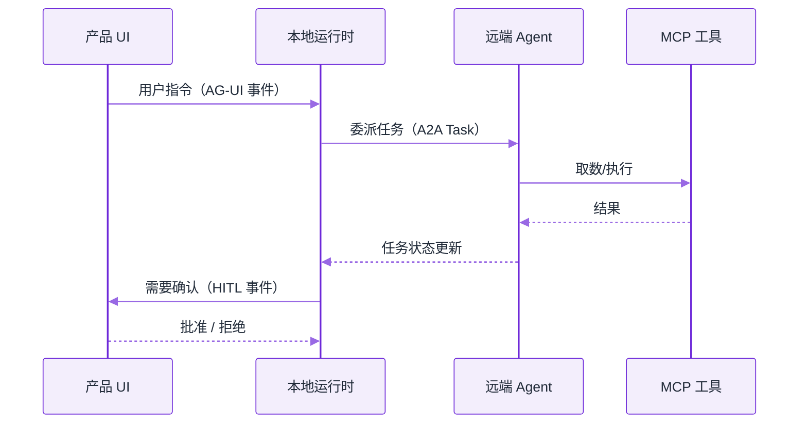
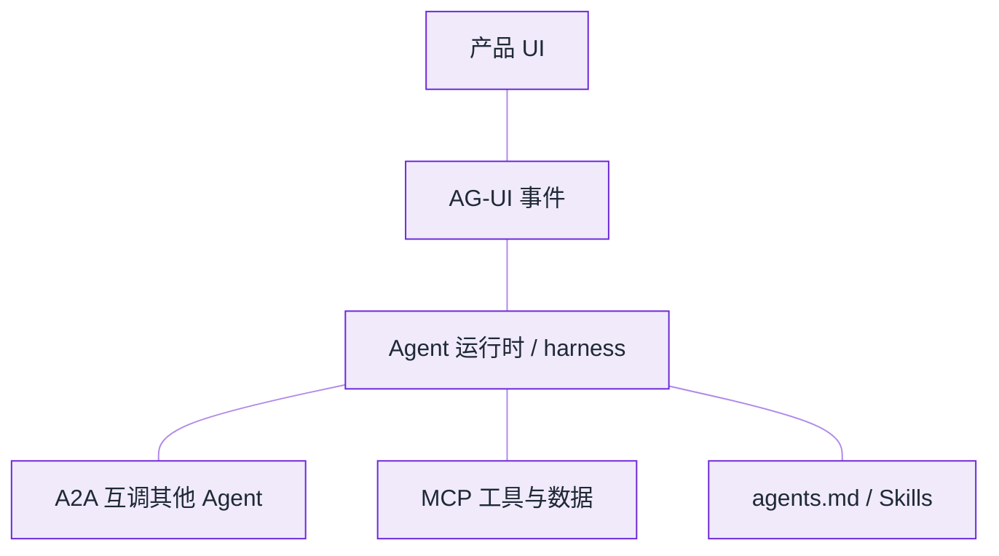

# 2026 协议栈：MCP · A2A · AG-UI · Skills


**一句话**：工具接入看 MCP，Agent 互操作看 A2A，界面流式看 AG-UI，行为可复用看 agents.md / Skills——四层解决的问题不同，不要混为一谈。


*《图：四层各管一段，分层的依据不是调用方向而是「谁被迫改代码」——界面换 AG-UI、工具换 MCP、Agent 互调换 A2A，三层互不顶替》*
## 先看结论

| 层 | 协议/规范 | 解决 |
|---|---|---|
| 工具与数据 | **MCP** | 模型 ↔ 外部工具/资源的标准接口 |
| Agent 互操作 | **A2A** | Agent 之间发现、委派、任务生命周期 |
| 前端体验 | **AG-UI** | Agent 事件流驱动 UI（消息、工具状态、人工确认） |
| 行为与技能 | **agents.md / Skills** | 仓库与用户级「如何工作」的可版本化约定 |

## 核心机制

### 1. MCP（已写专章）

见 [MCP](../05-tool-protocol/mcp.md)。2026 仍是工具侧事实标准；Agents API、Agent SDK 均一等公民支持。

### 2. A2A（Agent-to-Agent）

用于 **跨组织/跨产品** 的任务委派：Agent Card 声明能力，Task 有生命周期。适合「你的采购 Agent 调我的物流 Agent」，而不是同一进程内 subagent（后者用 harness 原生能力即可）。

### 3. AG-UI

把 Agent 运行时事件（token 流、工具开始/结束、需要确认、状态快照）标准化推给前端。价值在于：

- 前端不必为每家 harness 写一套 WebSocket 协议
- 人工确认（HITL）成为协议级事件，而不是产品私有字段

### 4. agents.md 与 Skills

- **agents.md**：像 README 一样，在仓库根描述「构建命令、测试命令、代码风格、禁止事项」——Agent 与人类同一事实源
- **Skills**：可打包的流程/知识/工具组合（Anthropic Claude Skills 等），可被 Agent SDK / Claude Code 加载

这与 [上下文工程](../06-memory-rag/context-engineering.md) 互补：Skills 是「怎么做」，RAG 是「知道什么」。

### 5. 四层怎么分：三条判据

功能落在哪一层，不是看名字而是看**换掉谁需要改代码**：

| 判据 | 落在哪层 |
|---|---|
| 换一个前端框架就要改的 | AG-UI（事件模型） |
| 换一个模型厂商/框架就要重写的 | harness 私有代码（不是协议） |
| 只在同一进程内互相调用的 | harness 的 subagent，不必上 A2A |
| 跨组织、要声明能力与任务生命周期的 | A2A |
| 只是「怎么把某个系统接进来」 | MCP |
| 「在这个仓库里该怎么干活」的约定 | agents.md / Skills |

一句话记法：**协议是给「不认识你的那一端」用的**。同一团队同一进程内的调用套协议，只会白白增加延迟与调试面。

判据反过来读同样有效：换掉某个组件只需要改配置或换一个 URL，它多半已经站在协议层；换掉它必须动业务代码里的控制流、状态机与重试逻辑，那它其实还长在 harness 里，只是起了一个协议的名字。命名不能改变依赖方向——分层图上的位置，最终由「谁被迫改代码」决定。

一次委派在四层里的实际走法：

注意最后两步：**人工确认是协议级事件**，所以前端的「批准」按钮不必为每家 harness 重写一遍。

## 常见误区

- ❌ **用 A2A 传大文件**：A2A 传的是任务与引用（URI、句柄），不是字节流；把 20MB 附件塞进消息体，两端超时与审计都会难看。
- ❌ **把 agents.md 当唯一系统提示**：它是「仓库内约定」，不覆盖运行时权限与工具白名单；安全边界仍要由 harness 强制。
- ❌ **在 AG-UI 事件里塞原始数据**：事件流会进浏览器、日志与第三方分析；只放渲染必需的字段，敏感内容留在服务端。
- ❌ **四层一次全上**：单人项目通常只需要 MCP + agents.md；A2A 与 AG-UI 分别在出现跨组织委派、多前端时才引入。

## 小练习

你要做「内部工单 Agent 需要向供应商的 Agent 下单」：写出这条链路上四层各自承担什么，并说明哪一步必须落到 AG-UI 的人工确认事件上、为什么不能只靠模型自述。

## 分层示意

*《图：连线全为无向——UI 只经 AG-UI 触到 RT；A2A、MCP、Skills 并列挂在 RT 下，分层不看调用方向只看谁被迫改代码》*

## 工程含义

1. **不要用 A2A 做进程内子 Agent**——那是 harness 的事，成本与延迟都更低
2. **UI 与 Agent 解耦**：先定事件模型，再选前端框架
3. **Skills 进 git**：和代码一起 review、回滚

## 参考资料

- [Model Context Protocol](https://modelcontextprotocol.io/)
- [A2A](https://github.com/a2aproject/A2A)
- [AG-UI](https://github.com/ag-ui-protocol/ag-ui)
- [Claude Skills](https://claude.com/skills)
- [agents.md](https://agents.md/)

## 相关知识点

- [MCP](../05-tool-protocol/mcp.md)
- [A2A](../05-tool-protocol/a2a.md)
- [Human-in-the-loop](../02-agent-basics/human-in-the-loop.md)
- [Claude Agent SDK](claude-agent-sdk.md)

