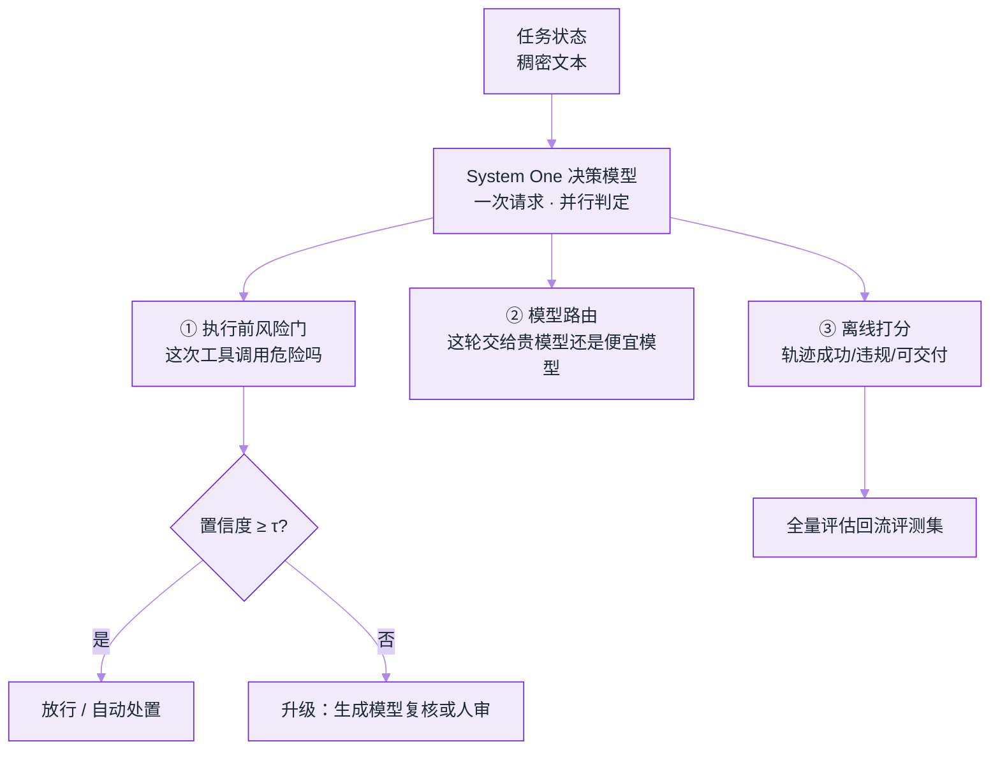

# System One 决策模型：不生成文字的 Jev


**一句话**：Jev 把 Agent 循环里那些「只要一个判断、不要一段话」的高频节点（工具风险门、模型路由、检索重排、轨迹打分）从自回归生成里拆出来，换成一次并行采样出的**带置信度的类型化决策**——快两个数量级、便宜到可以每步都跑。


## 定义与边界

2026-09-15，TypeSafe AI（TechCrunch 称其创始人中有 ChatGPT 的早期研发者）发布 **System One model**，首个产品命名 **Jev**；一周后全面开放。Simon Willison 给了个更贴近实质的别名：**decision model**。它的名字来自 Kahneman 的双系统隐喻——System 2 是慢、贵、会写段落的推理，System 1 是快、便宜、只给直觉的那一层。

| 维度 | 生成式 LLM | **System One 决策模型** | 传统判别式分类器 |
|---|---|---|---|
| 输出 | 文本/工具调用 | **数值化决策**：类别、是/否、评分 + 置信度 | 固定标签的概率 |
| 生成方式 | 自回归，逐 token | **一次查询并行采出全部答案** | 单次前向 |
| 输入契约 | prompt + 多模态 | **一段稠密的「状态」文本**（纯文本，图/音要先转写） | 特征向量/文本 |
| 能解释吗 | 会给理由（但可能是编的） | **不给理由**，只给分布 | 通常不给 |
| 典型耗时 | 数百 ms～数十 s | **70–500 ms** | 毫秒级 |
| 换领域 | 改 prompt | 改 prompt（题型化） | 重新标注训练 |

**什么不算 System One**：让 GPT/Claude「只输出 JSON」仍是自回归地把 JSON 一个个 token 吐出来——省的是解析麻烦，不是延迟与账单。差别在**解码形态**，不在输出格式。

## 为什么这件事对 Agent 特别值

一个跑在生产里的 Agent，绝大多数模型调用并不产出内容，只做判断：这一步该不该放行、这个工具参数危不危险、这条轨迹算不算成功、这批候选该看哪三条。这些判断过去只能用「贵且慢的生成模型 + 一句 prompt」来做，于是被压成**抽检**。换成决策模型后，同一份预算能买的覆盖率高两个数量级：

$$
\text{被拦下的真实事故}\;\propto\;\underbrace{\text{事故总数}}_{\text{固定}}\times\;\text{检查覆盖率}\times\;\text{判定准确率}
$$

按第三方 LangChain/LangSmith 的评估实验口径代入：生成模型做 judge 时只能抽检（覆盖率 $$5\%$$、对齐准确率约 $$0.80$$），决策模型可全量跑（覆盖率 $$100\%$$、该实验中对齐准确率 $$0.95\text{–}1.00$$）——**$$0.05\times0.80=0.04$$ 对 $$1.00\times0.95=0.95$$，同一个预算下有效拦截量差约 24 倍**。这笔账才是「快而便宜」的真实意义：**不是省成本，是把软层防线从抽样变成全覆盖**。

多问题并行还有一层结构收益：一次请求里 N 个判定同时评估，延迟由求和变成取最大。

$$
t_{\text{gate}}^{\text{自回归}}=\sum_{i=1}^{N}t_i\qquad\text{vs}\qquad t_{\text{gate}}^{\text{System One}}\approx\max_i t_i
$$

所以在 Agent 循环里它有三个天然挂载点：



*《图：状态进、三路判定出；关键在最下方那个分叉——置信度不够时要把样本**升级**出去，而不是硬判》*

## 接口形状：state 进，类型化决策出

请求体是一个 `state` 加一组互相独立的 `questions`，这正是「一次并行」能成立的前提（[一手文档](https://typesafe.ai/blog/introducing-system-one-models-and-jev)）：

```json
{
  "model": "jev-latest",
  "state": "<这一步的稠密上下文：目标、历史、工具参数>",
  "questions": {
    "risky":  { "type": "noul",   "instructions": "该调用是否包含不可逆副作用" },
    "tier":   { "type": "choice", "options": ["cheap", "strong"], "instructions": "需要哪一档模型" },
    "done":   { "type": "score",  "instructions": "任务已完成的程度" }
  }
}
```

三类原语 **noul（是/否）、choice（多选）、score（打分）**，每个都带完整值分布与置信度。工程上要注意三个硬边界：

- **决策集大小 ≤ 255**。超过就退化成两阶段（先独立打分、再显式选择），会引入周期性停顿——所以「从 5000 个工具里选一个」不该问它，要先做粗召回。
- **上下文 32k–64k**（第三方指南口径，随版本变动），它不是长上下文推理器，是把状态压成一段稠密文本再判。
- **版本漂移必须钉 tag**（LiteLLM 测的是 `jev-1.13.0`）。判定阈值是按版本标定的，用 `latest` 上线等于偷偷重标刻度。

## 校准才是可用性的前提

一个不给理由的判定器，唯一能被审计的量化属性是**校准**：它说 0.9 的场合，是不是真有约 90% 对。常用期望校准误差：

$$
\mathrm{ECE}=\sum_{b=1}^{B}\frac{n_b}{N}\,\bigl|\overline{p}_b-y_b\bigr|
$$

第三方汇总的预注册测试给出的量级：**noul ≈ 0.012、choice ≈ 0.086、score ≈ 0.254**——即「是/否」很可信，「打分」明显漂。同一测试还给出**置信度—覆盖率的交换关系**：只采信置信度 ≥ 0.9 的判定，准确率约 92%，但只覆盖约 73% 的样本。

由此得出一条能直接落地的策略：**模型负责不确定性，代码负责政策**（官方原话 "models handle uncertainty, code handles policy"）。

- 用 **noul** 做闸门，用 **choice** 做路由，**别用 score 直接排序做决策**
- 阈值 $$\tau$$ 必须**在你自己的分布上重标**，官方准确率不能当你的 SLA
- 低置信样本走升级链：生成模型复核 → 人审，并把它们回流成标注集

## 第三方实测怎么说

厂商自报的口径是分类任务上 **193.6× 快、444.6× 便宜**（LangChain 转述为「最多 200× 快、400× 便宜」），输入 **$0.042 / MTok**、**输出免费（too cheap to meter）**。真正值得引用的是别人测的：

| 测试 | 结果 | 报告者自己声明的局限 |
|---|---|---|
| LiteLLM 路由基准（2026-09-18，`jev-1.13.0` vs `claude-haiku-4-5`，80 组 × 4 难度 × 3 次 = 240 次判定） | 中位延迟 **126.81 ms vs 688.40 ms**（P95 231.16 vs 896.94）；档位一致率 **95.00% vs 73.75%**；240 次判定花费 **$0.0077 vs $0.1985**（省 96.1%） | **标签与 prompt 出自同一作者**，无独立标注/盲评；**未测下游答案质量**；单线程、单区域，不含持续负载与冷启动 |
| LangChain / LangSmith 评估器实验（5 条固定的天气 Agent 轨迹、500 次重复二判定） | 与人类标注一致率：**Jev 100%**、GPT-5.6 Terra 99.8%、Luna 96.4%、Claude 80.0%；单次 **0.44 s / $0.00035**，总计 **$0.34 vs Claude $28.17** | 场景极窄（5 条轨迹）；结论原文是「promising, but early」 |

两条警告要抄在实现注释里：

1. **「猜对档位」不等于「答案更好」**——路由判得准，不代表被选中的模型真能答好，最终仍要测端到端。
2. **成本极低会把「一致的错误」放大**——一次判错只花三十分之一美分，于是错误也能以百万次/天的规模复制。便宜的判定器必须配**人类标注锚点**，否则你只是在批量固化偏见。

## 它不适合做什么

- **对话与写作**：根本不产文本，这是设计而非缺陷
- **多模态**：纯文本进，图像/音频要自己先 OCR/ASR
- **精确算术、反讽、相互冲突的准则、长噪声上下文**：第三方指南明确列为退化区
- **需要可解释判罚的场景**：Willison 的批评值得原样记住——**「黑箱又流行了」（black boxes are back in fashion）**。没有理由链，出错时你只能靠统计与抽检反推
- **不可逆动作的唯一闸门**：按本手册 [提示注入](../10-evaluation-safety/prompt-injection.md) 第 3 节的乘法模型，它仍是**软层**。不过它有个新性质：Jev 没有执行能力，注入的收益从「夺取行动」变成「**操纵判定**」——被污染的 state 会让风险门误放行，并顺着路由与审批链放大。所以「执行前门 + 执行后核验」要成对出现。

## 与具身/实时控制的同构关系

「快而廉的直觉 + 慢而贵的 deliberation」这个分层，和第 17 章 [VLA 模型](../17-embodied-ai/vla-models.md) 的双层控制（高频小脑动作策略 + 低频大脑规划）是**同一个结构**：把 10 Hz 的判断从 1 Hz 的推理里摘出来，才可能既实时又不破产。差别在 Jev 判的是符号级决策（放行/选路/打分），VLA 输出的是连续动作。看到「System One」就自动类比机器人控制环要谨慎——**它的 70–500 ms 是分类延迟，不是伺服带宽**。

## 常见误区

- ❌ **把「让 LLM 输出 JSON」当决策模型**：省了解析，没省延迟与账单，也拿不到校准过的置信度
- ❌ **拿官方准确率当 SLA**：分布一变就失真，必须本地重标阈值与覆盖率曲线
- ❌ **用 score 原语做硬决策**：三类原语校准差一个数量级
- ❌ **因为它便宜就全量上线不管**：没有理由链 → 无法排错，只能靠锚点集持续对齐
- ❌ **用它做 5000 选 1**：255 的决策集上限会触发两阶段退化，正确做法是先粗召回
- ❌ **把它当硬防线**：它是**软层**，价值在于「便宜到每步都检查」，不在于「判得比规则权威」

## 一句话决策

高频、低单次代价、可容忍少量误判、且有事后核验的判定节点 → 换决策模型；需要理由、需要创造、动作不可逆且无复核 → 留在生成模型 + 硬规则 + 人审。

## 小练习

给你现有的一个 Agent 循环，列出所有「其实只要一个布尔或一个标签」的模型调用，按调用次数 × 单次成本估出它们占账单的比例。若超过 30%，设计一条迁移方案：哪几个改成 noul 闸门、阈值定在多少、置信度不足的样本升级到哪里、以及你用什么锚点集发现它开始系统性判错。

## 工程含义

1. **判定成为独立采购项**：以后选型不止「用哪个大模型」，还有「哪层判断交给便宜模型」
2. **覆盖率是可设计变量**：软层防线的价值随单价暴跌而上升，抽检 → 全量是架构改动，不是省钱技巧
3. **校准数据变成新资产**：谁有本地标注锚点集，谁就能安全用上这类不可解释的判定器

## 参考资料

- [Introducing System One Models & Jev — TypeSafe AI](https://typesafe.ai/blog/introducing-system-one-models-and-jev)（官方：延迟、价格、255 上限、RLCD 训练法）
- [Jev introduces a new shape of LLM — Simon Willison](https://simonwillison.net/2026/Sep/21/jev/)（「decision model」命名与黑箱批评）
- [What Is Jev? A Guide to TypeSafe AI's System One Model — LangChain](https://www.langchain.com/blog/building-a-harness-with-jev)（middleware 接入：风险门与模型路由）
- [Can Jev Be a Better Agent Evaluator? — LangChain](https://www.langchain.com/blog/jev-agent-evals-langsmith)（评估器对照实验与数字）
- [JEV Classifier: 5.43x as Fast as Haiku, 96% Lower Cost — LiteLLM](https://docs.litellm.ai/blog/jev-auto-router-benchmark)（第三方基准与其自陈局限）
- [A new kind of AI model from a ChatGPT inventor — TechCrunch](https://techcrunch.com/2026-09-18/a-new-kind-of-ai-model-from-a-chatgpt-inventor-is-thrilling-developers/)（团队与舆论面）

## 相关知识点

- [什么是 AI Agent](../02-agent-basics/what-is-agent.md)
- [Function Calling 的机制](../05-tool-protocol/function-calling.md)
- [结构化输出](../04-prompt-reasoning/structured-output.md)
- [提示注入](../10-evaluation-safety/prompt-injection.md)
- [LLM 可观测与评估平台](../16-ai-infrastructure/llm-observability-eval-platform.md)
- [模型网关](../16-ai-infrastructure/model-gateway.md)
- [VLA 模型](../17-embodied-ai/vla-models.md)
- [2026 前沿模型地图](frontier-models-2026.md)
- [模型原生 vs 自建 Harness](model-native-vs-harness.md)
