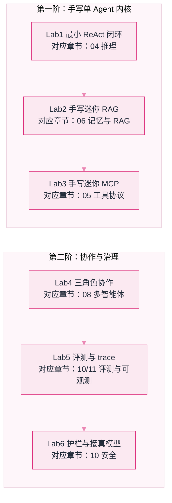

# 动手实验（Labs）


**一句话**：六个零依赖、零 API key、复制即跑的 Python 实验——把前面章节讲的 ReAct、RAG、MCP、多智能体、评测、护栏，每样都亲手实现一遍。


看十遍架构图，不如自己把循环写出来跑通。这一章的每个实验都遵守三条硬规矩：

1. **纯标准库**：`python labX.py` 直接跑，不 `pip install` 任何东西，不注册任何服务；
2. **真实输出**：页面里贴的运行结果就是本机 Python 3.13 跑出来的原文，不是手写的；
3. **接口同构**：MockLLM 的调用形状与真实模型完全一致（见 Lab 6），看懂实验后把 Mock 换成真 API，主循环一行都不用改。

## 实验地图



*《图：实验地图——上排三关手写单 Agent 内核（推理、记忆、工具），下排三关进入协作与治理；六个实验相互独立，但按编号顺序做收益最大》*

## 六个实验各练到什么

| 实验 | 你亲手实现的东西 | 回看的章节 |
|---|---|---|
| [Lab 1 最小 ReAct 闭环](lab1-react.md) | Thought→Action→Observation 的 while 循环、安全计算器、轨迹回放 | 04 |
| [Lab 2 手写迷你 RAG](lab2-rag.md) | 切块、BM25 打分、上下文预算、带引用回答 | 06 |
| [Lab 3 手写迷你 MCP](lab3-mcp.md) | 两个真进程之间的 JSON-RPC：握手、能力发现、工具调用 | 05 |
| [Lab 4 三角色协作](lab4-multi-agent.md) | 消息总线、评审否决、返工重试、升级兜底 | 08 |
| [Lab 5 评测与可观测](lab5-eval-trace.md) | pass@1 成绩单、span 瀑布图、JSONL trace 落盘 | 10、11 |
| [Lab 6 护栏与真模型切换](lab6-guardrails.md) | 权限分级闸门、提示注入隔离、OpenAI 兼容适配器 | 10、03 |

## 怎么跑

源码都在仓库根目录 `labs/` 下，每个文件自包含：

```bash
git clone https://github.com/funny8kids/ai-agent-handbook.git
cd ai-agent-handbook/labs
python lab1_react.py        # Windows 若提示 python 不存在，试试 python3
```


**Windows 乱码？** 每个脚本开头都有一行 `sys.stdout.reconfigure(encoding="utf-8")`，就是为防控制台 GBK 把中文打成乱码。如果你删掉了它又用老版本终端，会看到满屏问号——那不是 bug，是编码。


## 读完能做到

- [ ] 不看书写出 ReAct 主循环的骨架：生成→解析动作→执行工具→结果回流→判停
- [ ] 徒手实现 BM25 的三个因子（TF 饱和、文档长度归一、IDF），并解释上下文预算为什么必须在拼装层做
- [ ] 说清 MCP 的三个方法名和一条报文从 client 到 server 的完整路径
- [ ] 用「角色提示词 + 消息总线 + 重试/升级」三件套解释任意多智能体框架
- [ ] 给一个 Agent 设计可机判的评测用例，并从 trace 瀑布里指出优化对象
- [ ] 实现「默认拒绝」权限门，并解释数据/指令分离为什么能挡住大部分注入

## 章末自测

1. **回忆**：Lab 1 的循环里，模型输出的哪三个字段决定了下一步走向？工具抛异常时循环为什么不炸？（提示：见 lab1-react.md）
2. **应用**：把 Lab 2 的 `budget` 从 160 改到 40，观察哪条检索结果被丢弃、回答质量怎么变，用一句话说清「检索对了但没用上」是怎么发生的。（提示：见 lab2-rag.md）
3. **判断**：Lab 5 里 pass@1 只有 75%，有人说「换更大的模型就行」。用用例 3 的失败模式（多跳除法）评价这个说法。（提示：见 lab5-eval-trace.md）

## 本章术语速查

这章的术语都是「动手时会撞上的」，解释按代码里的实际用法给。

| 英文术语 | 中文 | 白话一句话 |
|---|---|---|
| MockLLM | 脚本化假模型 | 长得和真模型一模一样（进 messages 出文本）但按剧本答话，让实验零成本可复现 |
| Trajectory | 轨迹 | prompt 里累积的 Thought/Action/Observation 全过程，Agent 的「行车记录仪底片」 |
| BM25 | BM25 打分 | 关键词检索的经典公式：词频算到饱和、长文吃惩罚、稀有词涨权重 |
| Context Budget | 上下文预算 | 拼 prompt 前先算字数，塞不下就丢——丢弃策略本身就是工程设计 |
| JSON-RPC 2.0 | JSON-RPC | 一行一条 JSON 的远程喊话规矩：带 id 的要回话，不带 id 的（通知）免回 |
| Handshake / Capability Discovery | 握手与能力发现 | MCP 的 `initialize` 对暗号 + `tools/list` 报菜名，client 才知道能点什么 |
| Message Bus | 消息总线 | 多 Agent 共享的发言流水账，「协作」在代码里其实就是这一个 list |
| pass@1 | 单次通过率 | 每个用例跑一遍，判对几个算几分——比「感觉变好了」硬一万倍 |
| Span / Trace | 跨度 / 链路 | 一次步骤计时叫 span，一串 span 按父子排开就是 trace，瀑布图的本体 |
| Prompt Injection | 提示注入 | 工具返回值里藏「忽略之前的指令」，把数据伪装成命令来指挥你的 Agent |
| Deny by Default | 默认拒绝 | 高危操作不批就不许跑——权限门看的是风险级别，不是模型的人格保证 |

