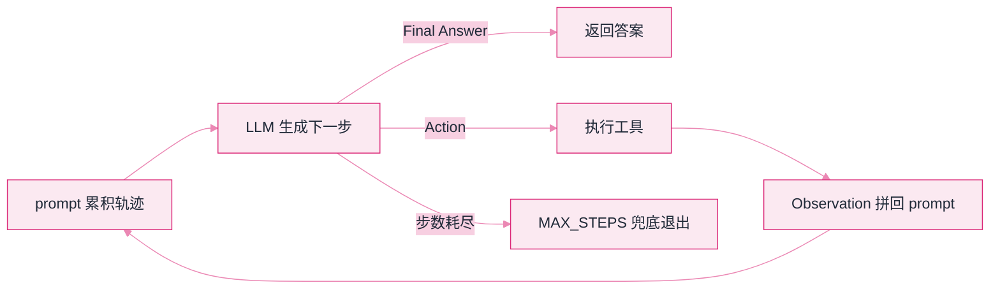

# Lab 1：最小 ReAct 闭环


**一句话**：这张卡片式演示把「想一步、做一步、看结果、再想」拆成可以点着走的五步——你能看见每一圈 prompt 到底长成什么样，这是全书反复出现的那个循环的本体。


- 可运行脚本仍在仓库里：[`labs/lab1_react.py`](https://github.com/funny8kids/ai-agent-handbook/blob/main/labs/lab1_react.py)（零依赖、零 API key，`python lab1_react.py` 就能复现下面每一步的真实输出）
- 下面所有状态与输出都是**本机 Python 3.13 真跑截取**，不是示意；改参数的两个标签同样是真跑结果
- 前置阅读：[ReAct](../04-prompt-reasoning/react.md)、[什么是 Agent](../02-agent-basics/what-is-agent.md)

## 这个实验在搭什么



任务是一道多跳题：「甲公司和乙公司谁的 2025 年营收更高？」——甲公司给的是「4800 万元」，乙公司给的是「0.62 亿元」，单位不一样，必须**先查两份资料、再做一次换算**才能回答。纯 CoT 会在这里编数字，ReAct 循环会用工具把数字钉死。

## 分步演示：跟着循环走四圈



*《图：动画只帮你把节奏看清——每一圈亮起的格子，就是模型此刻能看到的全部上下文》*




#### 起点：模型的上下文里只有问题

```text
Question: 甲公司和乙公司谁的 2025 年营收更高？
```

没有任何历史、没有中间结论。工具清单与输出协议在系统提示里（这里省略）。

**要点**：Agent 没有记忆，它的「状态」就是这段字符串。后面每一步看到的变化，全都是往这个字符串里追加内容。




#### 第 1 圈：模型先决定去查甲公司

模型输出（协议固定为 `Thought:` + `Action:`）：

```text
Thought: 要比较两家公司营收，先查甲公司的财报。
Action: search(财报-甲公司)
```

运行时把 `Action` 解析成一次真实调用 `search("财报-甲公司")`，拿回结果后**两句一起**拼回上下文：

```text
Question: 甲公司和乙公司谁的 2025 年营收更高？
Thought: 要比较两家公司营收，先查甲公司的财报。
Action: search(财报-甲公司)
Observation: 甲公司 2025 年营收 4800 万元，同比增长 12%。
```

**要点**：一圈让 prompt 变长两次——模型说的话 + 工具给的事实。缺了后者，模型下一圈只能凭想象继续。




#### 第 2 圈：同样的动作，换一家公司

```text
Thought: 甲公司数据已到手，再查乙公司。
Action: search(财报-乙公司)
Observation: 乙公司 2025 年营收 0.62 亿元，同比增长 5%。
```

此刻上下文里已经有了 4800 万元和 0.62 亿元两个数字，**但单位还没统一**。模型如果直接比大小就会得出「4800 > 0.62，甲公司更高」的错误结论——它没有这个自由，因为下一圈还得给出依据。




#### 第 3 圈：数字必须由工具算出来

```text
Thought: 甲公司 4800 万元，乙公司 0.62 亿元=6200 万元，用计算器换算确认。
Action: calculator(0.62*10000)
Observation: 6200.0
```

**要点**：`6200.0` 是计算器返回的，不是模型编的。要求关键数字来自工具输出，是压幻觉的第一杠杆——这也是第 10 章「可验证性」的最小实现。




#### 第 4 圈：模型自己宣布结束

```text
Thought: 6200 万元 > 4800 万元，乙公司营收更高。
Final Answer: 乙公司营收更高（约 6200 万元 vs 4800 万元），
              问题「甲公司和乙公司谁的 2025 年营收更高？」已解决。
```

出现 `Final Answer:` 就是循环的第一道终止闸门。整段轨迹共 4 圈、3 次工具调用，最终答案原样返回：

```text
最终答案: 乙公司营收更高（约 6200 万元 vs 4800 万元），问题「甲公司和乙公司谁的 2025 年营收更高？」已解决。
```



## 两个开关，两种结局（点标签切换，均为真跑输出）



只允许两圈，循环连换算都来不及做就撞上第二道闸门：

```text
[step 1] Thought: 要比较两家公司营收，先查甲公司的财报。
Action: search(财报-甲公司)
          -> Observation: 甲公司 2025 年营收 4800 万元，同比增长 12%。

[step 2] Thought: 甲公司数据已到手，再查乙公司。
Action: search(财报-乙公司)
          -> Observation: 乙公司 2025 年营收 0.62 亿元，同比增长 5%。

最终答案: 到达 MAX_STEPS 兜底退出（防止一直转圈）
```

两圈用完时，上下文里**只有两个还没统一的数字**，没有任何结论。兜底退出必须返回一个明确的状态，而不是硬编一个答案——否则下游会把「超时」当成「答完」。



把第 3 圈的表达式换成带单位的 `0.62*亿元`，计算器按 AST 白名单拒绝执行，错误被当成 Observation 回流：

```text
[step 3] Thought: 甲公司 4800 万元，乙公司 0.62 亿元，换算成万元。
Action: calculator(0.62*亿元)
          -> Observation: 工具错误: 非法表达式: 0.62*亿元

[step 4] Thought: 刚才表达式里混进了单位，改成纯数字再算一次。
Action: calculator(0.62*10000)
          -> Observation: 6200.0

[step 5] Thought: 6200 万元 > 4800 万元，乙公司营收更高。
Final Answer: 乙公司营收更高（约 6200 万元 vs 4800 万元），问题「甲公司和乙公司谁的 2025 年营收更高？」已解决。
```

**这就是自纠错的全部机制**：没有额外的「反思模块」，只是错误信息进了上下文，模型下一圈看见了。第 07 章的重试策略、第 11 章的错误处理，落到最小处就是这一行 `except` 把异常转成 Observation。



## 盯住这段轨迹的三个细节

1. **每一步的上下文都在变长**：输出拼一次、Observation 再拼一次——模型的「记忆」完全来自这个字符串。这就是「API 无状态、上下文工程才有状态」（第 03 章）的最小实证。
2. **Observation 是事实回流**：`6200.0` 出现在上下文里，之后模型才敢引用它。顺序反了（先给结论再查）就是编造。
3. **两道终止闸门**：模型自己说 `Final Answer`（正常收敛），或步数上限兜底（防转圈）。生产系统两个都必须有——缺后一个的 Agent 会在凌晨把 token 烧穿。


计算器工具用 AST 白名单而不是裸 `eval`：Agent 生成的表达式是**不可信输入**，`eval("__import__('os').system('rm -rf /')")` 就是教科书级事故。工具层对每一个参数做校验，永远不是多余的。


## 自己改着玩（不用看源码也能改）

1. **改任务**：把问题换成「三家谁最高」，在资料里补一条「丙公司 2025 年营收 5500 万元」。你会立刻发现：得给「剧本」再加一个分支才能查第三家——**轨迹一长，写死的规则就维护不动了**，这正是真模型存在的理由。
2. **改工具返回**：让乙公司的资料故意返回「未找到相关结果」。观察循环怎么在没有事实的情况下继续，以及它是否会开始编数字——这一条是第 10 章幻觉评测的手感来源。
3. **改解析严格度**：现在只认 `Action: 名字(参数)` 这一种形状。让模型输出 `Action: search["财报-甲公司"]`，看它怎么卡住。真实框架里这一步叫「输出解析器」，它脆弱与否直接决定系统稳定性（第 04 章结构化输出）。

## 排错备忘

| 症状 | 原因 | 解法 |
|---|---|---|
| 满屏乱码 | Windows 控制台默认 GBK | 脚本开头已把标准输出切成 UTF-8，别删那行 |
| `ValueError: 非法表达式` | 模型给的表达式里有变量或函数 | 正常——错误会被转成 Observation 回流让模型自纠；若一直转圈就查剧本分支 |
| 永远到不了 Final Answer | 「剧本」的判断条件与实际累积的上下文对不上 | 把每圈的 prompt 原样打印出来看，99% 是解析或拼接错位 |

下一站：[Lab 2 手写迷你 RAG →](lab2-rag.md)
