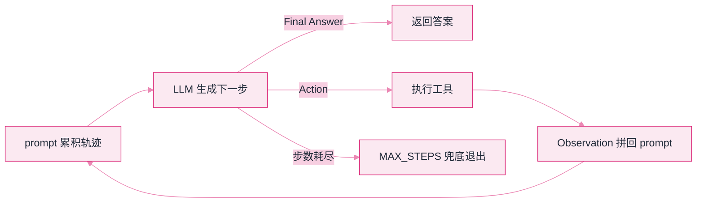

# Lab 1：最小 ReAct 闭环


**一句话**：用 100 行纯标准库 Python 把「想一步、做一步、看结果、再想」写出来跑通——这是全书反复出现的那个 while 循环的本体。


- 源码：仓库根目录 [`labs/lab1_react.py`](https://github.com/funny8kids/ai-agent-handbook/blob/main/labs/lab1_react.py)
- 运行：`python lab1_react.py`（零依赖、零 API key）
- 前置阅读：[ReAct](../04-prompt-reasoning/react.md)、[什么是 Agent](../02-agent-basics/what-is-agent.md)

## 这个实验在搭什么



任务是一道多跳题：「甲公司和乙公司谁的 2025 年营收更高？」——甲公司给的是「4800 万元」，乙公司给的是「0.62 亿元」，单位不一样，必须**先查两份资料、再做一次换算**才能回答。纯 CoT 会在这里编数字，ReAct 循环会用工具把数字钉死。

## 完整代码（复制即跑）

```python
# -*- coding: utf-8 -*-
"""Lab 1 最小 ReAct 闭环：Thought -> Action -> Observation，直到 Final Answer。

零依赖，纯标准库，无需 API key：LLM 由一个"脚本化 MockLLM"扮演，
它根据当前轨迹（trajectory）决定下一步说什么——和真模型的行为接口完全一致，
换成真实模型只需替换 MockLLM 类（见 lab6 与页面说明）。

运行：python lab1_react.py
"""
import ast
import operator
import sys

sys.stdout.reconfigure(encoding="utf-8")  # Windows 控制台默认 GBK，中文输出会乱码

# ---------- 工具层：Agent 的"手" ----------

def calculator(expr: str) -> str:
    """安全四则运算：只允许数字与 + - * / ( )，不用 eval 裸跑。"""
    allowed = {ast.BinOp, ast.UnaryOp, ast.Expression, ast.Constant, ast.Load}
    ops = {ast.Add: operator.add, ast.Sub: operator.sub,
           ast.Mult: operator.mul, ast.Div: operator.truediv,
           ast.USub: operator.neg}

    def _ev(node):
        if type(node) not in allowed:
            raise ValueError(f"非法表达式: {expr}")
        if isinstance(node, ast.Expression):
            return _ev(node.body)
        if isinstance(node, ast.Constant):
            return node.value
        if isinstance(node, ast.UnaryOp):
            return ops[type(node.op)](_ev(node.operand))
        return ops[type(node.op)](_ev(node.left), _ev(node.right))

    return str(_ev(ast.parse(expr, mode="eval")))


DOCS = {
    "财报-甲公司": "甲公司 2025 年营收 4800 万元，同比增长 12%。",
    "财报-乙公司": "乙公司 2025 年营收 0.62 亿元，同比增长 5%。",
    "汇率": "2025 年参考汇率：1 美元 ≈ 7.2 元人民币。",
}

def search(query: str) -> str:
    """玩具搜索：按关键词命中返回文档，否则返回未找到。"""
    hits = [doc for key, doc in DOCS.items() if any(w in key for w in query.split())]
    return "\n".join(hits) if hits else "未找到相关结果"


TOOLS = {"calculator": calculator, "search": search}

# ---------- LLM 层：Agent 的"脑" ----------

class MockLLM:
    """脚本化模型：读入完整 prompt（含历史轨迹），输出下一段文本。

    输出协议与 ReAct 论文一致：
      Thought: ...
      Action: 工具名(参数)
    或
      Thought: ...
      Final Answer: ...
    """

    def __init__(self):
        self.step = 0

    def __call__(self, prompt: str) -> str:
        q = prompt.split("Question:", 1)[1].split("Thought:", 1)[0].strip()
        seen = prompt
        if "Action: search" not in seen:
            return f"Thought: 要比较两家公司营收，先查甲公司的财报。\nAction: search(财报-甲公司)"
        if "Action: calculator" not in seen:
            if "0.62" not in seen:
                return f"Thought: 甲公司数据已到手，再查乙公司。\nAction: search(财报-乙公司)"
            return ("Thought: 甲公司 4800 万元，乙公司 0.62 亿元=6200 万元，"
                    "用计算器换算确认。\nAction: calculator(0.62*10000)")
        return ("Thought: 6200 万元 > 4800 万元，乙公司营收更高。\n"
                f"Final Answer: 乙公司营收更高（约 6200 万元 vs 4800 万元），问题「{q}」已解决。")

# ---------- Agent 循环：本书反复出现的那个 while ----------

def run_agent(question: str, llm, max_steps: int = 6) -> str:
    prompt = f"Question: {question}\n"
    for i in range(1, max_steps + 1):
        out = llm(prompt)                       # 1. 模型基于全部历史生成下一步
        prompt += out + "\n"
        print(f"\n[step {i}] {out}")
        if "Final Answer:" in out:              # 2. 终止条件一：模型自己宣布完成
            return out.split("Final Answer:", 1)[1].strip()
        if "Action:" in out:                    # 3. 终止条件二之前，永远先执行工具
            call = out.split("Action:", 1)[1].strip()
            name, args = call.split("(", 1)
            args = args.rstrip(")")
            try:
                obs = TOOLS[name.strip()](args)
            except Exception as e:              # 工具报错也要回流，不能炸循环
                obs = f"工具错误: {e}"
            prompt += f"Observation: {obs}\n"
            print(f"          -> Observation: {obs}")
    return "到达 MAX_STEPS 兜底退出（防止一直转圈）"


if __name__ == "__main__":
    print("=" * 62)
    print("Lab 1：最小 ReAct 闭环（甲公司 vs 乙公司谁营收更高？）")
    print("=" * 62)
    answer = run_agent("甲公司和乙公司谁的 2025 年营收更高？", MockLLM())
    print("\n最终答案:", answer)
```

## 真实运行输出

本机 Python 3.13 原样输出：

```text
==============================================================
Lab 1：最小 ReAct 闭环（甲公司 vs 乙公司谁营收更高？）
==============================================================

[step 1] Thought: 要比较两家公司营收，先查甲公司的财报。
Action: search(财报-甲公司)
          -> Observation: 甲公司 2025 年营收 4800 万元，同比增长 12%。

[step 2] Thought: 甲公司数据已到手，再查乙公司。
Action: search(财报-乙公司)
          -> Observation: 乙公司 2025 年营收 0.62 亿元，同比增长 5%。

[step 3] Thought: 甲公司 4800 万元，乙公司 0.62 亿元=6200 万元，用计算器换算确认。
Action: calculator(0.62*10000)
          -> Observation: 6200.0

[step 4] Thought: 6200 万元 > 4800 万元，乙公司营收更高。
Final Answer: 乙公司营收更高（约 6200 万元 vs 4800 万元），问题「甲公司和乙公司谁的 2025 年营收更高？」已解决。

最终答案: 乙公司营收更高（约 6200 万元 vs 4800 万元），问题「甲公司和乙公司谁的 2025 年营收更高？」已解决。
```

## 盯住输出里的三个细节

1. **每一步的 prompt 都在变长**：`prompt += out` 再 `+= Observation`——模型的"记忆"完全来自这个字符串，这就是「API 无状态、上下文工程才有状态」（第 03 章）的最小实证。
2. **Observation 是事实回流**：step 3 的 6200.0 是计算器给的，不是模型编的。要求数字来自工具，是压幻觉的第一杠杆。
3. **两道终止闸门**：模型自己说 `Final Answer`（正常收敛），或 `max_steps` 兜底（防转圈）。生产系统两个都必须有，缺一个就敢上线的团队都吃过深夜告警。


`calculator` 用 AST 白名单而不是 `eval`：Agent 生成的表达式是**不可信输入**，`eval("__import__('os').system('rm -rf /')")` 就是教科书级事故。工具层的每一行参数校验都不是多余的。


## 动手改（由易到难）

1. 把 `max_steps` 改成 2 再跑：观察兜底退出长什么样，答案质量掉了多少。
2. 给 `DOCS` 加一条「丙公司 2025 年营收 5500 万元」，把 MockLLM 的剧本改成三家比较——你会自然理解为什么轨迹一长，脚本化剧本就写不动了（这就是真模型存在的意义）。
3. 把解析从 `if "Action:" in out` 升级为正则提取 `Action: name(arg1, arg2)`，支持多参数。真实框架里这一步叫「输出解析器」，它脆弱与否直接决定系统稳定性。

## 排错备忘

| 症状 | 原因 | 解法 |
|---|---|---|
| 满屏乱码 | Windows 控制台 GBK | 别删脚本开头的 `reconfigure(encoding="utf-8")` |
| `ValueError: 非法表达式` | 模型给了带变量/函数的表达式 | 正常——错误被 catch 成 Observation 回流，模型会改；若循环转圈就查剧本 |
| 永远到不了 Final Answer | MockLLM 分支条件与 prompt 内容对不上 | 打印 `prompt` 看实际累积了什么，99% 是解析/拼接错位 |

下一站：[Lab 2 手写迷你 RAG →](lab2-rag.md)
