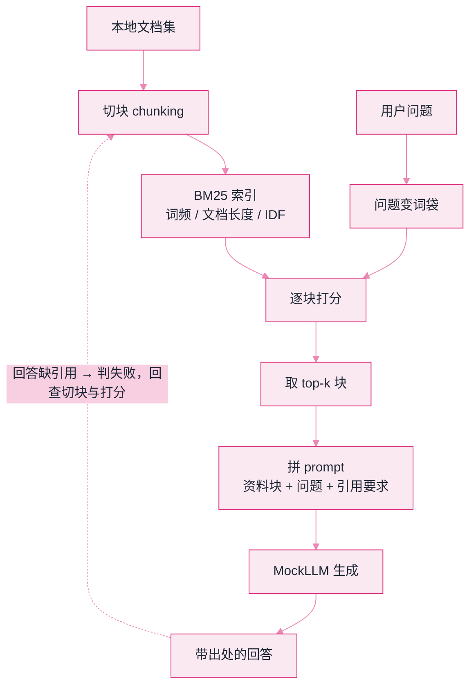

# Lab 2：手写迷你 RAG


**一句话**：不装向量库、不调 API，用 BM25 把「切块 → 检索 → 拼 prompt → 引用回答」整条 RAG 流水线走一遍，看清框架替你藏起来的每一步。


- 可运行脚本仍在仓库里：[`labs/lab2_rag.py`](https://github.com/funny8kids/ai-agent-handbook/blob/main/labs/lab2_rag.py)（`python lab2_rag.py` 即可复现）
- 下面每一步的分数、预算数字与丢弃记录都是**本机真跑原样截取**；三个标签同样是真跑结果
- 前置阅读：[记忆类型](../06-memory-rag/memory-types.md)、[RAG 基础](../06-memory-rag/rag-basics.md)

## 这个实验在搭什么

所有 RAG 框架的说明书都会告诉你「支持多种检索器」，但骨架只有一个：**把问题变成词袋，把文档变成词袋，打分，取 top-k，塞进 prompt**。本实验手写 BM25——就是那个 1990 年代提出、至今仍是混合检索里「关键词半边天」的公式。没有魔法，只有三个因子：词频（饱和）、文档长度（惩罚）、稀有度（IDF）。

下面这张图就是本实验要手写的全部东西：文档侧先切块建索引，问题侧变词袋，两边在「逐块打分」汇合；最后那条虚线（回答不合格就回查切块与打分）是很多教程会漏掉的一步：



## 分步演示：一个问题走完流水线




#### 第 1 步：知识库先被切成块（不是整篇入库）

语料是 8 条本机写死的技术短文（KV 缓存、上下文窗口、RAG、Embedding、BM25、切块、重排、记忆）。每条约 60–70 字，按 40 字一切、**相邻块保留 10 字重叠**，于是长一点的条目会裂成 `xxx#0`、`xxx#1` 两块。

```text
context-window#0   kv-cache#0   rag#0   embedding#0
bm25#0             chunking#0   chunking#1   rerank#0   memory#0   kv-cache#1
```

**要点**：检索的最小单位是「块」，不是「文档」。重叠窗口的存在，是为了让跨块边界的句子至少完整出现在某一块里。




#### 第 2 步：问题也变成同一套词袋

```text
问题：KV 缓存和上下文窗口有什么关系？窗口大是不是就不用 RAG 了？
```

分词规则：英文按单词小写，中文按**相邻两字组合**（2-gram）。所以「上下文窗口」会贡献 `上下` `下文` `文窗` `窗口` 这一串命中项，而「关系」「什么」这类高频虚词因为 IDF 低几乎不加分。

**要点**：查询与索引必须走**同一个**分词函数。两边不一致，是「所有分数都是 0」这类灵异 bug 的头号原因。




#### 第 3 步：逐块打分，分数不平权

对每个块算 BM25，取前几名（真跑原样）：

```text
   11.53  context-window#0
    5.13  kv-cache#0
    4.18  chunking#1
    3.85  chunking#0
    3.70  rag#0
    2.45  kv-cache#1
    2.19  memory#0     2.08  bm25#0
```

`context-window` 得 11.53、`kv-cache` 只有 5.13——问题里「上下文窗口」四个字命中了一串密集 2-gram，而「KV 缓存」只命中一组。

**要点**：关键词检索天生是「部分匹配」。字面不同但语义相关的块（比如「开卷考试」和 RAG）捞不上来，这就是混合检索 + 重排要补的课。




#### 第 4 步：上下文预算真会把结果丢掉

默认只取 top-3、预算 160 字。第三条 `chunking#1` 分数不低（4.18），但前两条已经吃掉 128 字，塞不下了：

```text
  [预算不足，丢弃] chunking#1 (score=4.18)

--- 检索结果（预算 128/160 字）---
   11.53  context-window#0 上下文窗口是模型单次能看到的 token 上限。窗口大不代表记得好：中段信息…
    5.13  kv-cache#0   KV 缓存把历史 token 的 key/value 存下来复用，避免每轮重…
```

**要点**：这一步在真实系统里叫 context stuffing 策略——丢尾部、截断单条、还是触发压缩摘要，是三种完全不同的工程取向（第 03 章）。




#### 第 5 步：回答必须带出处

```text
--- 带引用的回答 ---
  答：根据 context-window：上下文窗口是模型单次能看到的 token 上限。窗口大不代表记得好：
      中段信息容易被忽略，即所谓 lost in the middle。
  答：根据 kv-cache：KV 缓存把历史 token 的 key/value 存下来复用，避免每轮重算整个前缀。
      它占显存，且随上下文长度线性增长。
```

每条答案前面钉着「根据 xxx」，出处就是第 4 步真正进入上下文的那两个块。

**要点**：引用不是装饰，是把「幻觉」变成「可核对的错误」的机制——[Lab 5 的评测断言](lab5-eval-trace.md) 就靠它。



## 三个旋钮，三种结局（点标签切换，均为真跑输出）



只把预算从 160 改成 40，检索本身完全正确：

```text
  [预算不足，丢弃] context-window#0 (score=11.53)
  [预算不足，丢弃] kv-cache#0 (score=5.13)
  [预算不足，丢弃] chunking#1 (score=4.18)

--- 检索结果（预算 0/40 字）---

--- 带引用的回答 ---
（空）
```

排名第一的块也被丢了，因为**注入是按顺序贪心装填**的：一条 66 字的块超过 40 字预算就直接跳过。线上表现为「检索命中了，答案却说不知道」——排查顺序应当是：先看有没有进上下文，再看模型怎么用。



放宽之后，语义相关的 `rag#0`（3.70）终于被捞上来，但代价也当场暴露：

```text
--- 检索结果（预算 355/400 字）---
   11.53  context-window#0    5.13  kv-cache#0      4.18  chunking#1
    3.85  chunking#0          3.70  rag#0           2.45  kv-cache#1
  [预算不足，丢弃] memory#0 (score=2.19)
  [预算不足，丢弃] bm25#0 (score=2.08)
```

回答里出现了**两条一模一样的「根据 chunking」**——因为 `chunking#0` 与 `chunking#1` 是同一篇文档的重叠块，各自独立命中。真实系统在这里必须做**按文档去重 / MMR 多样性**，否则 top-k 会被同一来源刷满，看似召回丰富实则信息量为零。



只动 BM25 的一个参数，排序就变了（同一问题、同一索引）：

```text
b=0.75 → context-window#0:11.53, kv-cache#0:5.13, chunking#1:4.18, chunking#0:3.85, rag#0:3.70
b=0.40 → context-window#0:12.39, kv-cache#0:5.10, chunking#0:4.21, chunking#1:4.12, rag#0:3.86
```

`chunking#0` 与 `chunking#1` 互换位次，长块整体得分上浮。b 越大越惩罚长文档；调小它，长文档更容易排上去，但也更容易把噪声带进上下文。**这就是为什么检索参数要跟着评测集调**，而不是抄默认值（第 06 章检索质量调优）。




中文分词是 RAG 落地第一坑。本实验用 2-gram 偷懒；生产上至少上 jieba/ICU，更好的做法是让 embedding 模型直接吃原始中文——BM25 这边则务必确认你的分析器认识中文，否则「词频」统计的是字组，效果直接腰斩。


## 自己改着玩（不用看源码也能改）

1. **换问题**：把提问改成「开卷考试式的回答要付什么代价？」——字面完全不含「RAG」，看 BM25 还能不能命中 `rag` 那条。命不中，你就亲手复现了「词汇鸿沟（vocabulary mismatch）」，也就是向量检索存在的理由。
2. **改切块**：把块大小从 40 字改成 200 字（等于不切）。观察 top-3 里重叠块消失、但每条注入的噪声变多——切块粒度是「准」和「干净」之间的取舍。
3. **加重排**：对前 6 个候选按「与问题共享的英文术语数」重新打分。写完这一层，rerank 的价值与成本边界你就有手感了。

## 排错备忘

| 症状 | 原因 | 解法 |
|---|---|---|
| 所有分数都是 0 | 查询分词结果与索引分词不一致 | 确认两边共用同一个分词入口，大小写/全半角先归一 |
| 检索命中但答案跑题 | 拼 prompt 时没带「只准依据上下文回答」约束 | 演示里是硬编码，真实系统里这是 system prompt 的活 |
| 长文档永远排不上去 | BM25 的长度惩罚参数太大 | 按上面第三个标签的做法把 b 从 0.75 降到 0.4，感受参数含义 |

下一站：[Lab 3 手写迷你 MCP →](lab3-mcp.md)
