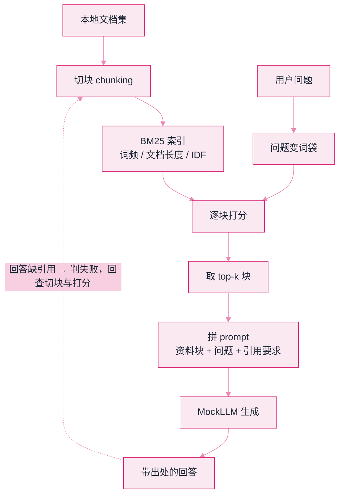

# Lab 2：手写迷你 RAG


**一句话**：不装向量库、不调 API，用 BM25 把「切块 → 检索 → 拼 prompt → 引用回答」整条 RAG 流水线走一遍，看清框架替你藏起来的每一步。


- 源码：仓库根目录 [`labs/lab2_rag.py`](https://github.com/funny8kids/ai-agent-handbook/blob/main/labs/lab2_rag.py)
- 运行：`python lab2_rag.py`
- 前置阅读：[记忆类型](../06-memory-rag/memory-types.md)、[RAG 基础](../06-memory-rag/rag-basics.md)

## 这个实验在搭什么

所有 RAG 框架的说明书都会告诉你「支持多种检索器」，但骨架只有一个：**把问题变成词袋，把文档变成词袋，打分，取 top-k，塞进 prompt**。本实验手写 BM25——就是那个 1990 年代提出、至今仍是混合检索里「关键词半边天」的公式。没有魔法，只有三个因子：词频（饱和）、文档长度（惩罚）、稀有度（IDF）。

下面这张图就是本实验要手写的全部东西：文档侧先切块建索引，问题侧变词袋，两边在「逐块打分」汇合；最后那条虚线（回答不合格就回查切块与打分）是很多教程会漏掉的一步：



## 完整代码（复制即跑）

```python
# -*- coding: utf-8 -*-
"""Lab 2 手写迷你 RAG：切块 -> BM25 检索 -> 带引用的回答。

不装任何向量库、不调任何 API——用最朴素的 BM25 把「检索增强」的
骨架走一遍，你会看清所有框架帮你藏起来的三件事：切块、打分、拼 prompt。

运行：python lab2_rag.py
"""
import math
import re
import sys

sys.stdout.reconfigure(encoding="utf-8")  # 防 Windows 控制台 GBK 乱码

# ---------- 1) 知识库与切块 ----------

CORPUS = {
    "kv-cache": "KV 缓存把历史 token 的 key/value 存下来复用，避免每轮重算整个前缀。它占显存，且随上下文长度线性增长。",
    "context-window": "上下文窗口是模型单次能看到的 token 上限。窗口大不代表记得好：中段信息容易被忽略，即所谓 lost in the middle。",
    "rag": "RAG 把外部知识检索后拼进 prompt，让模型「开卷考试」。它更新知识不用重训模型，代价是检索质量决定上限。",
    "embedding": "Embedding 把文本映射成向量，语义相近则向量距离近。适合召回阶段粗筛，但精确关键词匹配有时反而不如 BM25。",
    "bm25": "BM25 是经典的关键词打分函数：词频越高得分越高，但设饱和上限；文档越长惩罚越大；稀有词权重更高（IDF）。",
    "chunking": "切块策略决定 RAG 的检索粒度：块太大引入噪声，太小丢上下文。常见做法是按标题/句子边界切，并保留重叠窗口。",
    "rerank": "重排（rerank）在粗召回之后，用更强的交叉编码器对 top 候选重新打分，只处理少量候选所以负担得起。",
    "memory": "Agent 的长期记忆通常落在向量库或数据库里，靠检索注入上下文；模型本身没有参数化的持久记忆。",
}

def tokenize(text: str):
    """中文按 2-gram + 英文按单词，够玩具但真实存在这类方案（jieba 是正式版）。"""
    en = re.findall(r"[a-zA-Z]+", text.lower())
    zh = re.sub(r"[^\u4e00-\u9fff]", "", text)
    bigrams = [zh[i:i + 2] for i in range(len(zh) - 1)]
    return en + bigrams

def chunk(doc_id: str, text: str, size: int = 40):
    """按字符数粗切块并保留 10 字重叠——演示 overlap 的作用。"""
    chunks, start = [], 0
    while start < len(text):
        chunks.append((f"{doc_id}#{len(chunks)}", text[start:start + size]))
        start += size - 10
    return chunks

INDEX = []  # [(chunk_id, tokens)]
for did, txt in CORPUS.items():
    for cid, piece in chunk(did, txt):
        INDEX.append((cid, tokenize(piece)))

# ---------- 2) BM25 打分（就是公式本身，没有魔法） ----------

def bm25(query_tokens, k1=1.5, b=0.75):
    N = len(INDEX)
    avg_len = sum(len(t) for _, t in INDEX) / N
    df = {}
    for _, toks in INDEX:
        for w in set(toks):
            df[w] = df.get(w, 0) + 1
    scores = []
    for cid, toks in INDEX:
        s, L = 0.0, len(toks)
        for w in query_tokens:
            if w not in df:
                continue
            tf = toks.count(w)
            idf = math.log(1 + (N - df[w] + 0.5) / (df[w] + 0.5))
            s += idf * tf * (k1 + 1) / (tf + k1 * (1 - b + b * L / avg_len))
        scores.append((s, cid))
    return sorted(scores, reverse=True)

# ---------- 3) 拼 prompt + "生成"回答 ----------

def answer(question: str, top_k: int = 3, budget: int = 160):
    hits = bm25(tokenize(question))[:top_k]
    context, used = [], 0
    for score, cid in hits:
        if score <= 0:
            break
        doc_id = cid.split("#")[0]
        text = CORPUS[doc_id]               # 演示用：整篇注入；真实系统注入的是切好的块
        if used + len(text) > budget:      # 上下文预算：塞不下就停，这就是工程
            print(f"  [预算不足，丢弃] {cid} (score={score:.2f})")
            continue
        context.append((cid, score, text))
        used += len(text)

    print(f"\n--- 检索结果（预算 {used}/{budget} 字）---")
    for cid, score, text in context:
        print(f"  {score:6.2f}  {cid:12s} {text[:38]}…")

    # MockLLM：真实系统里这里是一次模型调用；我们按「只准引用检索到的块」作答
    lines = [f"  答：根据 {cid.split('#')[0]}：{text}" for cid, _, text in context]
    print("\n--- 带引用的回答 ---")
    for ln in lines:
        print(ln)
    return context

if __name__ == "__main__":
    print("=" * 62)
    print("Lab 2：手写迷你 RAG（BM25 检索 + 引用式回答 + 上下文预算）")
    print("=" * 62)
    q = "KV 缓存和上下文窗口有什么关系？窗口大是不是就不用 RAG 了？"
    print(f"\n问题: {q}")
    answer(q)
    print("\n" + "-" * 62)
    q2 = "切块太大或太小会怎样？"
    print(f"问题: {q2}")
    answer(q2)
```

## 真实运行输出

```text
==============================================================
Lab 2：手写迷你 RAG（BM25 检索 + 引用式回答 + 上下文预算）
==============================================================

问题: KV 缓存和上下文窗口有什么关系？窗口大是不是就不用 RAG 了？
  [预算不足，丢弃] chunking#1 (score=4.18)

--- 检索结果（预算 128/160 字）---
   11.53  context-window#0 上下文窗口是模型单次能看到的 token 上限。窗口大不代表记得好：中段信息…
    5.13  kv-cache#0   KV 缓存把历史 token 的 key/value 存下来复用，避免每轮重…

--- 带引用的回答 ---
  答：根据 context-window：上下文窗口是模型单次能看到的 token 上限。窗口大不代表记得好：中段信息容易被忽略，即所谓 lost in the middle。
  答：根据 kv-cache：KV 缓存把历史 token 的 key/value 存下来复用，避免每轮重算整个前缀。它占显存，且随上下文长度线性增长。

--------------------------------------------------------------
问题: 切块太大或太小会怎样？

--- 检索结果（预算 55/160 字）---
    8.31  chunking#0   切块策略决定 RAG 的检索粒度：块太大引入噪声，太小丢上下文。常见做法是按…

--- 带引用的回答 ---
  答：根据 chunking：切块策略决定 RAG 的检索粒度：块太大引入噪声，太小丢上下文。常见做法是按标题/句子边界切，并保留重叠窗口。
```

## 盯住输出里的三个细节

1. **分数不是平权的**：第一问里 `context-window` 得 11.53、`kv-cache` 只有 5.13——问题里「上下文窗口」四个字贡献了密集的 2-gram 命中，而「KV 缓存」只命中一组词。检索天然是「部分匹配」，这就是为什么生产系统要做**混合检索**（BM25 + 向量）再重排。
2. **预算丢弃真实发生了**：`chunking#1` 分数不低（4.18）但被丢弃，因为 160 字的预算已被前两条占满。真实系统里这一步对应「context stuffing 策略」：是丢尾部、截断单条、还是触发压缩摘要——第 03 章上下文预算的工程版本。
3. **回答必须带出处**：每条答案前缀「根据 xxx」。引用不是装饰，是把「幻觉」变成「可核对的错误」的机制——Lab 5 的评测断言就靠它。


中文分词是 RAG 落地第一坑。本实验用 2-gram 偷懒；生产上至少上 jieba/ICU，更好的做法是让 embedding 模型直接吃原始中文——BM25 这边则务必确认你的分析器认识中文，否则「词频」统计的是字组，效果直接腰斩。


## 动手改（由易到难）

1. 把 `budget` 从 160 改到 40 再跑：第一条检索结果都塞不下时会发生什么？回答变空——这就是「检索正确但生成没用上」的成因之一。
2. 把 `top_k` 改成 8、`budget` 改成 400，观察 `rag`、`embedding` 这些「语义相关但词面不同」的块能不能被 BM25 捞上来。捞不上来的，就是向量检索要补的课。
3. 给 `answer()` 加一个「重排」步骤：对 top-k 候选按「与问题共享的英文术语数」重新打分。写完你就理解了 rerank 的价值与成本边界。

## 排错备忘

| 症状 | 原因 | 解法 |
|---|---|---|
| 所有分数都是 0 | 查询分词结果与索引分词不一致 | 确认 `tokenize` 是唯一入口，大小写/全半角先归一 |
| 检索命中但答案跑题 | 拼 prompt 时没带「只准依据上下文回答」约束 | Mock 里是硬编码，真实系统里这是 system prompt 的活 |
| 长文档永远排不上去 | BM25 的长度惩罚 b 太大 | 把 b 从 0.75 降到 0.4 试试，感受参数含义 |

下一站：[Lab 3 手写迷你 MCP →](lab3-mcp.md)
