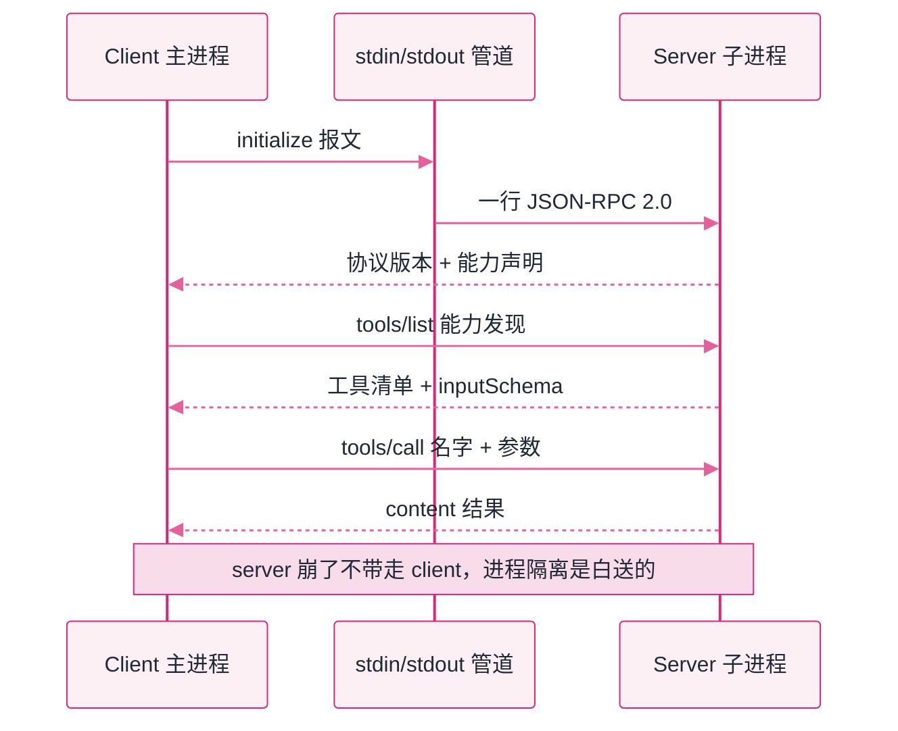

# Lab 3：手写迷你 MCP


**一句话**：同一个文件扮演 server 和 client 两个真进程，把 MCP 的三件套报文（initialize / tools/list / tools/call）逐条打出来——拆掉 SDK 外壳后，协议薄得惊人。


- 可运行脚本仍在仓库里：[`labs/lab3_mcp.py`](https://github.com/funny8kids/ai-agent-handbook/blob/main/labs/lab3_mcp.py)（`python lab3_mcp.py`，client 会把自己再以 `serve` 参数拉起来当 server）
- 下面每一条报文都是**两个真实进程之间跑出来的原样字节**，不是手写的示意
- 前置阅读：[MCP 协议](../05-tool-protocol/mcp.md)、[工具使用](../05-tool-protocol/tool-use.md)

## 这个实验在搭什么

第 05 章说 MCP = 「USB-C 接口」，很多人听完仍然没感觉，因为没见过报文。本实验让你当一次协议的裸用户：

- **进程隔离**：server 是独立子进程，崩溃不带走 client；
- **一条管道**：stdin/stdout 上每行一个 JSON-RPC 2.0 报文；
- **三个约定**：`initialize` 握手对版本 → `tools/list` 能力发现 → `tools/call` 干活。

把这三步画成报文往返，就是下面这张时序图——运行实验时打印出来的正好是这六条：



## 分步演示：一条管道上的六次对话




#### 第 1 步：握手——先对协议版本，再谈别的

client 发出（`id` 有，所以要求回复）：

```json
{"jsonrpc": "2.0", "id": 1, "method": "initialize",
 "params": {"protocolVersion": "2024-11-05",
            "clientInfo": {"name": "lab3-client", "version": "0.1.0"},
            "capabilities": {}}}
```

server 回：

```json
{"jsonrpc": "2.0", "id": 1,
 "result": {"protocolVersion": "2024-11-05",
            "serverInfo": {"name": "lab3-mini-mcp", "version": "0.1.0"},
            "capabilities": {"tools": {}}}}
```

**要点**：第一句话不是「有什么工具」，而是「你说哪一版协议」。版本对不上要在握手阶段就谈崩，而不是等到调用时报错。




#### 第 2 步：通知——没有 id，所以没有回音

```json
{"jsonrpc": "2.0", "method": "notifications/initialized"}
```

server 读到它，**什么都不回**。管道上这一来无二去是正常的。

**要点**：JSON-RPC 用「有没有 `id` 字段」区分「请求」和「通知」。这一条就是整个协议的精髓，SDK 里那些 `send_request` / `send_notification` 的分别也源于此。




#### 第 3 步：能力发现——工具清单本身就是一份 schema

```json
{"jsonrpc": "2.0", "id": 2, "result": {"tools": [
  {"name": "get_time", "description": "返回一个固定的演示时间戳（真实实现里这里查系统时钟）",
   "inputSchema": {"type": "object", "properties": {}, "required": []}},
  {"name": "word_count", "description": "统计一段文本的中英文字数",
   "inputSchema": {"type": "object",
                   "properties": {"text": {"type": "string", "description": "待统计文本"}},
                   "required": ["text"]}}]}}
```

client 侧打印出来的是：`[能力发现] 共 2 个工具: get_time, word_count`。

**要点**：`inputSchema` 长得像 JSON Schema，因为它**就是** JSON Schema。模型侧的参数校验、以及第 05 章反复强调的「工具描述质量决定调用质量」，源头都是这份清单里那两行 `description`。




#### 第 4 步：干活——参数与返回值都有固定形状

```json
{"jsonrpc": "2.0", "id": 4, "method": "tools/call",
 "params": {"name": "word_count", "arguments": {"text": "MCP 让一个协议服务 N 个工具"}}}
```

```json
{"jsonrpc": "2.0", "id": 4, "result": {"content": [{"type": "text",
 "text": "{\"中文\": 10, \"英文单词\": 2}"}], "isError": false}}
```

**要点**：结果统一装在 `content` 数组里，每项带 `type`。这个形状让同一个工具可以返回文本、图片、结构化数据而不改协议。




#### 第 5 步：错误也是数据，不是异常

调用一个不存在的工具 `delete_all`，server 没有炸：

```json
{"jsonrpc": "2.0", "id": 5, "result": {"content": [{"type": "text",
 "text": "Error: 未知工具 delete_all"}], "isError": true}}
```

**要点**：`isError: true` 是一条**正常报文**。模型看得见这行文本，才会自己改参数重试；返回 HTTP 500 式炸穿是不及格的实现——循环当场死掉，模型连纠错的机会都没有。



## 三种越界用法（点标签切换，均为真跑输出）



只往 server 的能力清单里加一个 `echo` 工具，client 一行不动，重跑后的第 3 步变成：

```text
[能力发现] 共 3 个工具: echo, get_time, word_count
```

清单里多出来的那一项：

```json
{"name": "echo", "description": "原样返回传入文本（演示 server 侧新增能力）",
 "inputSchema": {"type": "object", "properties": {"text": {"type": "string"}},
                 "required": ["text"]}}
```

**这就是 MCP 宣称的解耦**：能力长在 server 上，client 靠发现而不是靠硬编码。同一份 server 可以被任意多个 client 用。



不是未知工具，而是未知**方法**——协议层的错误走的是另一条路：

```text
>>> {"jsonrpc": "2.0", "id": 7, "method": "tools/execute",
     "params": {"name": "get_time"}}

<<< {"jsonrpc": "2.0", "id": 7,
     "error": {"code": -32601, "message": "Method not found: tools/execute"}}
```

**要点**：`error` 与 `result` 互斥。方法不存在是**协议错**（用 JSON-RPC 的标准错误码 -32601），工具执行失败是**业务错**（`isError: true` 的正常报文）。把两者混成一类，是排查 MCP 问题时最常见的弯路。



把 server 单独起在管道另一头，从外面直接灌一行报文：

```text
echo '{"jsonrpc":"2.0","id":1,"method":"tools/list"}' | python lab3_mcp.py serve
```

真跑返回（原样，未经任何 SDK）：

```json
{"jsonrpc": "2.0", "id": 1, "result": {"tools": [
  {"name": "get_time", "description": "返回一个固定的演示时间戳（真实实现里这里查系统时钟）",
   "inputSchema": {"type": "object", "properties": {}, "required": []}},
  {"name": "word_count", "description": "统计一段文本的中英文字数",
   "inputSchema": {"type": "object",
                   "properties": {"text": {"type": "string", "description": "待统计文本"}},
                   "required": ["text"]}}]}}
```

**要点**：协议面前人人平等。任何语言、任何工具（甚至一行 shell）都能当 client——这也是评审一个「MCP 集成」是否合规的最省事办法：绕开 SDK 直接灌报文。




真实 MCP 与这个玩具的差距只有三处：多了 `resources` / `prompts` 两类能力、多了流式进度通知、传输层可换 SSE/WebSocket。管道形状、报文语法、生命周期一模一样——先懂骨架，再学 SDK，不会晕。


## 自己改着玩（不用看源码也能改）

1. **改描述**：把 `word_count` 的 `description` 从「统计一段文本的中英文字数」改成「count」。观察调用方（人或模型）是否还能选对工具——这就是第 05 章「工具描述质量」的可复现版本。
2. **改生命周期**：让 server 在处理第 2 个请求时直接退出。看 client 会不会跟着死——不会，因为它们是**两个进程**，这正是 stdio 传输选进程隔离的理由。
3. **改成并发**：连续发两个 `tools/call` 再按顺序收两行。这个玩具 server 是单线程顺序应答，恰好对得上；一旦 server 改成并发处理，回包顺序就不再可靠，你必须按 `id` 配对——真实 SDK 里那张 pending map（id → future）就是为这个存在的。

## 排错备忘

| 症状 | 原因 | 解法 |
|---|---|---|
| client 卡住不动 | server 忘了 flush，输出停在缓冲区 | stdio 模式必须每行立即刷，这是最常见的入门坑 |
| 报文解析报错 | Windows 管道默认编码不是 UTF-8 | 两端显式约定 UTF-8，别信系统默认 |
| 子进程没被回收 | 没关 stdin 就退出 | 关闭输入流并等待子进程退出，别留孤儿进程 |

下一站：[Lab 4 三角色协作 →](lab4-multi-agent.md)
