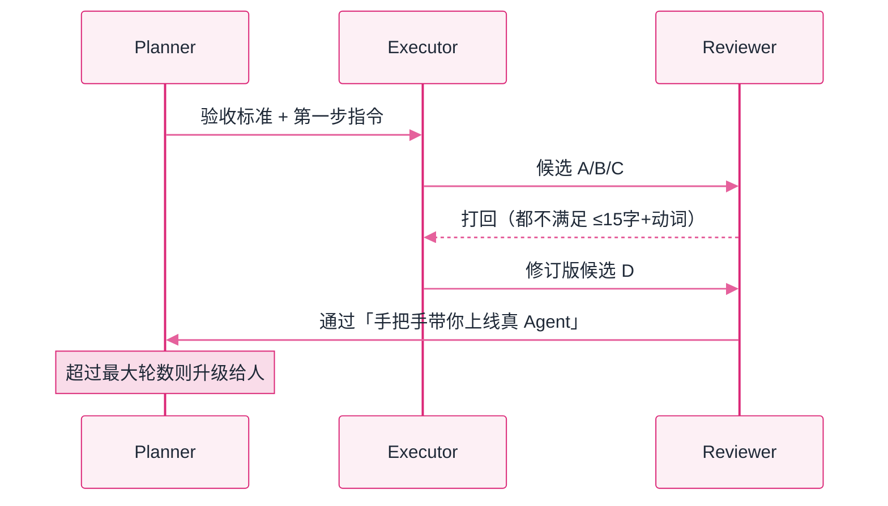

# Lab 4：三角色协作（Planner / Executor / Reviewer）


**一句话**：多智能体被讲玄了——本实验把它压回三件套：角色提示词、消息总线、重试与升级策略，并亲眼看一次「评审打回 → 修订 → 通过」。


- 源码：仓库根目录 [`labs/lab4_multi_agent.py`](https://github.com/funny8kids/ai-agent-handbook/blob/main/labs/lab4_multi_agent.py)
- 运行：`python lab4_multi_agent.py`
- 前置阅读：[多智能体协作](../08-multi-agent/multi-agent-collaboration.md)、[规划与执行](../07-planning/plan-and-execute.md)

## 这个实验在搭什么

任务很具体：给本手册写一句 ≤15 字的首页标语。三个角色：

- **Planner**：拆步骤、定验收标准（然后闭嘴，让干活的人干活）；
- **Executor**：出候选；被驳回时读评审意见、修订再交；
- **Reviewer**：按「字数 ≤15 + 含动词 + 说清价值」硬标准放行或打回。



## 完整代码（复制即跑）

```python
# -*- coding: utf-8 -*-
"""Lab 4 三角色多智能体：Planner -> Executor -> Reviewer，带返工闭环。

多 Agent 系统最容易被讲玄。本实验把它压回三件事：
  1) 角色 = 同一个 MockLLM 换不同 system prompt
  2) 协作 = 一条共享的消息总线（list）
  3) 质量控制 = Reviewer 否决后，把意见回流给 Executor 重做（有重试上限）

运行：python lab4_multi_agent.py
"""
import re
import sys

sys.stdout.reconfigure(encoding="utf-8")  # 防 Windows 控制台 GBK 乱码

TASK = "给一本讲 AI Agent 的中文手册写一句首页标语，要求不超过 15 字"

class MessageBus:
    """共享上下文：所有角色的发言按序留痕——这就是多 Agent 的'群聊记录'。"""
    def __init__(self):
        self.log = []

    def post(self, role, text):
        self.log.append((role, text))
        print(f"  [{role:8s}] {text}")

    def last(self, role):
        for r, t in reversed(self.log):
            if r == role:
                return t
        return ""

class Role:
    """角色 = system prompt + 对该角色的'剧本化'应答。真实系统里换成真模型调用。"""
    def __init__(self, name, system, brain):
        self.name, self.system, self.brain = name, system, brain

    def think(self, bus):
        return self.brain(bus)

def planner(bus):
    bus.post("planner", "拆两步：① Executor 产出 3 个候选标语；② Reviewer 按'≤15字+含动词'标准挑一个，不合格打回。")
    bus.post("planner", "验收标准：字数≤15、有动词、说清'给谁、有什么用'。")

def executor(bus):
    attempt = sum(1 for r, _ in bus.log if r == "reviewer")   # 被驳回次数
    if attempt == 0:
        bus.post("executor", "候选：A「让 Agent 从 demo 走向生产」 B「AI Agent 学习手册」 C「懂原理的 Agent 都省心」")
    else:
        feedback = bus.last("reviewer")
        bus.post("executor", f"（收到意见「{feedback[:18]}…」，修订）候选：D「手把手带你上线真 Agent」")

def reviewer(bus):
    text = bus.last("executor")
    cands = re.findall(r"「([^」]+)」", text)  # 标语里可能有空格，必须整体提取
    for c in cands:
        if len(c) <= 15 and any(v in c for v in ("走向", "上线", "带你")):
            bus.post("reviewer", f"通过：「{c}」（{len(c)} 字，含动词，说清价值）")
            return c
    bus.post("reviewer", "打回：没有同时满足 字数≤15 + 含动词 + 说清价值 的候选")
    return None

def run(max_rounds=3):
    print("=" * 62)
    print(f"Lab 4：三角色协作（任务：{TASK}）")
    print("=" * 62)
    bus = MessageBus()
    planner(bus)
    for rnd in range(1, max_rounds + 1):
        print(f"\n--- 第 {rnd} 轮 ---")
        executor(bus)
        pick = reviewer(bus)
        if pick:
            bus.post("planner", f"任务完成，采用「{pick}」。共 {rnd} 轮，消息数 {len(bus.log) + 1}")
            return pick
    bus.post("planner", "到达最大轮数，升级给人（真实系统必须有的兜底）")
    return None

if __name__ == "__main__":
    result = run()
    print("\n最终标语:", result or "（无，需人工介入）")
    print("要点：所谓'多智能体框架'，剥开外壳就是 角色提示词 + 消息总线 + 重试/升级策略。")
```

## 真实运行输出

```text
==============================================================
Lab 4：三角色协作（任务：给一本讲 AI Agent 的中文手册写一句首页标语，要求不超过 15 字）
==============================================================
  [planner ] 拆两步：① Executor 产出 3 个候选标语；② Reviewer 按'≤15字+含动词'标准挑一个，不合格打回。
  [planner ] 验收标准：字数≤15、有动词、说清'给谁、有什么用'。

--- 第 1 轮 ---
  [executor] 候选：A「让 Agent 从 demo 走向生产」 B「AI Agent 学习手册」 C「懂原理的 Agent 都省心」
  [reviewer] 打回：没有同时满足 字数≤15 + 含动词 + 说清价值 的候选

--- 第 2 轮 ---
  [executor] （收到意见「打回：没有同时满足 字数≤15 + …」，修订）候选：D「手把手带你上线真 Agent」
  [reviewer] 通过：「手把手带你上线真 Agent」（14 字，含动词，说清价值）
  [planner ] 任务完成，采用「手把手带你上线真 Agent」。共 2 轮，消息数 7

最终标语: 手把手带你上线真 Agent
要点：所谓'多智能体框架'，剥开外壳就是 角色提示词 + 消息总线 + 重试/升级策略。
```

## 盯住输出里的三个细节

1. **返工不是失败，是设计**：第 1 轮全被打回（A 是 17 字超长），第 2 轮 Executor 读了评审意见才交出 14 字版。Reviewer 的价值不在「聪明」，在**标准可机判**——把「写得好」换成「≤15 字 + 含动词」，评审才从玄学变成闸门。
2. **消息总线 = 最朴素的共享记忆**：`bus.log` 按序留痕，角色之间没有私聊。第 08 章讲的「黑板模式」「结构化交接物」，最小实现就是这一个 list。
3. **升级兜底真实存在**：`max_rounds` 用完不是死循环也不是硬编一个答案，而是「升级给人」。生产级多 Agent 系统与 demo 的分水岭，往往就是这条退出路径有没有认真写。


开发这个实验时踩过一个真实 bug：第一版用 `text.split()` 提取候选，结果「让 Agent 从 demo 走向生产」里的空格把标语切成碎片，Reviewer 拿到的是「让」一个字，永远打回。改成正则整体提取才对。**多 Agent 系统的第一大坑就是角色间的解析边界**——你写的不是自然语言处理，是接口契约。


## 动手改（由易到难）

1. 把 `max_rounds` 改成 1：看「升级给人」路径的输出长什么样，想想生产系统里这条路径应该通知谁、带什么上下文。
2. 给 Reviewer 加第二条标准「不得含英文单词」，观察两轮都不通过后系统如何收场——你会发现标准越严，剧本越难写，这正是真模型的价值所在。
3. 把单 Reviewer 改成「两个 Reviewer 投票，2:1 通过」，再统计总 token 数（每条消息长度求和即可）。多数表决提升一点质量，成本翻倍——第 08 章的「多 Agent 成本账」自己算一遍才记得住。

## 排错备忘

| 症状 | 原因 | 解法 |
|---|---|---|
| 永远在第一轮打转 | Executor 的驳回计数没生效（日志里找不到 reviewer） | 确认 `attempt` 统计的是总线而非局部变量 |
| 评审通过但标语是半句 | 提取正则与分隔符不匹配 | 打印 `cands` 列表，边界用「」这类成对符号 |
| 角色互相复读 | 提示里没有「看到意见才修订」的条件分支 | 给 Executor 的剧本加触发词，或真模型里把意见显式拼进 prompt |

下一站：[Lab 5 评测与可观测 →](lab5-eval-trace.md)
