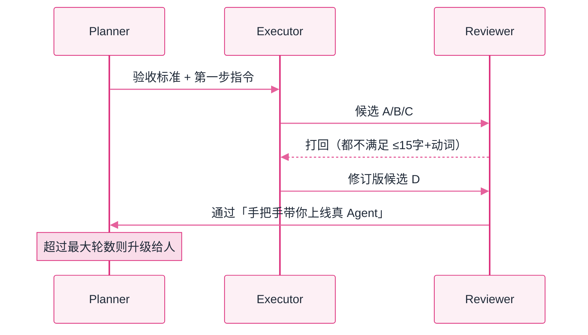

# Lab 4：三角色协作（Planner / Executor / Reviewer）


**一句话**：多智能体被讲玄了——本实验把它压回三件套：角色提示词、消息总线、重试与升级策略，并亲眼看一次「评审打回 → 修订 → 通过」。


- 可运行脚本仍在仓库里：[`labs/lab4_multi_agent.py`](https://github.com/funny8kids/ai-agent-handbook/blob/main/labs/lab4_multi_agent.py)（`python lab4_multi_agent.py`）
- 下面每一步的总线记录都是**真跑原样**；三个标签是改标准、改轮数、加评审后的真跑结果
- 前置阅读：[多智能体协作](../08-multi-agent/multi-agent-collaboration.md)、[规划与执行](../07-planning/plan-and-execute.md)

## 这个实验在搭什么

任务很具体：给本手册写一句 ≤15 字的首页标语。三个角色：

- **Planner**：拆步骤、定验收标准（然后闭嘴，让干活的人干活）；
- **Executor**：出候选；被驳回时读评审意见、修订再交；
- **Reviewer**：按「字数 ≤15 + 含动词 + 说清价值」硬标准放行或打回。



*《图：打回只回给 Executor 修订，通过才向 Planner 交人；Note 那条「超轮数升级给人」是这条链唯一的人工出口》*

## 分步演示：一条消息总线上的七次发言




#### 第 1 步：Planner 先立标准，再分工

```text
[planner ] 拆两步：① Executor 产出 3 个候选标语；② Reviewer 按'≤15字+含动词'标准挑一个，不合格打回。
[planner ] 验收标准：字数≤15、有动词、说清'给谁、有什么用'。
```

**要点**：Planner 只说话两次，且第二次给的是**可机判的验收标准**。没有这条，Reviewer 无从否决，多角色就退化成三个互相点头的复读机。




#### 第 2 步：Executor 一次交三个候选

```text
--- 第 1 轮 ---
[executor] 候选：A「让 Agent 从 demo 走向生产」 B「AI Agent 学习手册」 C「懂原理的 Agent 都省心」
```

**要点**：交的是**三个候选而不是一个**，这是把「生成」和「挑选」分开——挑选可比生成便宜得多，也可靠得多。




#### 第 3 步：Reviewer 打回，理由是可核对的

```text
[reviewer] 打回：没有同时满足 字数≤15 + 含动词 + 说清价值 的候选
```

按字符数逐条量：A 是 19 字（超长），B 13 字、C 14 字都合格但都没带评审认的动词（走向 / 上线 / 带你）。三条全不过。

**要点**：Reviewer 的价值不在「聪明」，在**标准可机判**。把「写得好」换成「≤15 字 + 含动词」，评审才从玄学变成闸门。




#### 第 4 步：意见回流，Executor 修订后再交

```text
--- 第 2 轮 ---
[executor] （收到意见「打回：没有同时满足 字数≤15 + …」，修订）候选：D「手把手带你上线真 Agent」
```

Executor 没有私聊通道，它只能从总线上读到那句打回理由——所以理由写得越具体，下一版越接近通过。

**要点**：这就是第 08 章说的「结构化交接物」。返工不是失败，是设计出来的第二条路径。




#### 第 5 步：通过，向 Planner 交人

```text
[reviewer] 通过：「手把手带你上线真 Agent」（14 字，含动词，说清价值）
[planner ] 任务完成，采用「手把手带你上线真 Agent」。共 2 轮，消息数 7
```

**要点**：注意最后那条把「共几轮、多少条消息」一起报了。多 Agent 系统没有这两个数，就无法回答「这套角色到底值不值」。



## 三个改动，三种收场（点标签切换，均为真跑输出）



第 1 轮刚打回，预算就用完了：

```text
--- 第 1 轮 ---
  [executor] 候选：A「让 Agent 从 demo 走向生产」 B「AI Agent 学习手册」 C「懂原理的 Agent 都省心」
  [reviewer] 打回：没有同时满足 字数≤15 + 含动词 + 说清价值 的候选
  [planner ] 到达最大轮数，升级给人（真实系统必须有的兜底）
```

**没有最终标语**。这条路径在生产上必须通知具体的人，并带上上下文：任务、已试过的候选、打回理由、剩余预算。缺了这条，多 Agent 系统只会安静地把 token 烧光。



给 Reviewer 加一条「不得含英文单词」，其余不动。三轮跑完：

```text
--- 第 2 轮 ---
  [executor] （收到意见「打回：没有同时满足 字数≤15 + …」，修订）候选：D「手把手带你上线真 Agent」
  [reviewer] 打回：没有同时满足 字数≤15 + 含动词 + 说清价值 的候选

--- 第 3 轮 ---
  [executor] （收到意见「打回：没有同时满足 字数≤15 + …」，修订）候选：D「手把手带你上线真 Agent」
  [reviewer] 打回：没有同时满足 字数≤15 + 含动词 + 说清价值 的候选
  [planner ] 到达最大轮数，升级给人（真实系统必须有的兜底）

最终标语: （无，需人工介入）
```

第 2、3 轮 Executor 交的是**同一个候选**——写死的剧本改不动了，因为「Agent」这个词本身就在它的候选里。两个教训：**标准越严，剧本越难写**（这正是真模型存在的理由）；以及**必须做停滞检测**（连续两轮交接物完全相同就直接升级，别把轮数预算耗在复读上）。



再挂一个 Reviewer，只投「同意 / 不同意」，2:1 才算通过：

```text
--- 第 1 轮 ---
  [reviewer] 打回：没有同时满足 字数≤15 + 含动词 + 说清价值 的候选
  [reviewer2] 不同意

--- 第 2 轮 ---
  [reviewer] 通过：「手把手带你上线真 Agent」（14 字，含动词，说清价值）
  [reviewer2] 同意
  [planner ] 任务完成，采用「手把手带你上线真 Agent」。共 2 轮，消息数 9
```

实测：总线消息 **7 条 → 9 条**，总线文本 **298 字 → 303 字**。看起来几乎免费——但这是玩具的错觉：真实系统里每多一个评审，就多一次「把候选和验收标准完整重发一遍」的模型调用，账单按**调用次数 × 输入长度**算，而不是按回复那两个字算（第 08 章的多 Agent 成本账）。




开发这个实验时踩过一个真实 bug：第一版用空白切分提取候选，结果「让 Agent 从 demo 走向生产」里的空格把标语切成碎片，Reviewer 拿到的是「让」一个字，永远打回。改成按成对引号整体提取才对。**多 Agent 系统的第一大坑就是角色间的解析边界**——你写的不是自然语言处理，是接口契约。


## 自己改着玩（不用看源码也能改）

1. **改标准写法**：把「说清价值」这条去掉，只留「≤15 字 + 含动词」。第 1 轮的 C 候选会不会被放行？体会标准松一格，通过率与质量怎么换。
2. **改总线形状**：让 Reviewer 只能看到 Executor 的候选、看不到 Planner 的标准。第二轮它还会不会打回？——这就是第 08 章「共享黑板 vs 定向消息」的差别，看不见标准的评审会退化成自由发挥。
3. **加停滞检测**：连续两轮候选完全相同就立刻升级。用上面第二个标签的场景验证：轮数预算应该从 3 降到 2 就收工，而不是把第三轮白烧一遍。

## 排错备忘

| 症状 | 原因 | 解法 |
|---|---|---|
| 永远在第一轮打转 | Executor 的驳回计数没生效（总线里找不到 reviewer） | 确认计数读的是共享总线，不是角色自己的局部变量 |
| 评审通过但标语是半句 | 提取用的分隔符与文本不匹配 | 打印提取结果；边界用「」这类成对符号 |
| 角色互相复读 | 提示里没有「看到意见才修订」的条件 | 把评审意见显式拼进下一轮的输入，并加停滞检测 |

下一站：[Lab 5 评测与可观测 →](lab5-eval-trace.md)
