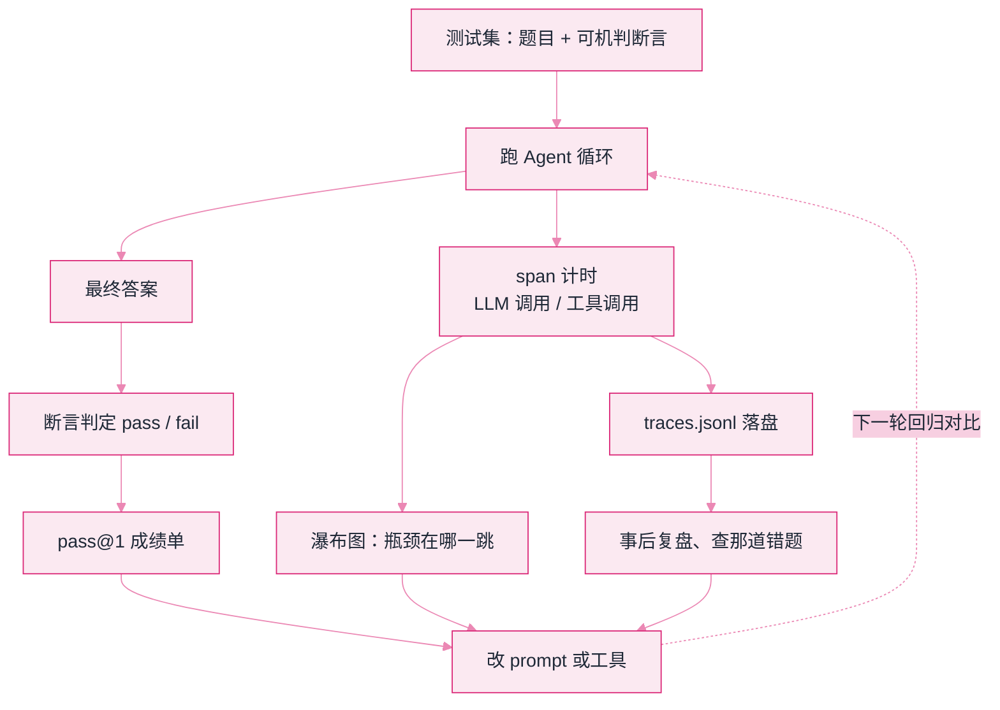

# Lab 5：评测与可观测（pass@1 + trace 瀑布）


**一句话**：给 Agent 建「考场 + 行车记录仪」——可机判的测试集打分，span 级瀑布图找瓶颈，trace 落盘 JSONL 供事后复盘。


- 源码：仓库根目录 [`labs/lab5_eval_trace.py`](https://github.com/funny8kids/ai-agent-handbook/blob/main/labs/lab5_eval_trace.py)
- 运行：`python lab5_eval_trace.py`（会在当前目录生成 `traces.jsonl`）
- 前置阅读：[评估指标](../10-evaluation-safety/evaluation-metrics.md)、[日志与追踪](../11-engineering/logging-tracing-monitoring.md)

## 这个实验在搭什么

第 10 章说「没有评测就没有迭代」，第 11 章说「看不见就修不好」。本实验把两句话变成两个文件：一份成绩单 + 一份 trace。被测对象是 Lab 1 那种循环的简化版，我们**故意让它在一道多跳题上答错**（幻觉），看评测系统能不能当场抓住。

数据流一画就清楚了：左边是「考场」，右边是「行车记录仪」，两者都从同一次运行里长出来。



## 完整代码（复制即跑）

```python
# -*- coding: utf-8 -*-
"""Lab 5 评测与可观测：给 Lab1 式 Agent 建"考场 + 行车记录仪"。

三件事，正是第 10/11 章的工程落地：
  1) 测试集 + 断言判定 -> pass@1（回归测试的雏形）
  2) 每次运行记录 span（谁、何时、多久）-> 文本版瀑布图
  3) trace 落盘 JSONL -> 事后可用 jq/pandas 复盘

运行：python lab5_eval_trace.py   （会在当前目录生成 traces.jsonl）
"""
import json
import random
import sys
import time

sys.stdout.reconfigure(encoding="utf-8")  # 防 Windows 控制台 GBK 乱码
random.seed(42)  # 固定随机种子：工具耗时可复现，输出才能和书里对上

# ---------- 被测 Agent：简化版 ReAct，带"性格缺陷"供评测抓出来 ----------

def agent_solve(case):
    """返回 (答案, 步骤列表)。故意让'多跳'用例慢一些，制造可观测性素材。"""
    spans, t0 = [], time.perf_counter()
    for step, name in enumerate(["plan", "tool:search", "tool:calc", "answer"]):
        if name == "tool:calc" and not case["needs_calc"]:
            continue
        dur = random.uniform(0.01, 0.03) if name.startswith("plan") \
            else random.uniform(0.05, 0.15) if "search" in name \
            else random.uniform(0.02, 0.05)
        time.sleep(dur)
        spans.append({"step": name, "start": time.perf_counter() - t0 - dur,
                      "dur": dur})
    ans = case["gold"] if case["id"] != 3 else "4200 万元"  # 用例3故意答错（幻觉）
    return ans, spans

# ---------- 测试集：断言要"可机判"，别写'回答质量好' ----------

CASES = [
    {"id": 1, "q": "甲公司营收？", "needs_calc": False, "gold": "4800 万元"},
    {"id": 2, "q": "乙公司营收换算成万元？", "needs_calc": True, "gold": "6200 万元"},
    {"id": 3, "q": "甲公司半年营收（需除以2）？", "needs_calc": True, "gold": "2400 万元"},
    {"id": 4, "q": "甲公司营收加汇率常识？", "needs_calc": False, "gold": "4800 万元"},
]

def run_suite():
    print("=" * 62)
    print("Lab 5：Agent 评测（pass@1）+ 可观测（span 瀑布 + JSONL trace）")
    print("=" * 62)
    results, all_spans = [], []
    for case in CASES:
        ans, spans = agent_solve(case)
        ok = (ans == case["gold"])
        results.append({"id": case["id"], "q": case["q"], "got": ans,
                        "gold": case["gold"], "pass": ok,
                        "cost_ms": round(sum(s["dur"] for s in spans) * 1000)})
        for s in spans:
            all_spans.append({"case": case["id"], **s})
        with open("traces.jsonl", "a", encoding="utf-8") as f:
            f.write(json.dumps({"case": case["id"], "answer": ans,
                                "pass": ok, "spans": spans}, ensure_ascii=False) + "\n")

    # ---- 成绩单 ----
    print("\n--- 成绩单 ---")
    print(f"{'用例':4s} {'判定':4s} {'耗时ms':>6s}  答案 vs 期望")
    for r in results:
        print(f"{r['id']:<4d} {'✓' if r['pass'] else '✗':<4s} {r['cost_ms']:>6d}  "
              f"{r['got']} | {r['gold']}")
    p1 = sum(r["pass"] for r in results) / len(results)
    print(f"\npass@1 = {p1:.0%}（{sum(r['pass'] for r in results)}/{len(results)}）"
          f" —— 低于 100% 的每一个 ✗ 都该沉淀为常驻回归用例")

    # ---- 文本版瀑布图：一眼看出时间花在哪 ----
    print("\n--- trace 瀑布（用例:步骤，条长≈耗时）---")
    tmax = max(s["start"] + s["dur"] for s in all_spans) or 1e-9
    for s in all_spans:
        left = int(s["start"] / tmax * 40)
        bar = "#" * max(1, int(s["dur"] / tmax * 40))
        print(f"  c{s['case']} {s['step']:12s} {' ' * left}|{bar}| {s['dur']*1000:.0f}ms")
    print("\n  观察：search 步占了大头 -> 优化方向是缓存/并行，而不是换更快的模型")
    print("  traces.jsonl 已生成：每行一个用例的完整 span 记录，pandas 可直接读")

if __name__ == "__main__":
    import os
    if os.path.exists("traces.jsonl"):
        os.remove("traces.jsonl")  # 每次干净起跑
    run_suite()
```

## 真实运行输出

```text
==============================================================
Lab 5：Agent 评测（pass@1）+ 可观测（span 瀑布 + JSONL trace）
==============================================================

--- 成绩单 ---
用例   判定     耗时ms  答案 vs 期望
1    ✓       104  4800 万元 | 4800 万元
2    ✓       225  6200 万元 | 6200 万元
3    ✗       151  4200 万元 | 2400 万元
4    ✓        99  4800 万元 | 4800 万元

pass@1 = 75%（3/4） —— 低于 100% 的每一个 ✗ 都该沉淀为常驻回归用例

--- trace 瀑布（用例:步骤，条长≈耗时）---
  c1 plan         |####| 23ms
  c1 tool:search      |#########| 53ms
  c1 answer                    |####| 28ms
  c2 plan         |##| 14ms
  c2 tool:search    |#####################| 124ms
  c2 tool:calc                            |#######| 40ms
  c2 answer                                      |########| 47ms
  c3 plan         |##| 12ms
  c3 tool:search    |################| 92ms
  c3 tool:calc                      |###| 21ms
  c3 answer                             |####| 27ms
  c4 plan         |###| 20ms
  c4 tool:search     |#########| 53ms
  c4 answer                   |####| 26ms

  观察：search 步占了大头 -> 优化方向是缓存/并行，而不是换更快的模型
  traces.jsonl 已生成：每行一个用例的完整 span 记录，pandas 可直接读
```

## 盯住输出里的三个细节

1. **用例 3 是"像样的错误"**：4200 万元不是乱码，是**语法、单位、格式全对但数值错**的答案——真实世界的幻觉就长这样。断言若只查「是否包含'万元'」就会被骗过；查精确数值才抓得住。这就是「断言要可机判」的含义。
2. **pass@1 之后还有动作**：每个 ✗ 都要变成常驻回归用例（代码里已落盘 traces.jsonl），下次改动重跑，防止「修 A 坏 B」。第 10 章的回归测试闭环，最小可行版就是这个循环。
3. **瀑布图直接给出优化对象**：c2 的 search 步 124ms，是 plan 的十倍。优化顺序应从最大条开始——缓存热点查询、并行独立检索，而不是笼统地「换个更快的模型」。没有这张图，优化全凭猜。


`random.seed(42)` 不是装饰。评测要对比两个版本，若耗时每次不同，diff 里就分不清「真变慢了」还是「噪声」。真实评测里对应的做法是：固定温度到 0、固定样本顺序、同一模型版本跑多次取分布。


## 动手改（由易到难）

1. 把用例 3 的判定从精确匹配改成「数值 ±1% 容差」：思考什么错误该被容差放过、什么绝不能。
2. 给 `agent_solve` 加一个「重试」步（失败换参数再跑一次），对比加与不加的 pass@1 和总耗时——第 16 章「用延迟换正确率」的账自己算。
3. 用 pandas 读 `traces.jsonl`，按 step 聚合平均耗时并画柱状图。做完这一步，你就拥有了一个没有 UI 的 LangSmith。

## 排错备忘

| 症状 | 原因 | 解法 |
|---|---|---|
| 输出和书里对不上 | 没固定随机种子，或 Python 版本时间精度差异 | 保留 `random.seed(42)`；耗时列本就有毫秒级抖动 |
| traces.jsonl 越跑越长 | 追加模式没清旧文件 | 脚本开头已 `os.remove`，手动删一次也行 |
| 瀑布条全部挤在最左 | tmax 计算漏了 start 偏移 | 检查 `s["start"] + s["dur"]` 取最大值 |

下一站：[Lab 6 护栏与真模型切换 →](lab6-guardrails.md)
