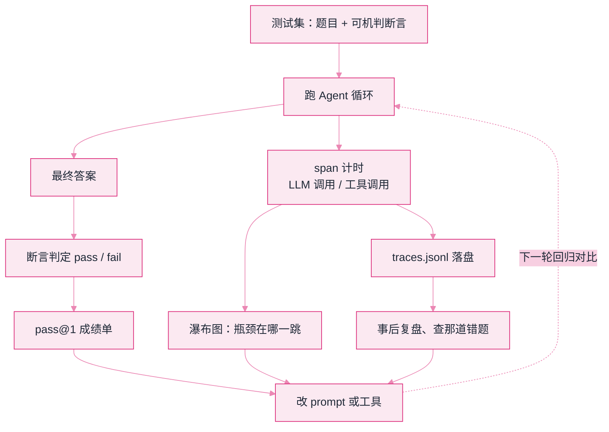

# Lab 5：评测与可观测（pass@1 + trace 瀑布）


**一句话**：给 Agent 建「考场 + 行车记录仪」——可机判的测试集打分，span 级瀑布图找瓶颈，trace 落盘 JSONL 供事后复盘。


- 可运行脚本仍在仓库里：[`labs/lab5_eval_trace.py`](https://github.com/funny8kids/ai-agent-handbook/blob/main/labs/lab5_eval_trace.py)（`python lab5_eval_trace.py`，会在当前目录生成 `traces.jsonl`）
- 下面每一步的成绩单、瀑布和 trace 都是**真跑原样**；三个标签是改断言、加容差、去掉随机种子后的真跑结果
- 前置阅读：[评估指标](../10-evaluation-safety/evaluation-metrics.md)、[日志与追踪](../11-engineering/logging-tracing-monitoring.md)

## 这个实验在搭什么

第 10 章说「没有评测就没有迭代」，第 11 章说「看不见就修不好」。本实验把两句话变成两个文件：一份成绩单 + 一份 trace。被测对象是 Lab 1 那种循环的简化版，我们**故意让它在一道多跳题上答错**（幻觉），看评测系统能不能当场抓住。

数据流一画就清楚了：左边是「考场」，右边是「行车记录仪」，两者都从同一次运行里长出来。



*《图：一次运行同时长出成绩单与 span；三条反馈线（成绩/瀑布/复盘）都指向同一个「改」字，虚线才是这套系统值得建的原因》*

## 分步演示：一次运行怎么长出成绩单和 trace




#### 第 1 步：先立考题——4 道题，每题带一句可机判断言

```text
用例 1  甲公司营收？                    期望 4800 万元   需要计算：否
用例 2  乙公司营收换算成万元？          期望 6200 万元   需要计算：是
用例 3  甲公司半年营收（需除以 2）？    期望 2400 万元   需要计算：是
用例 4  甲公司营收加汇率常识？          期望 4800 万元   需要计算：否
```

**要点**：判定标准是「答案字符串 == 期望字符串」，不是「回答质量好」。写不出可机判的断言，评测就只能靠人眼看，而人眼看不了回归测试的第 200 次运行。




#### 第 2 步：跑最简单的单跳题，顺带记下三个 span

```text
1    ✓       104  4800 万元 | 4800 万元
```

同一轮落盘的原始记录（`traces.jsonl` 第 1 行，未加工）：

```json
{"case": 1, "answer": "4800 万元", "pass": true, "spans": [{"step": "plan", "start": 0.0003035640346929734, "dur": 0.022788535969157673}, {"step": "tool:search", "start": 0.02363122448197995, "dur": 0.052501075522266696}, {"step": "answer", "start": 0.0764572204486243, "dur": 0.02825087955107358}]}
```

**要点**：`start` 是相对用例起点的偏移，`dur` 是这段耗时——只要有这两个数，任何工具都能重建瀑布图，不需要 SDK。这就是第 11 章讲的 span 数据契约的最小形状。

一句对照说明：这行是本机一次真跑的原文。`dur` 被脚本里的随机种子钉住了，重跑还是 22.8 / 52.5 / 28.3 毫秒；`start` 读的是真实时钟，**每次跑都不一样**，别去对那串 16 位小数。




#### 第 3 步：多跳题真被测出问题——用例 3 答成 4200 万元

```text
3    ✗       151  4200 万元 | 2400 万元
```

期望「2400 万元」，模型给出「4200 万元」。注意这个答案的形式：单位对、格式对、语气对、数字对不上。

**要点**：这就是幻觉在生产环境里的真实长相——不是乱码，是**像样地错**。所以判定必须是精确数值，任何「看起来合理就放行」的检查都会放它过去（下面第一个标签现场演示一次）。




#### 第 4 步：合上成绩单

```text
用例   判定     耗时ms  答案 vs 期望
1    ✓       104  4800 万元 | 4800 万元
2    ✓       225  6200 万元 | 6200 万元
3    ✗       151  4200 万元 | 2400 万元
4    ✓        99  4800 万元 | 4800 万元

pass@1 = 75%（3/4） —— 低于 100% 的每一个 ✗ 都该沉淀为常驻回归用例
```

**要点**：pass@1 = 一次采样就通过的比例。分数本身不重要，重要的是**每一个 ✗ 都留了题目、期望、实际、耗时四列**——下一版改动直接重跑这四行，才知道有没有「修 A 坏 B」。




#### 第 5 步：把 span 画成瀑布，瓶颈自己跳出来

```text
  c1 plan         |####| 23ms
  c1 tool:search      |#########| 53ms
  c1 answer                    |####| 28ms
  c2 plan         |##| 14ms
  c2 tool:search    |#####################| 124ms
  c2 tool:calc                            |#######| 40ms
  c2 answer                                      |########| 47ms
  c3 plan         |##| 12ms
  c3 tool:search    |################| 92ms
  c3 tool:calc                      |###| 21ms
  c3 answer                             |####| 27ms
  c4 plan         |###| 20ms
  c4 tool:search     |#########| 53ms
  c4 answer                   |####| 26ms
```

条越长越慢，横位置表示它什么时候开始。**c2 的 search 步 124ms，是同一条用例 plan 步（14ms）的近九倍。**

**要点**：优化顺序从最长的条开始——缓存热点查询、把独立检索并行化，而不是笼统地「换个更快的模型」。没有这张图，这三条 line 长的瓶颈全靠猜。



## 三处改动，三种后果（点标签切换，均为真跑输出）



判定从「等于期望值」换成「答案里出现『万元』两个字」，其余一行不改：

```text
1    ✓       104  4800 万元 | 4800 万元
2    ✓       225  6200 万元 | 6200 万元
3    ✓       151  4200 万元 | 2400 万元
4    ✓        99  4800 万元 | 4800 万元

pass@1 = 100%（4/4） —— 低于 100% 的每一个 ✗ 都该沉淀为常驻回归用例
```

**pass@1 从 75% 涨到 100%，而 Agent 的能力一点没变**——用例 3 照样在答 4200 万元，只是没人抓它了。这是评测系统最典型的失败方式：分数上升 ≠ 变好，往往只是断言变软。看到「接入评测后通过率立刻 100%」，第一反应应该是去查断言。


{% tab title="改成数值 ±1% 容差" %}
不是放松，而是换一种严格：把两边解析成数字，允许 1% 误差。

```text
1    ✓       104  4800 万元 | 4800 万元
2    ✓       225  6200 万元 | 6200 万元
3    ✗       151  4200 万元 | 2400 万元
4    ✓        99  4800 万元 | 4800 万元

pass@1 = 75%（3/4） —— 低于 100% 的每一个 ✗ 都该沉淀为常驻回归用例
```

结论和精确匹配一模一样（4200 与 2400 差 75%，远超 1%），但容差把「四舍五入 / 单位换算尾数」这类无害差异放过了。**容差要按错误幅度定，不是按好不好写定**：数值题给 1%，字符串题零容差，检索题看命中位置。



脚本里有 `random.seed(42)` 固定工具耗时。把它去掉，同一段代码连跑两次，只看四行耗时：

| 用例 | 固定种子 | 无种子第 1 遍 | 无种子第 2 遍 |
|---|---|---|---|
| 1 | 104ms | 126ms | 128ms |
| 2 | 225ms | 175ms | 168ms |
| 3 | 151ms | 228ms | 140ms |
| 4 | 99ms | 102ms | 132ms |

瀑布条跟着抖：c2 的 search 步在三份输出里分别是 124ms、101ms、75ms，条长肉眼可见地换了形状。

**pass@1 三次都还是 75%**（对错是确定的），但耗时完全不可比。这就是为什么评测脚本第一件事是固定随机性——温度归 0、样本顺序固定、同一模型版本跑多次取分布。不这么做，版本 A/B 的 diff 里分不清「真变慢了」还是「噪声」。




trace 落盘这件事的价值在事后：`traces.jsonl` 每行一个用例，用表格工具读进来按 step 聚合平均耗时，就得到一个没有 UI 的 LangSmith。先有这份 JSONL，再考虑要不要买观测平台——顺序反了会花冤枉钱。


## 自己改着玩（不用看源码也能改）

1. **给错题加第二条断言**：除了精确数值，再加「回答必须引用检索到的文档名」。用例 1、2、4 会不会因此挂掉？体会断言越多、假阳性越少但假阴性上升。
2. **加一个重试步**：失败就换参数再跑一次，然后对比加与不加的 pass@1 和总耗时。用上面第三张表的量级自己算——第 16 章「用延迟换正确率」的账，数字要落在具体毫秒上才作数。
3. **改聚合维度**：把瀑布从「按用例」改成「按步骤跨用例聚合」（plan / search / calc / answer 各一行）。改完你会发现 search 平均占了一半以上时间——这正是所有观测平台默认给你的那张图。

## 排错备忘

| 症状 | 原因 | 解法 |
|---|---|---|
| 输出和书里对不上 | 没固定随机种子，或时间精度有毫秒级抖动 | 保留种子；耗时列本就允许抖动，对错列不该有 |
| `traces.jsonl` 越跑越长 | 追加模式没清旧文件 | 起跑前先删同名文件，或按运行时间戳分文件 |
| 瀑布条全挤在最左边 | 计算总长时漏了 `start` 偏移 | 取 `max(start + dur)` 作标尺，而不是 `max(dur)` |
| pass@1 突然 100% | 断言被写软了（见第一个标签） | 反向验证：故意喂一个错答案，看评测抓不抓得住 |

下一站：[Lab 6 护栏与真模型切换 →](lab6-guardrails.md)
