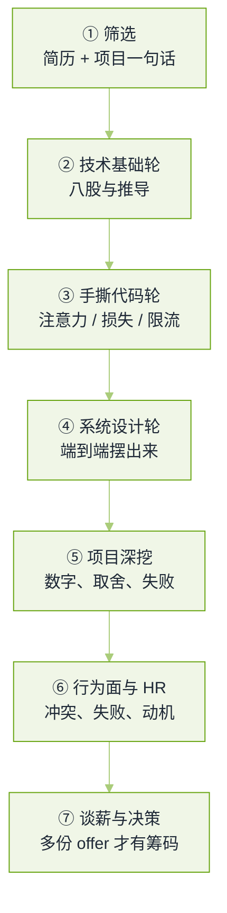

# 20 面试真题 · 本章导读


**一句话**：把大厂 LLM/AI 岗位真实考过的问题按轮次摊开——每道题写清「考什么、答到哪算到位、去本书哪一页补」，题目本身来自公开题库与候选人面经，不含任何公司的官方题库。


## 题源与口径（先说清楚，免得把这份清单当保证）

本章的题不是编的，也不是某家公司「题库泄露」。它们来自四类公开材料，每一页的**参考资料**里都给了可点开的原始出处：

| 来源类型 | 具体是什么 | 可信度边界 |
|---|---|---|
| 海外候选人面经汇总 | 按公司打标签的开源题库仓库，条目是面试者事后转述的原话 | 「曾在 X 公司被问过」由转述者标注，平台不背书 |
| 国内大厂面经 | 牛客、掘金、CSDN 上按轮次记录的面经帖 | 同一条题在不同帖里措辞会漂移，本章取最常被复述的那版说法 |
| 开源面试手册 | 中文 AIGC 面试书、Agent 面试与手撕题库仓库 | 部分是「待补充」的占位条目，本章只用在能读出具体问题的文件上 |
| 岗位与协议官方文档 | 模型/推理引擎/协议的官方 spec 与论文 | 用来核对答案里的事实与公式，不用来出题 |

两条硬口径：

1. **公司名只是标签**。写「某家 labs 问过」不等于该公司官方考题，也不会因为某题标了大厂就更容易考——同一个岗位每一轮面试官不同，题就不同。
2. **本章给的是答题要点，不是标准答案**。要点写的是「面试官在等什么信号」；同一道题在基础设施岗和算法岗上的合格线完全不同，页内会注明岗位倾向。

## 一轮面试长什么样

*《图：LLM/AI 岗位一轮完整面试的七个阶段，本章十四页按这七个阶段分工——基础与推导三页（含数据），手撕一页，设计与专项四页，项目与背景三页》*

不同岗位的重心不一样，这是准备时间该怎么分的依据：

| 岗位 | 拉得最满的轮次 | 常被压到最低的轮次 |
|---|---|---|
| 算法/后训练 | 训练与对齐、手撕损失函数 | 服务化容量规划 |
| 推理与基础设施 | 推理服务化、系统设计 | 对齐细节的公式推导 |
| 应用/Agent 工程 | Agent 工程、系统设计 | 分布式训练显存账 |
| 数据与评测 | 数据工程、评测与裁判 | 模型结构演进史 |
| 多模态/具身 | 多模态与视觉语言、前沿开放题 | 服务化调度 |
| 安全与对齐 | 安全与红队、评测与裁判 | 容量与成本账 |

## 十四页怎么用

| 页面 | 装了什么 | 补哪几章 |
|---|---|---|
| [大模型基础真题](llm-foundations.md) | 注意力、位置编码、KV Cache、MoE、量化、采样 | [03 LLM](../03-llm/README.md) |
| [训练与对齐真题](training-alignment.md) | 预训练/SFT/RLHF、PPO-DPO-GRPO、LoRA 家族、并行与显存 | [03](../03-llm/README.md)、[16 基础设施](../16-ai-infrastructure/README.md) |
| [数据工程与合成数据真题](data-engineering.md) | 语料管线、去重、配比、合成数据、分词器、可复现 | [16 基础设施](../16-ai-infrastructure/README.md) |
| [RAG 与检索真题](rag-retrieval.md) | 分块、混合检索、重排、评测、幻觉治理 | [06 记忆与 RAG](../06-memory-rag/README.md) |
| [Agent 工程真题](agent-engineering.md) | 循环、工具、记忆、多智能体、评测回流、安全 | [02](../02-agent-basics/README.md)、[05](../05-tool-protocol/README.md)、[08](../08-multi-agent/README.md) |
| [推理与服务化真题](inference-serving.md) |  batching、显存、成本、延迟预算、扩缩容 | [16 基础设施](../16-ai-infrastructure/README.md) |
| [系统设计真题](system-design.md) | 客服 Agent、企业 RAG、代码助手、高并发推理 | [12 应用](../12-applications/README.md) |
| [评测与裁判模型真题](evaluation-judge.md) | 四层评测、裁判偏差与一致性、显著性、离线线上对平 | [10 评估与安全](../10-evaluation-safety/README.md) |
| [安全与红队真题](safety-redteam.md) | 注入与权限、越狱分类、红队指标、护栏与合规 | [10 评估与安全](../10-evaluation-safety/README.md) |
| [多模态与视觉语言真题](multimodal-vision.md) | 图文对齐、接入路线、token 与位置账、视觉幻觉、VLA、语音 | [03 LLM](../03-llm/README.md)、[17 具身](../17-embodied-ai/README.md) |
| [前沿与研究岗真题](frontier-research.md) | 测试时算力、长上下文、MoE、蒸馏压缩、自改进、开放题 | [18 2026 前沿](../18-frontier-2026/README.md) |
| [手撕代码与算法真题](live-coding.md) | 注意力、采样、损失、限流、Agent 循环 | 各章的机制图 |
| [项目深挖与行为面真题](behavioral-project.md) | 深挖四问、失败题、反问、谈薪 | [11 工程化](../11-engineering/README.md) |
| [岗位分档与转岗真题](career-tracks.md) | 年资及格线、后端/测试/数据转岗、项目信号、四周排期 | [00 学习路线](../00-index/learning-path.md) |

推荐顺序：**先做自测，再看页**。每页的题目按「跨来源重复出现次数」排序，靠前的题更值得先练——但「出现得多」只说明转述的人多，不代表你会考到。如果只有两周，按 [岗位分档与转岗真题](career-tracks.md) 里的四周排期表砍掉前两周，先练手撕与设计两轮。

## 读完能做到

- 说出 LLM/AI 岗位一轮完整面试的七个阶段，以及自己目标岗位上被拉得最满的两轮是哪两轮；
- 对每道高频题给出「考察点 + 三条答题要点 + 一个能量化的细节」，而不是背结论；
- 把十四页按岗位拼成一条自己的复习路线：应用岗走「基础—RAG—Agent—设计—安全」，训练岗走「基础—训练—数据—评测—手撕」，基础设施岗走「基础—推理—设计—评测」；
- 用本书章节定位任何一道答不顺的题：每页每题都标了回看页；
- 在项目深挖轮里用「数字—对照—失败—修正」四步讲完一个项目，而不是复述简历；
- 分辨一份面经清单的可信度边界：哪些是公司官方口径，哪些只是候选人转述。

## 章末自测

1. 面试官问「为什么注意力要除以 $$\sqrt{d_k}$$，不除会怎样」，你能否在两分钟内讲清方差放大与 softmax 饱和两条因果，并说出 pre-norm 与 post-norm 的区别？（提示：见 [大模型基础真题](llm-foundations.md) 与 [Transformer 注意力机制](../03-llm/transformer-attention.md)）
2. PPO、DPO、GRPO 三者的 loss 各自省掉了什么组件、代价是什么？为什么有团队在长链推理上用 GRPO 反而不稳？（提示：见 [训练与对齐真题](training-alignment.md) 与 [RLHF、DPO 与对齐](../03-llm/rlhf-dpo-alignment.md)）
3. 检索命中了正确片段但生成仍然错，你如何把责任分到检索侧与生成侧？给出可落地的两步定位法。（提示：见 [RAG 与检索真题](rag-retrieval.md) 与 [RAG 检索质量调优](../06-memory-rag/retrieval-quality-tuning.md)）
4. 一个 Agent 上线后开始出现路径震荡与死循环，你的检测手段和兜底策略分别是什么？（提示：见 [Agent 工程真题](agent-engineering.md) 与 [Agent 失败模式排查手册](../11-engineering/agent-failure-playbook.md)）
5. 给一个 3 秒首字预算的客服 Agent 做容量规划，你会先问哪三个数字？（提示：见 [推理与服务化真题](inference-serving.md) 与 [推理服务化](../16-ai-infrastructure/inference-serving.md)）
6. 系统设计轮要求「设计一个能真实执行操作、并能升级给人工的客服 Agent」，你的方案里权限闸门放在哪一层？（提示：见 [系统设计真题](system-design.md) 与 [工具权限与沙箱](../05-tool-protocol/tool-permission-sandbox.md)）
7. 手撕带 causal mask 的多头注意力时，你如何用一个形状断言证明 mask 真的生效了？（提示：见 [手撕代码与算法真题](live-coding.md)）
8. 项目深挖轮被问「你的评测框架是真的，还是凭感觉」，你手上有什么证据可以顶上？（提示：见 [项目深挖与行为面真题](behavioral-project.md) 与 [持续评测](../11-engineering/continuous-evaluation.md)）
9. 一张 1024×1024、patch=14 的图，做完 2×2 空间合并后吃掉多少 token？这条账怎么推出「支持 4K」和「看得清 4K」是两件事？（提示：见 [多模态与视觉语言真题](multimodal-vision.md) 与 [多模态大模型](../03-llm/multimodal.md)）
10. MinHash + LSH 的碰撞概率公式里，$$b$$ 与 $$r$$ 各调的是什么？为什么段落级重复比文档级更该治？（提示：见 [数据工程与合成数据真题](data-engineering.md) 与 [数据与向量存储](../16-ai-infrastructure/data-vector-storage.md)）
11. 裁判模型换了版本，历史曲线为什么立刻不可比？你会用哪三样东西发现漂移？（提示：见 [评测与裁判模型真题](evaluation-judge.md) 与 [LLM 观测与评测平台](../16-ai-infrastructure/llm-observability-eval-platform.md)）
12. 面试官说「我们在 system 里写了不要执行外部指令」，你该指出这条防线的哪个致命问题？（提示：见 [安全与红队真题](safety-redteam.md) 与 [工具权限与沙箱](../05-tool-protocol/tool-permission-sandbox.md)）
13. 「为什么多花 token 思考会变强，上限由什么决定」——你怎么把这个问题答成一次可证伪的实验设计？（提示：见 [前沿与研究岗真题](frontier-research.md) 与 [推理预算与测试期计算](../04-prompt-reasoning/test-time-compute-reasoning-budget.md)）
14. 同为「设计企业知识库问答」，3 年社招与 8 年社招的及格线差在哪两个词上？（提示：见 [岗位分档与转岗真题](career-tracks.md) 与 [系统设计真题](system-design.md)）

## 术语速查

| 英文 | 中文 | 白话 |
|---|---|---|
| Loop | 面试轮次 | 一场面试被切成几关，每关考不同的东西 |
| Screen | 电话筛选 | 十几分钟判断值不值得占用你后面几小时 |
| Onsite | 现场轮 | 连续几轮技术面加行为面，一次走完 |
| Hiring Manager | 用人经理面 | 关心你能否独立负责一块，而不是会不会背书 |
| Bar Raiser | 加严轮 | 专门有权否决的一方，考察你比同层强多少 |
| Deep Dive | 项目深挖 | 抓住一个项目连环追问，直到你答不出细节 |
| Take-home | 回家作业 | 限期交一个小系统，看工程习惯而非炫技 |
| Whiteboarding | 白板题 | 现场写代码或画图，没有搜索引擎 |
| Behavioral | 行为面 | 用过去的具体事例预测未来的行为 |
| Referral | 内推 | 由在职员工递简历，通常跳过最浅的一层筛选 |
| Back-channel | 结果私下沟通 | 面试官之间对齐评价的那轮非正式讨论 |
| Debrief | 面后评议 | 所有面试官摊开投票，决定给不给 offer |
| Loop Update | 流程反馈 | 协调人告诉你在哪一关、卡在哪一环 |
| Leveling | 定级 | 面评换算成职级，级别决定薪酬带宽与是否复议 |
| Hiring Committee | 录用委员会 | 跨团队复核边缘候选人的那一层，常见于研究岗 |
| HC（Headcount） | 名额 | 岗位有没有坑、什么时候收回，往往比面试表现更致命 |
| Offer Call | 意向电话 | 谈级别与薪酬，先拿到的数字容易变成上限 |

## 常见误区

- ❌ 把这章当题库背：题目是公司不负责的转述，答题要点才是能迁移的东西。
- ❌ 只刷八股不练表达：基础轮的失败通常不是「不知道」，是讲不到能量化的那一层。
- ❌ 系统设计轮直接开始画框图：先问清三个数字（并发、延迟预算、数据规模），再谈选型。
- ❌ 项目深挖只讲成功：没有失败与修正路径的项目叙述，会被直接判定为「不是你自己做的」。
- ❌ 第一通电话就报数字：只有一个 offer 时几乎没有议价空间，见 [项目深挖与行为面真题](behavioral-project.md)。
- ❌ 不分岗位地平均用力：数据、评测、安全、多模态四页各自只服务于被拉满的那一轮，全刷等于什么都没刷。

## 参考资料

- [AI Engineering 面试题库（按公司标注的候选人转述）](https://github.com/pallavi-shekhar/ai-engineering-interview-questions-company-wise)
- [AI Engineering Field Guide（面试章节与面经汇总）](https://github.com/alexeygrigorev/ai-engineering-field-guide)
- [AIGC-Interview-Book 大厂高频面试题](https://github.com/WeThinkIn/AIGC-Interview-Book)
- [AgentGuide 面试题库目录（理论、RAG、Agent、手撕、转型、谈薪、评测）](https://github.com/adongwanai/AgentGuide/tree/main/docs/04-interview)
- [AgentGuide 企业面试案例](https://github.com/adongwanai/AgentGuide/blob/main/docs/04-interview/12-company-interview-cases.md)
- [AgentGuide 算法与手撕题库](https://github.com/adongwanai/AgentGuide/blob/main/docs/04-interview/22-algorithm-ai-coding-question-bank.md)
- [LLM & VLM & Agent 面试问题总结（datawhale hello-agents 附录）](https://github.com/datawhalechina/hello-agents/blob/main/Extra-Chapter/Extra01-%E9%9D%A2%E8%AF%95%E9%97%AE%E9%A2%98%E6%80%BB%E7%BB%93.md)

## 相关知识点

- [学习路线](../00-index/learning-path.md)
- [动手实验](../19-labs/README.md)
- [术语表](../21-glossary/README.md)
- [评测与裁判模型真题](evaluation-judge.md)
- [安全与红队真题](safety-redteam.md)
