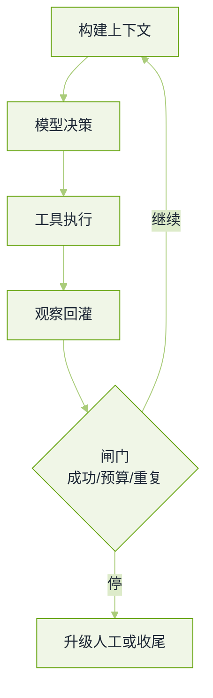

# Agent 工程真题


**一句话**：Agent 岗的题几乎都在问同一件事——模型之外那层脚手架怎么设计，才能让它错了也不闯祸、贵了也能被看见。


这是应用/基础设施两个方向共同拉满的一轮，也是海外题库里出现频率最高的一组（「一个能真实调用工具的 Agent，怎么让循环可靠」在多家被复述）。题源见本章[导读](README.md)。

## 循环、预算、闸门

*《图：Agent 循环里面试官真正在看的那一格——判定停下的条件，而不是模型能想几步》*

## 概念与选型

**1. 你怎么理解 Agent？它与普通大模型问答最大的区别是什么？用 ReAct 还是 Plan-and-Execute，为什么？**

- 要点：区别在**控制流归谁**。问答是单轮映射；Agent 由模型自己决定下一步做什么、并接收环境反馈，因此需要状态、预算与终止判据。
- ReAct 边想边做，适合探索型任务与步数不多的场景，代价是缺乏全局视野、容易在局部打转；Plan-and-Execute 先出整体计划再执行，适合可分解、步骤稳定的任务，代价是计划赶不上环境变化，需要重规划路径。
- 正确答案通常是混合：先出粗计划（可被人类审批），每步内部用小循环，出现新证据时回到规划阶段。讲清「为什么这里要混合」比站队重要。
- 回看：[什么是 AI Agent](../02-agent-basics/what-is-agent.md)、[ReAct](../04-prompt-reasoning/react.md)

**2. Agent Loop 的核心设计是什么？**

- 要点：五件事——上下文构建（放什么、按什么顺序）、决策与动作解析、执行与错误分类、观察回灌（含截断策略）、终止与预算。
- 错误分类要具体：可重试（超时、限流）、需换路（参数不合法、工具不适用）、需升级（权限不足、结果冲突）。三分法没做，重试逻辑就会变成死循环制造机。
- 加分：能说出「哪一步是可缓存的」（系统提示与稳定前缀、工具清单、检索结果），以及循环里最容易漏的是**幂等**。
- 回看：[感知—规划—行动循环](../02-agent-basics/perception-planning-action.md)

**3. 模型给出的工具调用不合法（参数缺失、枚举值乱填、JSON 坏了），你怎么办？**

- 要点：先校验后执行——用 schema 把参数挡住，别把脏调用透传给真实系统。第一层修复是把校验错误原样回喂一次让它改（多数不合法是格式问题，不是能力问题）；第二层换兜底路径或降级到只读工具；第三层记成可观测事件并计入失败率。
- 加分：讲清「为什么不合法率是核心 SLA 指标」——它同时暴露提示、schema 与模型选型的问题。
- 回看：[Function Calling](../05-tool-protocol/function-calling.md)

**4. 工具的观察结果过长（一份大日志、一次网页抓取），怎么截断？**

- 要点：保头尾、压中段，并且把被压掉的部分留成可再取的句柄（分页），而不是直接丢掉。
- 结构化内容按字段裁剪（保留错误栈与状态码，丢掉重复行），文本类做小模型摘要但要在上下文里标注「已摘要」，否则模型会把它当原始证据引用。
- 面试官在等：能说出「悄悄截断会改变模型对事实的判断」这条因果。
- 回看：[记忆压缩、遗忘与摘要](../06-memory-rag/memory-compression-forgetting.md)

## 工具与协议

**5. 工具 schema 怎么定义，模型才能真的用对？工具太多怎么办？**

- 要点：少参数、能用枚举就不用自由文本、单位与格式写进描述、描述要写「什么时候**不要**用这个工具」。返回体也要裁剪——工具输出是上下文成本的大头。
- 工具数量多了会稀释选择准确率，表现为「越加越不会用」。可行手段按效果排：按域分组（先选组再选工具）、两阶段加载（先给名字清单，选中才拉完整 schema）、把某域交给专职子 Agent、合并语义重叠的工具。
- 「多少个算多」的答法：不看绝对数，看**在你的评测集上工具选择准确率什么时候开始掉**。
- 回看：[工具选择与路由](../07-planning/tool-selection-routing.md)

**6. MCP 是什么？它和传统 function calling 的区别在哪？**

- 要点：function calling 是模型侧能力——让模型输出「要调哪个函数、参数是什么」的结构化结果。MCP 是宿主与工具服务之间的协议——负责发现有哪些工具、能力协商、传输与生命周期，把 $$N$$ 个应用乘 $$M$$ 个工具的适配成本变成加法。
- 两者不是替代关系：一个走 MCP 暴露的工具，最终仍要靠模型的函数调用能力被触发。
- 加分：能说出 MCP 的三类原语（工具、资源、提示模板）与本地进程/远程两种传输形态，以及它把「谁拥有权限」这个问题从模型侧推到了宿主侧。
- 回看：[MCP](../05-tool-protocol/mcp.md)

**7. 结构化输出和 function calling 有什么区别？Skills 和 MCP 的区别呢？**

- 要点：结构化输出保证「这次回复的形状」符合 schema，实现上常用受约束解码；function calling 是一个**决策**（要不要调、调哪个），参数只是它的副产物，且后面跟着真实执行与回灌。
- Skills 与 MCP：一个管「怎么做某类任务」的指令与工作流封装，一个管「能连到哪些外部系统」的协议边界；前者进上下文，后者进运行时。
- 追问常落在「既然能约束解码为什么还要函数调用」——因为函数调用会改世界状态，形状合法不代表动作合法。

**8. Function calling 底层是怎么实现的？模型怎么「知道」该调哪个工具？**

- 要点：工具描述被序列化进上下文，模型在训练阶段见过「描述 → 合适的调用参数」这类监督，因此它做的是条件生成，不是查表；参数与工具名以特殊结构或受限词表约束输出形状。
- 所以「知不知道该调」的准确性受三件事影响：描述质量、上下文里工具的位置、以及训练分布是否覆盖过这类任务。
- 加分：能说出为什么把工具挪到上下文最前面或最后面会改变命中率（位置偏置），并由此解释前缀缓存为什么要求工具清单稳定。

## 记忆与上下文

**9. Agent 的短期与长期记忆怎么设计？总结什么时候触发，原始上下文要不要丢，需要什么再召回？**

- 要点：短期记忆就是工作上下文（当前目标、最近轨迹、工具结果），它不需要「存」但需要预算；长期记忆分三类——事实/偏好、过程性技能（可复用的做法）、以及情节记录（做过什么）。
- 总结触发看两个条件：token 阈值（便宜但迟钝）与语义边界（任务阶段结束、发现关键事实），实践里两者叠加，并用「关键信息是否被写进摘要」做抽检。
- 原始上下文不该立刻丢弃：落盘保留可回溯指针，摘要只是索引。理由是摘要丢的东西往往在两天后才暴露。
- 召回按需做（检索 + 时间/标签过滤），而不是每轮全量注入；写入侧要有价值判据与去重，否则长期记忆会变成噪声仓库。
- 面试官在等：能讲清「什么时候不写记忆比写更对」（临时任务、一次性偏好、含敏感信息的内容）。
- 回看：[记忆类型](../06-memory-rag/memory-types.md)、[睡眠时记忆固化](../06-memory-rag/sleep-time-memory-consolidation.md)

**10. 上下文爆了怎么压缩？压缩造成的信息丢失怎么评估、怎么最小化？**

- 要点：评估要有「必须保留项」清单（目标、约束、已完成动作、待办、关键数字），然后测两件事——必须项保留率、以及压缩前后同一批评测任务的成功率差。
- 最小化手段：分层压缩（先丢冗余工具输出、再丢重复叙述、最后丢细节）、结构化而非自由摘要（字段固定，摘要器不能自己决定留什么）、给长期事实建外置存储而不是塞在历史里。
- 加分：能主动说「压缩率是唯一指标时会得到漂亮但没用的摘要」。
- 回看：[记忆压缩、遗忘与摘要](../06-memory-rag/memory-compression-forgetting.md)

## 多智能体

**11. 多 Agent 之间怎么通信？子 Agent 返回自然语言，主 Agent 怎么解析？两个 Agent 判断冲突了怎么办？**

- 要点：跨 Agent 的接口必须是**契约**而不是散文——固定字段（结论、置信度、证据引用、下一步建议），自由文本只放在证据字段里。自然语言接口的问题不是「读不懂」，而是无法断言、无法统计失败率。
- 冲突处理按代价从低到高：让仲裁者依据证据引用判定、按领域权限归属（谁的域谁说了算）、并行重试取一致、以及把冲突本身呈给人。
- 「什么时候多 Agent 会崩」：错误级联（一个 Agent 的幻觉成为另一个的输入）、成本与延迟按角色数叠加、责任不可归因。能说出这三条就不算答错。
- 加分：先证明单 Agent + 好工具不够用，再引入多 Agent——顺序反了就是过度设计。
- 回看：[多智能体编排](../08-multi-agent/multi-agent-orchestration.md)、[辩论、共识与投票](../08-multi-agent/debate-consensus-voting.md)

**12. 怎么检测并兜住 Agent 的死循环与路径震荡？**

- 要点：三类信号各自有不同的检测法——重复动作（同一工具同一参数连续命中，做签名哈希计数）、状态震荡（访问到的状态节点回到历史集合）、以及无进展（预算花了但里程碑没动）。
- 兜底要有层次：先换策略（提示注入一条「你已经试过三次」的反馈）、再降自由度（强制走已验证路径或问人）、最后硬停（步数、成本、墙钟三条闸门的任意一条）。
- 面试官在等：能给出**可观测的实现**（轨迹里带步签名与状态指纹），而不是「加个最大步数」。
- 回看：[Agent 失败模式排查手册](../11-engineering/agent-failure-playbook.md)

**13. 任务跑了 20 分钟用户取消，状态怎么回滚？**

- 要点：先区分「回滚」与「补偿」。外部世界的副作用（已发邮件、已下单）不能回滚，只能补偿动作，所以设计时要求每个副作用带幂等键并记录可补偿路径。
- 内部状态用事件溯源：进度是事件的折叠结果，取消只终止后续步骤，已完成步骤保持可审计；正在执行的工具要有超时与半完成状态处理。
- 加分：能说出「能续跑」比「能回滚」更常是用户真正要的（保存断点，之后从中间继续）。
- 回看：[持久执行运行时](../16-ai-infrastructure/agent-runtime-durable-execution.md)

## 安全与评测

**14. 如何防止 Agent 越权或泄露隐私？工具执行怎么沙箱化？**

- 要点：动作分级（只读 / 可逆写 / 不可逆），把审批闸门放在**执行前**；权限按最小可用配置，凭证不进模型上下文；写操作二次确认针对不可逆动作而不是所有动作（否则用户会无脑点确认）。
- 沙箱：隔离执行环境（容器或受限运行时）、文件系统按任务开辟临时目录、网络出站白名单、超时与资源上限。
- 提示注入是这条链路上的主要攻击面：外部内容要标记为不可信数据而非指令，工具返回里的「请执行」不该改变控制流。
- 加分：能提到审计——每个动作留下「谁、依据什么上下文、调了什么、结果如何」，否则合规过不了。
- 回看：[工具权限与沙箱](../05-tool-protocol/tool-permission-sandbox.md)、[提示注入](../10-evaluation-safety/prompt-injection.md)

**15. Agent 的评测体系怎么搭？评测集里有三成主观 case 怎么办？线上 badcase 怎么回流？**

- 要点：指标要成套而不是单个分数——任务成功率、步数与成本效率、工具调用正确率、危险动作率、升级率。同一批任务固定种子与解码参数，否则分数不可比。
- 主观 case 的处理：给评分细则（rubric）而不是让判分模型自由发挥；多判取一致、留人工锚点校准；并把主观 case 单独出报表，别和客观 case 混成一个平均数。
- badcase 回流要有出口分类：提示问题、工具缺口、上下文/检索缺失、模型能力边界（这条不该进训练集，应该改产品承诺）。每条出口决定它是变成评测集样本、还是工单、还是训练数据。
- 面试官在等：能讲清「坏 case 不都该拿去训模型」。
- 回看：[持续评测](../11-engineering/continuous-evaluation.md)、[评测与可观测](../16-ai-infrastructure/llm-observability-eval-platform.md)

**16. 对编码 Agent 来说，模型更重要还是 harness 更重要？设计这个循环。**

- 要点：这题没有唯一答案，考的是论证。可以站得住的答法是：模型决定能力上限，harness 决定**这个上限能不能被稳定兑现**——同一模型配不同脚手架的结果差距，往往比换一次模型的差距还大。
- 具体到编码：仓库索引与检索（放哪些文件进上下文）、编辑应用方式（精确匹配还是模糊定位）、验证反馈（测试、类型检查、lint 必须回到循环里）、预算与终止判据。
- 加分：能举出「模型很强但 harness 很脆」的表现（改错文件、看不到测试失败、反复重写同一段），说明它不是模型问题。
- 回看：[模型原生 vs 自建 Harness](../18-frontier-2026/model-native-vs-harness.md)、[编程 Agent](../12-applications/coding-agent.md)

**17. 讲讲你了解的一款真实编码 Agent 的架构取舍。**

- 要点：能讲清三件事就够了——上下文从哪儿来（索引与检索策略）、动作面有哪些（读写文件、跑命令、搜网）、以及人在哪儿介入（计划审批、危险操作确认）。
- 面试里的加分点是承认取舍：自动化程度越高，验收机制必须越强，否则用户会把「没报错」当成「做对了」。
- 千万不要编造具体产品内部实现的细节数字——面试官往往自己用过，编造会被当场抓住。
- 回看：[Claude Agent SDK](../18-frontier-2026/claude-agent-sdk.md)

## 常见误区

- ❌ 把 Agent 讲成「模型 + 提示词」：没有预算、闸门与可观测的实现，等于没答。
- ❌ 工具越多越好：选择准确率会掉，而且成本随上下文线性上升。
- ❌ 用自然语言做跨 Agent 接口：不可断言、不可统计，出错无法归因。
- ❌ 所有动作都要人确认：告警疲劳会让人无脑点通过，把闸门变成形式。
- ❌ badcase 一律拿去微调：有些是产品边界问题，硬训只会把不稳定藏起来。

## 参考资料

- [AI Engineering 面试题库（按公司标注的候选人转述）](https://github.com/pallavi-shekhar/ai-engineering-interview-questions-company-wise)
- [AgentGuide 企业面试案例](https://github.com/adongwanai/AgentGuide/blob/main/docs/04-interview/12-company-interview-cases.md)
- [AIGC-Interview-Book 大厂高频面试题](https://github.com/WeThinkIn/AIGC-Interview-Book)
- [字节豆包三轮技术面（掘金）](https://juejin.cn/post/7595232643464134690)

## 相关知识点

- [20 面试真题 · 本章导读](README.md)
- [系统设计真题](system-design.md)
- [RAG 与检索真题](rag-retrieval.md)
- [动手实验：最小 ReAct 闭环](../19-labs/lab1-react.md)
- [安全与红队真题](safety-redteam.md)
