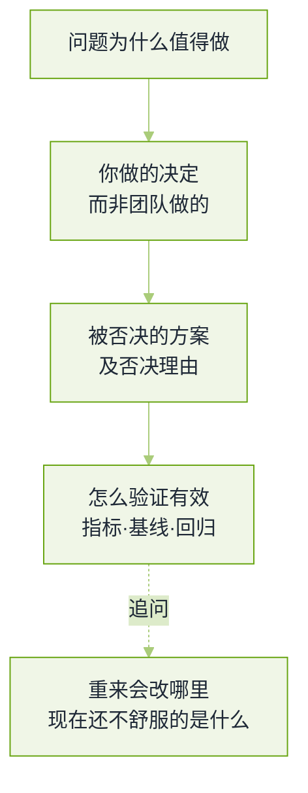

# 项目深挖与行为面真题


**一句话**：这一轮没有标准答案，但有标准失分点——讲不清「你做了什么决定、怎么验证它有效」的人，无论技术多强都会在这里被刷。


大模型岗位的行为面和技术面边界很薄：项目深挖会一直问到评测指标与 badcase 归因，而所谓「通用软素质题」也常常围绕一次真实的线上事故。题源与口径见本章[导读](README.md)。

## 一条项目叙述的四个可验证点

*《图：面试官真正在四处打钩——把「团队成果」讲成「个人决策链」的人，四处都能答》*

## 项目深挖

**1. 挑一个你端到端负责的项目讲清楚，关键的技术决策是什么？**

- 要点：这题的隐藏要求是**边界要说清**——哪段是你写的，哪段是别人做的，你从中学到什么。把团队成果整块说成自己的，深挖两问就露。
- 骨架：业务问题 → 约束（延迟/成本/合规/数据量）→ 你做的两个关键决策（含一个「看起来更聪明但你没选」的）→ 落地结果 → 事后回看。
- 时长控制：主线 5 分钟内讲完，留 10 分钟给对方挑一段钻。
- 加分：主动给数字（数据量、QPS、成本、指标提升幅度），因为下一问一定是它。

**2. 你项目的核心贡献是什么？怎么证明它有效？**

- 要点：贡献要落在「决策」而不是「工时」上：换了检索策略、定了分块口径、把某个环节从小模型换成规则、建立了评测集——这些都是可命名的贡献。
- 「怎么验证」必须有对照：基线是什么、评测集怎么来的、提升了多少、有没有跑显著性或至少多次重复。
- 面试官真正在问的是：你会不会自己给自己发奖杯。答不出基线，前面的数字全部作废。
- 回看：[评估指标](../10-evaluation-safety/evaluation-metrics.md)

**3. 为什么选这个方案而不是别的？取舍现在你还认同吗？**

- 要点：至少给两个真实被考虑过的替代方案，并说清「什么条件下会反过来选它」。这比夸自己方案好更有说服力。
- 最后一问「现在还有多舒服」是诚实度测试：一个从没被质疑过的技术方案，通常说明owner没看线上分布。
- 结构：决策依据（当时的信息）→ 已知代价 → 若今天重做会改的一处。

**4. 这个项目的主要 badcase 有哪些？你怎么定位原因？**

- 要点：先讲归因方法再举例：分桶（按意图/长度/领域/是否命中缓存）→ 抽样看原文 → 用「金标准检索」或人工标注判断责任模块 → 才谈修复。
- 检索类系统的经典答法：先固定检索只换生成、再固定生成只换检索，看指标动不动——一步定位模块责任。
- 反例（会当场扣分）：把 badcase 归成「模型能力不够」，然后唯一的动作是换更大的模型。
- 回看：[检索质量调优](../06-memory-rag/retrieval-quality-tuning.md)

**5. 你怎么评估微调后的模型确实变好了？有没有遇到离线涨、线上不涨？**

- 要点：三层证据——自动指标（任务集）、人评/裁判抽校、线上 A/B。缺任何一层都要说明为什么可以缺。
- 「离线涨线上不涨」的诊断清单：评测集与线上分布不一致、线上有降级路径没被离线复现、位置偏置与曝光偏置、延迟导致放弃、指标口径变了（分母/时长/人群）。
- 加分：说出「评测集一旦被反复用于选型就会泄漏」，并给出换题或留私有集的做法。
- 回看：[持续评估](../11-engineering/continuous-evaluation.md)

**6. 你主导的技术决策后来被证明是错的，那次经历讲讲。**

- 要点：这题考的不是错误大小，而是**发现—承认—纠偏—沉淀**这条链有多短。要说得出你是怎么发现的（哪个指标、谁的反馈），以及之后你改了流程里的哪一步。
- 大模型岗的好例子集中在：低估数据质量、把评测建在自选的样本上、以为换模型能解决上下文问题、把自主性给得过高。
- 避免两类失败答案：假错误（「我最大的问题是太追求完美」）与甩锅（全是同事的问题）。

## 追问链：一条项目线被钻到底

前面六题是「问什么」，这一组是「连起来怎么问」。真实的一轮项目深挖不会跳题，而是顺着同一条线往下钻，直到你答不动——所以每组追问的失分点都不在技术细节，而在**你能不能说出这层设计的代价**。

**7. 选一个你最满意的项目完整讲一遍——但不要报菜名。**

- 要点：「用了 RAG、用了 Multi-Agent、加了 MCP」这类名词清单在这一轮是零信息量，面试官明确要的是设计决策背后的思考：当时有哪两条路、为什么选了这条、选它付出了什么。
- 可操作的自检法：每说出一个技术名词，强制在后面接一句「因为……所以……」；接不上的那个名词，就是你其实没参与决策的部分。
- 加分：主动指认一处「事后看并不需要」的设计，这比夸十处做对的可信。
- 反例：整段叙述里没有任何一个被否决的方案。

**8. 你的架构分几层？每层职责、层间接口、为什么这么分、换一种分法会怎样？**

- 要点：按**职责**分层，而不是按你用的框架的包名分层。每一层要能说一句「它不做什么」——例如模型层只能提出候选动作，权限、参数范围、预算与副作用由服务端代码执行。
- 接口要可审计：版本化、结构化（动作提议与工具结果各自带状态、错误、可否重试与请求标识），并说清**谁负责重新校验**（接收方一定要再校验一次，不信任上游）。
- 换分法的代价要讲得出：纯函数链延迟低、可测性好，但扛不住动态任务；单一 Agent 自由调用起步快，但越权、循环、状态丢失的成本在生产环境才付；状态全落库恢复容易，但延迟与序列化成本上升——常见折中是事件追加加关键检查点。
- 面试官在等：你能不能把「模型的不确定性」和「系统的确定性」说成一条分层理由。
- 回看：[多智能体编排](../08-multi-agent/multi-agent-orchestration.md)

**9. 如果任务长度涨十倍（比如五十步的长链路），你现在的方案还成立吗？怎么改？**

- 要点：把最大步数从 8 改成 50 不是方案。四个方向要同时给答案——上下文（每步压成结构化状态，只留未完成目标、已确认事实、工具结果引用、失败原因与下一步约束）、目标漂移（分段与层级规划，每段有完成条件）、错误传播（验证、局部重试、分段恢复，而不是每步从头规划）、成本与延迟（错误预算、全局超时、人工接管点）。
- 一条能当场写出来的量化直觉：若单步成功率为 $$p$$，五十步全对的概率近似 $$p^{50}$$——这就是为什么长链路必须靠验证与恢复，而不能靠更大的上下文窗口。
- 加分：长链路的指标不止最终成功率——每步错误率怎么累积、失败恢复率、平均有效步数、重复副作用率、成本。
- 回看：[Agent 自主性分级](../02-agent-basics/autonomy-levels.md)

**10. 子 Agent 返回的是自然语言而不是结构化数据，主 Agent 怎么解析？怎么保证解析不出错？**

- 要点：协议优先。先要求按 schema 输出，并在接收端用严格校验器查类型、必填、枚举与长度；对带解释的文本或代码块可以做受限提取，但**那是兼容层，不能把正则当协议**。
- 解析失败的正确处理：回喂可定位的校验错误，让子 Agent 只修格式、不重造事实结论；关键字段（标识是否存在、数值是否越界、证据能否回查）用确定性代码校验；无法验证的字段标成未知，不许默认成空字符串或让模型猜。
- 有副作用的那一步要单独说：解析成功不等于允许执行，高风险动作走两阶段确认或人工。
- 面试官真正在等的：你有没有把「保证不出错」换成「出错时可定位、可降级」——前者是不可能承诺，后者才是工程。
- 多 Agent 还欠一笔账：消息重复、乱序、超时、版本冲突与权限隔离，靠任务标识、消息标识、状态版本和幂等键贯穿。
- 回看：[多智能体通信协议](../08-multi-agent/communication-protocol.md)

**11. 你读过这个框架的源码吗？Fork 过吗？提过 PR 吗？**

- 要点：这题考的是投入度信号，不是背诵量。能讲出「一处设计亮点 + 一处你会改的地方」，比背十行目录结构可信得多。
- 读源码的可讲法：从入口找到主循环，顺看它怎么持久化状态、错误往哪一层冒、扩展点开在哪、哪些约定其实是写死在实现里的。
- 没提过 PR 就直说没提过，补一句你在自己项目里绕过它某个缺陷的做法；临时编一个 PR 是这轮最容易当场崩的答案。
- 加分：知道贡献的真实路径——先修文档与复现 issue，再动核心逻辑，因为评审成本按影响面算。

**12. 如果检测到用户处于极端情绪，你的系统怎么在不打断对话流的前提下干预？**

- 要点：先把「情绪」拆成可观测信号（用词与语气变化、反复改口的频率、是否触及自伤一类的内容类别），再定义动作分级——调整语气与信息密度、收窄下一步选项、显式给出人工入口、高风险直接转人工或合规流程。
- 「不打断」不等于不处理：旁路提示、延长确认、把选择权交回用户，都是不打断的干预；一上来就弹「你是否需要心理支持」的窗口，才是打断。
- 必须谈误报的代价：把玩笑读成危机并强推人工，会让用户流失且不信任系统；阈值要按**风险的不对称性**来定——漏掉高风险的代价远高于误报低风险。
- 加分：说清责任链（模型判、规则闸门拦、人工兜底）与评测口径（离线标注集上把误报率与漏报率分开看，而不是只看准确率）。
- 回看：[人在回路](../02-agent-basics/human-in-the-loop.md)

## 冲突与动机

**13. 讲一次你和同事的技术分歧，以及你怎么处理的。**

- 要点：结构是「分歧点—各自依据—你做了什么让决策能推进—结果与关系」。要有可验证的中间动作（写了对比数据、拉了第三方、先小流量试）。
- 亚马逊系会明确按「敢于异议，服从大局」这条原则打分：异议阶段要有据，决定后要不糊弄。
- 面试官在等的坏答案：靠职级压人、靠私下抱怨、或者「我一般不会有分歧」。

**14. 讲一次你说服别人改变想法的经历。**

- 要点：说服的证据形式比热情更重要——数据、可复现的小实验、把对方顾虑拆成可验证子命题。
- 讲完要交代「如果我错了会怎样」，这显示你给自己的结论留了退路，是高级工程师的信号。

**15. 为什么是我们公司？你同意我们的哪些判断，不同意哪些？**

- 要点：这题在实验室与头部团队出现频率高，考的是你有没有真读过他们的技术路线。不同意要具体（某个取舍、某条产品路线、某个评测口径），并给出你的替代方案。
- 准备方式：读两篇该团队的技术报告/博客，从中挑一处「我认为代价被低估了」，而不是夸功能。
- 失败答案：把公司官网口号复述一遍；或者为显示勇气而无凭据地批评。

**16. 给一个非技术背景的人解释一个复杂概念（现场出题）。**

- 要点：判分点是**类比的边界**——说完比喻要补一句「这个类比在哪里会失效」，否则等于把听众引导到误解上。
- 结构：先给一个具体后果（「它会让客服答非所问」），再给机制，最后给一句可操作的结论。
- 加分：讲的过程中真的在观察对方有没有跟上，而不是自顾自说完。

## 开放题与收尾

**17. 你觉得大模型的上限在哪里？三年后 Agent 框架会变成什么样？**

- 要点：这题没有正确答案，考的是你能否把「观点」拆成可观察的信号：哪一类任务至今无法稳定通过、瓶颈归因到数据/评测/算力/交互哪一项，以及**什么证据会让你改变判断**。
- 关于框架的可持续论点：框架层会被模型能力吃掉一部分（模型自己会规划后，编排 DSL 的价值下降），但工程侧的约束（成本、审计、沙箱、回滚）不会消失——所以活下来的多是治理层。
- 避免：报某个模型版本号说「以后都这样」，以及把趋势外推到没有边界的地方。
- 回看：[模型原生与 harness](../18-frontier-2026/model-native-vs-harness.md)

**18. 反问环节：你该问什么？**

- 要点：问三类问题——团队怎么定义「这个功能做成了」（评测口径）、失败的 Agent 怎么处理（治理成熟度）、我这个岗位前三个月要交付什么（预期对齐）。
- 不要问的：能查到答案的公开信息、以及只关于晋升流程的问题（留给 HR 轮）。
- 加分：从面试官的回答里现场追问一句，说明你在听。

**19. 薪资：什么时候报价，怎么谈？**

- 要点：先拿到多个 offer 再谈，单一 offer 几乎没有筹码。该开源手册的原文写得很直白：`With just one offer, negotiation is difficult.`，而如果你在校招/初筛电话里先说了数字、对方就按那个数字给，往上抬会非常难。
- 做法：初筛阶段给区间并说明「取决于级别与股票结构」；拿到 offer 后逐项确认级别、股票归属、签字费与调薪周期，而不是只看总包。
- 诚实边界：谈薪话术随地区与年份变化很快，面试里表现得太熟练反而扣分——HR 轮问的是你的期望，不是你的谈判技巧。

## 常见误区

- ❌ 把团队成果讲成个人成果：两三个追问就会露，且这一项一旦崩塌，前面所有技术轮都会被重新怀疑。
- ❌ 用「模型能力不够」收尾所有 badcase：等于承认自己没有归因方法。
- ❌ 没有基线的「提升了 20%」：面试官会问「相对什么的 20%」。
- ❌ 假失败故事（我太追求完美）：这是行为面最典型的红旗。
- ❌ 反问环节不提问：会被读成对项目没兴趣或者没能力判断项目质量。
- ❌ 报菜名式的项目叙述：名词后面接不出「因为……所以……」，就说明那段不是你做的决定。
- ❌ 分层只按框架的包名分：说不出「这一层不做什么」，就还没理解分层是为了隔离什么。
- ❌ 把「保证解析不出错」当承诺：能做的是出错时可定位、可降级，说前者会被立刻追问倒。

## 参考资料

- [AI Engineering 面试题库（按公司标注的候选人转述）](https://github.com/pallavi-shekhar/ai-engineering-interview-questions-company-wise)
- [AI Engineering Field Guide 面试篇（项目深挖、行为面、发 offer 后）](https://github.com/alexeygrigorev/ai-engineering-field-guide/blob/main/interview/04-after-the-interview.md)
- [AIGC-Interview-Book 大厂高频面试题](https://github.com/WeThinkIn/AIGC-Interview-Book)
- [AIGC-Interview-Book：DeepSeek 高频面试题（Agent 开发岗社招一面的完整追问链）](https://github.com/WeThinkIn/AIGC-Interview-Book/blob/main/%E5%A4%A7%E5%8E%82%E9%AB%98%E9%A2%91%E9%9D%A2%E8%AF%95%E9%A2%98%EF%BC%88%E5%AE%9E%E6%97%B6%E6%9B%B4%E6%96%B0%EF%BC%89/DeepSeek%E9%AB%98%E9%A2%91%E9%9D%A2%E8%AF%95%E9%A2%98.md)
- [AIGC-Interview-Book：字节跳动高频面试题（记忆机制与情绪干预的项目拷打）](https://github.com/WeThinkIn/AIGC-Interview-Book/blob/main/%E5%A4%A7%E5%8E%82%E9%AB%98%E9%A2%91%E9%9D%A2%E8%AF%95%E9%A2%98%EF%BC%88%E5%AE%9E%E6%97%B6%E6%9B%B4%E6%96%B0%EF%BC%89/%E5%AD%97%E8%8A%82%E8%B7%B3%E5%8A%A8%E9%AB%98%E9%A2%91%E9%9D%A2%E8%AF%95%E9%A2%98.md)
- [牛客面经：智谱主管面（实习节奏与合作方式）](https://www.nowcoder.com/discuss/658749923600396288)

## 相关知识点

- [20 面试真题 · 本章导读](README.md)
- [手撕代码与算法真题](live-coding.md)
- [系统设计真题](system-design.md)
- [Agent 工程真题](agent-engineering.md)
- [岗位分档与转岗真题](career-tracks.md)
